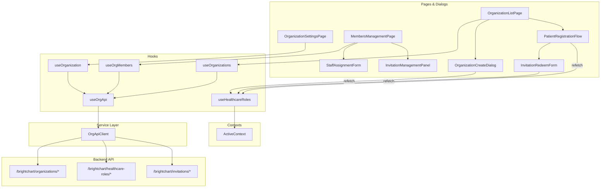

# Design Document: Organization Role UI Components

## Overview

This design adds React UI components to the `brightchart-react-components` package for Organization Role Management. The backend API (Organization CRUD, Healthcare Role assignment, Patient registration, Invitation management) is fully implemented. This spec covers the frontend layer: a typed API service client, reusable React hooks, page/dialog components, routing integration, and role refresh wiring.

The design follows established codebase patterns:
- **API service layer**: A `createOrgApiClient` factory function wrapping `AxiosInstance`, matching the `createEmailApiClient` pattern in `brightmail-react-components`
- **Hook layer**: A `useOrgApi` hook that memoizes the service client via `useAuthenticatedApi`, plus individual query hooks (`useOrganizations`, `useOrganization`, `useOrgMembers`) for data fetching
- **Component layer**: Material UI components with BEM-style class names, `useBrightChartTranslation` for i18n, and `@testing-library/react` for tests
- **Routing**: React Router `<Routes>` inside workspace components, with `PermissionGuardedRoute` for admin-only pages
- **Context**: `ActiveContext` for active role/org state, `useHealthcareRoles().refetch` for role refresh after mutations

## Architecture



### Request Flow

1. Component calls a hook (e.g. `useOrganizations`) or a mutation function from `useOrgApi()`
2. Hook delegates to `OrgApiClient` methods which call the authenticated Axios instance
3. Responses follow the `{ success, data, message }` envelope — `handleApiCall` extracts `data` or throws with the server error message
4. After role-creating mutations (org creation, patient registration, invitation redemption), the component calls `useHealthcareRoles().refetch()` to update `ActiveContext` and `RoleSwitcher`

## Components and Interfaces

### File Structure

```
brightchart-react-components/src/lib/
├── organizations/
│   ├── __tests__/
│   │   ├── orgApi.spec.ts
│   │   ├── useOrganizations.spec.tsx
│   │   ├── OrganizationListPage.spec.tsx
│   │   ├── OrganizationCreateDialog.spec.tsx
│   │   ├── OrganizationSettingsPage.spec.tsx
│   │   ├── MembersManagementPage.spec.tsx
│   │   ├── PatientRegistrationFlow.spec.tsx
│   │   ├── InvitationManagementPanel.spec.tsx
│   │   ├── StaffAssignmentForm.spec.tsx
│   │   └── InvitationRedeemForm.spec.tsx
│   ├── services/
│   │   └── orgApi.ts
│   ├── hooks/
│   │   ├── useOrgApi.ts
│   │   ├── useOrganizations.ts
│   │   ├── useOrganization.ts
│   │   └── useOrgMembers.ts
│   ├── components/
│   │   ├── OrganizationListPage.tsx
│   │   ├── OrganizationCreateDialog.tsx
│   │   ├── OrganizationSettingsPage.tsx
│   │   ├── MembersManagementPage.tsx
│   │   ├── PatientRegistrationFlow.tsx
│   │   ├── InvitationManagementPanel.tsx
│   │   ├── StaffAssignmentForm.tsx
│   │   └── InvitationRedeemForm.tsx
│   ├── OrganizationRoutes.tsx
│   └── index.ts
```

### API Service Layer (`services/orgApi.ts`)

Following the `createEmailApiClient` pattern, a factory function that accepts an `AxiosInstance` and returns typed methods for every backend endpoint:

```typescript
import type { AxiosInstance } from 'axios';
import type {
  IOrganization,
  IHealthcareRoleDocument,
  IInvitation,
  ICreateOrganizationRequest,
  IUpdateOrganizationRequest,
  IAssignStaffRequest,
  IRegisterPatientRequest,
  ICreateInvitationRequest,
  IRedeemInvitationRequest,
} from '@brightchain/brightchart-lib';

export interface OrgListParams {
  search?: string;
  page?: number;
  limit?: number;
}

export interface OrgListResponse {
  organizations: IOrganization[];
  total: number;
  page: number;
  limit: number;
}

export interface OrgMembersResponse {
  members: Record<string, IHealthcareRoleDocument[]>;
}

export function createOrgApiClient(api: AxiosInstance) {
  return {
    // Organization CRUD
    listOrganizations: (params?: OrgListParams) => Promise<OrgListResponse>,
    getOrganization: (id: string) => Promise<IOrganization>,
    createOrganization: (data: ICreateOrganizationRequest) => Promise<IOrganization>,
    updateOrganization: (id: string, data: IUpdateOrganizationRequest) => Promise<IOrganization>,
    getOrgMembers: (id: string) => Promise<OrgMembersResponse>,

    // Healthcare Role mutations
    assignStaff: (data: IAssignStaffRequest) => Promise<IHealthcareRoleDocument>,
    registerPatient: (data: IRegisterPatientRequest) => Promise<IHealthcareRoleDocument>,
    removeRole: (roleId: string) => Promise<void>,

    // Invitation management
    createInvitation: (data: ICreateInvitationRequest) => Promise<IInvitation>,
    redeemInvitation: (data: IRedeemInvitationRequest) => Promise<{ role: IHealthcareRoleDocument; organizationName: string }>,
  };
}

export type OrgApiClient = ReturnType<typeof createOrgApiClient>;
```

Each method uses the shared `handleApiCall` utility to unwrap the `IApiEnvelope` and propagate server error messages.

### Hook Layer

**`useOrgApi`** — Memoized service client hook (matches `useEmailApi` pattern):

```typescript
export const useOrgApi = () => {
  const api = useAuthenticatedApi();
  return useMemo(() => createOrgApiClient(api as AxiosInstance), [api]);
};
```

**`useOrganizations`** — Query hook for the paginated org list:

```typescript
export interface UseOrganizationsResult {
  data: OrgListResponse | null;
  loading: boolean;
  error: string | null;
  refetch: () => void;
}

export function useOrganizations(params?: OrgListParams): UseOrganizationsResult;
```

**`useOrganization`** — Query hook for a single org:

```typescript
export interface UseOrganizationResult {
  data: IOrganization | null;
  loading: boolean;
  error: string | null;
  refetch: () => void;
}

export function useOrganization(id: string): UseOrganizationResult;
```

**`useOrgMembers`** — Query hook for org members grouped by role:

```typescript
export interface UseOrgMembersResult {
  data: OrgMembersResponse | null;
  loading: boolean;
  error: string | null;
  refetch: () => void;
}

export function useOrgMembers(orgId: string): UseOrgMembersResult;
```

All query hooks follow the same pattern: `useState` for `data`, `loading`, `error`; `useEffect` to fetch on mount/param change; `useCallback` for `refetch`.

### Component Props Interfaces

```typescript
/** OrganizationCreateDialog */
export interface OrganizationCreateDialogProps {
  open: boolean;
  onClose: () => void;
  onCreated: (org: IOrganization) => void;
}

/** OrganizationListPage — no props, uses hooks internally */

/** OrganizationSettingsPage */
export interface OrganizationSettingsPageProps {
  organizationId: string;
}

/** MembersManagementPage */
export interface MembersManagementPageProps {
  organizationId: string;
}

/** PatientRegistrationFlow */
export interface PatientRegistrationFlowProps {
  organization: IOrganization;
  onRegistered: () => void;
  onCancel: () => void;
}

/** InvitationManagementPanel */
export interface InvitationManagementPanelProps {
  organizationId: string;
}

/** StaffAssignmentForm */
export interface StaffAssignmentFormProps {
  organizationId: string;
  onAssigned: () => void;
  onCancel: () => void;
}

/** InvitationRedeemForm */
export interface InvitationRedeemFormProps {
  /** Pre-filled token (e.g. from URL param) */
  initialToken?: string;
  onRedeemed: (roleName: string, orgName: string) => void;
}
```

### Routing (`OrganizationRoutes.tsx`)

Integrates into the existing workspace routing structure:

```typescript
export const OrganizationRoutes: React.FC = () => (
  <Routes>
    {/* Public to all authenticated members */}
    <Route index element={<OrganizationListPage />} />
    <Route path="redeem" element={<InvitationRedeemForm />} />

    {/* Org-scoped admin routes — guarded by role check */}
    <Route path=":orgId/settings" element={
      <OrgAdminGuard><OrganizationSettingsPage /></OrgAdminGuard>
    } />
    <Route path=":orgId/members" element={
      <OrgAdminGuard><MembersManagementPage /></OrgAdminGuard>
    } />
  </Routes>
);
```

**`OrgAdminGuard`** — A lightweight wrapper that checks whether the active role in `ActiveContext` is ADMIN at the target org (from `:orgId` route param). Renders `AccessDenied` if not.

### Navigation Integration

The `getAdminNav` function in `navigationConfigs.ts` will be extended with an "Organizations" nav item. Additionally, a top-level "Organizations" route will be added accessible to all authenticated members.

```typescript
// New nav item in getAdminNav:
{
  id: 'admin-organizations',
  label: 'Organizations',
  icon: 'business',
  route: 'organizations',
  requiredPermissions: [PatientPermission.Admin],
  visible: true,
}
```

The `AdminWorkspace` will mount `OrganizationRoutes` at the `organizations/*` path. The standalone invitation redemption route (`/brightchart/organizations/redeem`) is accessible to all authenticated members regardless of role.

### Role Refresh Wiring

After mutations that create new healthcare roles, components call `useHealthcareRoles().refetch()`. To make this accessible from organization components, the `refetch` function will be threaded through:

1. `BrightChartLayout` already receives `useHealthcareRoles()` result
2. Add a `refetchRoles` callback to `ActiveContext` value
3. Organization components consume `useActiveContext().refetchRoles()` after successful mutations

This avoids prop drilling and keeps the pattern consistent with how `ActiveContext` already distributes role state.

## Data Models

The UI components consume the shared interfaces already defined in `brightchart-lib`. No new data models are needed — the component layer works with:

| Interface | Package | Usage |
|---|---|---|
| `IOrganization` | `brightchart-lib` | Org list, settings, detail display |
| `IHealthcareRole` | `brightchart-lib` | Role display in RoleSwitcher, ActiveContext |
| `IHealthcareRoleDocument` | `brightchart-lib` | Members list, staff assignment response |
| `IInvitation` | `brightchart-lib` | Invitation panel display |
| `ICreateOrganizationRequest` | `brightchart-lib` | Create dialog form payload |
| `IUpdateOrganizationRequest` | `brightchart-lib` | Settings form payload |
| `IAssignStaffRequest` | `brightchart-lib` | Staff assignment form payload |
| `IRegisterPatientRequest` | `brightchart-lib` | Patient registration payload |
| `ICreateInvitationRequest` | `brightchart-lib` | Invitation creation payload |
| `IRedeemInvitationRequest` | `brightchart-lib` | Invitation redemption payload |
| `EnrollmentMode` | `brightchart-lib` | Enrollment mode display/toggle |

### API Response Envelope

All API responses follow the existing envelope format. The `handleApiCall` utility (shared with `emailApi.ts`) unwraps:

```typescript
// Success: { success: true, data: T }
// Error:   { success: false, error: { code: string, message: string } }
```

### Form Validation Models

Client-side validation before API calls:

| Field | Validation Rule |
|---|---|
| Organization name | Required, non-empty after trim |
| Member ID (staff assignment) | Required, non-empty after trim |
| Role code selector | Required, must be from valid SNOMED CT codes |
| Invitation token | Required, non-empty after trim |
| Enrollment mode | Must be `'open'` or `'invite-only'` |


## Correctness Properties

*A property is a characteristic or behavior that should hold true across all valid executions of a system — essentially, a formal statement about what the system should do. Properties serve as the bridge between human-readable specifications and machine-verifiable correctness guarantees.*

### Property 1: Empty/whitespace name validation rejection

*For any* string composed entirely of whitespace characters (including the empty string), submitting the Organization_Create_Dialog with that string as the name SHALL be rejected by client-side validation — the form SHALL display an inline validation error and SHALL NOT invoke the API.

**Validates: Requirements 1.4**

### Property 2: Organization list item renders name and enrollment mode

*For any* valid `IOrganization` object with a non-empty name and an enrollment mode of either `'open'` or `'invite-only'`, rendering that organization in the Organization_List_Page SHALL produce output containing the organization's name and a chip/badge reflecting the enrollment mode.

**Validates: Requirements 2.2**

### Property 3: Settings update sends only changed fields

*For any* non-empty subset of editable organization fields (name, enrollmentMode, active) that differ from the original values, submitting the Organization_Settings_Page SHALL produce a PUT request body containing exactly those changed fields and no others.

**Validates: Requirements 3.2**

### Property 4: Members grouped by role code with correct details

*For any* set of `IHealthcareRoleDocument` objects with varying role codes, rendering the Members_Management_Page SHALL group each member under a section header matching its `roleDisplay`, and each member entry SHALL display the member's identifier and role display name within the correct group.

**Validates: Requirements 4.1, 4.2**

### Property 5: Query hooks expose consistent interface shape

*For any* query hook (`useOrganizations`, `useOrganization`, `useOrgMembers`) and any valid input parameters, the hook result SHALL always expose `data`, `loading`, `error`, and `refetch` properties where `loading` is a boolean, `error` is a string or null, and `refetch` is a function.

**Validates: Requirements 9.1, 9.2, 9.3**

### Property 6: API client methods call correct endpoints

*For any* valid request DTO passed to an `OrgApiClient` mutation method (`createOrganization`, `updateOrganization`, `assignStaff`, `registerPatient`, `createInvitation`, `redeemInvitation`, `removeRole`), the method SHALL call the correct HTTP method and URL path on the underlying Axios instance, with the DTO as the request body (or URL parameter for DELETE).

**Validates: Requirements 9.4**

## Error Handling

All components follow a consistent error handling pattern:

| HTTP Status | Error Code | Component Behavior |
|---|---|---|
| 400 | `VALIDATION_ERROR` | Display server error message inline in the form |
| 400 | `LAST_ADMIN` | Display "Organization must retain at least one administrator" |
| 400 | `INVALID_ROLE_CODE` | Display error message listing valid role codes |
| 400 | `INACTIVE_ORGANIZATION` | Display "Organization is not active" |
| 401 | — | Delegated to `useAuthenticatedApi` (session redirect) |
| 403 | `FORBIDDEN` | Display `AccessDenied` component or inline permission error |
| 403 | `INVITATION_REQUIRED` | Display message + show `InvitationRedeemForm` |
| 404 | `NOT_FOUND` | Display "Organization not found" or "Role not found" |
| 409 | `CONFLICT` | Display "Already registered" or "Role already assigned" |
| 410 | `GONE` | Display "Invitation expired or already redeemed" |
| 5xx | — | Display generic "Something went wrong. Please try again." |

### Error Extraction Pattern

The `handleApiCall` utility (shared with `emailApi.ts`) extracts error messages from the API envelope:

```typescript
// In catch block:
if (isAxiosError(error) && error.response?.data?.error) {
  const { code, message } = error.response.data.error;
  // Components use `code` for conditional rendering (e.g. LAST_ADMIN, INVITATION_REQUIRED)
  // and `message` for display text
}
```

### Loading State Pattern

All mutation-triggering components follow the same loading pattern:
1. Set `submitting = true` before the API call
2. Disable the submit button and show a `CircularProgress` indicator
3. Set `submitting = false` in the `finally` block
4. Re-enable the button regardless of success or failure

## Testing Strategy

### Unit Tests (Example-Based)

Example-based tests using `@testing-library/react` and `jest`, following the patterns in `DocumentList.spec.tsx` and `useHealthcareRoles.spec.tsx`:

**Component tests:**
- OrganizationCreateDialog: renders form fields, submits valid data, shows validation errors, shows API errors, loading state
- OrganizationListPage: renders org list, search debounce, pagination, empty state, create button, click actions
- OrganizationSettingsPage: populates form from API, submits changes, enrollment mode toggle, active status warning, 403 handling
- MembersManagementPage: renders grouped members, remove role confirmation, LAST_ADMIN error, 403 handling
- PatientRegistrationFlow: open enrollment registration, invite-only token prompt, 403/409/410 error handling, role refetch
- InvitationManagementPanel: role selector, token display, clipboard copy, expiration display, 403 handling
- StaffAssignmentForm: form fields, submission, 409/400 error handling, success + form clear
- InvitationRedeemForm: token field, submission, success message with role/org, 410 error, role refetch

**Hook tests:**
- useOrganizations: fetches on mount, refetch, error state
- useOrganization: fetches by ID, loading/error states
- useOrgMembers: fetches members, grouped data shape

**Service tests:**
- orgApi: each method calls correct endpoint with correct HTTP method and payload

### Property-Based Tests

Property-based tests use `fast-check` with a minimum of 100 iterations per property. Each test is tagged with its design property reference.

Tag format: **Feature: org-role-ui-components, Property {N}: {title}**

Properties to implement:
- Property 1: Empty/whitespace name validation rejection — generate whitespace strings, verify form rejects
- Property 2: Org list item renders name and enrollment mode — generate random IOrganization, verify render
- Property 3: Settings update sends only changed fields — generate random field subsets, verify PUT payload
- Property 4: Members grouped by role code — generate random member sets, verify grouping
- Property 5: Query hooks expose consistent interface shape — generate random params, verify hook result shape
- Property 6: API client methods call correct endpoints — generate random DTOs, verify axios calls

### Integration Tests

- Full flow: create org → verify list updates → open settings → update enrollment mode → verify change
- Patient registration flow: browse orgs → register at open org → verify role refetch → switch role
- Invitation flow: create invitation → copy token → redeem from standalone route → verify role appears
- Admin guard: navigate to admin routes with non-admin role → verify AccessDenied
