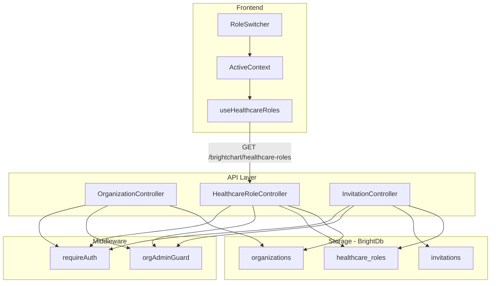

# Design Document: Organization Role Management

## Overview

This design introduces backend CRUD for FHIR Organizations, Healthcare Roles, and Invitations into the BrightChain API, replacing the hardcoded fallback in `useHealthcareRoles` with persisted, multi-organization role data. The system follows existing codebase patterns: `CollectionSchema` definitions in `brightchain-api-lib`, shared interfaces in `brightchart-lib`, controllers extending `BaseController`, and JWT auth middleware for access control.

The feature spans four packages:

| Package | Responsibility |
|---|---|
| `brightchain-node-express-suite` | Extend `SchemaCollection` enum with new collection names |
| `brightchain-api-lib` | Storage schemas, controllers, router mounting |
| `brightchart-lib` | Shared interfaces (Organization, Invitation, request/response DTOs) |
| `brightchart-react-components` | Wire `useHealthcareRoles` to the live API (already calls `GET /brightchart/healthcare-roles`) |

## Architecture



### Request Flow

1. Frontend calls an endpoint (e.g. `GET /brightchart/healthcare-roles`)
2. `requireAuth` middleware validates the JWT and attaches `memberContext`
3. For org-scoped mutations, `orgAdminGuard` verifies the caller holds an ADMIN healthcare role at the target organization by querying `healthcare_roles`
4. Controller reads/writes BrightDb collections
5. Response follows the existing `{ success, data, message }` envelope

## Components and Interfaces

### Shared Interfaces (brightchart-lib)

```typescript
/** FHIR Organization resource stored in BrightDb */
export interface IOrganization {
  _id: string;
  name: string;
  type?: ICodeableConcept;
  telecom?: IContactPoint[];
  address?: IAddress[];
  active: boolean;
  enrollmentMode: 'open' | 'invite-only';
  createdBy: string;
  createdAt: string;
  updatedAt: string;
}

/** Invitation record for controlled onboarding */
export interface IInvitation {
  _id: string;
  token: string;
  organizationId: string;
  roleCode: string;
  targetEmail?: string;
  createdBy: string;
  expiresAt: string;
  usedBy?: string;
  usedAt?: string;
  createdAt: string;
}

/** Stored healthcare role document (extends IHealthcareRole with DB fields) */
export interface IHealthcareRoleDocument {
  _id: string;
  memberId: string;
  roleCode: string;
  roleDisplay: string;
  specialty?: ICodeableConcept;
  organizationId: string;
  practitionerRef?: string;
  patientRef?: string;
  period: { start: string; end?: string };
  createdBy: string;
  createdAt: string;
  updatedAt: string;
}
```

### Controllers (brightchain-api-lib)

Three controllers, each extending `BaseController`:

**OrganizationController** — mounted at `/brightchart/organizations`
- `POST /` — Create organization (any authenticated member)
- `GET /` — List active organizations (paginated, searchable)
- `GET /:id` — Get single organization
- `PUT /:id` — Update organization (org admin only)
- `GET /:id/members` — List org members grouped by role (org admin only)

**HealthcareRoleController** — mounted at `/brightchart/healthcare-roles`
- `GET /` — Get all roles for the authenticated member (the endpoint `useHealthcareRoles` already calls)
- `POST /staff` — Assign a practitioner role (org admin only)
- `POST /patient` — Register as patient (self-service or staff-initiated)
- `DELETE /:id` — Soft-delete role by setting `period.end` (org admin only)

**InvitationController** — mounted at `/brightchart/invitations`
- `POST /` — Create invitation (org admin or practitioner)
- `POST /redeem` — Redeem invitation token (any authenticated member)

### Organization Admin Guard Middleware

A reusable middleware that checks whether `req.memberContext.memberId` holds an active ADMIN healthcare role at the organization specified in the request (from route param or body). This avoids duplicating the authorization check in every handler.

```typescript
async function orgAdminGuard(
  req: IAuthenticatedRequest,
  res: Response,
  next: NextFunction,
  db: BrightDb,
  organizationId: string,
): Promise<void>;
```

### Router Mounting

The `ApiRouter` constructor will mount a new `BrightChartRouter` under `/brightchart`:

```typescript
this.router.use('/brightchart', brightchartRouter.router);
```

The `BrightChartRouter` internally mounts the three controllers:
```
/brightchart/organizations  → OrganizationController
/brightchart/healthcare-roles → HealthcareRoleController
/brightchart/invitations    → InvitationController
```

## Data Models

### organizations Collection

```typescript
export const ORGANIZATION_SCHEMA: CollectionSchema = {
  name: 'organization',
  properties: {
    _id: { type: 'string', required: true },
    name: { type: 'string', required: true },
    type: { type: 'object' },           // ICodeableConcept
    telecom: { type: 'array' },          // IContactPoint[]
    address: { type: 'array' },          // IAddress[]
    active: { type: 'boolean', required: true },
    enrollmentMode: {
      type: 'string', required: true,
      enum: ['open', 'invite-only'],
    },
    createdBy: { type: 'string', required: true },
    createdAt: { type: 'string', required: true },
    updatedAt: { type: 'string', required: true },
  },
  required: ['_id', 'name', 'active', 'enrollmentMode', 'createdBy', 'createdAt', 'updatedAt'],
  additionalProperties: true,
  validationLevel: 'strict',
  validationAction: 'error',
  indexes: [
    { fields: { name: 1 }, options: {} },
    { fields: { active: 1 }, options: {} },
  ],
};
```

### healthcare_roles Collection

```typescript
export const HEALTHCARE_ROLE_SCHEMA: CollectionSchema = {
  name: 'healthcareRole',
  properties: {
    _id: { type: 'string', required: true },
    memberId: { type: 'string', required: true },
    roleCode: { type: 'string', required: true },
    roleDisplay: { type: 'string', required: true },
    specialty: { type: 'object' },
    organizationId: { type: 'string', required: true },
    practitionerRef: { type: 'string' },
    patientRef: { type: 'string' },
    period: { type: 'object', required: true },
    createdBy: { type: 'string', required: true },
    createdAt: { type: 'string', required: true },
    updatedAt: { type: 'string', required: true },
  },
  required: ['_id', 'memberId', 'roleCode', 'roleDisplay', 'organizationId', 'period', 'createdBy', 'createdAt', 'updatedAt'],
  additionalProperties: true,
  validationLevel: 'strict',
  validationAction: 'error',
  indexes: [
    { fields: { memberId: 1 }, options: {} },
    { fields: { organizationId: 1 }, options: {} },
    { fields: { memberId: 1, roleCode: 1, organizationId: 1 }, options: { unique: true } },
  ],
};
```

### invitations Collection

```typescript
export const INVITATION_SCHEMA: CollectionSchema = {
  name: 'invitation',
  properties: {
    _id: { type: 'string', required: true },
    token: { type: 'string', required: true },
    organizationId: { type: 'string', required: true },
    roleCode: { type: 'string', required: true },
    targetEmail: { type: 'string' },
    createdBy: { type: 'string', required: true },
    expiresAt: { type: 'string', required: true },
    usedBy: { type: 'string' },
    usedAt: { type: 'string' },
    createdAt: { type: 'string', required: true },
  },
  required: ['_id', 'token', 'organizationId', 'roleCode', 'createdBy', 'expiresAt', 'createdAt'],
  additionalProperties: true,
  validationLevel: 'strict',
  validationAction: 'error',
  indexes: [
    { fields: { token: 1 }, options: { unique: true } },
    { fields: { organizationId: 1 }, options: {} },
    { fields: { expiresAt: 1 }, options: {} },
  ],
};
```

### SchemaCollection Enum Extension

```typescript
export enum SchemaCollection {
  // ... existing entries ...
  Organization = 'organizations',
  HealthcareRole = 'healthcare_roles',
  Invitation = 'invitations',
}
```


## Correctness Properties

*A property is a characteristic or behavior that should hold true across all valid executions of a system — essentially, a formal statement about what the system should do. Properties serve as the bridge between human-readable specifications and machine-verifiable correctness guarantees.*

### Property 1: Organization creation produces a complete record with auto-admin

*For any* valid organization creation payload (with a non-empty name and optional contact info), creating the organization SHALL produce a stored document with a generated `_id`, matching `name`, `active=true`, `enrollmentMode='open'`, all required timestamp fields, AND a corresponding ADMIN healthcare role (roleCode `394572006`) for the creating member with a `practitioner` reference and `period.start` set.

**Validates: Requirements 1.1, 1.2, 1.4, 3.5**

### Property 2: Organization update preserves unchanged fields

*For any* existing organization and any valid partial update payload, applying the update SHALL change only the specified fields while preserving all other fields unchanged, and the `updatedAt` timestamp SHALL advance.

**Validates: Requirements 2.1**

### Property 3: Org-scoped mutation authorization

*For any* org-scoped mutation (organization update, staff assignment, role removal, invitation creation) and any member who does NOT hold an active ADMIN healthcare role at the target organization, the API SHALL return a 403 forbidden error and leave the data unchanged.

**Validates: Requirements 2.4, 3.4, 5.6, 7.2**

### Property 4: Enrollment mode governs patient self-registration

*For any* organization and any BrightChain member, patient self-registration (without an invitation token) SHALL succeed if and only if the organization's `enrollmentMode` is `'open'`. When `enrollmentMode` is `'invite-only'`, self-registration without a valid token SHALL be rejected with 403.

**Validates: Requirements 2.2, 2.3, 4.1, 4.3**

### Property 5: Inactive organizations reject new role assignments

*For any* organization with `active=false` and any role assignment request (staff or patient), the API SHALL reject the assignment.

**Validates: Requirements 2.5**

### Property 6: Staff role creation with valid SNOMED CT codes

*For any* valid SNOMED CT practitioner role code and any target member, creating a staff role SHALL produce a healthcare role document with the correct `roleCode`, `roleDisplay`, `practitionerRef`, `organizationId`, and `period.start` set. *For any* string that is NOT a recognized SNOMED CT practitioner role code, the API SHALL return a 400 validation error.

**Validates: Requirements 3.1, 3.2, 3.5**

### Property 7: Duplicate role detection

*For any* (memberId, roleCode, organizationId) tuple that already has an active healthcare role, attempting to create another role with the same tuple SHALL return a 409 conflict error and leave the existing role unchanged.

**Validates: Requirements 3.3, 4.5**

### Property 8: Staff-initiated patient registration bypasses enrollment mode

*For any* organization (regardless of enrollment mode) and any authorized staff member (admin or practitioner), staff-initiated patient registration SHALL succeed and create a PATIENT role with `patientRef` set.

**Validates: Requirements 4.4**

### Property 9: Invitation creation invariants

*For any* invitation creation request with a valid role code, the API SHALL produce an invitation document with a unique `token`, correct `organizationId` and `roleCode`, and an `expiresAt` timestamp approximately 7 days after `createdAt`.

**Validates: Requirements 5.1, 5.2**

### Property 10: Invitation redemption marks as used

*For any* valid, unexpired, unused invitation token, redeeming it SHALL set `usedBy` to the redeeming member's ID and `usedAt` to the current timestamp, and create the corresponding healthcare role.

**Validates: Requirements 5.3**

### Property 11: Used or expired invitations are rejected

*For any* invitation token that has already been redeemed OR has an `expiresAt` in the past, attempting to redeem it SHALL return a 410 gone error and create no new healthcare role.

**Validates: Requirements 5.4, 5.5**

### Property 12: Healthcare role retrieval returns active roles with populated org names

*For any* authenticated member with N active healthcare roles (where `period.end` is absent or in the future), `GET /brightchart/healthcare-roles` SHALL return exactly those N roles, each with `organization.display` populated from the organization's `name` field. Roles with `period.end` in the past SHALL be excluded.

**Validates: Requirements 6.1, 6.2, 6.4**

### Property 13: Role soft-delete sets period.end

*For any* active healthcare role, removing it SHALL set `period.end` to approximately the current timestamp without deleting the document. The role SHALL no longer appear in subsequent `GET /brightchart/healthcare-roles` responses.

**Validates: Requirements 7.1**

### Property 14: Last admin guard

*For any* organization with exactly one active ADMIN healthcare role, attempting to remove that role SHALL return a 400 error and leave the role unchanged.

**Validates: Requirements 7.4**

### Property 15: Organization listing returns only active orgs with search filtering

*For any* set of organizations (some active, some inactive) and any search query string, `GET /brightchart/organizations` SHALL return only active organizations whose name contains the query string (case-insensitive partial match), each with `enrollmentMode` included.

**Validates: Requirements 8.1, 8.2, 8.3**

### Property 16: Multi-organization and multi-role coexistence

*For any* BrightChain member, creating healthcare roles at multiple different organizations AND creating multiple different role codes at the same organization SHALL all succeed, and all roles SHALL be retrievable via `GET /brightchart/healthcare-roles`.

**Validates: Requirements 9.1, 9.2**

### Property 17: Organization members listing grouped by role code

*For any* organization with active healthcare roles, `GET /brightchart/organizations/:id/members` SHALL return all active roles grouped by `roleCode`, with no expired roles included.

**Validates: Requirements 8.4**

## Error Handling

| Scenario | HTTP Status | Error Code | Description |
|---|---|---|---|
| Missing required field (e.g. org name) | 400 | `VALIDATION_ERROR` | Descriptive message listing missing/invalid fields |
| Invalid SNOMED CT role code | 400 | `INVALID_ROLE_CODE` | Lists valid practitioner role codes |
| Last admin removal attempt | 400 | `LAST_ADMIN` | Organization must retain at least one administrator |
| Role assignment to inactive org | 400 | `INACTIVE_ORGANIZATION` | Organization is not active |
| Missing/invalid JWT | 401 | `UNAUTHORIZED` | Handled by existing `requireAuth` middleware |
| Non-admin attempting org-scoped mutation | 403 | `FORBIDDEN` | Member does not hold ADMIN role at this organization |
| Invite-only org without valid token | 403 | `INVITATION_REQUIRED` | Organization requires an invitation for registration |
| Healthcare role not found or wrong org | 404 | `NOT_FOUND` | Role does not exist at this organization |
| Duplicate role (same member+code+org) | 409 | `CONFLICT` | Member already holds this role at this organization |
| Expired or used invitation | 410 | `GONE` | Invitation has expired or already been redeemed |
| Unexpected server error | 500 | `INTERNAL_ERROR` | Follows existing `createErrorResponse` pattern |

All error responses follow the existing envelope format: `{ success: false, error: { code, message } }`.

## Testing Strategy

### Unit Tests (Example-Based)

- Organization creation with valid/invalid payloads
- Role assignment with each valid SNOMED CT code
- Invitation creation and redemption happy path
- Edge cases: empty role list returns `[]`, non-existent role returns 404
- Schema smoke tests: verify `ORGANIZATION_SCHEMA`, `HEALTHCARE_ROLE_SCHEMA`, `INVITATION_SCHEMA` have all required fields
- `SchemaCollection` enum has `Organization`, `HealthcareRole`, `Invitation` entries
- `RoleSwitcher` renders roles from API response (Requirements 9.3)
- `ActiveContext` updates on role switch (Requirements 9.4)

### Property-Based Tests

Property-based tests use `fast-check` (already available in the workspace) with a minimum of 100 iterations per property. Each test is tagged with its design property reference.

Tag format: **Feature: organization-role-management, Property {N}: {title}**

Properties to implement:
- Property 1: Org creation completeness + auto-admin
- Property 2: Org update field preservation
- Property 3: Authorization guard (403 for non-admins)
- Property 4: Enrollment mode enforcement
- Property 5: Inactive org rejects assignments
- Property 6: Valid/invalid SNOMED CT code handling
- Property 7: Duplicate role detection (409)
- Property 8: Staff-initiated patient registration bypasses enrollment mode
- Property 9: Invitation creation invariants
- Property 10: Invitation redemption marks as used
- Property 11: Used/expired invitation rejection (410)
- Property 12: Role retrieval with org name population and expired role filtering
- Property 13: Soft-delete sets period.end
- Property 14: Last admin guard
- Property 15: Org listing with active filter and search
- Property 16: Multi-org/multi-role coexistence
- Property 17: Org members grouped by role code

### Integration Tests

- End-to-end flow: create org → assign staff → register patient → retrieve roles → switch role
- Invitation flow: create invitation → redeem → verify role created → attempt re-redeem (410)
- `useHealthcareRoles` hook fetches from live API and populates `ActiveContext`
