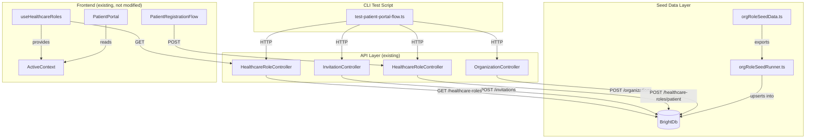
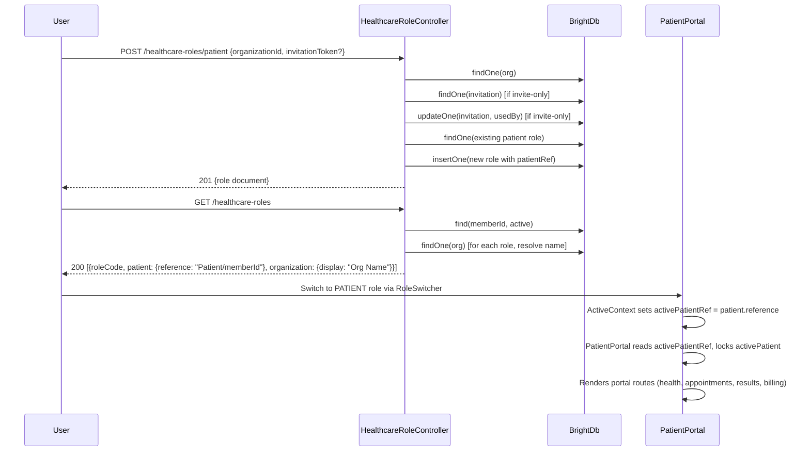

# Design Document: Patient Portal Registration

## Overview

This design extends the existing BrightChart patient portal infrastructure with two deliverables:

1. **Extended seed data** — New deterministic records in `orgRoleSeedData.ts` that create a complete patient-portal-ready test scenario, including a PATIENT role with valid `patientRef` at an open org, an invitation token for the invite-only org, and dual provider+patient roles for the dev user to test role switching.

2. **CLI test script** — A TypeScript script (`scripts/test-patient-portal-flow.ts`) that chains the existing API endpoints together in sequence: create org → assign provider → create invitation → register patient (invite-only) → register patient (open) → fetch roles → verify, providing pass/fail output with HTTP status codes.

The existing API controllers (`HealthcareRoleController`, `InvitationController`, `OrganizationController`), UI components (`PatientRegistrationFlow`, `PatientPortal`), hooks (`useHealthcareRoles`), and contexts (`ActiveContext`) are already implemented and will not be redesigned. This design focuses on the glue and verification layer.

### Key Design Decisions

- **Extend, don't replace**: The existing `orgRoleSeedData.ts` already has 3 orgs, 3 roles, and 1 invitation. We add new records alongside them rather than modifying existing ones, preserving backward compatibility with existing tests.
- **Upsert semantics**: The seed runner already uses insert-or-skip. The new records follow the same pattern with deterministic IDs.
- **CLI script uses HTTP**: The test script calls the REST API over HTTP rather than importing controller code directly, validating the full request/response pipeline including routing, authentication middleware, and serialization.
- **No new libraries**: The CLI script uses Node.js built-in `fetch` (available in Node 18+) to avoid adding dependencies.

## Architecture

The feature touches two layers of the existing architecture:



### Seed Data Extension

New records are added to the existing exported arrays. The seed runner (`orgRoleSeedRunner.ts`) already iterates over `SEED_ORGANIZATIONS`, `SEED_HEALTHCARE_ROLES`, and `SEED_INVITATIONS` — no changes needed there.

### CLI Test Script

A standalone TypeScript script that:
1. Accepts `--base-url` and `--token` CLI arguments
2. Executes a sequence of HTTP calls against the running API
3. Validates each response status code and body
4. Exits 0 on full success, non-zero on any failure

The script is designed to run via `npx tsx scripts/test-patient-portal-flow.ts --base-url http://localhost:3000 --token <jwt>`.

## Components and Interfaces

### 1. Extended Seed Data (`orgRoleSeedData.ts`)

New exported constants:

| Constant | Value | Purpose |
|---|---|---|
| `ROLE_PATIENT_SUNRISE_ID` | `'seed-role-patient-sunrise-04'` | PATIENT role at Sunrise (open org) for dev user |
| `INV_SUNRISE_PATIENT_ID` | `'seed-inv-sunrise-patient-01'` | Invitation for patient at Sunrise (open org, for completeness) |
| `INV_SUNRISE_PATIENT_TOKEN` | `'seed-invite-sunrise-patient-token-001'` | Token for the Sunrise invitation |

New records added to existing arrays:

**SEED_HEALTHCARE_ROLES** — 1 new entry:
- PATIENT role at Sunrise Family Practice (open enrollment) for the dev user, with `patientRef: DEV_USER_ID`. This gives the dev user both a provider role (ADMIN @ Sunrise, PHYSICIAN @ Downtown) and a patient role (PATIENT @ Sunrise, PATIENT @ CityVet), enabling role-switching tests.

**SEED_INVITATIONS** — 1 new entry:
- Invitation for PATIENT role at Sunrise Family Practice. While Sunrise is open-enrollment (so the token isn't strictly required), having it available lets the CLI script test the "token ignored for open org" path (Requirement 2.5).

### 2. CLI Test Script (`scripts/test-patient-portal-flow.ts`)

```typescript
interface TestStep {
  name: string;
  method: 'GET' | 'POST' | 'DELETE';
  path: string;
  body?: Record<string, unknown>;
  expectedStatus: number;
  validate?: (data: unknown) => void;
}

interface StepResult {
  step: string;
  status: number;
  success: boolean;
  data?: unknown;
  error?: string;
}
```

The script defines a pipeline of `TestStep` objects and executes them sequentially, collecting `StepResult` for each. It uses a simple `runStep` function that calls `fetch`, checks the status code, and optionally runs a validation function on the response body.

**CLI Arguments:**
- `--base-url <url>` (required) — API base URL, e.g. `http://localhost:3000/api`
- `--token <jwt>` (optional) — Bearer token for authentication. If omitted, the script reads from `AUTH_TOKEN` env var.

**Test Steps (in order):**
1. Create a test organization (open enrollment)
2. Assign PHYSICIAN role to the authenticated user at the new org
3. Create an invitation for PATIENT role at the new org
4. Register patient using the invitation token
5. Fetch healthcare roles and verify the new PATIENT role exists
6. Verify the PATIENT role has `patient.reference` populated

### 3. Existing Components (verification only, no changes)

The following existing components are verified to work correctly with the seed data and CLI script:

- **`HealthcareRoleController.handleRegisterPatient`** — Already sets `patientRef: patientMemberId` when creating PATIENT roles. ✅
- **`HealthcareRoleController.handleGetMyRoles`** — Already maps `patientRef` to `patient: { reference: \`Patient/\${patientRef}\` }`. ✅
- **`InvitationController.handleCreateInvitation`** — Already validates role codes including PATIENT. ✅
- **`InvitationController.handleRedeemInvitation`** — Already sets `patientRef` for PATIENT roles. ✅
- **`useHealthcareRoles`** — Already consumes `patient.reference` from the API response. ✅
- **`ActiveContext`** — Already exposes `activePatientRef` derived from `activeRole.patient?.reference`. ✅
- **`PatientPortal`** — Already reads `activeRole.patient?.reference` and locks `activePatient`. ✅
- **`PatientRegistrationFlow`** — Already calls `refetchRoles?.()` on success. ✅

## Data Models

### Existing Models (unchanged)

**IHealthcareRoleDocument** — The stored document in `healthcare_roles` collection:
```typescript
interface IHealthcareRoleDocument {
  _id: string;
  memberId: string;
  roleCode: string;        // SNOMED CT code
  roleDisplay: string;
  organizationId: string;
  practitionerRef?: string; // set for provider roles
  patientRef?: string;      // set for PATIENT roles
  period: { start: string; end?: string };
  createdBy: string;
  createdAt: string;
  updatedAt: string;
}
```

**IHealthcareRole** — The API response shape consumed by the frontend:
```typescript
interface IHealthcareRole {
  roleCode: string;
  roleDisplay: string;
  organization?: { reference?: string; display?: string };
  practitioner?: { reference?: string; display?: string };
  patient?: { reference?: string; display?: string };
  period?: { start: string; end?: string };
}
```

**IInvitation** — Invitation record:
```typescript
interface IInvitation {
  _id: string;
  token: string;
  organizationId: string;
  roleCode: string;
  targetEmail?: string;
  createdBy: string;
  expiresAt: string;
  usedBy?: string;
  usedAt?: string;
  createdAt: string;
}
```

**IOrganization** — Organization record:
```typescript
interface IOrganization {
  _id: string;
  name: string;
  active: boolean;
  enrollmentMode: 'open' | 'invite-only';
  createdBy: string;
  createdAt: string;
  updatedAt: string;
}
```

### New Seed Data Records

**New PATIENT role at Sunrise:**
```typescript
{
  _id: 'seed-role-patient-sunrise-04',
  memberId: DEV_USER_ID,
  roleCode: PATIENT,                    // '116154003'
  roleDisplay: ROLE_CODE_DISPLAY[PATIENT], // 'Patient'
  organizationId: ORG_SUNRISE_ID,
  patientRef: DEV_USER_ID,
  period: { start: '2025-01-01T00:00:00.000Z' },
  createdBy: DEV_USER_ID,
  createdAt: '2025-01-01T00:00:00.000Z',
  updatedAt: '2025-01-01T00:00:00.000Z',
}
```

**New invitation at Sunrise:**
```typescript
{
  _id: 'seed-inv-sunrise-patient-01',
  token: 'seed-invite-sunrise-patient-token-001',
  organizationId: ORG_SUNRISE_ID,
  roleCode: PATIENT,
  createdBy: DEV_USER_ID,
  expiresAt: '2099-12-31T23:59:59.000Z',
  createdAt: '2025-01-01T00:00:00.000Z',
}
```

### Data Flow: Patient Registration → Portal Access




## Correctness Properties

*A property is a characteristic or behavior that should hold true across all valid executions of a system — essentially, a formal statement about what the system should do. Properties serve as the bridge between human-readable specifications and machine-verifiable correctness guarantees.*

### Property 1: Patient registration creates a role with patientRef

*For any* valid patient registration request (self-service at an open org, self-service with a valid invitation at an invite-only org, or staff-initiated), the controller SHALL create a PATIENT healthcare role document with `patientRef` set to the patient's member ID, and return HTTP 201 with the role document in the response body.

**Validates: Requirements 2.1, 2.2, 2.6, 3.1, 3.2**

### Property 2: Duplicate patient role detection

*For any* (memberId, organizationId) pair where an active PATIENT healthcare role already exists, submitting a patient registration request SHALL return HTTP 409 with error code `CONFLICT`, and the existing role SHALL remain unchanged.

**Validates: Requirements 3.3**

### Property 3: Staff-initiated registration bypasses enrollment mode

*For any* staff-initiated registration where the caller holds an active ADMIN or practitioner role at the organization, the controller SHALL create a PATIENT healthcare role for the target member regardless of the organization's enrollment mode (open or invite-only), without requiring an invitation token.

**Validates: Requirements 4.1, 4.4**

### Property 4: Non-staff callers are rejected for staff-initiated registration

*For any* caller who does not hold an active ADMIN or practitioner role at the specified organization, submitting a staff-initiated patient registration (with `targetMemberId`) SHALL return HTTP 403.

**Validates: Requirements 4.2, 4.3**

### Property 5: Invitation expiry is 7 days from creation

*For any* successfully created invitation, the `expiresAt` timestamp SHALL be approximately 7 days (168 hours ± 1 second) after the `createdAt` timestamp.

**Validates: Requirements 5.1**

### Property 6: Non-staff callers are rejected for invitation creation

*For any* caller who does not hold an active ADMIN or practitioner role at the specified organization, submitting an invitation creation request SHALL return HTTP 403.

**Validates: Requirements 5.2, 5.5**

### Property 7: Invitation response contains required fields

*For any* successfully created invitation, the response body SHALL contain the `token` (non-empty string), `organizationId`, `roleCode`, and `expiresAt` fields.

**Validates: Requirements 5.3**

### Property 8: ActiveContext derives activePatientRef from role

*For any* `IHealthcareRole` with `patient.reference` set, when that role is set as the active role in ActiveContext, the `activePatientRef` value SHALL equal `patient.reference`.

**Validates: Requirements 6.1**

### Property 9: Role API maps patientRef to patient.reference

*For any* healthcare role document in the database with `patientRef` set, the `GET /healthcare-roles` endpoint SHALL return that role with `patient.reference` equal to `Patient/${patientRef}` and `organization.display` populated from the organization's name.

**Validates: Requirements 6.4**

### Property 10: CLI step logger includes step name and status code

*For any* step name (non-empty string) and HTTP status code (integer), the CLI test script's log output for that step SHALL contain both the step name and the status code.

**Validates: Requirements 8.3**

## Error Handling

### API Layer (existing, verified)

| Condition | HTTP Status | Error Code | Source |
|---|---|---|---|
| Missing authentication | 400 | Validation error | All controllers |
| Missing `organizationId` | 400 | Validation error | HealthcareRoleController |
| Organization not found | 404 | Not found | HealthcareRoleController |
| Expired invitation token | 410 | `GONE` | HealthcareRoleController |
| Already-redeemed invitation | 410 | `GONE` | HealthcareRoleController |
| Invalid invitation token | 410 | `GONE` | HealthcareRoleController |
| Invite-only org, no token | 403 | `INVITATION_REQUIRED` | HealthcareRoleController |
| Duplicate PATIENT role | 409 | `CONFLICT` | HealthcareRoleController |
| Non-staff caller for staff ops | 403 | Forbidden | HealthcareRoleController, InvitationController |
| Invalid role code | 400 | `INVALID_ROLE_CODE` | InvitationController |
| Database unavailable | 503 | Service unavailable | All controllers |

### Seed Runner

- Existing documents with the same `_id` are silently skipped (insert-or-skip pattern)
- Database errors during upsert are caught and logged via `SeedLogger.error()`

### CLI Test Script

- Each step validates the HTTP status code against the expected value
- On mismatch, the step is marked as failed with the actual status code and response body logged
- The script continues to the next step only if the current step succeeds (fail-fast)
- Network errors (connection refused, timeout) are caught and logged with the step name
- Exit code 1 on any failure, exit code 0 only when all steps pass

### Frontend (existing, verified)

- `PatientRegistrationFlow` catches API errors and displays user-friendly messages for `INVITATION_REQUIRED`, `CONFLICT`, and `GONE` error codes
- `PatientPortal` renders `AccessDenied` when `activePatientRef` is not set
- `useHealthcareRoles` falls back to default roles when the API is unreachable

## Testing Strategy

### Property-Based Tests (fast-check)

Property-based tests validate universal properties across generated inputs. Each test runs a minimum of 100 iterations.

**Library:** `fast-check` (already used in the project — see `orgRoleSeedData.spec.ts`)

Tests to implement for the new code:

1. **Seed data schema conformance** (extends existing Property 1) — For any new seed record, all required schema fields are present. Tag: `Feature: patient-portal-registration, Property 1: Patient registration creates a role with patientRef`

2. **Patient registration patientRef invariant** — For any valid registration input, the created role has `patientRef` set. Tag: `Feature: patient-portal-registration, Property 1: Patient registration creates a role with patientRef`

3. **Duplicate detection** — For any pre-existing PATIENT role, re-registration returns 409. Tag: `Feature: patient-portal-registration, Property 2: Duplicate patient role detection`

4. **Staff bypass enrollment mode** — For any staff caller and any enrollment mode, staff-initiated registration succeeds. Tag: `Feature: patient-portal-registration, Property 3: Staff-initiated registration bypasses enrollment mode`

5. **Non-staff rejection** — For any non-staff caller, staff-initiated registration returns 403. Tag: `Feature: patient-portal-registration, Property 4: Non-staff callers are rejected for staff-initiated registration`

6. **Invitation expiry calculation** — For any successful invitation, expiresAt is ~7 days after createdAt. Tag: `Feature: patient-portal-registration, Property 5: Invitation expiry is 7 days from creation`

7. **Invitation response shape** — For any successful invitation, response contains token, orgId, roleCode, expiresAt. Tag: `Feature: patient-portal-registration, Property 7: Invitation response contains required fields`

8. **ActiveContext patientRef derivation** — For any role with patient.reference, activePatientRef equals that value. Tag: `Feature: patient-portal-registration, Property 8: ActiveContext derives activePatientRef from role`

9. **Role API patientRef mapping** — For any role doc with patientRef, GET returns patient.reference = `Patient/${patientRef}`. Tag: `Feature: patient-portal-registration, Property 9: Role API maps patientRef to patient.reference`

10. **CLI step logger output** — For any step name and status code, log contains both. Tag: `Feature: patient-portal-registration, Property 10: CLI step logger includes step name and status code`

### Unit Tests (Jest)

Example-based tests for specific scenarios and edge cases:

- Seed data contains open and invite-only organizations (Req 1.1)
- Seed data contains PHYSICIAN role at invite-only org (Req 1.2)
- Seed data contains PATIENT role at open org with patientRef (Req 1.3)
- Seed data contains unexpired invitation for invite-only org (Req 1.4)
- Expired invitation returns 410 GONE (Req 2.3)
- Already-redeemed invitation returns 410 GONE (Req 2.4)
- Token ignored for open enrollment org (Req 2.5)
- Non-existent organization returns 404 (Req 3.4)
- Invalid role code returns 400 (Req 5.4)
- PatientPortal renders routes when activePatientRef is set (Req 6.2)
- PatientPortal renders AccessDenied when no patient.reference (Req 6.3)
- PatientRegistrationFlow calls refetchRoles on success (Req 7.1)
- CLI script accepts --base-url and --token arguments (Req 8.1)
- CLI script exits 0 on all-pass (Req 8.5)
- CLI script exits non-zero on failure (Req 8.4)

### Integration Tests

- Full CLI script execution against a running API with seeded data (Req 8.2)
- `useHealthcareRoles` hook returns updated roles after refetch (Req 7.2)
- RoleSwitcher displays new PATIENT role after refetch (Req 7.3)

### Test Configuration

- Property tests: minimum 100 iterations per property (`{ numRuns: 100 }`)
- Unit tests: Jest with mocked BrightDb collections for controller tests
- Frontend tests: React Testing Library with mocked ActiveContext
- CLI tests: Jest with mocked `fetch` for step execution logic
- Run via: `yarn nx test brightchain-api-lib --testPathPatterns="seed|healthcareRole|invitation"` and `yarn nx test brightchart-react-components --testPathPatterns="PatientPortal|PatientRegistration|ActiveContext|useHealthcareRoles"`
