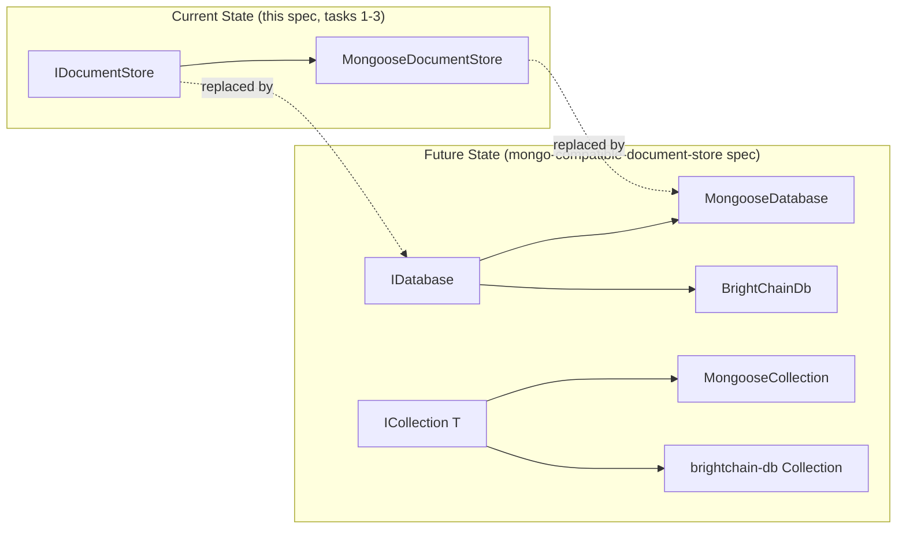

# Design Document: Pluggable Document Store

> **Status: PARTIALLY COMPLETED / SUPERSEDED**
>
> The `IDocumentStore` interface and `MongooseDocumentStore` implementation exist as working code. The remaining design (BaseApplication refactoring, Application constructor changes, IApplication updates) has been **superseded** by the [`mongo-compatible-document-store`](../mongo-compatible-document-store/design.md) spec.

## Overview

This spec created two artifacts in `@digitaldefiance/node-express-suite`:

1. **`IDocumentStore`** — a storage-agnostic interface at `interfaces/document-store.ts`
2. **`MongooseDocumentStore`** — a mongoose wrapper at `services/mongoose-document-store.ts`

Both are exported from the package barrel and compile cleanly. They serve as a **transitional bridge** until the `mongo-compatible-document-store` spec replaces them with `IDatabase` and `MongooseDatabase`.

## Transitional Architecture

### What Exists (Completed)

- **`IDocumentStore<TID, TModelDocs>`** declares: `connect`, `disconnect`, `isConnected`, `getModel`, optional `setupDevStore`/`initializeDevStore`, optional readonly `schemaMap`/`devDatabase`.
- **`MongooseDocumentStore`** implements `IDocumentStore`, holding `_db`, `_schemaMap`, `_devDatabase` fields. Constructor accepts `schemaMapFactory`, `databaseInitFunction`, `initResultHashFunction`, `environment`, `constants`.
- Both exported from `interfaces/index.ts`, `services/index.ts`, and the package root `index.ts`.

### What Was Planned But Is Now Superseded

The original design called for:
- Refactoring `BaseApplication` to accept `IDocumentStore` and delegate all DB operations
- Adding an optional `documentStore` parameter to `Application`'s constructor
- Updating `IApplication` to expose `documentStore`
- Backward-compatible accessor delegation (`db`, `schemaMap`, `devDatabase`)

All of this is now handled by the `mongo-compatible-document-store` spec, which takes a stronger approach:
- Shared `IDatabase`/`ICollection<T>`/`IClientSession` interfaces in `brightchain-lib`
- Both `BrightChainDb` and `MongooseDatabase` implement `IDatabase`
- `BaseApplication` depends on `IDatabase` instead of `IDocumentStore`

## Disposition of Existing Code

| Artifact | Location | Status |
|---|---|---|
| `IDocumentStore` | `interfaces/document-store.ts` | Working. Will be replaced by `IDatabase` from `brightchain-lib`. |
| `MongooseDocumentStore` | `services/mongoose-document-store.ts` | Working. Will be replaced by `MongooseDatabase` in `express-suite`. |
| Barrel exports | `interfaces/index.ts`, `services/index.ts`, `index.ts` | Working. Exports will be updated when replacement is complete. |

No further work should be done on this spec. All remaining implementation effort belongs to the `mongo-compatible-document-store` spec.
