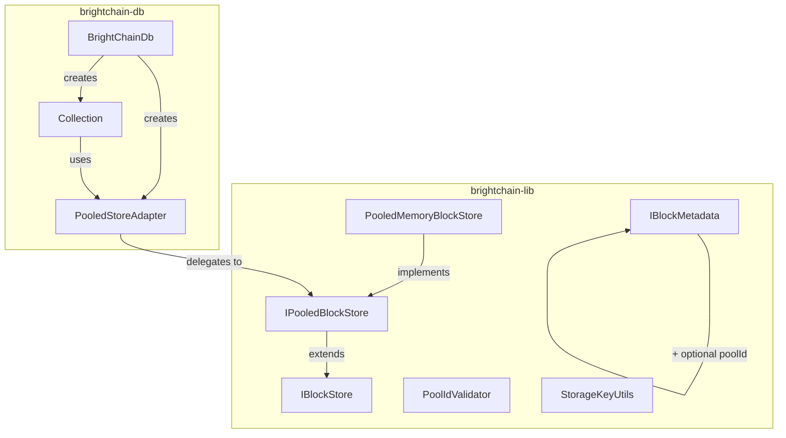

# Design Document: Pool-Based Storage Isolation

## Overview

This design introduces pool-based namespace isolation to BrightChain's block store. Pools are lightweight string prefixes on block IDs that provide logical grouping without requiring separate physical storage. The implementation adds a new `IPooledBlockStore` interface in `brightchain-lib` extending the existing `IBlockStore`, a `PooledMemoryBlockStore` reference implementation, and integration points in `brightchain-db` so each database instance can operate within an isolated pool.

The design follows the project's architecture rules: shared interfaces and types live in `brightchain-lib`, and the database integration lives in `brightchain-db`.

## Architecture



The key architectural decision is introducing a `PooledStoreAdapter` in `brightchain-db` that wraps an `IPooledBlockStore` and exposes the standard `IBlockStore` interface with all operations scoped to a specific pool. This means `Collection` does not need to change its internal logic at all — it continues to call `store.has()`, `store.get()`, `store.put()` as before, but the adapter routes those calls through pool-scoped methods.

## Components and Interfaces

### 1. PoolId Type and Validator (`brightchain-lib`)

Location: `brightchain-lib/src/lib/interfaces/storage/pooledBlockStore.ts`

```typescript
/**
 * Pool identifier type. Must match /^[a-zA-Z0-9_-]{1,64}$/.
 * Case-sensitive. "default" is reserved for unpooled blocks.
 */
export type PoolId = string;

/** Reserved pool identifier for unpooled/legacy blocks */
export const DEFAULT_POOL: PoolId = 'default';

/** Regex for valid pool identifiers */
const POOL_ID_PATTERN = /^[a-zA-Z0-9_-]{1,64}$/;

/**
 * Validate a pool identifier.
 * @throws Error if the pool ID is invalid
 */
export function validatePoolId(poolId: PoolId): void {
  if (!POOL_ID_PATTERN.test(poolId)) {
    throw new Error(
      `Invalid pool ID "${poolId}": must match /^[a-zA-Z0-9_-]{1,64}$/`
    );
  }
}

/**
 * Check if a pool ID is valid without throwing.
 */
export function isValidPoolId(poolId: PoolId): boolean {
  return POOL_ID_PATTERN.test(poolId);
}
```

### 2. Storage Key Utilities (`brightchain-lib`)

Location: `brightchain-lib/src/lib/interfaces/storage/pooledBlockStore.ts`

```typescript
/**
 * Construct an internal storage key from pool and hash.
 * Format: "${poolId}:${hash}"
 */
export function makeStorageKey(poolId: PoolId, hash: string): string {
  return `${poolId}:${hash}`;
}

/**
 * Parse a storage key into its pool and hash components.
 * The pool is everything up to the first colon; the hash is the rest.
 */
export function parseStorageKey(key: string): { poolId: PoolId; hash: string } {
  const colonIndex = key.indexOf(':');
  if (colonIndex === -1) {
    return { poolId: DEFAULT_POOL, hash: key };
  }
  return {
    poolId: key.substring(0, colonIndex),
    hash: key.substring(colonIndex + 1),
  };
}
```

### 3. ListOptions and PoolStats Interfaces (`brightchain-lib`)

Location: `brightchain-lib/src/lib/interfaces/storage/pooledBlockStore.ts`

```typescript
/** Pagination options for listing blocks in a pool */
export interface ListOptions {
  /** Maximum number of items to return */
  limit?: number;
  /** Opaque cursor for pagination (the last hash from the previous page) */
  cursor?: string;
}

/** Statistics about a pool */
export interface PoolStats {
  /** The pool identifier */
  poolId: PoolId;
  /** Number of blocks in the pool */
  blockCount: number;
  /** Total bytes stored in the pool */
  totalBytes: number;
  /** When the pool was first created (first block stored) */
  createdAt: Date;
  /** When the pool was last accessed (any read or write) */
  lastAccessedAt: Date;
}
```

### 4. IPooledBlockStore Interface (`brightchain-lib`)

Location: `brightchain-lib/src/lib/interfaces/storage/pooledBlockStore.ts`

```typescript
import { IBlockStore } from './blockStore';

/**
 * Extended block store interface with pool-scoped operations.
 * Pools provide namespace isolation for blocks without separate physical storage.
 */
export interface IPooledBlockStore extends IBlockStore {
  // === Pool-Scoped Block Operations ===

  /** Check if a block exists in a specific pool */
  hasInPool(pool: PoolId, hash: string): Promise<boolean>;

  /** Get block data from a specific pool */
  getFromPool(pool: PoolId, hash: string): Promise<Uint8Array>;

  /** Store block data in a specific pool, returns the block hash */
  putInPool(pool: PoolId, data: Uint8Array, options?: import('./blockMetadata').BlockStoreOptions): Promise<string>;

  /** Delete a block from a specific pool */
  deleteFromPool(pool: PoolId, hash: string): Promise<void>;

  // === Pool Management ===

  /** List all pools that contain at least one block */
  listPools(): Promise<PoolId[]>;

  /** List block hashes in a pool with optional pagination */
  listBlocksInPool(pool: PoolId, options?: ListOptions): AsyncIterable<string>;

  /** Get statistics for a pool */
  getPoolStats(pool: PoolId): Promise<PoolStats>;

  /** Delete an entire pool and all its blocks */
  deletePool(pool: PoolId): Promise<void>;
}
```

### 5. IBlockMetadata Extension (`brightchain-lib`)

The existing `IBlockMetadata` interface gains an optional `poolId` field:

```typescript
export interface IBlockMetadata {
  // ... existing fields ...
  /** Optional pool identifier for pool-scoped blocks */
  poolId?: PoolId;
}
```

### 6. PooledMemoryBlockStore (`brightchain-lib`)

Location: `brightchain-lib/src/lib/stores/pooledMemoryBlockStore.ts`

This class extends `MemoryBlockStore` and implements `IPooledBlockStore`. It uses a `Map<string, Uint8Array>` keyed by storage keys (`${pool}:${hash}`), and maintains a `Map<PoolId, PoolStats>` for per-pool statistics.

Key implementation details:
- `putInPool`: computes SHA3-512 hash of data, constructs storage key, stores block, updates pool stats
- `getFromPool`: constructs storage key, retrieves block, throws if not found
- `hasInPool`: constructs storage key, checks map
- `deleteFromPool`: constructs storage key, removes from map, updates pool stats
- `listPools`: returns keys from the pool stats map that have blockCount > 0
- `listBlocksInPool`: iterates all storage keys, yields hashes where pool prefix matches
- `getPoolStats`: returns stats from the pool stats map, throws if pool not found
- `deletePool`: iterates and removes all keys with the pool prefix, removes pool stats entry
- Legacy methods (`has`, `get`, `put`, `delete`, `getData`, `setData`, `deleteData`): delegate to pool-scoped methods using `DEFAULT_POOL`

```typescript
class PooledMemoryBlockStore extends MemoryBlockStore implements IPooledBlockStore {
  private poolBlocks = new Map<string, Uint8Array>();
  private poolStatsMap = new Map<PoolId, PoolStats>();

  // Pool-scoped operations use makeStorageKey/parseStorageKey
  // Legacy operations delegate to DEFAULT_POOL
  // Pool stats updated on every put/delete
}
```

### 7. PooledStoreAdapter (`brightchain-db`)

Location: `brightchain-db/src/lib/pooledStoreAdapter.ts`

This adapter wraps an `IPooledBlockStore` and a fixed `PoolId`, exposing the standard `IBlockStore` interface. All operations are transparently routed through the pool.

```typescript
import { IBlockStore, IPooledBlockStore, PoolId } from '@brightchain/brightchain-lib';

/**
 * Adapts an IPooledBlockStore to IBlockStore by fixing all operations
 * to a specific pool. This allows Collection to remain unchanged.
 */
export class PooledStoreAdapter implements IBlockStore {
  constructor(
    private readonly inner: IPooledBlockStore,
    private readonly poolId: PoolId,
  ) {}

  async has(key: Checksum | string): Promise<boolean> {
    return this.inner.hasInPool(this.poolId, String(key));
  }

  async put(key: Checksum | string, data: Uint8Array): Promise<void> {
    await this.inner.putInPool(this.poolId, data);
  }

  get<T extends BaseBlock>(key: Checksum | string): BlockHandle<T> {
    // Delegate to inner store's get, but with pool-prefixed key
    return this.inner.get(makeStorageKey(this.poolId, String(key)));
  }

  // ... remaining IBlockStore methods delegate similarly ...
}
```

### 8. BrightChainDb Integration (`brightchain-db`)

The `BrightChainDb` constructor gains an optional `poolId` parameter. When provided and the block store implements `IPooledBlockStore`, it wraps the store in a `PooledStoreAdapter` before passing it to collections.

```typescript
export interface BrightChainDbOptions {
  name?: string;
  headRegistry?: HeadRegistry;
  cursorTimeoutMs?: number;
  /** Optional pool ID for storage isolation */
  poolId?: PoolId;
}

export class BrightChainDb {
  constructor(blockStore: IBlockStore, options?: BrightChainDbOptions) {
    // If poolId is provided and store supports pools, wrap it
    if (options?.poolId && isPooledBlockStore(blockStore)) {
      this.store = new PooledStoreAdapter(blockStore, options.poolId);
    } else {
      this.store = blockStore;
    }
    // ... rest unchanged
  }
}
```

A type guard function `isPooledBlockStore` checks for the presence of pool methods:

```typescript
export function isPooledBlockStore(store: IBlockStore): store is IPooledBlockStore {
  return 'hasInPool' in store && 'putInPool' in store
    && 'getFromPool' in store && 'deleteFromPool' in store;
}
```

## Data Models

### Storage Key Format

```
Internal key: "${poolId}:${hash}"
Examples:
  "default:abc123def..."     (legacy/unpooled block)
  "db:users:abc123def..."    (block in "db:users" pool — note pool ID can contain colons? No.)
```

Pool IDs cannot contain colons (the regex `[a-zA-Z0-9_-]` excludes `:`), so the first colon in a storage key is always the delimiter between pool ID and hash. This makes parsing unambiguous.

### PoolStats

```typescript
{
  poolId: "db:users",       // Wait — this contains a colon!
}
```

**Important design clarification**: The spec document uses pool IDs like `"db:users"` in examples, but the validation regex `/^[a-zA-Z0-9_-]{1,64}$/` does not allow colons. This is intentional — the colon is the internal delimiter. Pool IDs like `"db-users"` or `"db_users"` should be used instead. The spec examples are illustrative, not literal.

Corrected examples:
```typescript
{
  poolId: "db-users",
  blockCount: 1542,
  totalBytes: 6291456,
  createdAt: new Date("2025-01-15T10:00:00Z"),
  lastAccessedAt: new Date("2025-01-15T14:30:00Z"),
}
```

### IBlockMetadata (extended)

```typescript
{
  blockId: "abc123def...",
  poolId: "db-users",        // NEW optional field
  createdAt: new Date(),
  expiresAt: null,
  durabilityLevel: DurabilityLevel.Standard,
  parityBlockIds: [],
  accessCount: 0,
  lastAccessedAt: new Date(),
  replicationStatus: ReplicationStatus.Pending,
  targetReplicationFactor: 0,
  replicaNodeIds: [],
  size: 4096,
  checksum: "abc123def...",
}
```


## Correctness Properties

*A property is a characteristic or behavior that should hold true across all valid executions of a system — essentially, a formal statement about what the system should do. Properties serve as the bridge between human-readable specifications and machine-verifiable correctness guarantees.*

### Property 1: Pool ID validation accepts exactly valid identifiers

*For any* string, the Pool_ID_Validator accepts it if and only if it matches `/^[a-zA-Z0-9_-]{1,64}$/`. Strings that are empty, exceed 64 characters, or contain characters outside `[a-zA-Z0-9_-]` are rejected with an error.

**Validates: Requirements 1.1, 1.2, 1.3**

### Property 2: Storage key round-trip

*For any* valid PoolId and any hash string (not containing a colon as first-segment delimiter — hashes are hex strings), constructing a storage key with `makeStorageKey(poolId, hash)` and then parsing it with `parseStorageKey` yields the original `poolId` and `hash`.

**Validates: Requirements 3.1, 3.2, 3.3**

### Property 3: Put/get round-trip within a pool

*For any* valid PoolId and any block data (non-empty `Uint8Array`), storing the data with `putInPool(pool, data)` and then retrieving it with `getFromPool(pool, returnedHash)` yields data identical to the original.

**Validates: Requirements 2.4, 2.6, 8.3, 8.4**

### Property 4: Cross-pool isolation

*For any* two distinct valid PoolIds (poolA ≠ poolB) and any block data, storing the data in poolA and then calling `hasInPool(poolB, hash)` returns false. The same hash in different pools represents separate storage entries.

**Validates: Requirements 2.3, 3.4, 9.1**

### Property 5: Delete removes block from pool

*For any* valid PoolId and any block stored in that pool, calling `deleteFromPool(pool, hash)` causes `hasInPool(pool, hash)` to return false.

**Validates: Requirements 2.7**

### Property 6: Pool stats consistency

*For any* sequence of `putInPool` and `deleteFromPool` operations on a pool, `getPoolStats(pool).blockCount` equals the number of distinct blocks currently in the pool, and `getPoolStats(pool).totalBytes` equals the sum of their sizes.

**Validates: Requirements 4.1, 4.2, 4.3, 8.5**

### Property 7: deletePool removes exactly the target pool

*For any* two distinct pools (poolA, poolB) each containing blocks, calling `deletePool(poolA)` removes all blocks from poolA (hasInPool returns false for all) and removes poolA from `listPools()`, while all blocks in poolB remain accessible.

**Validates: Requirements 5.1, 5.2, 9.2**

### Property 8: listPools returns exactly pools with blocks

*For any* set of pools that have had blocks stored in them (and not fully deleted), `listPools()` returns exactly those pool identifiers.

**Validates: Requirements 2.8**

### Property 9: listBlocksInPool returns exactly the pool's hashes

*For any* pool with a known set of stored block hashes, collecting all items from `listBlocksInPool(pool)` yields exactly that set of hashes (no more, no less).

**Validates: Requirements 2.9, 9.3**

### Property 10: Legacy operations equivalent to default pool

*For any* block data, storing via legacy `put(hash, data)` and then retrieving via `getFromPool("default", hash)` returns the same data. Conversely, storing via `putInPool("default", data)` and retrieving via legacy `getData(hash)` returns the same data.

**Validates: Requirements 6.1, 6.2, 6.3, 6.4, 6.5**

### Property 11: Metadata poolId matches storage pool

*For any* block stored in a specific pool, `getMetadata(key).poolId` equals the PoolId used during storage. For blocks stored via legacy methods, `poolId` is `"default"` or undefined.

**Validates: Requirements 7.2, 7.3**

### Property 12: Database pool routing

*For any* document inserted into a BrightChainDb instance configured with a poolId, the underlying `IPooledBlockStore` contains the document's block in the configured pool (verifiable via `hasInPool`).

**Validates: Requirements 10.2**

### Property 13: Database drop deletes pool

*For any* BrightChainDb instance configured with a poolId, dropping the database causes `listPools()` on the underlying store to no longer include that poolId.

**Validates: Requirements 10.4**

### Property 14: Pagination in listBlocksInPool

*For any* pool with N blocks and any limit L > 0, paginating through `listBlocksInPool(pool, { limit: L })` using cursors yields exactly N total hashes with no duplicates and no omissions.

**Validates: Requirements 2.10**

## Error Handling

### Pool ID Validation Errors

- `validatePoolId` throws a descriptive `Error` when the pool ID doesn't match the required pattern
- Error message includes the invalid pool ID and the expected pattern
- All pool-scoped methods call `validatePoolId` before proceeding

### Block Not Found Errors

- `getFromPool` throws when the block doesn't exist in the specified pool
- Error includes both the pool ID and the hash for debugging
- Follows the existing `StoreError` pattern if available, otherwise uses a descriptive `Error`

### Pool Not Found Errors

- `getPoolStats` throws when called for a pool that has never had blocks stored
- `deletePool` on a non-existent pool completes silently (idempotent)

### Adapter Errors

- `PooledStoreAdapter` propagates all errors from the underlying `IPooledBlockStore`
- If a non-pooled `IBlockStore` is passed to `BrightChainDb` with a `poolId`, the database falls back to using the store directly (no adapter wrapping)

## Testing Strategy

### Property-Based Testing

Use `fast-check` as the property-based testing library (already available in the Node.js/TypeScript ecosystem, compatible with Jest).

Each correctness property maps to a single property-based test with a minimum of 100 iterations. Tests are tagged with the format:

```
Feature: pool-based-storage-isolation, Property {N}: {title}
```

Property tests focus on:
- Pool ID validation across random strings (Property 1)
- Storage key round-trip with random pool IDs and hashes (Property 2)
- Put/get round-trip with random data (Property 3)
- Cross-pool isolation with random pool pairs (Property 4)
- Stats consistency across random operation sequences (Property 6)
- Legacy/pool equivalence with random data (Property 10)
- Pagination correctness with random block counts and page sizes (Property 14)

### Unit Testing

Unit tests complement property tests for specific examples and edge cases:
- Pool ID edge cases: empty string, 64-char boundary, 65-char string, special characters
- Case sensitivity: "Users" vs "users" as distinct pools
- Default pool reservation
- `deletePool` on non-existent pool (no-op)
- `deletePool` on default pool
- `getFromPool` on missing block (error)
- `getPoolStats` on missing pool (error)
- `BrightChainDb` constructor with and without poolId
- `PooledStoreAdapter` delegation correctness

### Integration Testing

- End-to-end: create `BrightChainDb` with pool, insert documents, verify blocks are in the correct pool
- Multi-database isolation: two `BrightChainDb` instances with different pools sharing the same `IPooledBlockStore`
- Database drop: verify pool cleanup

### Test Execution

```bash
NX_TUI=false npx nx test brightchain-lib --outputStyle=stream
NX_TUI=false npx nx test brightchain-db --outputStyle=stream
```
