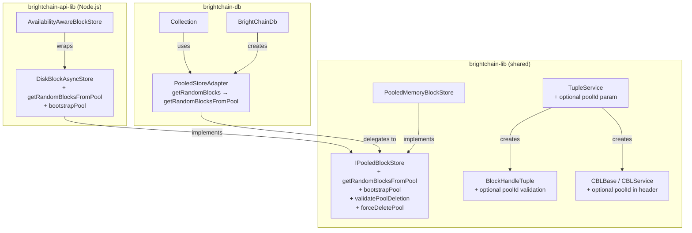

# Design Document: Pool-Scoped Whitening

## Overview

This design enforces pool-scoped whitening in BrightChain's Owner Free Filesystem (OFF) pattern. Today, the XOR/whitening layer is completely pool-blind: `getRandomBlocks()` in `MemoryBlockStore` pulls from the global `blocks` map, `BlockHandleTuple` validates block sizes but not pool membership, and `TupleService` callbacks accept blocks from any pool. This creates cross-pool XOR dependencies where deleting one pool can destroy blocks needed to reconstruct another pool's data.

The fix ensures every block in a tuple belongs to the same pool. This is achieved through:

1. A new `getRandomBlocksFromPool(pool, count)` method on `IPooledBlockStore`
2. `PooledStoreAdapter` routing `getRandomBlocks` through the pool
3. An optional pool parameter on `TupleService` tuple-creation methods
4. Optional pool validation in `BlockHandleTuple`
5. A `bootstrapPool` method to seed new pools with random blocks
6. Pre-deletion validation (`validatePoolDeletion`) to prevent unsafe pool deletion
7. An optional `poolId` field on CBL headers for reconstruction integrity

All changes maintain backward compatibility: unpooled code continues to work via the Default_Pool, and all new parameters are optional.

## Architecture



### Key Architectural Decisions

1. **`getRandomBlocksFromPool` as a new method** rather than changing `getRandomBlocks` signature: This preserves the `IBlockStore` contract. Non-pooled stores don't need to change. The `PooledStoreAdapter` bridges the gap by overriding `getRandomBlocks` to call `getRandomBlocksFromPool`.

2. **Optional pool parameter on TupleService** rather than mandatory: Callers that already use `PooledStoreAdapter` get pool scoping automatically (the adapter's `getRandomBlocks` is already pool-scoped). The explicit pool parameter adds a second layer of defense for callers that construct callbacks manually.

3. **CBL pool metadata as an optional header field** rather than changing the binary format: The pool ID is stored as metadata alongside the CBL, not embedded in the binary header. This avoids breaking the existing CBL header format and signature scheme. The `IBlockMetadata.poolId` field (from pool-based-storage-isolation) already carries this information.

4. **Pre-deletion validation as a separate method**: `validatePoolDeletion` is separate from `deletePool` so callers can check safety without committing to deletion. `forceDeletePool` provides an escape hatch for administrative use.

## Components and Interfaces

### 1. IPooledBlockStore Extensions (`brightchain-lib`)

Location: `brightchain-lib/src/lib/interfaces/storage/pooledBlockStore.ts`

Add three new methods to the existing `IPooledBlockStore` interface:

```typescript
export interface IPooledBlockStore extends IBlockStore {
  // ... existing methods ...

  /**
   * Get random block checksums scoped to a specific pool.
   * Used for pool-scoped whitening to ensure tuples don't cross pool boundaries.
   * @param pool - The pool to source random blocks from
   * @param count - Number of random blocks requested
   * @returns Array of checksums (may be fewer than count if pool has insufficient blocks)
   */
  getRandomBlocksFromPool(pool: PoolId, count: number): Promise<Checksum[]>;

  /**
   * Seed a pool with cryptographically random blocks for whitening material.
   * @param pool - The pool to bootstrap
   * @param blockSize - The block size for generated random blocks
   * @param count - Number of random blocks to generate
   */
  bootstrapPool(pool: PoolId, blockSize: BlockSize, count: number): Promise<void>;

  /**
   * Check whether a pool can be safely deleted (no cross-pool XOR dependencies).
   * @param pool - The pool to validate for deletion
   * @returns Validation result with dependency details if unsafe
   */
  validatePoolDeletion(pool: PoolId): Promise<PoolDeletionValidationResult>;

  /**
   * Delete a pool without checking for cross-pool dependencies.
   * For administrative use only.
   * @param pool - The pool to force-delete
   */
  forceDeletePool(pool: PoolId): Promise<void>;
}
```

New supporting types:

```typescript
/** Result of a pool deletion validation check */
export interface PoolDeletionValidationResult {
  /** Whether the pool can be safely deleted */
  safe: boolean;
  /** Pools that depend on blocks in the target pool (empty if safe) */
  dependentPools: PoolId[];
  /** Block checksums in the target pool that are referenced by other pools' CBLs */
  referencedBlocks: string[];
}
```

### 2. PooledMemoryBlockStore Extensions (`brightchain-lib`)

Location: `brightchain-lib/src/lib/stores/pooledMemoryBlockStore.ts`

New methods on the existing class:

```typescript
class PooledMemoryBlockStore extends MemoryBlockStore implements IPooledBlockStore {
  // ... existing implementation ...

  /**
   * Get random blocks scoped to a specific pool.
   * Iterates storage keys with the pool prefix and randomly selects blocks.
   */
  public async getRandomBlocksFromPool(pool: PoolId, count: number): Promise<Checksum[]> {
    validatePoolId(pool);
    const poolPrefix = `${pool}:`;
    const poolKeys: string[] = [];
    for (const key of this.poolBlocks.keys()) {
      if (key.startsWith(poolPrefix)) {
        poolKeys.push(key.substring(poolPrefix.length));
      }
    }
    const actualCount = Math.min(count, poolKeys.length);
    const shuffled = [...poolKeys].sort(() => Math.random() - 0.5);
    return shuffled.slice(0, actualCount).map(hex => Checksum.fromHex(hex));
  }

  /**
   * Override getRandomBlocks to use Default_Pool for backward compatibility.
   */
  public override async getRandomBlocks(count: number): Promise<Checksum[]> {
    return this.getRandomBlocksFromPool(DEFAULT_POOL, count);
  }

  /**
   * Seed a pool with random blocks.
   */
  public async bootstrapPool(pool: PoolId, blockSize: BlockSize, count: number): Promise<void> {
    validatePoolId(pool);
    if (count <= 0) return;
    for (let i = 0; i < count; i++) {
      const data = new Uint8Array(blockSize);
      crypto.getRandomValues(data);
      await this.putInPool(pool, data);
    }
  }

  /**
   * Validate that no other pool's CBLs reference blocks in this pool.
   * Scans all pools' blocks looking for CBL-type blocks whose addresses
   * reference checksums stored in the target pool.
   */
  public async validatePoolDeletion(pool: PoolId): Promise<PoolDeletionValidationResult> {
    // Implementation scans CBLs in other pools for references to target pool blocks
  }

  /**
   * Force-delete a pool without validation.
   */
  public async forceDeletePool(pool: PoolId): Promise<void> {
    // Same as deletePool but skips validatePoolDeletion
  }
}
```

### 3. PooledStoreAdapter Fix (`brightchain-db`)

Location: `brightchain-db/src/lib/pooledStoreAdapter.ts`

The critical fix — route `getRandomBlocks` through the pool:

```typescript
export class PooledStoreAdapter implements IBlockStore {
  // ... existing implementation ...

  /**
   * FIXED: Route through pool-scoped random block retrieval.
   * Previously delegated to inner.getRandomBlocks() which was global/pool-blind.
   */
  public async getRandomBlocks(count: number): Promise<Checksum[]> {
    return this.inner.getRandomBlocksFromPool(this.poolId, count);
  }
}
```

This is the single most important change. Any code using `PooledStoreAdapter` (including `Collection`, `MemberCblService`, etc.) automatically gets pool-scoped random blocks without any changes to their own code.

### 4. DiskBlockAsyncStore Extensions (`brightchain-api-lib`)

Location: `brightchain-api-lib/src/lib/stores/diskBlockAsyncStore.ts`

```typescript
class DiskBlockAsyncStore implements IPooledBlockStore {
  // ... existing implementation ...

  /**
   * Get random blocks from a specific pool's disk namespace.
   * Reads only from the pool-prefixed directory structure.
   */
  public async getRandomBlocksFromPool(pool: PoolId, count: number): Promise<Checksum[]> {
    validatePoolId(pool);
    // Use pool-prefixed path: storePath/blockSize/pool/XX/YY/hash
    const poolPath = join(this._storePath, blockSizeToSizeString(this._blockSize), pool);
    if (!existsSync(poolPath)) return [];
    // Same random selection logic as getRandomBlocks but scoped to poolPath
  }

  /**
   * Override getRandomBlocks to use Default_Pool.
   */
  public override async getRandomBlocks(count: number): Promise<Checksum[]> {
    return this.getRandomBlocksFromPool(DEFAULT_POOL, count);
  }

  /**
   * Seed a pool with random blocks on disk.
   */
  public async bootstrapPool(pool: PoolId, blockSize: BlockSize, count: number): Promise<void> {
    validatePoolId(pool);
    if (count <= 0) return;
    for (let i = 0; i < count; i++) {
      const data = new Uint8Array(blockSize);
      crypto.getRandomValues(data);
      await this.putInPool(pool, data);
    }
  }

  public async validatePoolDeletion(pool: PoolId): Promise<PoolDeletionValidationResult> {
    // Scan CBLs on disk in other pools
  }

  public async forceDeletePool(pool: PoolId): Promise<void> {
    // Direct deletion without validation
  }
}
```

### 5. TupleService Pool-Scoping (`brightchain-lib`)

Location: `brightchain-lib/src/lib/services/tuple.service.ts`

Add an optional `poolId` parameter to tuple-creation methods. When provided, the service validates that all whitened and random blocks belong to the specified pool.

```typescript
/**
 * Options for pool-scoped tuple creation.
 */
export interface TuplePoolOptions {
  /** Pool that all blocks in the tuple must belong to */
  poolId?: PoolId;
}

class TupleService {
  /**
   * Extended signature with optional pool scoping.
   * When poolId is provided, validates all blocks belong to that pool.
   */
  public async dataStreamToPlaintextTuplesAndCBL(
    creator: Member<TID>,
    blockSize: BlockSize,
    source: Readable,
    sourceLength: number,
    whitenedBlockSource: () => WhitenedBlock | undefined,
    randomBlockSource: () => RandomBlock,
    persistTuple: (tuple: InMemoryBlockTuple) => Promise<void>,
    poolOptions?: TuplePoolOptions,
  ): Promise<InMemoryBlockTuple> {
    // Existing logic unchanged
    // If poolOptions?.poolId is set, wrap whitenedBlockSource and randomBlockSource
    // with validation that checks block metadata poolId matches
  }

  // Same pattern for dataStreamToEncryptedTuplesAndCBL
}
```

The validation wraps the source callbacks:

```typescript
private wrapWithPoolValidation<T extends BaseBlock>(
  source: () => T | undefined,
  poolId: PoolId,
  blockType: string,
): () => T | undefined {
  return () => {
    const block = source();
    if (block && block.metadata?.poolId && block.metadata.poolId !== poolId) {
      throw new TupleError(
        TupleErrorType.PoolBoundaryViolation,
        `${blockType} belongs to pool "${block.metadata.poolId}" but tuple requires pool "${poolId}"`,
      );
    }
    return block;
  };
}
```

### 6. BlockHandleTuple Pool Validation (`brightchain-lib`)

Location: `brightchain-lib/src/lib/blocks/handleTuple.ts`

Add optional pool validation to the constructor:

```typescript
export class BlockHandleTuple<T extends BaseBlock = BaseBlock> {
  private readonly _handles: BlockHandle<T>[];
  private readonly _poolId?: PoolId;

  constructor(handles: BlockHandle<T>[], poolId?: PoolId) {
    // Existing size and blockSize validation unchanged

    if (poolId) {
      for (const handle of handles) {
        // Check handle's storage key or metadata for pool membership
        const handlePool = handle.poolId; // New getter on BlockHandle
        if (handlePool && handlePool !== poolId) {
          throw new HandleTupleError(
            HandleTupleErrorType.PoolMismatch,
            `Block ${handle.idChecksum.toHex()} belongs to pool "${handlePool}" but tuple requires pool "${poolId}"`,
          );
        }
      }
    }

    this._handles = handles;
    this._poolId = poolId;
  }

  public get poolId(): PoolId | undefined {
    return this._poolId;
  }
}
```

### 7. Safe Pool Deletion Flow (`brightchain-lib`)

The enhanced `deletePool` on `IPooledBlockStore` implementations:

```typescript
public async deletePool(pool: PoolId): Promise<void> {
  validatePoolId(pool);
  
  // Pre-deletion validation
  const validation = await this.validatePoolDeletion(pool);
  if (!validation.safe) {
    throw new PoolDeletionError(
      `Cannot delete pool "${pool}": ${validation.dependentPools.length} dependent pool(s) ` +
      `reference ${validation.referencedBlocks.length} block(s). ` +
      `Dependent pools: ${validation.dependentPools.join(', ')}. ` +
      `Use forceDeletePool() to bypass this check.`,
      validation,
    );
  }

  // Proceed with existing deletion logic
  await this.performPoolDeletion(pool);
}
```

### 8. Cross-Node Pool Boundary Enforcement (`brightchain-api-lib`)

The existing `IBlockFetchTransport.fetchBlockFromNode` already accepts an optional `poolId` parameter (from the cross-node-eventual-consistency design). The `BlockFetcher` already validates pool metadata via `PoolMismatchError`. No new interfaces are needed — the enforcement comes from:

1. `PooledStoreAdapter` ensuring fetched blocks are stored in the correct pool
2. The existing `PoolMismatchError` rejection in `BlockFetcher`
3. Tuple reconstruction using pool-scoped block retrieval

## Data Models

### PoolDeletionValidationResult

```typescript
interface PoolDeletionValidationResult {
  safe: boolean;
  dependentPools: PoolId[];      // e.g. ["pool-b", "pool-c"]
  referencedBlocks: string[];    // hex checksums of blocks in target pool referenced by other pools
}
```

### TuplePoolOptions

```typescript
interface TuplePoolOptions {
  poolId?: PoolId;  // When set, all blocks in the tuple must belong to this pool
}
```

### New Error Types

```typescript
/** Thrown when deletePool finds cross-pool dependencies */
class PoolDeletionError extends Error {
  constructor(
    message: string,
    public readonly validation: PoolDeletionValidationResult,
  ) {
    super(message);
    this.name = 'PoolDeletionError';
  }
}

/** New TupleErrorType variant */
enum TupleErrorType {
  // ... existing variants ...
  PoolBoundaryViolation = 'PoolBoundaryViolation',
}

/** New HandleTupleErrorType variant */
enum HandleTupleErrorType {
  // ... existing variants ...
  PoolMismatch = 'PoolMismatch',
}
```

### CBL Pool Awareness

Rather than modifying the binary CBL header format (which would break signatures and parsing), pool awareness for CBLs is achieved through the existing `IBlockMetadata.poolId` field. When a CBL is stored in a pool via `putInPool`, its metadata automatically records the pool. During reconstruction, `getHandleTuples` can optionally verify that all referenced blocks exist in the same pool as the CBL by checking the store's pool-scoped `hasInPool`.


## Correctness Properties

*A property is a characteristic or behavior that should hold true across all valid executions of a system — essentially, a formal statement about what the system should do. Properties serve as the bridge between human-readable specifications and machine-verifiable correctness guarantees.*

### Property 1: Pool-scoped random block isolation

*For any* valid PoolId P and any PooledMemoryBlockStore (or DiskBlockAsyncStore) containing blocks in multiple pools, calling `getRandomBlocksFromPool(P, count)` SHALL return only checksums that correspond to blocks stored in pool P. No checksum from any other pool shall appear in the result.

**Validates: Requirements 1.1, 1.2, 1.6**

### Property 2: Random block count capping

*For any* valid PoolId P containing N blocks and any requested count M, `getRandomBlocksFromPool(P, M)` SHALL return exactly `min(M, N)` checksums. When N is 0, the result SHALL be an empty array.

**Validates: Requirements 1.4, 1.5**

### Property 3: PooledStoreAdapter routes random blocks through pool

*For any* PooledStoreAdapter configured with PoolId P and any inner IPooledBlockStore containing blocks in multiple pools, calling `getRandomBlocks(count)` on the adapter SHALL return only checksums that exist in pool P on the inner store.

**Validates: Requirements 2.1, 2.3, 8.4**

### Property 4: Tuple creation pool enforcement

*For any* valid PoolId P, when `dataStreamToPlaintextTuplesAndCBL` (or `dataStreamToEncryptedTuplesAndCBL`) is called with `poolOptions.poolId = P`, and a `whitenedBlockSource` or `randomBlockSource` callback returns a block whose metadata indicates a pool other than P, THE TupleService SHALL reject the block with a PoolBoundaryViolation error.

**Validates: Requirements 3.1, 3.2, 3.4, 3.5**

### Property 5: BlockHandleTuple pool validation rejects mismatched handles

*For any* set of block handles where at least one handle belongs to a pool different from the specified PoolId P, constructing a `BlockHandleTuple(handles, P)` SHALL throw a HandleTupleError with type PoolMismatch.

**Validates: Requirements 4.2, 4.3**

### Property 6: BlockHandleTuple without poolId skips pool validation

*For any* set of block handles from mixed pools (with matching block sizes), constructing a `BlockHandleTuple(handles)` without a poolId parameter SHALL succeed without error.

**Validates: Requirements 4.4, 8.3**

### Property 7: Bootstrap adds the requested number of blocks to a pool

*For any* valid PoolId P, BlockSize B, and count N > 0, after calling `bootstrapPool(P, B, N)`, `getRandomBlocksFromPool(P, N)` SHALL return exactly N checksums, and `getPoolStats(P).blockCount` SHALL be at least N.

**Validates: Requirements 5.2, 5.3**

### Property 8: Bootstrap is additive to existing pool contents

*For any* valid PoolId P that already contains K blocks, after calling `bootstrapPool(P, B, N)`, `getPoolStats(P).blockCount` SHALL equal K + N. All K original blocks SHALL still be retrievable via `hasInPool(P, hash)`.

**Validates: Requirements 5.4**

### Property 9: validatePoolDeletion detects cross-pool dependencies

*For any* pool configuration where pool A contains blocks referenced by a CBL in pool B, `validatePoolDeletion(A)` SHALL return `safe: false` with pool B in `dependentPools` and the referenced checksums in `referencedBlocks`. *For any* pool A with no external CBL references, `validatePoolDeletion(A)` SHALL return `safe: true` with empty arrays.

**Validates: Requirements 6.2, 6.3, 6.4**

### Property 10: deletePool rejects deletion when cross-pool dependencies exist

*For any* pool A that has cross-pool dependencies (validatePoolDeletion returns safe=false), calling `deletePool(A)` SHALL throw a PoolDeletionError and leave pool A's blocks intact.

**Validates: Requirements 6.5, 6.6**

### Property 11: forceDeletePool bypasses dependency validation

*For any* pool A (regardless of cross-pool dependencies), calling `forceDeletePool(A)` SHALL remove all blocks from pool A and remove pool A from `listPools()`.

**Validates: Requirements 6.7**

### Property 12: Remote fetch stores block in correct pool

*For any* block fetch with a specified PoolId P, when the transport returns valid block data with matching pool metadata, the block SHALL be stored in pool P (verifiable via `hasInPool(P, blockId)`). When the transport returns block data with pool metadata Q ≠ P, the fetch SHALL be rejected with a PoolMismatchError.

**Validates: Requirements 7.1, 7.2, 7.3**

### Property 13: CBL records pool on pool-scoped creation

*For any* CBL created via pool-scoped tuple creation with PoolId P, the CBL's block metadata SHALL have `poolId` equal to P.

**Validates: Requirements 9.2**

### Property 14: CBL reconstruction verifies pool integrity

*For any* CBL with a recorded PoolId P, when `getHandleTuples` is called with a pool-aware store, the reconstruction process SHALL verify that all referenced block addresses exist in pool P. If any address is missing from pool P, the process SHALL report a pool integrity error.

**Validates: Requirements 9.3, 9.4**

## Error Handling

### New Error Types

| Error | When Thrown | Recovery |
|-------|-----------|----------|
| `PoolDeletionError` | `deletePool` finds cross-pool dependencies | Use `forceDeletePool` or resolve dependencies first |
| `TupleError(PoolBoundaryViolation)` | Whitened/random block source returns block from wrong pool | Ensure callbacks source blocks from the correct pool |
| `HandleTupleError(PoolMismatch)` | BlockHandleTuple constructed with handle from wrong pool | Fix the handle set to use same-pool blocks |
| `PoolMismatchError` (existing) | Remote fetch returns block with wrong pool metadata | Reject block, retry from different node |

### Error Propagation

- `getRandomBlocksFromPool` validates the pool ID and throws on invalid IDs. Returns empty array (not error) for empty pools.
- `bootstrapPool` validates pool ID and propagates storage errors from `putInPool`.
- `validatePoolDeletion` never throws — it returns a result object. Only `deletePool` throws `PoolDeletionError`.
- `TupleService` pool validation wraps callbacks and throws `TupleError` with `PoolBoundaryViolation` type. The error includes both the block's actual pool and the expected pool.
- `BlockHandleTuple` pool validation throws `HandleTupleError` with `PoolMismatch` type. The error identifies the specific mismatched block.
- All new errors include enough context (pool IDs, block checksums) for debugging.

### Backward Compatibility

- All new parameters are optional. Omitting them preserves existing behavior.
- `getRandomBlocks` on `PooledMemoryBlockStore` now delegates to `getRandomBlocksFromPool(DEFAULT_POOL, count)`. This is functionally equivalent to the old behavior when all blocks are in the default pool.
- `deletePool` now performs validation before deletion. Existing code that calls `deletePool` on pools with no cross-pool dependencies sees no change. Code that would have caused data loss now gets a clear error.

## Testing Strategy

### Property-Based Testing

Use **fast-check** for property-based tests. Each correctness property maps to a single property-based test with a minimum of 100 iterations.

Each test is tagged with: `Feature: pool-scoped-whitening, Property N: <title>`

Key generators needed:
- `arbPoolId`: generates valid pool ID strings matching `/^[a-zA-Z0-9_-]{1,64}$/`
- `arbDistinctPoolIds`: generates two or more distinct valid pool IDs
- `arbBlockData(blockSize)`: generates random `Uint8Array` of a given block size
- `arbBlockSize`: generates one of the valid `BlockSize` enum values
- `arbBlockCount`: generates a reasonable count (1–50) for bootstrap/random block operations

### Unit Testing

Unit tests complement property tests for specific examples and edge cases:
- `bootstrapPool` with count=0 (no-op)
- `getRandomBlocksFromPool` on non-existent pool (empty result)
- `deletePool` on pool with dependencies (error with correct details)
- `forceDeletePool` on pool with dependencies (succeeds)
- `BlockHandleTuple` construction with mixed-pool handles and poolId (error)
- `BlockHandleTuple` construction with mixed-pool handles without poolId (succeeds)
- `TupleService` with poolId and cross-pool callback (PoolBoundaryViolation)
- `PooledStoreAdapter.getRandomBlocks` delegation verification
- Legacy `getRandomBlocks` on non-pooled `MemoryBlockStore` (unchanged behavior)

### Test Organization

```
brightchain-lib/src/lib/stores/pooledMemoryBlockStore.poolWhitening.property.spec.ts  — Properties 1, 2, 7, 8, 9, 10, 11
brightchain-lib/src/lib/blocks/handleTuple.poolValidation.property.spec.ts            — Properties 5, 6
brightchain-lib/src/lib/services/tuple.service.poolScoping.property.spec.ts           — Property 4
brightchain-db/src/lib/pooledStoreAdapter.poolRouting.property.spec.ts                — Property 3
brightchain-api-lib/src/__tests__/remoteFetch.poolEnforcement.property.spec.ts        — Property 12
brightchain-lib/src/lib/blocks/cbl.poolAwareness.property.spec.ts                     — Properties 13, 14
```

### Test Execution

```bash
NX_TUI=false npx nx test brightchain-lib --outputStyle=stream
NX_TUI=false npx nx test brightchain-db --outputStyle=stream
NX_TUI=false npx nx test brightchain-api-lib --outputStyle=stream
```
