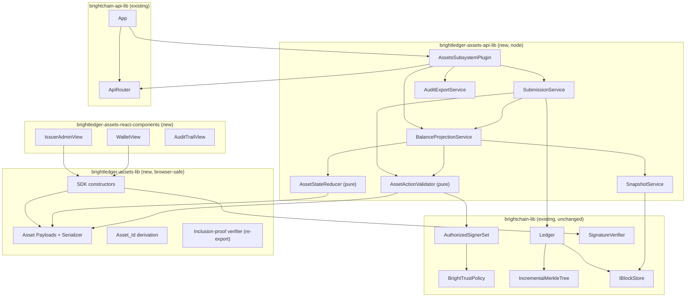
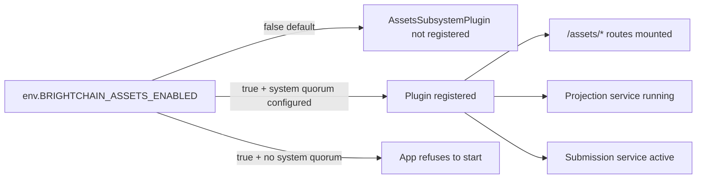
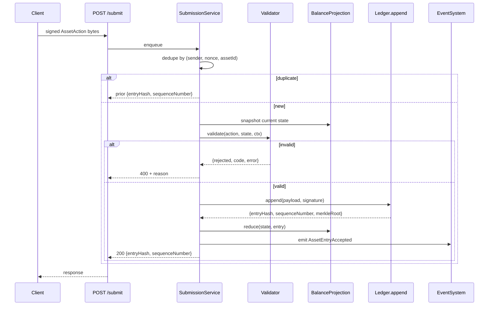
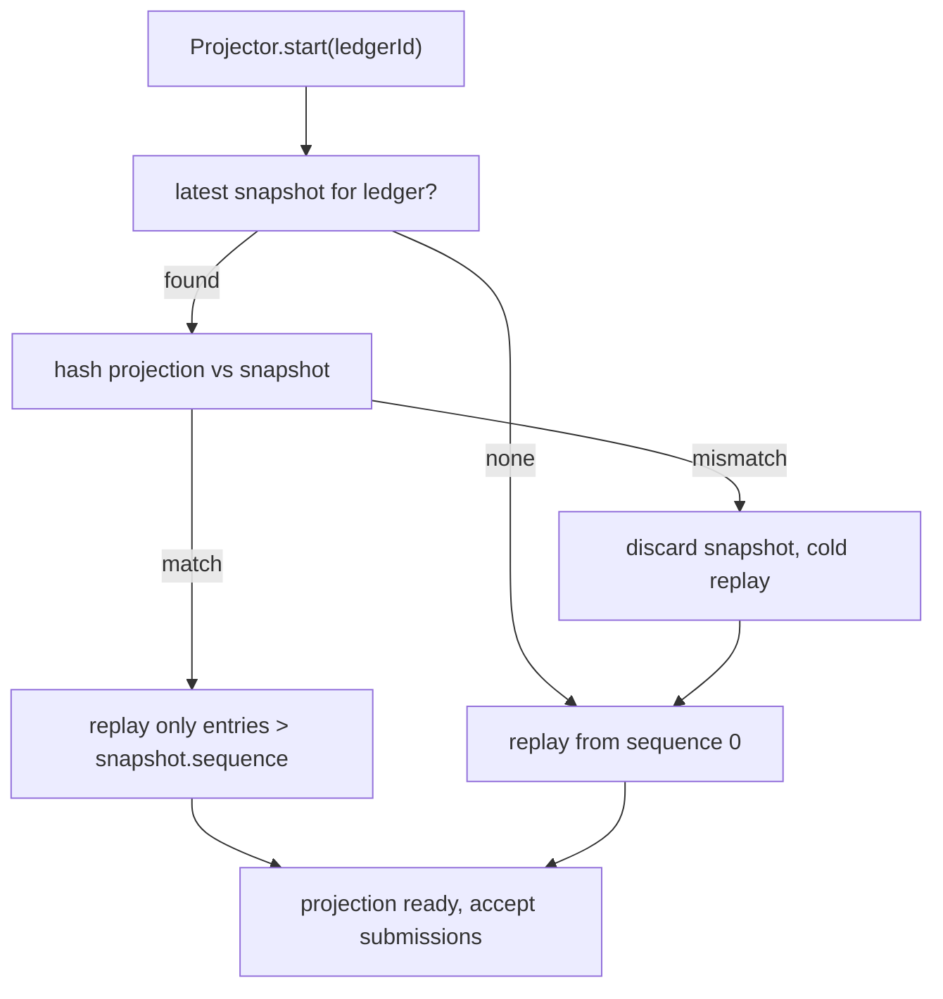

# Design Document: Programmable Asset Ledger

## Overview

This design adds a programmable asset layer on top of BrightChain's existing permissioned ledger. The asset layer is delivered as four new packages, gated behind a capability flag, using neutral accounting vocabulary throughout.

The existing ledger primitives — append-only signed entries, BrightTrust quorum, governance entries, incremental Merkle proofs, pluggable block-store — are reused **without modification**. The asset layer is a strict consumer of `Ledger.append` (writes) and `Ledger.iterate` (replay). The ledger itself remains domain-agnostic: it only knows bytes.

The work is partitioned into a pure browser-safe domain library, a node-side service library, REST controllers wired into the existing `App` via the subsystem-plugin architecture, and a React component pack — mirroring the conventions already used by every other capability in the workspace (`*-lib`, `*-api-lib`, `*-react-components`).

### Three-layer position

This spec is **Layer 3** (settlement) of a three-layer architecture:

| Layer | Spec | Role | Throughput |
| ----- | ---- | ---- | ---------- |
| 1 — Operational | `asset-account-store-generalization` | In-memory per-member balance + reservation cache for the request hot path | 100k+ ops/sec |
| 2 — Capture | `metering-log` | Per-shard signed hash chain capturing every micro-event with sub-ms append | 50k records/sec/shard |
| 3 — Settlement (this spec) | `programmable-asset-ledger` | Cryptographic source of truth, BrightTrust governance, periodic batch settlements from Layer 2 | ~1 settlement entry per shard per minute |

Layer 2 produces `BatchSettlementAction` entries on Layer 3 at a configurable cadence (default 60 s); Layer 1 reads accepted settlements via the `attachLedger` hook and reconciles its operational projection. The asset ledger is therefore the **slowest, most authoritative** of the three layers and is intentionally insulated from per-event traffic.

## Architecture



### Capability gating



### Submission lifecycle



### Cold vs warm projection start



## Components and Interfaces

### `brightledger-assets-lib` (browser-safe)

**Files:**

- `src/lib/payloads/index.ts` — discriminated-union of every `IAssetAction` interface listed in Requirements 1.1.
- `src/lib/payloads/serializer.ts` — `AssetActionSerializer.serialize(action): Uint8Array` and `.deserialize(bytes): IAssetAction`. Versioned, length-prefixed, deterministic. Mirrors the pattern in `brightchain-lib/src/lib/ledger/ledgerEntrySerializer.ts`.
- `src/lib/payloads/assetId.ts` — `deriveAssetId(issuerPubKey, issuanceEntryHash): AssetIdBuffer`.
- `src/lib/sdk/wallet.ts` — `Wallet` class with local nonce tracking.
- `src/lib/sdk/constructors.ts` — `createTransfer`, `createMultiTransfer`, `createIssueAsset`, etc.
- `src/lib/proof/verify.ts` — re-export of existing `verifyInclusionProof`.

**No node imports. No `brightchain-api-lib` imports.** Only depends on `brightchain-lib`.

### `brightledger-assets-api-lib` (node)

**Validator.** `AssetActionValidator.validate(action, currentState, ledgerContext) → Result`. Pure; one method per action kind dispatched off the discriminator. Conservation invariant checked after every accepted simulation.

**Reducer.** `AssetStateReducer.reduce(state, ledgerEntry) → state'`. Pure; assumes the entry was already validator-approved. Returns a structurally-shared updated state (no mutation).

**State shape.**

```ts
interface IAssetProjectedState {
  readonly assets: ReadonlyMap<AssetId, IAssetMetadata>;
  readonly balances: ReadonlyMap<AssetId, ReadonlyMap<AccountId, bigint>>;
  readonly nonces: ReadonlyMap<AccountId, bigint>;
  readonly frozen: ReadonlyMap<AssetId, ReadonlySet<AccountId>>;
  readonly whitelist: ReadonlyMap<AssetId, ReadonlySet<AccountId>>;
  readonly issuedTotal: ReadonlyMap<AssetId, bigint>;
  readonly burnedTotal: ReadonlyMap<AssetId, bigint>;
  readonly issuerSets: ReadonlyMap<AssetId, AuthorizedSignerSet>;
  readonly redactions: ReadonlySet<EntryHash>;
  readonly shardSettlement: ReadonlyMap<ShardId, IShardSettlementState>;
  readonly processKeys: ReadonlyMap<ShardId, ReadonlyMap<KeyFingerprint, IProcessKeyState>>;
  readonly disputes: ReadonlyMap<EntryHash, IDisputeState>;
  readonly lastSequence: number;
}

interface IShardSettlementState {
  readonly lastSettledSeq: bigint;
  readonly nextExpectedSeq: bigint;     // === lastSettledSeq + 1n
  readonly lastTipHash: Uint8Array;
  readonly lastSettledAt: number;
  readonly currentProcessKeyFingerprint: Uint8Array | null;
  readonly status: 'active' | 'paused' | 'retired';
}

interface IProcessKeyState {
  readonly pubKey: Uint8Array;
  readonly notBefore: number;
  readonly notAfter: number;
  readonly revoked: false | { reason: 'rotation' | 'compromise' | 'shutdown'; effectiveAtSeq: bigint | null };
}

interface IDisputeState {
  readonly settlementEntryHash: Uint8Array;
  readonly raisedAt: number;
  readonly windowExpiresAt: number;
  readonly status: 'PENDING' | 'RESOLVED_FINAL' | 'RESOLVED_REPLACED' | 'DISPUTED_RETROACTIVE';
  readonly resolutionEntryHash?: Uint8Array;
}
```

**BalanceProjectionService.** Owns the in-memory `IAssetProjectedState`. Exposes `current(): state` and `lookup(...)`. Subscribes to `Ledger` append events to remain warm.

**SnapshotService.** Periodic serialization of state to `IBlockStore` (every `N` entries; `N` defaults to `1000`). Snapshot bytes include `lastSequence`, `merkleRootAtSnapshot`, and a SHA-256 hash of the canonically-serialized state for tamper detection. Cold-start verifies the hash before trusting the snapshot.

**SubmissionService.** Single-writer queue per `ledgerId` (a serial async queue, not threads). Pipeline: parse → dedup → validate → append → reduce → emit. Returns the canonical receipt.

**AssetsSubsystemPlugin.** Implements `IAppSubsystemPlugin` (already in `brightchain-lib`). When `BRIGHTCHAIN_ASSETS_ENABLED` is true, the plugin's `initialize` instantiates the projector and submission service, registers them on the service container, and binds controllers to the `apiRouter`. When false, the plugin is never registered, so its existence is invisible at runtime. The plugin refuses to initialize if no system-quorum policy is configured for `OperatorFreezeAction`.

**AuditExportService.** Streams CSV for a single asset over a fresh ledger iteration; never reads from the projection (auditors see entries directly, not derivations).

### `brightchain-api-lib` (modifications)

A single addition: a constructor-side `registerSubsystemPlugin(new AssetsSubsystemPlugin(...))` call wrapped in `if (env.BRIGHTCHAIN_ASSETS_ENABLED)`. No other changes.

### `brightledger-assets-react-components`

- `WalletBalances` — multi-asset balance grid for an account.
- `TransferComposer` — signs and submits a transfer via the SDK.
- `IssuerAdminPanel` — issue-asset, mint, burn, freeze, rotate-issuer-set; gated by signer role.
- `AuditTrailView` — paginated entry history with inclusion-proof reveal.
- `AssetRegistryView` — list of registered assets with metadata.

All copy in these components passes the vocabulary lint (Requirement 8).

## Data Models

### Wire format (per action, summarized)

```
+--------+------------+----------+----------+---------+-----------+
| ver(1) | kind(1)    | asset(32)| from(32) | to(32)  | amt(var)  |
+--------+------------+----------+----------+---------+-----------+
| nonce(8)| expiry(8) | memoLen(2)| memo(N) | sigCount(1) | sigs() |
+--------+------------+----------+---------+-------------+--------+
```

`amt` is canonical big-endian byte representation of a non-negative `bigint`, length-prefixed (1 byte) so values stay deterministic across runtimes.

### Asset metadata (registered)

```ts
interface IAssetMetadata {
  readonly assetId: AssetId;
  readonly symbol: string;       // ≤ 16 chars, [A-Z0-9_-]
  readonly displayName: string;  // ≤ 64 chars
  readonly decimals: number;     // 0..18
  readonly supplyPolicy: 'fixed' | 'mintable' | { kind: 'capped'; cap: bigint };
  readonly transferPolicy: 'open' | 'whitelist';
  readonly freezable: boolean;
  readonly burnable: boolean;
  readonly issuerPublicKey: Uint8Array;
  readonly issuanceSequence: number;
  readonly issuanceEntryHash: Uint8Array;
  readonly retired: boolean;
}
```

### Settlement payload schemas (Layer 2 → Layer 3 bridge)

```ts
interface IBatchSettlementAction {
  readonly kind: 'BatchSettlement';
  readonly shardId: GuidV7Uint8Array;
  readonly fromSeq: bigint;          // inclusive
  readonly toSeq: bigint;            // inclusive, > fromSeq
  readonly tipHash: Uint8Array;      // 32-byte BLAKE3 of metering-log record at toSeq
  readonly itemsRoot: Uint8Array;    // 32-byte RFC-9162 Merkle root over the batch
  readonly memberDeltas: ReadonlyArray<{
    readonly memberId: MemberId;
    readonly assetId: AssetId;
    readonly netDelta: bigint;       // signed; positive = credit, negative = debit
  }>;                                 // sorted by (memberId, assetId), no duplicates
  readonly sigEnvelope: {
    readonly processKeyFingerprint: Uint8Array; // 32 bytes
    readonly signature: Uint8Array;             // 64-byte Ed25519 over canonical bytes
  };
}

interface IProcessKeyCertAction {
  readonly kind: 'ProcessKeyCert';
  readonly shardId: GuidV7Uint8Array;
  readonly fingerprint: Uint8Array;        // 32 bytes (SHA-256 of pubKey)
  readonly pubKey: Uint8Array;             // 32-byte Ed25519 public key
  readonly notBefore: number;              // unix-ms
  readonly notAfter: number;               // unix-ms; notAfter - notBefore <= 7 d
  readonly operatorSig: BrightTrustQuorumSignature; // existing primitive
}

interface IProcessKeyRevokeAction {
  readonly kind: 'ProcessKeyRevoke';
  readonly shardId: GuidV7Uint8Array;
  readonly fingerprint: Uint8Array;
  readonly reason: 'rotation' | 'compromise' | 'shutdown';
  readonly effectiveAtSeq?: bigint;        // required when reason === 'compromise'
  readonly operatorSig: BrightTrustQuorumSignature;
}

interface IBatchChallengeAction {
  readonly kind: 'BatchChallenge';
  readonly settlementEntryHash: Uint8Array;
  readonly claim:
    | 'wrong-itemsRoot'
    | 'wrong-tipHash'
    | 'wrong-delta'
    | 'wrong-fromSeq'
    | 'revoked-key';
  readonly evidence: {
    readonly merkleProof?: Uint8Array;     // RFC-9162 inclusion or exclusion proof
    readonly auditedRecords?: Uint8Array;  // CBOR-encoded metering-log records
  };
  readonly challengerSig: Uint8Array;      // 64-byte Ed25519 over canonical bytes
}

interface IBatchSettlementResolutionAction {
  readonly kind: 'BatchSettlementResolution';
  readonly settlementEntryHash: Uint8Array;
  readonly outcome: 'RESOLVED_FINAL' | 'RESOLVED_REPLACED';
  readonly correctedDeltas?: IBatchSettlementAction['memberDeltas']; // present iff RESOLVED_REPLACED
  readonly operatorSig: BrightTrustQuorumSignature;
}
```

### Settlement and dispute lifecycle

```mermaid
stateDiagram-v2
    [*] --> Submitted: BatchSettlementAction accepted
    Submitted --> Final: dispute window expires (default 24h)
    Submitted --> Disputed: BatchChallengeAction accepted in window
    Disputed --> Final: BatchSettlementResolutionAction RESOLVED_FINAL
    Disputed --> Replaced: BatchSettlementResolutionAction RESOLVED_REPLACED
    Final --> Frozen: OperatorFreezeAction (rare, court order)
    Replaced --> [*]: deltas reversed; corrected deltas applied
    Final --> [*]: permanent
```



During `Disputed`, `memberDeltas` are reversed in the projection (Layer 1 sees the reversal via the standard `attachLedger` hook). On `RESOLVED_REPLACED`, the corrected deltas are applied; on `RESOLVED_FINAL`, the original deltas are re-applied.

### Snapshot envelope

```ts
interface IAssetSnapshot {
  readonly version: 1;
  readonly ledgerId: string;
  readonly sequenceNumber: number;
  readonly merkleRootAtSnapshot: Uint8Array;
  readonly stateHash: Uint8Array;        // SHA-256 of canonical state bytes
  readonly stateBytes: Uint8Array;       // canonical serialization of IAssetProjectedState
  readonly createdAt: number;
}
```

## Error Handling

| Code                       | Trigger                                                       | HTTP |
| -------------------------- | ------------------------------------------------------------- | ---- |
| `ASSET_DISABLED`           | Capability flag false                                         | 404  |
| `ASSET_UNKNOWN`            | `assetId` not in `state.assets`                               | 404  |
| `ASSET_RETIRED`            | Mint attempted on retired asset                               | 409  |
| `INSUFFICIENT_BALANCE`     | `balances[assetId][from] < amount`                            | 422  |
| `NONCE_MISMATCH`           | Replay or out-of-order nonce                                  | 409  |
| `EXPIRED`                  | `expiry < now`                                                | 410  |
| `FROZEN`                   | Account frozen for asset                                      | 423  |
| `NOT_WHITELISTED`          | Recipient not on whitelist for whitelist-policy asset         | 403  |
| `QUORUM_NOT_SATISFIED`     | Issuer-set BrightTrust policy unmet                           | 403  |
| `OVERFLOW`                 | bigint serialization or supply overflow                       | 422  |
| `MALFORMED`                | Deserialization failure                                       | 400  |
| `RATE_LIMIT`               | Per-account submission cap exceeded                           | 429  |
| `OVERSIZED`                | Entry payload exceeds size cap                                | 413  |
| `REDACTED`                 | Entry exists but is on the redaction list                     | 451  |
| `SYSTEM_QUORUM_REQUIRED`   | Operator-class action without system quorum                   | 403  |
| `CONSERVATION_VIOLATION`   | Internal — should never reach client; logged + alert          | 500  |
| `SHARD_UNKNOWN`            | `BatchSettlementAction` for unregistered shard                | 404  |
| `SHARD_SEQ_GAP`            | `fromSeq` does not equal `nextExpectedSeq` for shard          | 409  |
| `SHARD_SEQ_OVERLAP`        | `[fromSeq, toSeq]` overlaps an already-accepted batch         | 409  |
| `PROCESS_KEY_UNKNOWN`      | Settlement signed by unrecognized fingerprint                 | 403  |
| `PROCESS_KEY_EXPIRED`      | Settlement signed after `notAfter` of certifying cert         | 403  |
| `PROCESS_KEY_REVOKED`      | Settlement signed by a revoked Process_Key                    | 403  |
| `PROCESS_KEY_TTL_EXCEEDED` | `ProcessKeyCertAction` with `notAfter - notBefore > 7 d`      | 422  |
| `DELTA_ORDER`              | `memberDeltas` not sorted or duplicated `(memberId, assetId)` | 422  |
| `DISPUTE_WINDOW_CLOSED`    | `BatchChallengeAction` after window expiry                    | 410  |
| `DISPUTE_DUPLICATE`        | Settlement already in `Disputed` state                        | 409  |

The validator returns the `code` directly; the controller maps `code → HTTP` via a single switch.

## Testing Strategy

**Unit.** Each validator rule and each reducer transition tested in isolation with hand-crafted state and actions. Serializer roundtrip tests for every action kind including unknown-version rejection.

**Property** (using `fast-check`, repository convention):

- *Conservation*: for any reachable state, `sum(balances[a]) == issued[a] - burned[a]`.
- *No double-spend*: no sequence of valid actions produces a negative balance.
- *Replay safety*: shuffling validator-accepted actions (within nonce-respecting permutations) yields the same final state.
- *Snapshot equivalence*: cold replay to N == warm replay from snapshot at N.
- *Asset isolation*: random valid actions on asset A never alter state of any other asset B.
- *Wallet nonce monotonicity*: SDK never produces a transfer with non-strict-increasing nonce.

**Adversarial.** Forged signatures, mid-chain issuer revocation, malformed payloads, oversized amounts, nonce gaps, submissions to unknown assets, retired-asset mint attempts, conflicting concurrent multi-transfer legs.

**Integration.** Full submit→ledger→project→query loop against `MemoryBlockStore`; same suite re-run against the S3 store and the Azure store using the existing test fixtures.

**E2E (Pilot).** One of {BrightHub credits, BrightMail postage stamps, Burn Bag retention receipts} implemented against a real `App<TID>` with auth + sessions, exercising issue → grant → transfer → audit-export → operator-freeze → unfreeze.

**Brand lint.** ESLint `no-restricted-syntax` rule rejects identifiers matching `/coin|holder|tokenomics|airdrop|staking|marketCap/i` in the asset libraries; markdown-lint runs the same regex over `*.md` files there. The literal verb `mint` is allowed only in payload-kind discriminators and validator dispatch; a unit test scans built `*.d.ts` to assert `mint` does not appear in any string literal exposed via the public API or OpenAPI schema.

## Operational Notes

- The asset layer never defines a "native" asset. Genesis state is empty.
- Every asset's `assetId` is namespaced by issuer public key, so two issuers cannot collide on a symbol.
- Operator-class actions (`OperatorFreezeAction`, redaction attestation) require a deployment-wide system-quorum policy that is configured at deployment time; the plugin refuses to start without it.
- Audit export reads directly from the ledger, never the projection — a corrupted or compromised projection cannot taint an audit export.
- Snapshots are advisory; they speed up cold start but the system can always recover by full replay.

## Out of Scope (Explicitly)

- Cryptocurrency, native asset, gas, fees in protocol.
- Exchange, order book, AMM, price feed, oracle.
- Bridges to public chains.
- Public permissionless tier (operators may expose one externally; not a default).
- Smart contracts / scripting / on-ledger code execution. Asset behavior is a fixed schema; new behavior requires a code release.
- Identity issuance — accounts reuse the existing BrightChain member/key system.
- High-frequency per-event recording on the ledger — micro-events live in the Layer 2 metering log; only batched settlements land here.
- Real-time balance correctness — Layer 1 (`AssetAccountStore`) is the operational source for hot-path reads; this layer trails by one settlement window (default 60 s) and is the cryptographic source of truth, not the user-facing latency surface.
