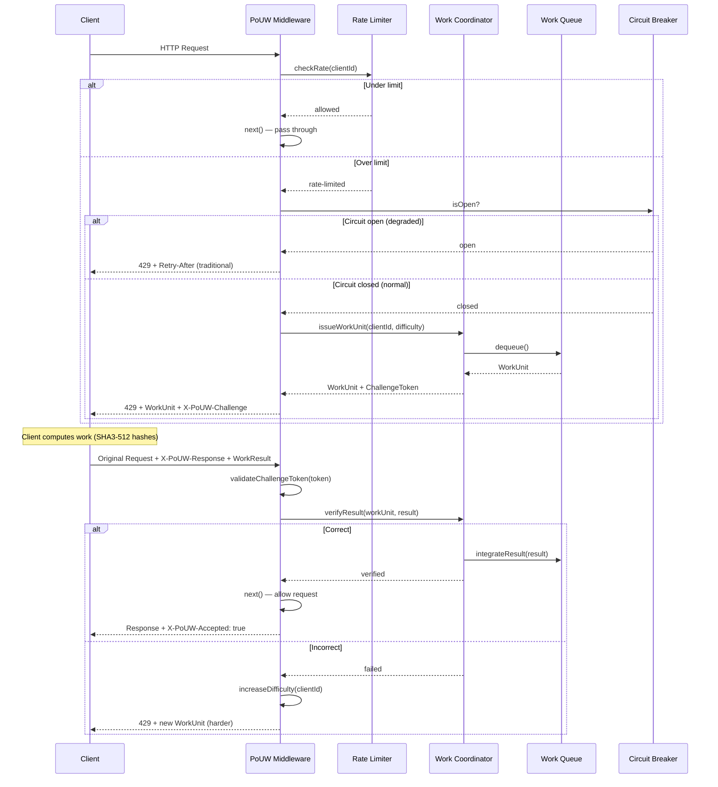
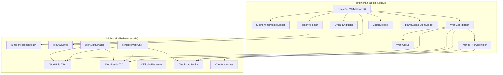
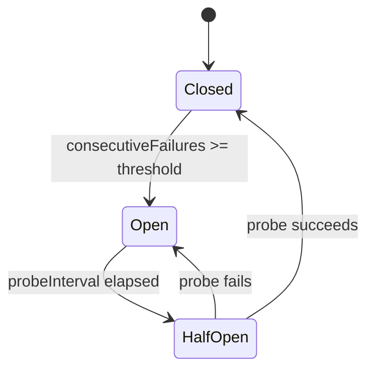

# Design Document: Proof of Useful Work Rate Limiting

## Overview

This document describes the technical design for a **Proof of Useful Work (PoUW) Rate Limiting** system for the BrightChain platform. The system replaces traditional "block and wait" rate limiting with a challenge-response protocol where rate-limited clients perform genuinely useful computation — specifically, constructing Merkle tree nodes using SHA3-512 hashes — that directly benefits the BrightChain network.

The design spans four packages in the monorepo:

| Package | Responsibility |
|---|---|
| `brightchain-lib` | Shared interfaces, enums, serialization, and browser-safe types (`IWorkUnit`, `IWorkResult`, `IChallengeToken`, difficulty tiers) |
| `brightchain-api-lib` | Node.js Express middleware factory, `WorkCoordinator`, `WorkQueue`, `DifficultyAdjuster`, token HMAC signing/verification |
| `brightchain-lib` (client module) | Browser-compatible `computeWorkUnit()` function using `@noble/hashes/sha3` with optional WASM acceleration |
| `docs/` | Research paper (`proof-of-useful-work-ratelimit-paper.md`) |

### Key Design Decisions

1. **Factory middleware pattern** — follows `createJwtAuthMiddleware()` and `createCaptureMiddleware()` conventions: a factory function accepts a config object and returns a standard Express `RequestHandler`.
2. **EventEmitter for observability** — a singleton `pouwEvents` emitter (like `captureEvents` in the Joule capture middleware) provides structured operational events.
3. **Generic `TID extends PlatformID`** — all shared interfaces are generic over the platform ID type for frontend/backend compatibility.
4. **Existing `ChecksumService` + `Checksum` class** — all SHA3-512 operations use the existing `@noble/hashes/sha3` pipeline via `ChecksumService.calculateChecksum()` and produce `Checksum` instances.
5. **HMAC-based challenge tokens** — lightweight, stateless token verification using Node.js `crypto.createHmac('sha3-512', secret)` for signing, with a consumed-token set for replay prevention.
6. **Circuit breaker for graceful degradation** — when the work coordination subsystem fails, the middleware falls back to traditional HTTP 429 rate limiting automatically.

### Research Context

The PoUW approach draws on several established concepts (content rephrased for compliance with licensing restrictions):

- **Hashcash** ([hashcash.org](http://hashcash.org/docs/hashcash.html)) pioneered computational puzzles as a spam deterrent, but the work produced is cryptographically meaningless.
- **Proof of Useful Work in blockchain** — recent academic work explores redirecting mining computation toward useful tasks like ML training ([arxiv.org/html/2504.07540v2](https://arxiv.org/html/2504.07540v2)) and matrix multiplication ([arxiv.org/html/2504.09971v1](https://arxiv.org/html/2504.09971v1)).
- **API PoW rate limiting** ([loke.dev](https://loke.dev/blog/api-protection-web-crypto-proof-of-work)) demonstrates browser-side Web Crypto API puzzles for API protection, validating the UX model.

### How This System Differs from Prior Art

Existing proof-of-work systems (including patented approaches to Merkle-tree-based access control) treat the computational puzzle as a **disposable gate** — the client builds a tree or solves a hash puzzle, the server verifies it, and the result is discarded. The work exists solely to impose a cost on the requester.

Our system is fundamentally different in its **primary purpose and architecture**:

1. **The work has independent, persistent value.** Every hash computed by a rate-limited client is a real node in a Merkle tree that BrightChain's CBL (Constituent Block List) infrastructure actually needs. The trees are persisted and used for data integrity verification across the network. In prior art, the tree is ephemeral — verified and thrown away.

2. **The server is a work coordinator, not a puzzle generator.** Our Work_Coordinator maintains a queue of *real pending infrastructure tasks* (Merkle tree nodes that need computing for actual block data). It doesn't generate artificial puzzles — it distributes genuine work from a backlog. When the backlog is empty, synthetic work is generated as a fallback, but the primary mode is real work distribution.

3. **Results are assembled into usable data structures.** The MerkleTreeAssembler tracks partially-constructed trees across multiple clients and multiple requests, assembling verified results into complete trees that are exported as `Checksum[]` arrays for direct consumption by `ConstituentBlockListBlock`. This assembly/integration pipeline has no analog in puzzle-based systems.

4. **Difficulty scaling serves dual purposes.** The DifficultyAdjuster doesn't just make puzzles harder — it assigns *larger subtrees* from the real work backlog, meaning more abusive clients contribute *more* useful infrastructure work. The punishment is productive.

5. **Open source, non-profit implementation.** This system is released as open-source software under a non-profit organization (Digital Defiance / BrightChain). The goal is to advance the state of the art in ethical rate limiting, not to gate access for commercial advantage.

> **Legal note:** Implementors deploying this system commercially should obtain a freedom-to-operate opinion from a patent attorney regarding any patents in the proof-of-work access control space. This open-source project does not provide legal advice.

---

## Architecture

### High-Level Flow



### Component Architecture



---

## Components and Interfaces

### Shared Interfaces (brightchain-lib)

All interfaces follow the `IBaseData<TID>` generic pattern and reside in `brightchain-lib/src/lib/interfaces/pouw/`.

#### IWorkUnit<TID>

```typescript
import { PlatformID } from '@digitaldefiance/ecies-lib';
import { DifficultyTier } from '../../enumerations/difficultyTier';

/**
 * Describes the type of Merkle tree computation a work unit requires.
 */
export enum WorkUnitOperation {
  /** Hash raw leaf data to produce a leaf node checksum */
  LeafHash = 'leaf_hash',
  /** Concatenate child hashes and hash the result to produce an interior node */
  InteriorHash = 'interior_hash',
}

/**
 * A single unit of useful work issued to a rate-limited client.
 *
 * Follows the IBaseData<TID> workspace convention:
 * - Frontend uses IWorkUnit<string>
 * - Backend uses IWorkUnit<Uint8Array>
 *
 * @template TID - Platform ID type. Defaults to string for JSON/frontend.
 */
export interface IWorkUnit<TID extends PlatformID = string> {
  /** Unique identifier for this work unit (UUID v4) */
  id: string;
  /** The Merkle tree this work unit contributes to */
  treeId: string;
  /** Position index within the tree (level + offset) */
  treeLevel: number;
  treeIndex: number;
  /** The operation to perform */
  operation: WorkUnitOperation;
  /**
   * Input data — base64-encoded for JSON transport.
   * For LeafHash: the raw block data to hash.
   * For InteriorHash: concatenated child hashes (each 64 bytes).
   */
  inputData: string;
  /** Number of child hashes (for InteriorHash; 0 for LeafHash) */
  childCount: number;
  /** Difficulty tier governing this work unit */
  difficulty: DifficultyTier;
  /** Challenge token binding this work unit to a client */
  challengeToken: string;
  /** ISO 8601 timestamp when this work unit was created */
  createdAt: string;
  /** ISO 8601 timestamp when this work unit expires */
  expiresAt: string;
}
```

#### IWorkResult<TID>

```typescript
/**
 * The result of computing a work unit, returned by the client.
 *
 * @template TID - Platform ID type. Defaults to string for JSON/frontend.
 */
export interface IWorkResult<TID extends PlatformID = string> {
  /** The work unit ID this result corresponds to */
  workUnitId: string;
  /** The computed SHA3-512 hash as a lowercase hex string (128 chars) */
  resultHash: string;
  /** The challenge token from the original work unit */
  challengeToken: string;
  /** Client-reported computation time in milliseconds */
  computeTimeMs: number;
  /** ISO 8601 timestamp when the client completed computation */
  completedAt: string;
}
```

#### IChallengeToken<TID>

```typescript
/**
 * Decoded challenge token structure.
 * The token is transmitted as a base64-encoded HMAC-signed JSON string.
 *
 * @template TID - Platform ID type. Defaults to string for JSON/frontend.
 */
export interface IChallengeToken<TID extends PlatformID = string> {
  /** The work unit this token is bound to */
  workUnitId: string;
  /** The client identifier this token is bound to */
  clientId: string;
  /** Issuance timestamp (Unix epoch ms) */
  issuedAt: number;
  /** Expiration timestamp (Unix epoch ms) */
  expiresAt: number;
  /** HMAC-SHA3-512 signature of the above fields */
  signature: string;
}
```

#### IPoUWConfig

```typescript
import { DifficultyTier } from '../../enumerations/difficultyTier';

/**
 * Client identifier extraction strategy.
 */
export enum ClientIdentifierStrategy {
  IpAddress = 'ip',
  AuthenticatedUser = 'user',
  ApiKey = 'apikey',
  /** Try user ID first, fall back to IP */
  UserOrIp = 'user_or_ip',
}

/**
 * Fallback behavior when the rate limiter backing store is unavailable.
 */
export enum RateLimiterFallback {
  Allow = 'allow',
  Deny = 'deny',
  InMemory = 'in_memory',
}

/**
 * Configuration for the PoUW rate limiting middleware.
 * All fields have sensible defaults except `hmacSecret`.
 */
export interface IPoUWConfig {
  /** HMAC secret for signing challenge tokens (REQUIRED) */
  hmacSecret: string;
  /** Maximum requests per window before rate limiting (default: 100) */
  rateLimit: number;
  /** Sliding window duration in milliseconds (default: 60_000) */
  windowMs: number;
  /** Client identifier strategy (default: UserOrIp) */
  identifierStrategy: ClientIdentifierStrategy;
  /** Challenge token TTL in seconds (default: 60) */
  tokenTtlSeconds: number;
  /** Initial difficulty tier (default: Low) */
  defaultDifficulty: DifficultyTier;
  /** Maximum difficulty tier (default: High) */
  maxDifficulty: DifficultyTier;
  /** Consecutive failures before circuit breaker opens (default: 10) */
  circuitBreakerThreshold: number;
  /** Circuit breaker recovery probe interval in ms (default: 30_000) */
  circuitBreakerProbeIntervalMs: number;
  /** Minimum work units to keep in the queue (default: 100) */
  minQueueDepth: number;
  /** Maximum age for unassigned work units in ms (default: 3_600_000) */
  workUnitMaxAgeMs: number;
  /** Fallback behavior when backing store is unavailable */
  fallbackBehavior: RateLimiterFallback;
  /** Difficulty escalation window in ms (default: 300_000) */
  escalationWindowMs: number;
  /** Cool-down period before difficulty decreases in ms (default: 600_000) */
  coolDownMs: number;
  /** Consecutive verification failures before security alert (default: 5) */
  securityAlertThreshold: number;
  /** Per-route rate limit overrides */
  routeOverrides?: Record<string, { rateLimit: number; windowMs: number }>;
}
```

#### DifficultyTier Enum

```typescript
// brightchain-lib/src/lib/enumerations/difficultyTier.ts

/**
 * Difficulty tiers for PoUW work units.
 * Each tier defines the number of hash operations required.
 */
export enum DifficultyTier {
  /** Single leaf hash — ~1-2 seconds of computation */
  Low = 'low',
  /** Subtree of 4-16 nodes — ~3-5 seconds of computation */
  Medium = 'medium',
  /** Subtree of 16-64 nodes — ~5-10 seconds of computation */
  High = 'high',
}

/**
 * Maps difficulty tiers to the number of hash operations (nodes to compute).
 */
export const DifficultyTierNodeCount: Record<DifficultyTier, { min: number; max: number }> = {
  [DifficultyTier.Low]: { min: 1, max: 1 },
  [DifficultyTier.Medium]: { min: 4, max: 16 },
  [DifficultyTier.High]: { min: 16, max: 64 },
};
```

#### WorkUnitSerializer (brightchain-lib)

```typescript
// brightchain-lib/src/lib/serializers/workUnitSerializer.ts

/**
 * Serializes and deserializes IWorkUnit and IWorkResult to/from JSON.
 * Binary fields are encoded as base64 strings.
 * Provides descriptive errors for malformed input.
 */
export class WorkUnitSerializer {
  static serializeWorkUnit(unit: IWorkUnit): string;
  static parseWorkUnit(json: string): IWorkUnit;
  static serializeWorkResult(result: IWorkResult): string;
  static parseWorkResult(json: string): IWorkResult;
}
```

### Node.js Components (brightchain-api-lib)

All implementations reside in `brightchain-api-lib/src/lib/pouw/`.

#### createPoUWMiddleware (Factory)

```typescript
// brightchain-api-lib/src/lib/pouw/middleware.ts

import { EventEmitter } from 'events';
import { RequestHandler } from 'express';
import { IPoUWConfig } from '@brightchain/brightchain-lib';

/**
 * Singleton event emitter for PoUW middleware operational events.
 *
 * Events:
 * - 'rate-limited'       — client exceeded rate limit
 * - 'work-issued'        — work unit issued to client
 * - 'work-verified'      — work result verified successfully
 * - 'work-failed'        — work result failed verification
 * - 'circuit-opened'     — circuit breaker opened
 * - 'circuit-closed'     — circuit breaker closed
 * - 'security-alert'     — repeated verification failures
 * - 'fallback-activated' — degraded to traditional rate limiting
 */
export const pouwEvents = new EventEmitter();

/**
 * Factory function that creates the PoUW rate limiting middleware.
 * Follows the same pattern as createJwtAuthMiddleware and createCaptureMiddleware.
 *
 * @param config - Partial configuration; only hmacSecret is required.
 * @returns Express RequestHandler
 */
export function createPoUWMiddleware(
  config: Partial<IPoUWConfig> & Pick<IPoUWConfig, 'hmacSecret'>
): RequestHandler;
```

#### SlidingWindowRateLimiter

```typescript
// brightchain-api-lib/src/lib/pouw/rateLimiter.ts

/**
 * Per-client sliding window rate limiter.
 * Extends the existing AuditRateLimiter pattern with per-route support
 * and rate limit status reporting (limit, remaining, reset).
 */
export class SlidingWindowRateLimiter {
  constructor(defaultLimit: number, defaultWindowMs: number);

  /**
   * Check if a request is allowed.
   * @returns { allowed, limit, remaining, resetMs }
   */
  checkRate(
    clientId: string,
    routeKey?: string,
    overrideLimit?: number,
    overrideWindowMs?: number
  ): { allowed: boolean; limit: number; remaining: number; resetMs: number };

  /** Clear all state (for testing) */
  clear(): void;

  /** Start periodic cleanup of stale entries */
  startCleanup(windowMs: number): void;

  /** Stop periodic cleanup */
  stopCleanup(): void;
}
```

#### WorkCoordinator

```typescript
// brightchain-api-lib/src/lib/pouw/workCoordinator.ts

import { ChecksumService, Checksum, IWorkUnit, IWorkResult } from '@brightchain/brightchain-lib';

/**
 * Manages the lifecycle of work units: generation, issuance, verification,
 * and integration of results into Merkle trees.
 */
export class WorkCoordinator {
  constructor(
    checksumService: ChecksumService,
    queue: WorkQueue,
    assembler: MerkleTreeAssembler,
    config: Pick<IPoUWConfig, 'minQueueDepth' | 'workUnitMaxAgeMs'>
  );

  /** Issue a work unit to a client at the given difficulty */
  issueWorkUnit(clientId: string, difficulty: DifficultyTier): IWorkUnit;

  /**
   * Verify a submitted work result.
   * For pre-computed strategy: constant-time comparison against stored answer.
   * @returns true if the result is correct
   */
  verifyResult(result: IWorkResult): boolean;

  /** Decompose a set of leaf data into independent work units */
  decomposeTree(leafData: Uint8Array[], treeId: string): IWorkUnit[];

  /** Generate synthetic work units when no real work is available */
  generateSyntheticWork(count: number): IWorkUnit[];

  /** Get current metrics */
  getMetrics(): IWorkCoordinatorMetrics;
}
```

#### WorkQueue

```typescript
// brightchain-api-lib/src/lib/pouw/workQueue.ts

/**
 * Priority queue for work units.
 * Prioritizes units contributing to partially-completed trees.
 * Supports in-memory and persistent backing stores.
 */
export class WorkQueue {
  constructor(config: Pick<IPoUWConfig, 'minQueueDepth' | 'workUnitMaxAgeMs'>);

  /** Dequeue the highest-priority work unit */
  dequeue(): IWorkUnit | null;

  /** Enqueue a new work unit */
  enqueue(unit: IWorkUnit): void;

  /** Return an expired/failed work unit to the queue */
  requeue(unit: IWorkUnit): void;

  /** Remove expired work units */
  expireStale(): number;

  /** Reclaim assigned-but-incomplete work units whose tokens have expired */
  reclaimExpired(): number;

  /** Current queue depth */
  get depth(): number;

  /** Whether the queue needs replenishment */
  get needsReplenishment(): boolean;
}
```

#### DifficultyAdjuster

```typescript
// brightchain-api-lib/src/lib/pouw/difficultyAdjuster.ts

/**
 * Tracks per-client difficulty tiers and adjusts based on
 * violation frequency and cool-down periods.
 */
export class DifficultyAdjuster {
  constructor(config: Pick<IPoUWConfig,
    'defaultDifficulty' | 'maxDifficulty' | 'escalationWindowMs' | 'coolDownMs'
  >);

  /** Get the current difficulty tier for a client */
  getDifficulty(clientId: string): DifficultyTier;

  /** Record a rate limit violation — may escalate difficulty */
  recordViolation(clientId: string): DifficultyTier;

  /** Record successful completion — may de-escalate after cool-down */
  recordCompletion(clientId: string): void;

  /** Clear all state (for testing) */
  clear(): void;
}
```

#### TokenValidator

```typescript
// brightchain-api-lib/src/lib/pouw/tokenValidator.ts

/**
 * Creates, signs, and validates HMAC-signed challenge tokens.
 * Tracks consumed tokens to prevent replay attacks.
 */
export class TokenValidator {
  constructor(hmacSecret: string, tokenTtlSeconds: number);

  /** Create and sign a new challenge token */
  createToken(workUnitId: string, clientId: string): IChallengeToken;

  /** Serialize a token to a base64 string for HTTP transport */
  encodeToken(token: IChallengeToken): string;

  /**
   * Validate a token: checks HMAC, expiration, client binding, and replay.
   * @returns { valid, reason? }
   */
  validateToken(
    encodedToken: string,
    clientId: string
  ): { valid: boolean; reason?: string };

  /** Mark a token as consumed (for replay prevention) */
  consumeToken(workUnitId: string): void;

  /** Periodic cleanup of expired consumed-token entries */
  cleanupConsumed(): void;
}
```

#### MerkleTreeAssembler

```typescript
// brightchain-api-lib/src/lib/pouw/merkleTreeAssembler.ts

import { Checksum, ChecksumService } from '@brightchain/brightchain-lib';

/**
 * Tracks partially-constructed Merkle trees and assembles
 * verified work results into complete trees.
 *
 * Each tree is identified by a treeId and tracks which nodes
 * have been computed. When all nodes are filled, the tree is
 * marked complete and made available for CBL integration.
 */
export class MerkleTreeAssembler {
  constructor(checksumService: ChecksumService);

  /** Create a new tree with the given number of leaves */
  createTree(treeId: string, leafCount: number): void;

  /** Insert a verified node hash at the given position */
  insertNode(treeId: string, level: number, index: number, hash: Checksum): void;

  /** Check if a tree is complete */
  isComplete(treeId: string): boolean;

  /** Get the root hash of a completed tree */
  getRootHash(treeId: string): Checksum;

  /**
   * Validate the parent-child hash consistency invariant:
   * each interior node = SHA3-512(concat(children)).
   */
  validateTree(treeId: string): boolean;

  /** Get IDs of trees that have remaining uncomputed nodes */
  getPartialTreeIds(): string[];

  /** Get remaining uncomputed node positions for a tree */
  getRemainingNodes(treeId: string): Array<{ level: number; index: number }>;

  /** Export a completed tree's addresses as Checksum[] for CBL consumption */
  exportAddresses(treeId: string): Checksum[];
}
```

#### CircuitBreaker

```typescript
// brightchain-api-lib/src/lib/pouw/circuitBreaker.ts

/**
 * Circuit breaker for the PoUW work coordination subsystem.
 * Opens after consecutive failures, periodically probes for recovery.
 */
export class CircuitBreaker {
  constructor(threshold: number, probeIntervalMs: number);

  /** Record a successful operation — resets failure count */
  recordSuccess(): void;

  /** Record a failure — may open the circuit */
  recordFailure(): void;

  /** Whether the circuit is currently open (degraded mode) */
  get isOpen(): boolean;

  /** Attempt a probe if enough time has elapsed since last probe */
  shouldProbe(): boolean;
}
```

### Client-Side Library (brightchain-lib)

```typescript
// brightchain-lib/src/lib/pouw/computeWorkUnit.ts

import { IWorkUnit, IWorkResult } from '../interfaces/pouw';

/**
 * Progress callback invoked during multi-step computation.
 * @param completed - Number of hash operations completed
 * @param total - Total hash operations required
 */
export type ProgressCallback = (completed: number, total: number) => void;

/**
 * Compute a work unit result in the browser or Node.js.
 * Uses @noble/hashes/sha3 (pure JS) with optional WASM acceleration.
 *
 * @param workUnit - The work unit to compute
 * @param onProgress - Optional progress callback
 * @returns The computed work result
 */
export async function computeWorkUnit(
  workUnit: IWorkUnit,
  onProgress?: ProgressCallback
): Promise<IWorkResult>;
```

---

## Data Models

### Merkle Tree Structure

Each Merkle tree managed by the `MerkleTreeAssembler` is stored as a flat array of node hashes indexed by `(level, index)`:

```
Level 0 (root):     [H(H01 || H23)]
Level 1:            [H(H0 || H1), H(H2 || H3)]
Level 2 (leaves):   [H(D0), H(D1), H(D2), H(D3)]
```

Where `H()` = SHA3-512 via `ChecksumService.calculateChecksum()` and `||` = byte concatenation.

```typescript
interface IMerkleTreeState {
  treeId: string;
  leafCount: number;
  /** Total levels = ceil(log2(leafCount)) + 1 */
  levels: number;
  /** nodes[level][index] = Checksum | null */
  nodes: Map<string, Checksum>; // key = `${level}:${index}`
  /** Tracks which nodes have been computed */
  completedNodes: Set<string>;
  createdAt: number;
  completedAt?: number;
}
```

### Rate Limiter State

```typescript
interface IRateLimiterState {
  /** clientId -> sorted array of request timestamps */
  windows: Map<string, number[]>;
}
```

### Difficulty Adjuster State

```typescript
interface IDifficultyState {
  currentTier: DifficultyTier;
  /** Timestamps of violations within the escalation window */
  violations: number[];
  /** Timestamp of last successful completion */
  lastCompletion?: number;
}
```

### Work Queue Entry

```typescript
interface IWorkQueueEntry {
  workUnit: IWorkUnit;
  /** Priority score — lower is higher priority */
  priority: number;
  /** Whether this unit contributes to a partial tree */
  isPartialTree: boolean;
  /** When this entry was enqueued */
  enqueuedAt: number;
  /** If assigned, when the assignment expires */
  assignedUntil?: number;
  /** Pre-computed expected result for verification */
  expectedResult: string;
}
```

### Consumed Token Tracking

```typescript
interface IConsumedToken {
  workUnitId: string;
  consumedAt: number;
  /** Expires at the same time as the original token */
  expiresAt: number;
}
```

### Metrics

```typescript
export interface IPoUWMetrics {
  totalRequests: number;
  requestsRateLimited: number;
  workUnitsIssued: number;
  workUnitsCompleted: number;
  workUnitsFailed: number;
  averageVerificationLatencyMs: number;
}

export interface IWorkCoordinatorMetrics {
  queueDepth: number;
  treesInProgress: number;
  treesCompleted: number;
  hashesComputedByClients: number;
}
```

---

## Correctness Properties

*A property is a characteristic or behavior that should hold true across all valid executions of a system — essentially, a formal statement about what the system should do. Properties serve as the bridge between human-readable specifications and machine-verifiable correctness guarantees.*

### Property 1: Sliding Window Rate Limiting

*For any* sequence of request timestamps from a single client, the rate limiter SHALL report the client as rate-limited if and only if the number of requests within the most recent sliding window exceeds the configured threshold.

**Validates: Requirements 1.1, 1.2**

### Property 2: Challenge Token Expiration Rejection

*For any* challenge token whose expiration timestamp is in the past, the token validator SHALL reject the token regardless of all other fields being valid.

**Validates: Requirements 3.2**

### Property 3: Challenge Token HMAC Integrity

*For any* challenge token whose HMAC signature has been modified (even by a single bit), the token validator SHALL reject the token.

**Validates: Requirements 3.3**

### Property 4: Challenge Token Client Binding

*For any* challenge token issued to client A, submitting that token from client B (where A ≠ B) SHALL result in rejection.

**Validates: Requirements 3.4**

### Property 5: Challenge Token Replay Prevention

*For any* challenge token that has been successfully consumed, resubmitting the same token SHALL result in rejection.

**Validates: Requirements 3.6**

### Property 6: Difficulty Adjustment Monotonicity and Bounds

*For any* client, the difficulty tier SHALL be monotonically non-decreasing with consecutive violations within the escalation window, monotonically non-increasing after cool-down periods without violations, and SHALL never exceed the configured maximum difficulty cap nor fall below the default difficulty.

**Validates: Requirements 5.1, 5.2, 5.4, 5.5**

### Property 7: Merkle Tree Decomposition and Assembly Round-Trip

*For any* set of leaf data blocks, decomposing them into work units and then computing and assembling all work unit results SHALL produce a valid Merkle tree whose leaf hashes match the SHA3-512 hashes of the original data blocks.

**Validates: Requirements 2.2, 6.2**

### Property 8: Merkle Tree Hash Consistency Invariant

*For any* assembled Merkle tree, every interior node's hash SHALL equal the SHA3-512 hash of the concatenation of its children's hashes.

**Validates: Requirements 6.5**

### Property 9: Client-Server Hash Compatibility

*For any* input data (leaf bytes or concatenated child hashes), the client library's `computeWorkUnit()` function SHALL produce a SHA3-512 hash identical to the server's `ChecksumService.calculateChecksum()` output.

**Validates: Requirements 7.3, 7.4**

### Property 10: Work Unit Serialization Round-Trip

*For any* valid `IWorkUnit` object, serializing it to JSON via `WorkUnitSerializer.serializeWorkUnit()` and then parsing it back via `WorkUnitSerializer.parseWorkUnit()` SHALL produce an object deeply equal to the original.

**Validates: Requirements 15.3**

### Property 11: Work Result Serialization Round-Trip

*For any* valid `IWorkResult` object, serializing it to JSON via `WorkUnitSerializer.serializeWorkResult()` and then parsing it back via `WorkUnitSerializer.parseWorkResult()` SHALL produce an object deeply equal to the original.

**Validates: Requirements 15.4**

### Property 12: Malformed JSON Error Reporting

*For any* string that is not valid JSON or is valid JSON but missing required fields, the parser SHALL return a descriptive error indicating which field is invalid or missing, and SHALL never return a successfully parsed object.

**Validates: Requirements 15.6**

### Property 13: Work Queue Auto-Replenishment Invariant

*For any* sequence of dequeue operations, when the queue depth falls below the configured minimum threshold, the work coordinator SHALL generate new work units to restore the queue depth to at least the minimum.

**Validates: Requirements 9.1, 9.2**

### Property 14: Work Queue Expiration

*For any* work unit that has been in the queue longer than the configured maximum age, the queue SHALL remove it during the next expiration sweep.

**Validates: Requirements 9.3**

### Property 15: Work Queue Reclamation

*For any* work unit that was assigned to a client but whose challenge token has expired without a result being submitted, the queue SHALL return the work unit to the available pool.

**Validates: Requirements 9.4**

### Property 16: Work Queue Prioritization

*For any* queue containing both work units that contribute to partially-completed Merkle trees and work units for new trees, dequeue SHALL return partial-tree work units before new-tree work units.

**Validates: Requirements 9.6**

### Property 17: Quorum Verification

*For any* work unit issued to N clients under redundant verification, the result SHALL be accepted if and only if at least Q (quorum) clients return matching results.

**Validates: Requirements 4.4**

### Property 18: Rate Limit Headers Presence

*For any* HTTP response produced by the PoUW middleware, the response SHALL include `X-RateLimit-Limit`, `X-RateLimit-Remaining`, and `X-RateLimit-Reset` headers with correct numeric values.

**Validates: Requirements 8.6**

### Property 19: Circuit Breaker Activation

*For any* sequence of consecutive work coordinator failures, the circuit breaker SHALL transition to the open state if and only if the number of consecutive failures meets or exceeds the configured threshold.

**Validates: Requirements 13.3**

---

## Error Handling

### Error Categories

| Category | Trigger | Response | Recovery |
|---|---|---|---|
| **Token Expired** | Challenge token past TTL | 429 + new work unit | Client recomputes |
| **Token Invalid HMAC** | Tampered or forged token | 403 Forbidden | Client must re-request |
| **Token Client Mismatch** | Token used by wrong client | 403 Forbidden | Client must re-request |
| **Token Replay** | Previously consumed token | 403 Forbidden | Client must re-request |
| **Incorrect Result** | Hash doesn't match expected | 429 + harder work unit | Client recomputes at higher difficulty |
| **Queue Empty** | No work units available | Generate synthetic work | Automatic via WorkCoordinator |
| **Backing Store Down** | Redis/DB unavailable | Fall back per config | Circuit breaker probes for recovery |
| **Work Coordinator Failure** | Repeated internal errors | Circuit breaker opens → traditional 429 | Periodic probe attempts |
| **Malformed Work Result** | Invalid JSON or missing fields | 400 Bad Request + descriptive error | Client fixes payload |
| **Security Alert** | N consecutive verification failures | Log alert + continue issuing work | Operator investigation |

### Circuit Breaker States



- **Closed**: Normal PoUW operation. Work units are issued and verified.
- **Open**: Degraded mode. Traditional HTTP 429 + Retry-After. No work units issued.
- **Half-Open**: A single probe work unit is issued. If it succeeds, the circuit closes. If it fails, the circuit reopens.

### HTTP Error Responses

All error responses follow the existing BrightChain error response pattern:

```typescript
{
  statusCode: number;
  error: string;
  message: string;
  requestId?: string;
  // PoUW-specific fields:
  workUnit?: IWorkUnit;        // included on 429 when work is available
  challengeToken?: string;     // included on 429 when work is available
}
```

### Graceful Degradation Priority

1. **PoUW challenges** (preferred) — client does useful work
2. **Traditional rate limiting** (fallback) — HTTP 429 + Retry-After
3. **Allow all** (emergency) — configurable last resort if rate limiter itself fails

---

## Testing Strategy

### Property-Based Testing

**Library**: [fast-check](https://github.com/dubzzz/fast-check) — the standard PBT library for TypeScript/JavaScript.

**Configuration**: Minimum 100 iterations per property test. Each test is tagged with its design property reference.

**Tag format**: `Feature: proof-of-useful-work-ratelimit, Property {N}: {title}`

The following properties will be implemented as property-based tests:

| Property | Test Location | Key Generators |
|---|---|---|
| 1: Sliding Window | `brightchain-api-lib` | Random timestamp sequences, thresholds, window sizes |
| 2: Token Expiration | `brightchain-api-lib` | Random tokens with past/future expiration times |
| 3: Token HMAC Integrity | `brightchain-api-lib` | Valid tokens with random bit flips in HMAC |
| 4: Token Client Binding | `brightchain-api-lib` | Token-client ID pairs with random mismatches |
| 5: Token Replay | `brightchain-api-lib` | Random token sequences with duplicates |
| 6: Difficulty Adjustment | `brightchain-api-lib` | Random violation/cool-down sequences |
| 7: Merkle Decompose/Assemble | `brightchain-api-lib` | Random leaf data arrays (1-64 leaves, 64-4096 bytes each) |
| 8: Merkle Hash Consistency | `brightchain-api-lib` | Random complete Merkle trees |
| 9: Client-Server Hash Compat | `brightchain-lib` | Random byte arrays (0-8192 bytes) |
| 10: WorkUnit Round-Trip | `brightchain-lib` | Random valid IWorkUnit objects |
| 11: WorkResult Round-Trip | `brightchain-lib` | Random valid IWorkResult objects |
| 12: Malformed JSON | `brightchain-lib` | Random strings, partial JSON, missing fields |
| 13: Queue Replenishment | `brightchain-api-lib` | Random dequeue sequences with varying min thresholds |
| 14: Queue Expiration | `brightchain-api-lib` | Work units with random ages and max-age configs |
| 15: Queue Reclamation | `brightchain-api-lib` | Assigned work units with random token TTLs |
| 16: Queue Prioritization | `brightchain-api-lib` | Mixed partial-tree and new-tree work units |
| 17: Quorum Verification | `brightchain-api-lib` | Random result sets with varying match counts and quorum thresholds |
| 18: Rate Limit Headers | `brightchain-api-lib` | Random request sequences through mock Express |
| 19: Circuit Breaker | `brightchain-api-lib` | Random success/failure sequences with varying thresholds |

### Unit Tests (Example-Based)

Unit tests complement property tests for specific scenarios, integration points, and edge cases:

- **Middleware integration**: Verify 429 response format, header presence, `next()` call behavior
- **Configuration**: Route-level overrides, default values, minimal config (hmac-only)
- **Client identifier strategies**: IP extraction, user ID extraction, API key extraction
- **Fallback behaviors**: Backing store failure → allow/deny/in-memory
- **HTTP protocol**: Correct status codes, header names, body structure
- **EventEmitter events**: Verify `pouwEvents` emits correct events with correct payloads
- **Health check**: Component state reporting
- **Security alerts**: Consecutive failure threshold triggers

### Integration Tests

- **Express middleware composition**: PoUW middleware with helmet, cors, body-parser
- **Full challenge-response flow**: Rate limit → receive work → compute → submit → verify → proceed
- **CBL integration**: Completed Merkle tree addresses consumed by `ConstituentBlockListBlock`
- **Persistence**: Queue state survives simulated restart (when using persistent backing store)

### Test Organization

```
brightchain-lib/src/lib/
├── interfaces/pouw/__tests__/
│   └── workUnit.property.spec.ts      # Properties 10, 11, 12
├── pouw/__tests__/
│   └── computeWorkUnit.property.spec.ts  # Property 9
└── serializers/__tests__/
    └── workUnitSerializer.spec.ts     # Unit tests for serialization

brightchain-api-lib/src/lib/pouw/__tests__/
├── rateLimiter.property.spec.ts       # Property 1
├── tokenValidator.property.spec.ts    # Properties 2, 3, 4, 5
├── difficultyAdjuster.property.spec.ts # Property 6
├── merkleTreeAssembler.property.spec.ts # Properties 7, 8
├── workQueue.property.spec.ts         # Properties 13, 14, 15, 16
├── workCoordinator.property.spec.ts   # Property 17
├── circuitBreaker.property.spec.ts    # Property 19
├── middleware.spec.ts                 # Property 18 + unit tests
└── integration/
    └── fullFlow.spec.ts               # End-to-end integration tests
```
