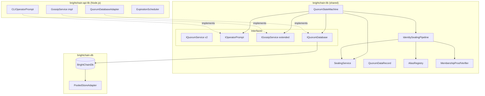
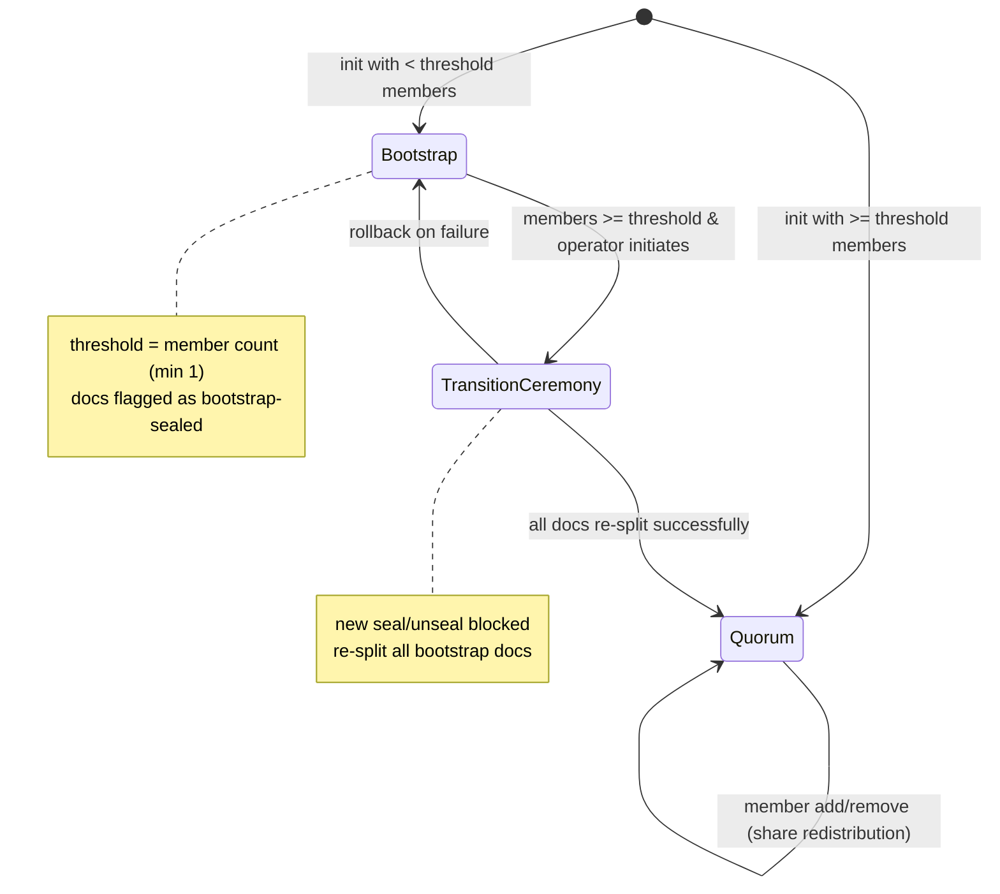
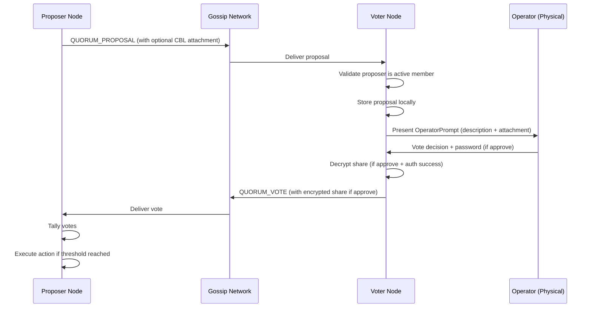
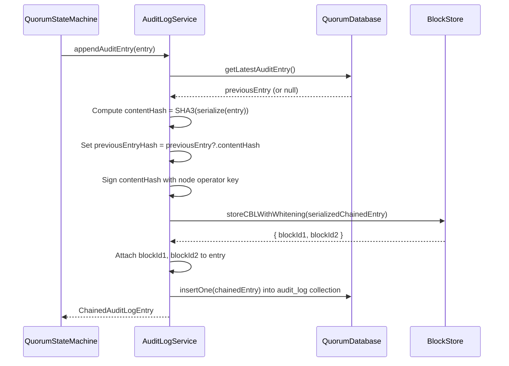
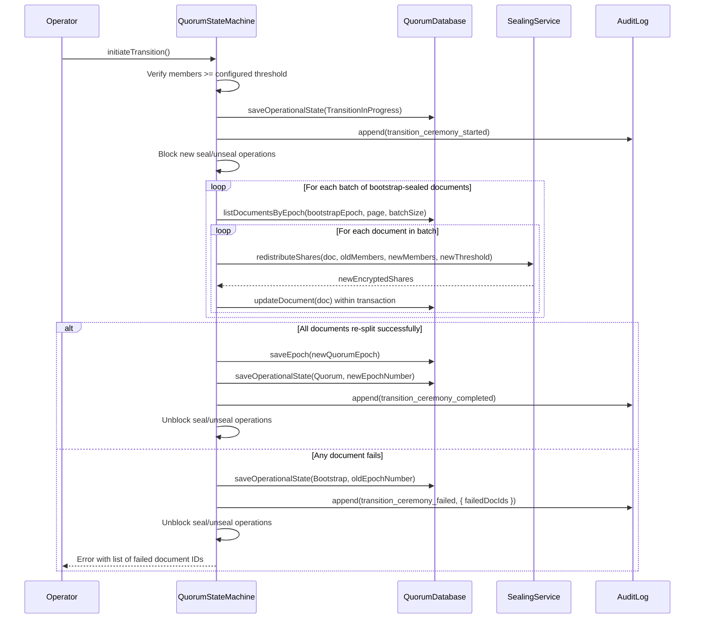
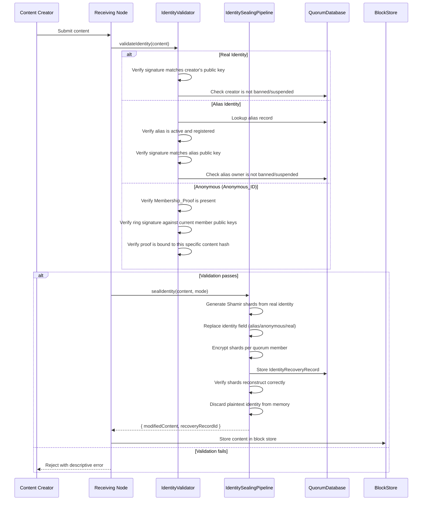
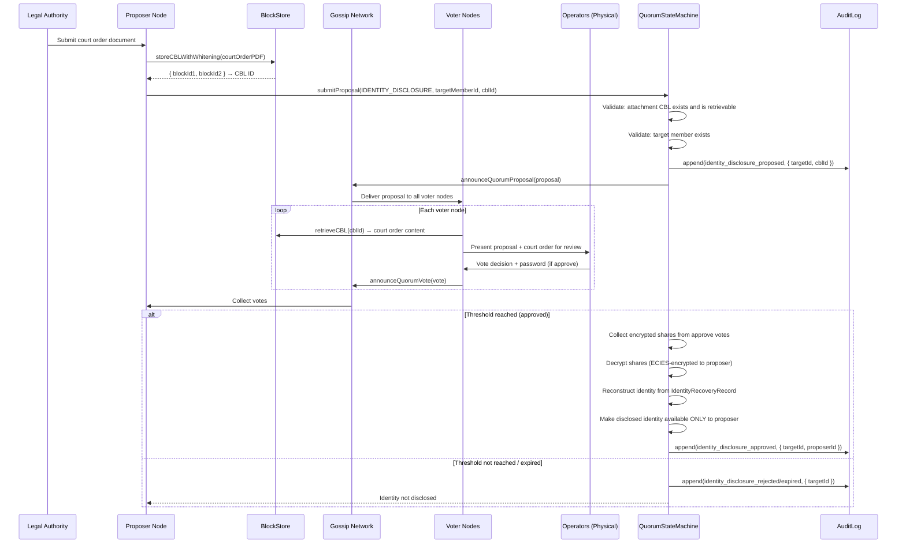

# Design Document: Quorum Bootstrap Redesign

## Overview

This design describes a comprehensive redesign of the BrightChain quorum system to support bootstrap mode operation, gossip-based proposal/voting workflows, share redistribution on membership changes, brokered anonymity (identity sealing, alias registry, membership proofs), and temporal identity expiration. The redesign extends the existing `QuorumService`, `SealingService`, and `QuorumDataRecord` in `brightchain-lib`, adds new gossip message types to `IGossipService`, and leverages `BrightChainDb` pool isolation for quorum data segregation.

The system is organized into three layers following workspace conventions:

- **brightchain-lib**: All shared interfaces, enumerations, data models, and core logic (including the quorum state machine, sealing pipeline, identity sealing pipeline, alias registry interfaces, and membership proof interfaces).
- **brightchain-api-lib**: Node.js-specific implementations (gossip transport for proposals/votes, operator prompt I/O, persistent quorum database adapter, expiration scheduler).
- **brightchain-api**: API endpoints for quorum metrics, proposal submission, and monitoring.

### Key Design Decisions

1. **Epoch-based state machine**: All membership changes produce a new `QuorumEpoch`. Documents are tagged with the epoch at sealing time. Share redistribution replays documents from prior epochs into the current epoch.
2. **Gossip reuse**: New `QUORUM_PROPOSAL` and `QUORUM_VOTE` announcement types are added to the existing `BlockAnnouncement.type` union, reusing the gossip batching, TTL, and fanout infrastructure.
3. **Operator-interactive voting**: Share release requires physical operator authentication. No code path bypasses the `IOperatorPrompt` interface.
4. **Generic TID pattern**: All new interfaces use `<TID extends PlatformID = Uint8Array>` for frontend/backend DTO compatibility per workspace conventions.
5. **Bootstrap mode relaxes MIN_SHARES**: In bootstrap mode, `SealingService` accepts threshold=1 and shareCount=1, overriding the current `SEALING.MIN_SHARES` of 2. Documents sealed under bootstrap carry a metadata flag.
6. **Identity sealing as a pipeline**: Content ingestion passes through `IdentitySealingPipeline` which captures the real identity, generates Shamir shards, replaces the identity field, distributes encrypted shards, and discards plaintext.
7. **Ring signature membership proofs**: Anonymous content carries a ring signature proving the creator is one of the current quorum members without revealing which one.

## Architecture



### State Machine: Bootstrap → Quorum Mode



### Proposal/Voting Flow




## Components and Interfaces

### 1. QuorumStateMachine (brightchain-lib)

Replaces the current `QuorumService` as the central coordinator. Manages operational mode, epoch lifecycle, proposal/vote orchestration, and delegates to `SealingService` for cryptographic operations.

```typescript
// brightchain-lib/src/lib/interfaces/services/quorumStateMachine.ts

export enum QuorumOperationalMode {
  Bootstrap = 'bootstrap',
  Quorum = 'quorum',
  TransitionInProgress = 'transition_in_progress',
}

export enum ProposalStatus {
  Pending = 'pending',
  Approved = 'approved',
  Rejected = 'rejected',
  Expired = 'expired',
}

export enum ProposalActionType {
  ADD_MEMBER = 'ADD_MEMBER',
  REMOVE_MEMBER = 'REMOVE_MEMBER',
  CHANGE_THRESHOLD = 'CHANGE_THRESHOLD',
  TRANSITION_TO_QUORUM_MODE = 'TRANSITION_TO_QUORUM_MODE',
  UNSEAL_DOCUMENT = 'UNSEAL_DOCUMENT',
  IDENTITY_DISCLOSURE = 'IDENTITY_DISCLOSURE',
  REGISTER_ALIAS = 'REGISTER_ALIAS',
  DEREGISTER_ALIAS = 'DEREGISTER_ALIAS',
  EXTEND_STATUTE = 'EXTEND_STATUTE',
  CHANGE_INNER_QUORUM = 'CHANGE_INNER_QUORUM',
  CUSTOM = 'CUSTOM',
}

export interface IQuorumStateMachine<TID extends PlatformID = Uint8Array> {
  // Mode management
  getMode(): Promise<QuorumOperationalMode>;
  initialize(members: Member<TID>[], threshold: number): Promise<QuorumEpoch<TID>>;
  
  // Transition ceremony
  initiateTransition(): Promise<void>;
  
  // Member management (triggers share redistribution)
  addMember(member: Member<TID>, metadata: QuorumMemberMetadata): Promise<QuorumEpoch<TID>>;
  removeMember(memberId: ShortHexGuid): Promise<QuorumEpoch<TID>>;
  
  // Proposal/voting
  submitProposal(proposal: ProposalInput<TID>): Promise<Proposal<TID>>;
  submitVote(vote: VoteInput<TID>): Promise<void>;
  getProposal(proposalId: ShortHexGuid): Promise<Proposal<TID> | null>;
  
  // Document operations
  sealDocument<T>(agent: Member<TID>, document: T, memberIds: ShortHexGuid[], sharesRequired?: number): Promise<SealedDocumentResult<TID>>;
  unsealDocument<T>(documentId: ShortHexGuid, membersWithPrivateKey: Member<TID>[]): Promise<T>;
  
  // Epoch queries
  getCurrentEpoch(): Promise<QuorumEpoch<TID>>;
  getEpoch(epochNumber: number): Promise<QuorumEpoch<TID> | null>;
}
```

### 2. Extended SealingService (brightchain-lib)

The existing `SealingService` gains a `bootstrapMode` parameter that relaxes the `MIN_SHARES` constraint, and a `redistributeShares` method for re-splitting an existing symmetric key under new membership.

```typescript
// Added to SealingService<TID>

/**
 * Re-split an existing symmetric key under new membership parameters.
 * Requires threshold existing members to provide decrypted shares for key reconstruction.
 */
async redistributeShares(
  existingShares: Map<ShortHexGuid, string>,  // decrypted shares from threshold members
  newMembers: Member<TID>[],
  newThreshold: number,
  existingSharingConfig: { totalShares: number; threshold: number },
): Promise<Map<ShortHexGuid, Uint8Array>>;  // new ECIES-encrypted shares per member

/**
 * Seal with bootstrap mode support (threshold can be 1).
 */
async quorumSealBootstrap<T>(
  agent: Member<TID>,
  document: T,
  members: Member<TID>[],
  threshold?: number,
): Promise<QuorumDataRecord<TID>>;
```

### 3. IOperatorPrompt (brightchain-lib)

Interface for physical operator interaction. Implementations live in `brightchain-api-lib` (CLI) or `brightchain-react` (web UI).

```typescript
// brightchain-lib/src/lib/interfaces/services/operatorPrompt.ts

export interface IOperatorPrompt {
  /**
   * Present a proposal to the operator and collect their vote.
   * Must display the full proposal description and any attachment info.
   * Returns the vote decision and, if approved, the authenticated password.
   */
  promptForVote(proposal: ProposalDisplay): Promise<OperatorVoteResult>;
  
  /**
   * Check if the voting interface is locked for a given proposal.
   */
  isLocked(proposalId: ShortHexGuid): boolean;
}

export interface ProposalDisplay {
  proposalId: ShortHexGuid;
  description: string;
  actionType: ProposalActionType;
  actionPayload: Record<string, unknown>;
  proposerMemberId: ShortHexGuid;
  expiresAt: Date;
  attachmentCblId?: string;
  attachmentContent?: Uint8Array;  // pre-fetched CBL content for review
}

export interface OperatorVoteResult {
  decision: 'approve' | 'reject';
  comment?: string;
  password?: string;  // present only on approve, used to decrypt member's private key
}
```

### 4. Extended IGossipService (brightchain-lib)

Two new announcement types are added to `BlockAnnouncement.type`:

```typescript
// Extended BlockAnnouncement.type union:
type: 'add' | 'remove' | 'ack' | 'pool_deleted' | 'cbl_index_update' 
    | 'cbl_index_delete' | 'head_update' | 'acl_update' | 'pool_announce' 
    | 'pool_remove'
    | 'quorum_proposal'   // NEW
    | 'quorum_vote';      // NEW

// New metadata fields on BlockAnnouncement:
quorumProposal?: QuorumProposalMetadata;
quorumVote?: QuorumVoteMetadata;
```

```typescript
// brightchain-lib/src/lib/interfaces/availability/gossipService.ts (additions)

export interface QuorumProposalMetadata {
  proposalId: ShortHexGuid;
  description: string;           // max 4096 chars
  actionType: ProposalActionType;
  actionPayload: string;         // JSON-serialized
  proposerMemberId: ShortHexGuid;
  expiresAt: Date;
  requiredThreshold: number;
  attachmentCblId?: string;      // optional CBL reference
}

export interface QuorumVoteMetadata {
  proposalId: ShortHexGuid;
  voterMemberId: ShortHexGuid;
  decision: 'approve' | 'reject';
  comment?: string;              // max 1024 chars
  encryptedShare?: Uint8Array;   // ECIES-encrypted to proposer's public key, present only on approve
}
```

New methods on `IGossipService`:

```typescript
announceQuorumProposal(metadata: QuorumProposalMetadata): Promise<void>;
announceQuorumVote(metadata: QuorumVoteMetadata): Promise<void>;
onQuorumProposal(handler: (announcement: BlockAnnouncement) => void): void;
offQuorumProposal(handler: (announcement: BlockAnnouncement) => void): void;
onQuorumVote(handler: (announcement: BlockAnnouncement) => void): void;
offQuorumVote(handler: (announcement: BlockAnnouncement) => void): void;
```

### 5. IQuorumDatabase (brightchain-lib)

Abstraction over `BrightChainDb` with a dedicated `quorum-system` pool. Implementations in `brightchain-api-lib`.

```typescript
// brightchain-lib/src/lib/interfaces/services/quorumDatabase.ts

export interface IQuorumDatabase<TID extends PlatformID = Uint8Array> {
  // Epoch management
  saveEpoch(epoch: QuorumEpoch<TID>): Promise<void>;
  getEpoch(epochNumber: number): Promise<QuorumEpoch<TID> | null>;
  getCurrentEpoch(): Promise<QuorumEpoch<TID>>;
  
  // Member management
  saveMember(member: IQuorumMember<TID>): Promise<void>;
  getMember(memberId: ShortHexGuid): Promise<IQuorumMember<TID> | null>;
  listActiveMembers(): Promise<IQuorumMember<TID>[]>;
  
  // Sealed documents
  saveDocument(doc: QuorumDataRecord<TID>): Promise<void>;
  getDocument(docId: ShortHexGuid): Promise<QuorumDataRecord<TID> | null>;
  listDocumentsByEpoch(epochNumber: number, page: number, pageSize: number): Promise<QuorumDataRecord<TID>[]>;
  
  // Proposals and votes
  saveProposal(proposal: Proposal<TID>): Promise<void>;
  getProposal(proposalId: ShortHexGuid): Promise<Proposal<TID> | null>;
  saveVote(vote: Vote<TID>): Promise<void>;
  getVotesForProposal(proposalId: ShortHexGuid): Promise<Vote<TID>[]>;
  
  // Identity recovery records
  saveIdentityRecord(record: IdentityRecoveryRecord<TID>): Promise<void>;
  getIdentityRecord(recordId: ShortHexGuid): Promise<IdentityRecoveryRecord<TID> | null>;
  deleteIdentityRecord(recordId: ShortHexGuid): Promise<void>;
  listExpiredIdentityRecords(before: Date, page: number, pageSize: number): Promise<IdentityRecoveryRecord<TID>[]>;
  
  // Alias registry
  saveAlias(alias: AliasRecord<TID>): Promise<void>;
  getAlias(aliasName: string): Promise<AliasRecord<TID> | null>;
  isAliasAvailable(aliasName: string): Promise<boolean>;
  
  // Audit log
  appendAuditEntry(entry: AuditLogEntry): Promise<void>;
  getLatestAuditEntry(): Promise<ChainedAuditLogEntry | null>;
  
  // Redistribution journal (for transition ceremony rollback)
  saveJournalEntry(entry: RedistributionJournalEntry): Promise<void>;
  getJournalEntries(epochNumber: number): Promise<RedistributionJournalEntry[]>;
  deleteJournalEntries(epochNumber: number): Promise<void>;
  
  // Statute of limitations configuration
  saveStatuteConfig(config: StatuteOfLimitationsConfig): Promise<void>;
  getStatuteConfig(): Promise<StatuteOfLimitationsConfig | null>;
  
  // Operational mode persistence
  saveOperationalState(state: OperationalState): Promise<void>;
  getOperationalState(): Promise<OperationalState | null>;
  
  // Transactions
  withTransaction<R>(fn: () => Promise<R>): Promise<R>;
  
  // Health check
  isAvailable(): Promise<boolean>;
}
```

### 6. IdentitySealingPipeline (brightchain-lib)

Orchestrates the brokered anonymity flow: captures real identity, generates Shamir shards, replaces identity field, distributes encrypted shards, discards plaintext.

```typescript
// brightchain-lib/src/lib/services/identitySealingPipeline.ts

export enum IdentityMode {
  Real = 'real',
  Alias = 'alias',
  Anonymous = 'anonymous',
}

export interface IIdentitySealingPipeline<TID extends PlatformID = Uint8Array> {
  /**
   * Process content through the identity sealing pipeline.
   * Returns the content with identity replaced and the identity recovery record ID.
   */
  sealIdentity(
    content: ContentWithIdentity<TID>,
    mode: IdentityMode,
    aliasName?: string,
  ): Promise<{ modifiedContent: ContentWithIdentity<TID>; recoveryRecordId: ShortHexGuid }>;
  
  /**
   * Recover a sealed identity given sufficient decrypted shares.
   */
  recoverIdentity(
    recoveryRecordId: ShortHexGuid,
    decryptedShares: Map<ShortHexGuid, string>,
  ): Promise<TID>;
}

export interface ContentWithIdentity<TID extends PlatformID = Uint8Array> {
  creatorId: TID;
  contentId: ShortHexGuid;
  contentType: string;
  signature: Uint8Array;
  membershipProof?: Uint8Array;
  identityRecoveryRecordId?: ShortHexGuid;
}
```

### 7. MembershipProofService (brightchain-lib)

Generates and verifies ring signatures proving quorum membership without revealing which member.

```typescript
// brightchain-lib/src/lib/interfaces/services/membershipProof.ts

export interface IMembershipProofService<TID extends PlatformID = Uint8Array> {
  /**
   * Generate a ring signature proving the signer is one of the current quorum members.
   * The proof is bound to the specific content hash.
   */
  generateProof(
    signerPrivateKey: Uint8Array,
    memberPublicKeys: Uint8Array[],
    contentHash: Uint8Array,
  ): Promise<Uint8Array>;
  
  /**
   * Verify a membership proof against the current member set and content hash.
   */
  verifyProof(
    proof: Uint8Array,
    memberPublicKeys: Uint8Array[],
    contentHash: Uint8Array,
  ): Promise<boolean>;
}
```


## Data Models

All data models are defined in `brightchain-lib` as generic interfaces with `<TID extends PlatformID = Uint8Array>` for frontend/backend DTO compatibility.

### QuorumEpoch

```typescript
// brightchain-lib/src/lib/interfaces/quorumEpoch.ts

export interface QuorumEpoch<TID extends PlatformID = Uint8Array> {
  epochNumber: number;              // monotonically increasing, starts at 1
  memberIds: ShortHexGuid[];        // active member IDs in this epoch
  threshold: number;                // shares required to unseal
  mode: QuorumOperationalMode;      // bootstrap | quorum
  createdAt: Date;
  previousEpochNumber?: number;     // for audit trail
  innerQuorumMemberIds?: ShortHexGuid[];  // optional subset for routine ops when members > 20 (Req 12.2)
  _platformId?: TID;                // generic marker
}
```

### Proposal

```typescript
// brightchain-lib/src/lib/interfaces/proposal.ts

export interface Proposal<TID extends PlatformID = Uint8Array> {
  id: ShortHexGuid;
  description: string;              // max 4096 chars
  actionType: ProposalActionType;
  actionPayload: Record<string, unknown>;
  proposerMemberId: ShortHexGuid;
  status: ProposalStatus;
  requiredThreshold: number;
  expiresAt: Date;
  createdAt: Date;
  attachmentCblId?: string;         // optional CBL reference for supporting docs
  epochNumber: number;              // epoch at proposal creation
  _platformId?: TID;
}

export interface ProposalInput<TID extends PlatformID = Uint8Array> {
  description: string;
  actionType: ProposalActionType;
  actionPayload: Record<string, unknown>;
  expiresAt: Date;
  attachmentCblId?: string;
  _platformId?: TID;
}
```

### Vote

```typescript
// brightchain-lib/src/lib/interfaces/vote.ts

export interface Vote<TID extends PlatformID = Uint8Array> {
  proposalId: ShortHexGuid;
  voterMemberId: ShortHexGuid;
  decision: 'approve' | 'reject';
  comment?: string;                 // max 1024 chars
  encryptedShare?: Uint8Array;      // ECIES-encrypted to proposer's public key, only on approve
  createdAt: Date;
  _platformId?: TID;
}

export interface VoteInput<TID extends PlatformID = Uint8Array> {
  proposalId: ShortHexGuid;
  decision: 'approve' | 'reject';
  comment?: string;
  _platformId?: TID;
}
```

### IdentityRecoveryRecord

```typescript
// brightchain-lib/src/lib/interfaces/identityRecoveryRecord.ts

export interface IdentityRecoveryRecord<TID extends PlatformID = Uint8Array> {
  id: ShortHexGuid;
  contentId: ShortHexGuid;          // reference to the content this identity belongs to
  contentType: string;              // block, message, post
  encryptedShardsByMemberId: Map<ShortHexGuid, Uint8Array>;  // ECIES-encrypted identity shards
  memberIds: ShortHexGuid[];        // members holding shards
  threshold: number;                // shares needed to recover
  epochNumber: number;              // epoch at creation
  expiresAt: Date;                  // statute of limitations
  createdAt: Date;
  identityMode: IdentityMode;       // real, alias, anonymous
  aliasName?: string;               // if mode is alias
  _platformId?: TID;
}
```

### AliasRecord

```typescript
// brightchain-lib/src/lib/interfaces/aliasRecord.ts

export interface AliasRecord<TID extends PlatformID = Uint8Array> {
  aliasName: string;                // unique pseudonym
  ownerMemberId: ShortHexGuid;      // sealed via identity recovery
  aliasPublicKey: Uint8Array;       // public key for signature verification under alias
  identityRecoveryRecordId: ShortHexGuid;  // link to sealed real identity
  isActive: boolean;
  registeredAt: Date;
  deactivatedAt?: Date;
  epochNumber: number;
  _platformId?: TID;
}
```

### Extended QuorumDataRecord Metadata

The existing `QuorumDataRecord` gains additional metadata fields:

```typescript
// Additional fields on QuorumDataRecord (or a wrapper)

export interface QuorumDocumentMetadata {
  epochNumber: number;              // epoch at sealing time
  sealedUnderBootstrap: boolean;    // true if sealed in bootstrap mode
  identityRecoveryRecordId?: ShortHexGuid;  // link to identity recovery if applicable
}
```

### AuditLogEntry

```typescript
// brightchain-lib/src/lib/interfaces/auditLogEntry.ts

export interface AuditLogEntry {
  id: ShortHexGuid;
  eventType: 'identity_disclosure_proposed' | 'identity_disclosure_approved' 
           | 'identity_disclosure_rejected' | 'identity_disclosure_expired'
           | 'identity_shards_expired' | 'alias_registered' | 'alias_deregistered'
           | 'epoch_created' | 'member_added' | 'member_removed'
           | 'transition_ceremony_started' | 'transition_ceremony_completed'
           | 'transition_ceremony_failed'
           | 'proposal_created' | 'proposal_approved' | 'proposal_rejected' | 'proposal_expired'
           | 'vote_cast'
           | 'share_redistribution_started' | 'share_redistribution_completed' | 'share_redistribution_failed';
  proposalId?: ShortHexGuid;
  targetMemberId?: ShortHexGuid;
  proposerMemberId?: ShortHexGuid;
  attachmentCblId?: string;
  details: Record<string, unknown>;
  timestamp: Date;
}
```

### OperationalState

```typescript
// brightchain-lib/src/lib/interfaces/operationalState.ts

export interface OperationalState {
  mode: QuorumOperationalMode;
  currentEpochNumber: number;
  lastUpdated: Date;
}
```

### Quorum Database Collections

The `BrightChainDb` instance with pool ID `"quorum-system"` contains these collections:

| Collection | Document Type | Key |
|---|---|---|
| `epochs` | `QuorumEpoch` | `epochNumber` |
| `members` | `IQuorumMember` | `id` (ShortHexGuid) |
| `documents` | `QuorumDataRecord` + metadata | `id` |
| `proposals` | `Proposal` | `id` |
| `votes` | `Vote` | `proposalId + voterMemberId` |
| `identity_records` | `IdentityRecoveryRecord` | `id` |
| `aliases` | `AliasRecord` | `aliasName` |
| `audit_log` | `ChainedAuditLogEntry` | `id` |
| `operational_state` | `OperationalState` | singleton |
| `redistribution_journal` | `RedistributionJournalEntry` | `documentId + epochNumber` |
| `statute_config` | `StatuteOfLimitationsConfig` | singleton |


## Immutable Chained Audit Log

The audit log is stored as a tamper-evident chain in the BrightChain block store. Each entry is signed by the node that created it and references the previous entry's hash, forming a hash chain. The chain is persisted via `storeCBLWithWhitening` so entries are XOR-whitened and distributed across the block store, making them resistant to targeted deletion.

### ChainedAuditLogEntry

```typescript
// brightchain-lib/src/lib/interfaces/chainedAuditLogEntry.ts

export interface ChainedAuditLogEntry extends AuditLogEntry {
  /** SHA-3 hash of the previous ChainedAuditLogEntry's serialized form. Null for the genesis entry. */
  previousEntryHash: string | null;
  /** SHA-3 hash of this entry's content (excluding signature and blockIds). */
  contentHash: string;
  /** ECIES signature of contentHash by the node operator's key. */
  signature: Uint8Array;
  /** CBL block IDs from storeCBLWithWhitening, used to retrieve the entry from the block store. */
  blockId1: string;
  blockId2: string;
}
```

### Audit Chain Write Flow



### Chain Verification

To verify the audit chain integrity, a verifier walks the chain from the latest entry backward:

1. Retrieve the latest `ChainedAuditLogEntry` from the `audit_log` collection.
2. Recompute `contentHash` from the entry's fields (excluding `signature`, `blockId1`, `blockId2`).
3. Verify the `signature` against the `contentHash` using the signing node's public key.
4. Retrieve the entry from the block store via `retrieveCBL(blockId1, blockId2)` and confirm it matches the database record.
5. Verify `previousEntryHash` matches the `contentHash` of the preceding entry.
6. Repeat until `previousEntryHash` is null (genesis entry).

If any step fails, the chain is considered tampered.

### Audit Events

All of the following events produce a chained audit log entry:

- `identity_disclosure_proposed`, `identity_disclosure_approved`, `identity_disclosure_rejected`, `identity_disclosure_expired`
- `identity_shards_expired`
- `alias_registered`, `alias_deregistered`
- `epoch_created`, `member_added`, `member_removed`
- `transition_ceremony_started`, `transition_ceremony_completed`, `transition_ceremony_failed`
- `proposal_created`, `proposal_approved`, `proposal_rejected`, `proposal_expired`
- `vote_cast`
- `share_redistribution_started`, `share_redistribution_completed`, `share_redistribution_failed`


## Share Redistribution Algorithm

Share redistribution re-splits an existing symmetric key under new membership parameters without re-encrypting the underlying data payload. The symmetric key never changes; only the Shamir shares change.

### Algorithm Steps

```
redistributeShares(document, oldMembers, newMembers, newThreshold):
  1. COLLECT: Gather at least `document.sharesRequired` decrypted shares
     from existing members (via approved proposal votes or direct key holders).
  
  2. RECONSTRUCT: Call `secrets.combine(decryptedShares)` to recover the
     original AES-256-GCM symmetric key hex string.
  
  3. VALIDATE: Decrypt a test block of `document.encryptedData` with the
     reconstructed key to confirm correctness. If validation fails, abort.
  
  4. RE-INIT: Call `sealingService.reinitSecrets(newMembers.length)` to
     configure the Shamir library for the new share count.
  
  5. RE-SPLIT: Call `secrets.share(keyHex, newMembers.length, newThreshold)`
     to generate a completely new set of Shamir polynomial coefficients and
     shares. The old shares become cryptographically useless.
  
  6. ENCRYPT: For each new member, ECIES-encrypt their share with their
     public key via `sealingService.encryptSharesForMembers(newShares, newMembers)`.
  
  7. UPDATE: Within a `db.withTransaction()`:
     a. Replace `document.encryptedSharesByMemberId` with the new map.
     b. Update `document.memberIDs` to the new member list.
     c. Update `document.sharesRequired` to `newThreshold`.
     d. Record the new `QuorumEpoch` number on the document metadata.
  
  8. WIPE: Zero out the reconstructed key and all plaintext shares from memory.
```

### Batched Redistribution

For large-scale redistribution (transition ceremony or member changes with many documents):

```typescript
// brightchain-lib/src/lib/interfaces/services/redistributionConfig.ts

export interface RedistributionConfig {
  /** Number of documents to process per batch. Default: 100 */
  batchSize: number;
  /** Callback for progress reporting */
  onProgress?: (processed: number, total: number, failed: ShortHexGuid[]) => void;
  /** Whether to continue on individual document failure. Default: true */
  continueOnFailure: boolean;
}
```

Documents are queried by epoch using `listDocumentsByEpoch(epoch, page, pageSize)` and processed in pages. Failed documents are logged and can be retried. The reconstructed key is held in memory only for the duration of a single document's redistribution, then wiped.


## Transition Ceremony Algorithm

The transition ceremony migrates all bootstrap-sealed documents to full quorum parameters. It is an atomic operation: either all documents are re-split or the system rolls back.

### Step-by-Step Flow



### Rollback Mechanism

- The `OperationalState` is set to `TransitionInProgress` before any document is modified.
- Each document's shares are updated within a `db.withTransaction()` call, so individual document updates are atomic.
- If the process is interrupted (crash, power loss), on restart the system detects `TransitionInProgress` state and:
  1. Queries documents that still have the old epoch number (not yet re-split).
  2. Queries documents that have the new epoch number (already re-split).
  3. Rolls back already-re-split documents by restoring from the previous epoch's share data (stored in a `redistribution_journal` collection during the ceremony).
  4. Restores `OperationalState` to `Bootstrap`.
- The `redistribution_journal` stores `{ documentId, oldShares, oldMemberIds, oldThreshold, oldEpoch }` for each document before modification, enabling precise rollback.

### Locking During Transition

While `OperationalState.mode === TransitionInProgress`:
- `sealDocument()` throws `QuorumError.TransitionInProgress`
- `unsealDocument()` throws `QuorumError.TransitionInProgress`
- `submitProposal()` throws `QuorumError.TransitionInProgress`
- Member add/remove operations are rejected


## Expiration Scheduler Design

The `ExpirationScheduler` runs in `brightchain-api-lib` as a periodic background task that purges expired `IdentityRecoveryRecord` entries.

### ExpirationScheduler (brightchain-api-lib)

```typescript
// brightchain-api-lib/src/lib/services/expirationScheduler.ts

export interface ExpirationSchedulerConfig {
  /** Interval between expiration checks in milliseconds. Default: 86400000 (24 hours) */
  intervalMs: number;
  /** Number of expired records to process per batch. Default: 100 */
  batchSize: number;
}

export interface IExpirationScheduler {
  /** Start the periodic expiration check. */
  start(): void;
  /** Stop the periodic expiration check. */
  stop(): void;
  /** Run a single expiration check immediately (for testing). */
  runOnce(): Promise<ExpirationResult>;
}

export interface ExpirationResult {
  deletedCount: number;
  failedIds: ShortHexGuid[];
  nextBatchAvailable: boolean;
}
```

### Expiration Flow

```
runOnce():
  1. Query: db.listExpiredIdentityRecords(now, page=0, batchSize)
  2. For each expired record:
     a. Delete the identity recovery shards from the database.
     b. Append a chained audit log entry (identity_shards_expired).
     c. Do NOT modify the associated content in the block store.
  3. If the batch was full (count === batchSize), set nextBatchAvailable = true
     to signal the caller to run again.
  4. Return { deletedCount, failedIds, nextBatchAvailable }.
```

### Statute of Limitations Configuration

```typescript
// brightchain-lib/src/lib/interfaces/statuteConfig.ts

export interface StatuteOfLimitationsConfig {
  /** Default expiration duration per content type, in milliseconds */
  defaultDurations: Map<string, number>;
  /** Fallback duration if content type is not configured. Default: 7 years */
  fallbackDurationMs: number;
}
```

Content types (e.g., `'post'`, `'message'`, `'financial_record'`) each have a configurable duration. When an `IdentityRecoveryRecord` is created, its `expiresAt` is set to `createdAt + duration` for the content type.


## Node-Side Identity Validation Flow

When a node receives content for ingestion, it passes through a validation pipeline before acceptance into the block store.

### Content Ingestion Sequence



### IdentityValidator (brightchain-lib)

```typescript
// brightchain-lib/src/lib/interfaces/services/identityValidator.ts

export interface IIdentityValidator<TID extends PlatformID = Uint8Array> {
  /**
   * Validate content identity before ingestion.
   * Throws IdentityValidationError with a specific reason on failure.
   */
  validateContent(content: ContentWithIdentity<TID>): Promise<IdentityValidationResult>;
}

export interface IdentityValidationResult {
  valid: boolean;
  identityMode: IdentityMode;
  resolvedMemberId?: ShortHexGuid;  // the real member ID (for real/alias modes)
  error?: IdentityValidationError;
}

export enum IdentityValidationErrorType {
  InvalidSignature = 'INVALID_SIGNATURE',
  UnregisteredAlias = 'UNREGISTERED_ALIAS',
  InactiveAlias = 'INACTIVE_ALIAS',
  InvalidMembershipProof = 'INVALID_MEMBERSHIP_PROOF',
  MissingMembershipProof = 'MISSING_MEMBERSHIP_PROOF',
  BannedUser = 'BANNED_USER',
  SuspendedUser = 'SUSPENDED_USER',
  ShardVerificationFailed = 'SHARD_VERIFICATION_FAILED',
}
```


## Scalability Design

### Hierarchical Quorum Structure

When the quorum exceeds 20 active members, the system supports a two-tier structure:

```
┌─────────────────────────────────────────┐
│           Full Membership               │
│  (all members, for critical ops only)   │
│  - CHANGE_THRESHOLD                     │
│  - TRANSITION_TO_QUORUM_MODE            │
│  - IDENTITY_DISCLOSURE                  │
└──────────────────┬──────────────────────┘
                   │ elected subset
┌──────────────────▼──────────────────────┐
│          Inner Quorum                   │
│  (subset of members, routine ops)       │
│  - ADD_MEMBER / REMOVE_MEMBER           │
│  - UNSEAL_DOCUMENT                      │
│  - REGISTER_ALIAS / DEREGISTER_ALIAS    │
│  - EXTEND_STATUTE                       │
│  - CUSTOM                               │
└─────────────────────────────────────────┘
```

The inner quorum is elected via a `CHANGE_INNER_QUORUM` proposal (requiring full membership vote). Inner quorum members are stored in the `QuorumEpoch` as an optional `innerQuorumMemberIds` field.

### Batching for Redistribution

Share redistribution processes documents in configurable page sizes (default 100) via `listDocumentsByEpoch`. This limits:
- Memory consumption: only one batch of documents + their reconstructed keys in memory at a time.
- Transaction scope: each batch is its own transaction, reducing lock contention.
- Progress visibility: the `onProgress` callback reports after each batch.

### Gossip Priority

`QUORUM_PROPOSAL` and `QUORUM_VOTE` messages use the existing priority gossip configuration. They are assigned higher priority than routine `add`/`remove` block announcements, ensuring vote collection is not delayed by bulk block synchronization.

### Metrics

The `QuorumStateMachine` exposes metrics via the API:

| Metric | Description |
|---|---|
| `quorum.proposals.total` | Total proposals created |
| `quorum.proposals.pending` | Currently pending proposals |
| `quorum.votes.latency_ms` | Time from proposal creation to threshold reached |
| `quorum.redistribution.progress` | Documents processed / total during redistribution |
| `quorum.redistribution.failures` | Failed document redistributions |
| `quorum.members.active` | Current active member count |
| `quorum.epoch.current` | Current epoch number |
| `quorum.expiration.last_run` | Timestamp of last expiration scheduler run |
| `quorum.expiration.deleted_total` | Total identity records expired |


## Legal Compliance: IDENTITY_DISCLOSURE Detailed Flow

The `IDENTITY_DISCLOSURE` flow is the most sensitive operation in the system. It requires legal documentation, quorum-wide voting, and produces an immutable audit trail.

### End-to-End Flow



### Key Constraints

1. The `IDENTITY_DISCLOSURE` proposal is rejected at submission time if no `attachmentCblId` is provided (Requirement 13.3).
2. The disclosed identity is made available exclusively to the proposer. It is not broadcast via gossip and is not stored in any shared collection.
3. Every step (proposal, each vote, outcome) is recorded in the chained audit log.
4. If the target member's `IdentityRecoveryRecord` has expired (statute of limitations), the disclosure is rejected with a permanent-unrecoverable error (Requirement 17.6).


## Error Handling

### Error Type Hierarchy

All quorum errors extend a base `QuorumError` class in `brightchain-lib`. Error types are organized by subsystem:

```typescript
// brightchain-lib/src/lib/errors/quorumError.ts

export enum QuorumErrorType {
  // Mode errors
  TransitionInProgress = 'TRANSITION_IN_PROGRESS',
  InvalidModeTransition = 'INVALID_MODE_TRANSITION',
  InsufficientMembersForTransition = 'INSUFFICIENT_MEMBERS_FOR_TRANSITION',
  
  // Member management errors
  MemberAlreadyExists = 'MEMBER_ALREADY_EXISTS',
  MemberNotFound = 'MEMBER_NOT_FOUND',
  InsufficientRemainingMembers = 'INSUFFICIENT_REMAINING_MEMBERS',
  MemberBanned = 'MEMBER_BANNED',
  MemberSuspended = 'MEMBER_SUSPENDED',
  
  // Proposal/voting errors
  DuplicateProposal = 'DUPLICATE_PROPOSAL',
  ProposalExpired = 'PROPOSAL_EXPIRED',
  DuplicateVote = 'DUPLICATE_VOTE',
  VoterNotOnProposal = 'VOTER_NOT_ON_PROPOSAL',
  AuthenticationFailed = 'AUTHENTICATION_FAILED',
  VotingLocked = 'VOTING_LOCKED',
  MissingAttachment = 'MISSING_ATTACHMENT',
  AttachmentNotRetrievable = 'ATTACHMENT_NOT_RETRIEVABLE',
  
  // Share redistribution errors
  RedistributionFailed = 'REDISTRIBUTION_FAILED',
  InsufficientSharesForReconstruction = 'INSUFFICIENT_SHARES_FOR_RECONSTRUCTION',
  KeyReconstructionValidationFailed = 'KEY_RECONSTRUCTION_VALIDATION_FAILED',
  
  // Identity errors
  IdentityPermanentlyUnrecoverable = 'IDENTITY_PERMANENTLY_UNRECOVERABLE',
  InvalidMembershipProof = 'INVALID_MEMBERSHIP_PROOF',
  MissingMembershipProof = 'MISSING_MEMBERSHIP_PROOF',
  AliasAlreadyTaken = 'ALIAS_ALREADY_TAKEN',
  AliasNotFound = 'ALIAS_NOT_FOUND',
  AliasInactive = 'ALIAS_INACTIVE',
  IdentitySealingFailed = 'IDENTITY_SEALING_FAILED',
  ShardVerificationFailed = 'SHARD_VERIFICATION_FAILED',
  
  // Database errors
  QuorumDatabaseUnavailable = 'QUORUM_DATABASE_UNAVAILABLE',
  TransactionFailed = 'TRANSACTION_FAILED',
  
  // Audit errors
  AuditChainCorrupted = 'AUDIT_CHAIN_CORRUPTED',
}

export class QuorumError extends Error {
  constructor(
    public readonly type: QuorumErrorType,
    message?: string,
    public readonly details?: Record<string, unknown>,
  ) {
    super(message ?? type);
    this.name = 'QuorumError';
  }
}
```

### Error Handling Strategy by Component

| Component | Error Scenario | Handling |
|---|---|---|
| QuorumStateMachine | Operations during transition | Throw `TransitionInProgress`, caller retries after ceremony |
| QuorumStateMachine | Member removal below threshold | Throw `InsufficientRemainingMembers`, reject removal |
| SealingService | Key reconstruction fails validation | Throw `KeyReconstructionValidationFailed`, abort redistribution, log failure |
| SealingService | Insufficient shares provided | Throw `InsufficientSharesForReconstruction` |
| GossipService | Duplicate proposal/vote received | Silently discard (idempotent), no error |
| GossipService | Invalid proposer/voter | Discard message, log warning |
| OperatorPrompt | 3 failed auth attempts | Lock voting for cooldown period, throw `VotingLocked` |
| IdentitySealingPipeline | Shard generation fails | Throw `IdentitySealingFailed`, reject content submission |
| IdentitySealingPipeline | Shard verification fails | Throw `ShardVerificationFailed`, reject content |
| IdentityValidator | Invalid signature | Throw with `InvalidSignature` reason |
| IdentityValidator | Unregistered/inactive alias | Throw with `UnregisteredAlias`/`InactiveAlias` reason |
| IdentityValidator | Missing membership proof on anonymous content | Throw `MissingMembershipProof` |
| ExpirationScheduler | Individual record deletion fails | Log failure, continue batch, report in `failedIds` |
| QuorumDatabase | Pool unavailable on startup | Throw `QuorumDatabaseUnavailable`, prevent quorum initialization |
| AuditLogService | Chain integrity verification fails | Throw `AuditChainCorrupted` with details of break point |
| TransitionCeremony | Partial failure during re-split | Roll back via redistribution journal, restore Bootstrap mode |

### Security-Sensitive Error Handling

- Checksum/signature verification failures during unseal return a generic error to external callers without revealing which check failed (Requirement 8.6).
- All verification operations use constant-time comparison to prevent timing side-channel attacks (Requirement 8.5).
- Authentication failures during voting do not reveal whether the password was close to correct.
- The `OperatorPrompt` lockout (3 failures → 300s cooldown) is per-proposal to prevent brute-force attacks while not locking out voting on other proposals.


## Correctness Properties

These properties define the formal correctness guarantees of the quorum system. Each property is testable via property-based testing (PBT) using fast-check or similar.

### P1: Bootstrap Mode Threshold Invariant
For any member set M where |M| < configured quorum threshold T, the system enters Bootstrap_Mode with effective threshold = |M| (minimum 1). Documents sealed in this mode carry `sealedUnderBootstrap = true`.

### P2: Seal/Unseal Round-Trip
For any data D, member set M (|M| >= threshold), and threshold T, `unseal(seal(D, M, T), M_subset)` returns D when |M_subset| >= T. When |M_subset| < T, unseal fails.

### P3: Share Redistribution Preserves Data
For any sealed document with encrypted data E, after share redistribution to new members M' with threshold T', the encrypted data E is unchanged. Unsealing with T' members from M' returns the original plaintext.

### P4: Removed Member Share Invalidation
After removing member X and redistributing shares with fresh polynomial coefficients, X's old share combined with any (T-1) new shares does NOT reconstruct the symmetric key.

### P5: Epoch Monotonicity
For any sequence of membership operations (add, remove, transition), the epoch number is strictly monotonically increasing. No two operations produce the same epoch number.

### P6: Vote Threshold Counting
For any proposal with required threshold T, the proposal status transitions to "approved" if and only if the count of distinct "approve" votes >= T. Duplicate votes (same voter) are discarded.

### P7: Identity Sealing Round-Trip
For any member identity ID and content C, `recoverIdentity(sealIdentity(C, ID).recoveryRecordId, sufficientShares)` returns ID. The content's creatorId field after sealing is either the alias ID, Anonymous_ID, or the real ID depending on mode.

### P8: Alias Uniqueness
For any two distinct members A and B, if A successfully registers alias "X", then B's attempt to register alias "X" is rejected. No two active alias records share the same aliasName.

### P9: Membership Proof Content Binding
For any membership proof P generated for content hash H1, `verifyProof(P, memberKeys, H2)` returns false when H1 ≠ H2. The proof is bound to the specific content.

### P10: Membership Proof Non-Identifiability
For any membership proof P generated by member X from member set M, the proof verifies against the full set M but does not reveal which member generated it. (Verified by checking that verification succeeds with the full key set but the proof contains no member-specific identifiers.)

### P11: Temporal Expiration Permanence
For any IdentityRecoveryRecord R with expiresAt < now, after the expiration scheduler runs, `getIdentityRecord(R.id)` returns null and any IDENTITY_DISCLOSURE proposal targeting R's content is rejected with `IdentityPermanentlyUnrecoverable`.

### P12: Audit Chain Integrity
For any sequence of N audit log entries, entry[i].previousEntryHash === entry[i-1].contentHash for all i > 0, and entry[0].previousEntryHash === null. Recomputing contentHash from entry fields matches the stored contentHash.

### P13: Fresh Key Per Seal
For any two seal operations on identical data D with identical members M, the resulting encrypted data E1 ≠ E2 (different AES-256-GCM keys and IVs).

### P14: Transition Ceremony Atomicity
After a successful transition ceremony, ALL documents previously sealed under Bootstrap_Mode have shares for the full quorum member set with the quorum threshold. After a failed ceremony, ALL documents retain their original bootstrap shares.

### P15: Identity Validation Rejects Invalid Signatures
For any content C where the signature does not match the claimed identity's public key (real, alias, or membership proof), `validateContent(C)` returns `valid: false`.

### P16: Operations Blocked During Transition
While `OperationalState.mode === TransitionInProgress`, all calls to `sealDocument`, `unsealDocument`, and `submitProposal` throw `QuorumError.TransitionInProgress`.

### P17: IDENTITY_DISCLOSURE Requires Attachment
For any proposal with actionType `IDENTITY_DISCLOSURE` and no `attachmentCblId`, `submitProposal` throws `MissingAttachment`.

### P18: Member Removal Below Threshold Rejected
For any quorum with N active members and threshold T, removing a member when N - 1 < T throws `InsufficientRemainingMembers`.


## Requirements Traceability

| Requirement | Design Components | Correctness Properties |
|---|---|---|
| Req 1: Bootstrap Mode | QuorumStateMachine, SealingService (bootstrap), OperationalState | P1, P2 |
| Req 2: Transition Ceremony | QuorumStateMachine, SealingService (redistribute), RedistributionConfig | P14, P16 |
| Req 3: Share Redistribution (Add) | SealingService.redistributeShares, QuorumStateMachine.addMember | P3, P5 |
| Req 4: Share Redistribution (Remove) | SealingService.redistributeShares, QuorumStateMachine.removeMember | P4, P5, P18 |
| Req 5: Gossip Proposal | IGossipService (quorum_proposal), QuorumProposalMetadata | P17 |
| Req 6: Operator Voting | IOperatorPrompt, OperatorVoteResult | P6 |
| Req 7: Vote Collection | QuorumStateMachine.submitVote, QuorumVoteMetadata | P6 |
| Req 8: Encryption Integrity | SealingService, QuorumDataRecord checksum/signature | P2, P13 |
| Req 9: DB Segregation | IQuorumDatabase, BrightChainDb pool "quorum-system" | — |
| Req 10: Epoch Management | QuorumEpoch, IQuorumDatabase.saveEpoch | P5 |
| Req 11: Proposal Action Types | ProposalActionType enum, QuorumStateMachine action handlers | P6, P17 |
| Req 12: Scalability | Hierarchical quorum, RedistributionConfig batching, metrics | P3 |
| Req 13: Legal Compliance | IDENTITY_DISCLOSURE flow, ChainedAuditLogEntry | P12, P17 |
| Req 14: Identity Sealing Pipeline | IdentitySealingPipeline, ContentWithIdentity | P7 |
| Req 15: Alias Registry | AliasRecord, IQuorumDatabase alias methods | P8 |
| Req 16: Node-Side Validation | IIdentityValidator, IdentityValidationResult | P15 |
| Req 17: Temporal Expiration | ExpirationScheduler, StatuteOfLimitationsConfig | P11 |
| Req 18: Membership Proof | IMembershipProofService, ring signatures | P9, P10 |
