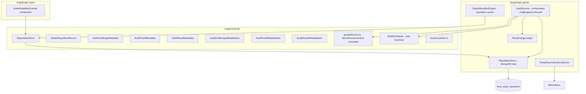
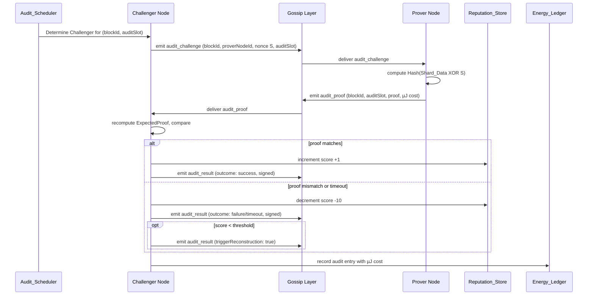

# Design Document: Reputation-Backed Spacetime Audit (RBSA)

## Overview

RBSA is a decentralized, peer-to-peer verification layer that proves storage nodes are actually holding the data they claim to store. It introduces **node-level reputation** — a "Proof-of-Service" metric entirely distinct from the existing `brighthub_hub_reputation` system (which tracks per-user, per-hub social scores).

The audit protocol ("Heartbeat") uses a deterministic challenge-response scheme: a Challenger node selects a Prover node on a schedule anchored to the BrightDate J2000.0 epoch, sends a random cryptographic challenge nonce `S`, and the Prover responds with `Hash(Shard_Data XOR S)`. Audit intensity is tiered by the block's Reed-Solomon parameters. Every audit event is logged with its energy cost in micro-Joules (µJ). When a node's reputation falls below a threshold, parity reconstruction is triggered using the remaining RS shards.

### Key Design Decisions

- **No central coordinator**: Challenger selection is a pure function of public inputs (`blockId`, `auditSlot`, sorted `replicaNodeIds`), so any node can independently verify the schedule.
- **Gossip-native**: All three message types (`audit_challenge`, `audit_proof`, `audit_result`) are extensions of the existing `BlockAnnouncement` gossip bus, requiring no new transport layer.
- **Separation from social reputation**: `rbsa_node_reputation` is a dedicated MongoDB collection with no schema overlap with `brighthub_hub_reputation`.
- **`IBaseData<TData>` pattern**: All DTO/domain type separation follows the project convention — shared interfaces in `brightchain-lib`, Node.js implementations in `brightchain-api-lib`, React components in `brightchain-react`.
- **`fast-check` for PBT**: Consistent with the existing test suite (e.g., `brightTrustDataRecord.serialization.property.spec.ts`).

---

## Architecture



### Data Flow: Heartbeat Audit Cycle



---

## Components and Interfaces

### 1. `brightchain-lib` — Shared Interfaces and Pure Logic

#### `INodeReputationRecord`

```typescript
// brightchain-lib/src/lib/interfaces/rbsa/nodeReputationRecord.ts

import type { BrightDateTimestamp } from '../../types/brightDateTimestamp';

export interface INodeReputationRecord {
  /** The node's string identifier (primary key) */
  nodeId: string;
  /** Non-negative integer reputation score */
  score: number;
  /** BrightDate timestamp of the last applied update */
  lastUpdatedAt: BrightDateTimestamp;
  /** BrightDate timestamp when this record was first created */
  createdAt: BrightDateTimestamp;
}
```

#### `IReputationStore`

```typescript
// brightchain-lib/src/lib/interfaces/rbsa/reputationStore.ts

import type { INodeReputationRecord } from './nodeReputationRecord';

export interface IReputationStore {
  /** Get the reputation record for a node, initializing to baseline if not found */
  getOrCreate(nodeId: string): Promise<INodeReputationRecord>;

  /** Get the reputation record for a node, or null if not found */
  get(nodeId: string): Promise<INodeReputationRecord | null>;

  /** Apply a score delta (positive or negative) to a node's reputation */
  applyDelta(nodeId: string, delta: number, updatedAt: number): Promise<INodeReputationRecord>;

  /** Return the top n nodes by score, descending */
  getTopN(n: number): Promise<INodeReputationRecord[]>;

  /** Return all nodes with score below the given threshold */
  getBelowThreshold(threshold: number): Promise<INodeReputationRecord[]>;
}
```

#### `rbsaConstants.ts`

```typescript
// brightchain-lib/src/lib/interfaces/rbsa/rbsaConstants.ts

export const RBSA_COLLECTION_NAME = 'rbsa_node_reputation';
export const RBSA_DEFAULT_BASELINE_SCORE = 100;
export const RBSA_DEFAULT_REPUTATION_THRESHOLD = 20;
export const RBSA_DEFAULT_SUCCESS_DELTA = 1;
export const RBSA_DEFAULT_FAILURE_DELTA = -10;
export const RBSA_GOSSIP_TTL = 7;
export const RBSA_CHALLENGE_RELAY_TTL = 5;
export const RBSA_PROOF_TIMEOUT_SECONDS = 30;
export const RBSA_RECONSTRUCTION_TIMEOUT_SECONDS = 60;
export const RBSA_ARCHIVE_RELAXED_THRESHOLD = 10;

/** Audit tier interval constants in BrightDate decimal days */
export const RBSA_TIER_INTERVAL_DAYS = {
  performance: 0.25,   // ~6 hours
  standard: 1.0,       // ~24 hours
  archive: 7.0,        // ~1 week
  'pending-burn': 30.0, // ~1 month
  none: Infinity,
} as const;
```

#### Gossip Message Schema Extension

The `BlockAnnouncement` interface in `brightchain-lib/src/lib/interfaces/availability/gossipService.ts` is extended with three new type literals and three new optional metadata fields:

```typescript
// Additions to the type union:
| 'audit_challenge'
| 'audit_proof'
| 'audit_result'

// New metadata interfaces:

export interface AuditChallengeMetadata {
  /** The block ID being audited */
  blockId: string;
  /** The Prover's node ID */
  proverNodeId: string;
  /** 32-byte cryptographically random nonce (hex-encoded) */
  nonce: string;
  /** The audit slot integer */
  auditSlot: number;
  /** The Challenger's node ID */
  challengerNodeId: string;
}

export interface AuditProofMetadata {
  /** The block ID being audited */
  blockId: string;
  /** The audit slot integer */
  auditSlot: number;
  /** The Prover's node ID */
  proverNodeId: string;
  /** Computed proof bytes (hex-encoded), absent if shardMissing or timeout */
  proof?: string;
  /** True if the prover does not hold the shard */
  shardMissing?: boolean;
  /** True if the prover timed out */
  timeout?: boolean;
  /** Wall-clock duration of hash computation in milliseconds */
  computationDurationMs: number;
  /** Estimated energy cost of hash computation in µJ (decimal string) */
  computationMicroJoules: string;
}

export interface AuditResultMetadata {
  /** The block ID being audited */
  blockId: string;
  /** The audit slot integer */
  auditSlot: number;
  /** The Prover's node ID */
  proverNodeId: string;
  /** The Challenger's node ID */
  challengerNodeId: string;
  /** Audit outcome */
  outcome: 'success' | 'failure' | 'timeout';
  /** Updated reputation score for the prover */
  updatedScore: number;
  /** ECDSA signature of the result by the Challenger (hex-encoded) */
  signature: string;
  /** BrightDate timestamp of the result */
  resultTimestamp: number;
  /** True if parity reconstruction should be triggered */
  triggerReconstruction?: boolean;
  /** True if reconstruction failed */
  reconstructionFailed?: boolean;
  /** Number of available healthy shards (present when reconstructionFailed) */
  availableShards?: number;
  /** Required k value (present when reconstructionFailed) */
  requiredK?: number;
}

// New optional fields on BlockAnnouncement:
auditChallenge?: AuditChallengeMetadata;
auditProof?: AuditProofMetadata;
auditResult?: AuditResultMetadata;
```

The `VALID_ANNOUNCEMENT_TYPES` constant array is updated to include all three new literals.

#### DTO Types for Round-Trip Serialization

```typescript
// brightchain-lib/src/lib/interfaces/rbsa/auditMetadataDto.ts

/** DTO for AuditChallengeMetadata — all fields are JSON-safe primitives */
export interface AuditChallengeMetadataDto {
  blockId: string;
  proverNodeId: string;
  nonce: string;          // hex string (Uint8Array → hex)
  auditSlot: number;
  challengerNodeId: string;
}

/** DTO for AuditProofMetadata — bigint fields serialized as decimal strings */
export interface AuditProofMetadataDto {
  blockId: string;
  auditSlot: number;
  proverNodeId: string;
  proof?: string;         // hex string
  shardMissing?: boolean;
  timeout?: boolean;
  computationDurationMs: number;
  computationMicroJoules: string;  // bigint as decimal string
}

/** DTO for AuditResultMetadata — bigint fields serialized as decimal strings */
export interface AuditResultMetadataDto {
  blockId: string;
  auditSlot: number;
  proverNodeId: string;
  challengerNodeId: string;
  outcome: 'success' | 'failure' | 'timeout';
  updatedScore: number;
  signature: string;      // hex string
  resultTimestamp: number;
  triggerReconstruction?: boolean;
  reconstructionFailed?: boolean;
  availableShards?: number;
  requiredK?: number;
}
```

Serializer/deserializer functions live in `brightchain-lib/src/lib/serializers/rbsaMetadataSerializer.ts`. The deserializer throws `ValidationError` (existing class at `brightchain-lib/src/lib/errors/validationError.ts`) when a decimal-string bigint field contains a non-numeric value.

#### `AuditScheduler` — Pure Functions

```typescript
// brightchain-lib/src/lib/rbsa/auditScheduler.ts

import type { BurnbagStorageTier } from 'digitalburnbag-lib/src/lib/joule/burnbagDurability';
import { RBSA_TIER_INTERVAL_DAYS } from '../interfaces/rbsa/rbsaConstants';

/**
 * Derive the audit tier from RS parameters.
 * Falls back to 'standard' for unrecognized RS params.
 */
export function rsParamsToAuditTier(rsK: number, rsM: number): BurnbagStorageTier | 'none';

/**
 * Compute the audit slot integer for a given BrightDate decimal day value and tier.
 * auditSlot = floor(brightDateDecimalDays / tierIntervalDays)
 */
export function computeAuditSlot(brightDateDecimalDays: number, tier: BurnbagStorageTier | 'none'): number;

/**
 * Deterministically select the Challenger node ID.
 * Challenger = sortedNodeIds[Hash(blockId || auditSlot) mod sortedNodeIds.length]
 * Returns null if fewer than 2 replica nodes are available.
 */
export function selectChallenger(
  blockId: string,
  auditSlot: number,
  replicaNodeIds: string[],
): string | null;
```

The hash in `selectChallenger` uses `@digitaldefiance/node-rs-accelerate` for consistency with the proof computation.

---

### 2. `brightchain-api-lib` — Node.js Implementations

#### `ReputationStore` (MongoDB)

```typescript
// brightchain-api-lib/src/lib/rbsa/reputationStore.ts

import { Collection, Db } from 'mongodb';
import type { IReputationStore } from '@brightchain/brightchain-lib';
import type { INodeReputationRecord } from '@brightchain/brightchain-lib';
import {
  RBSA_COLLECTION_NAME,
  RBSA_DEFAULT_BASELINE_SCORE,
} from '@brightchain/brightchain-lib';

export class ReputationStore implements IReputationStore {
  private readonly collection: Collection<INodeReputationRecord>;

  constructor(db: Db) {
    this.collection = db.collection<INodeReputationRecord>(RBSA_COLLECTION_NAME);
  }

  async initialize(): Promise<void> {
    // Create indexes: nodeId (unique), score (descending)
    await this.collection.createIndex({ nodeId: 1 }, { unique: true });
    await this.collection.createIndex({ score: -1 });
  }

  async getOrCreate(nodeId: string): Promise<INodeReputationRecord>;
  async get(nodeId: string): Promise<INodeReputationRecord | null>;
  async applyDelta(nodeId: string, delta: number, updatedAt: number): Promise<INodeReputationRecord>;
  async getTopN(n: number): Promise<INodeReputationRecord[]>;
  async getBelowThreshold(threshold: number): Promise<INodeReputationRecord[]>;
}
```

`applyDelta` uses a MongoDB `findOneAndUpdate` with `$inc` on `score` and a conditional `$set` on `lastUpdatedAt` (only applied when the incoming `updatedAt` is strictly greater than the stored value), ensuring timestamp-ordered updates are idempotent.

#### `AuditService`

Orchestrates the full Heartbeat cycle:

- **Challenger path**: Calls `selectChallenger`, constructs and emits `audit_challenge`, records pending challenge with timeout, receives `audit_proof`, recomputes `ExpectedProof`, calls `applyDelta`, emits signed `audit_result`, records energy ledger entry.
- **Prover path**: Listens for `audit_challenge` announcements, loads shard data from `IBlockStore`, computes `Hash(Shard_Data XOR S)` via `@digitaldefiance/node-rs-accelerate`, emits `audit_proof`.
- **Reconstruction path**: Listens for `audit_result` with `triggerReconstruction: true`, delegates to `ParityReconstructionService`.

ECDSA signing of `AUDIT_RESULT` follows the same pattern as `pool_join_approved` announcements: the node's existing private key signs a canonical serialization of the result fields.

#### `ParityReconstructionService`

```typescript
// brightchain-api-lib/src/lib/rbsa/parityReconstructionService.ts

export class ParityReconstructionService {
  constructor(
    private readonly blockStore: IBlockStore,
    private readonly reputationStore: IReputationStore,
    private readonly gossipService: IGossipService,
    private readonly threshold: number,
  ) {}

  async reconstruct(blockId: string, failedNodeId: string): Promise<void>;
}
```

`reconstruct` filters `replicaNodeIds` to those with `score >= threshold`, calls `recoverBlock(blockId)`, then on success calls `recordReplication(blockId, newNodeId)` and `recordReplicaLoss(blockId, failedNodeId)`. On failure, emits `audit_result` with `reconstructionFailed: true`.

#### `RbsaEnergyLedger`

Persists one `IRbsaEnergyLedgerEntry` per completed audit cycle to MongoDB collection `rbsa_energy_ledger`. Integrates with `AssetAccountStore` to debit `totalAuditMicroJoules` from the Challenger's Joule account.

#### `ClientAllocationEngine` (reputation-aware extension)

The existing allocation engine is extended to accept an `IReputationStore` dependency. For `performance` and `standard` tier uploads, it calls `getTopN(k + m)` filtered to nodes with `score >= threshold`. For `archive` and `pending-burn`, it uses the relaxed threshold of 10.

---

### 3. `brightchain-react` — Frontend

#### `NodeReliabilityOverlay`

```typescript
// brightchain-react/src/components/rbsa/NodeReliabilityOverlay.tsx

interface NodeReliabilityOverlayProps {
  fileId: string;
  contractId?: string;
}
```

Sources data from a typed API response interface `INodeReliabilityResponse` (defined in `brightchain-lib`) via a REST endpoint. Refreshes at most once every 30 seconds using a polling hook. Displays:

- Per-shard row: `proverNodeId` (first 8 chars), score, color indicator (green ≥ threshold, amber ≥ 50% of threshold, red < 50% of threshold).
- "Reconstruction in progress" badge when score transitions below threshold.
- "No audit data available" when no `IBurnbagStorageContract` is associated.

---

## Data Models

### MongoDB: `rbsa_node_reputation`

```
{
  nodeId: string,          // unique index
  score: number,           // descending index
  lastUpdatedAt: number,   // BrightDate decimal days
  createdAt: number        // BrightDate decimal days
}
```

### MongoDB: `rbsa_energy_ledger`

```
{
  blockId: string,
  auditSlot: number,
  challengerNodeId: string,
  proverNodeId: string,
  outcome: 'success' | 'failure' | 'timeout',
  proofComputationMicroJoules: string,   // bigint as decimal string
  validationMicroJoules: string,         // bigint as decimal string
  totalAuditMicroJoules: string,         // bigint as decimal string
  rsK: number,
  rsM: number,
  timestamp: number                      // BrightDate decimal days
}
```

Indexes: `(challengerNodeId, timestamp)`, `(proverNodeId, timestamp)`, `(rsK, rsM)`.

### `IRbsaEnergyLedgerEntry`

```typescript
// brightchain-lib/src/lib/interfaces/rbsa/energyLedgerEntry.ts

export interface IRbsaEnergyLedgerEntry {
  blockId: string;
  auditSlot: number;
  challengerNodeId: string;
  proverNodeId: string;
  outcome: 'success' | 'failure' | 'timeout';
  proofComputationMicroJoules: bigint;
  validationMicroJoules: bigint;
  totalAuditMicroJoules: bigint;
  rsK: number;
  rsM: number;
  timestamp: number; // BrightDate decimal days
}
```

### `IRbsaEnergyLedgerEntryDto`

Same shape as `IRbsaEnergyLedgerEntry` but with `bigint` fields as `string` (decimal).

### Audit Tier Mapping

| RS Params | `BurnbagStorageTier` | Interval (decimal days) | Approx. |
|-----------|---------------------|------------------------|---------|
| RS(10,6)  | `performance`       | 0.25                   | 6 hours |
| RS(8,4)   | `standard`          | 1.0                    | 24 hours |
| RS(6,2)   | `archive`           | 7.0                    | 1 week  |
| RS(4,1)   | `pending-burn`      | 30.0                   | 1 month |
| RS(1,0)   | `none`              | ∞                      | never   |

---

## Correctness Properties

*A property is a characteristic or behavior that should hold true across all valid executions of a system — essentially, a formal statement about what the system should do. Properties serve as the bridge between human-readable specifications and machine-verifiable correctness guarantees.*

### Property 1: Audit Metadata Round-Trip (Challenge)

*For any* valid `AuditChallengeMetadata` object, serializing it to `AuditChallengeMetadataDto` and deserializing back SHALL produce an object that is deep-equal to the original.

**Validates: Requirements 14.2**

### Property 2: Audit Metadata Round-Trip (Proof)

*For any* valid `AuditProofMetadata` object, serializing it to `AuditProofMetadataDto` and deserializing back SHALL produce an object that is deep-equal to the original, with `computationMicroJoules` preserved exactly as a `bigint`.

**Validates: Requirements 14.3**

### Property 3: Audit Metadata Round-Trip (Result)

*For any* valid `AuditResultMetadata` object, serializing it to `AuditResultMetadataDto` and deserializing back SHALL produce an object that is deep-equal to the original.

**Validates: Requirements 14.4**

### Property 4: Deterministic Challenger Selection

*For any* non-empty `blockId` string, `auditSlot` integer, and list of at least 2 `replicaNodeIds`, calling `selectChallenger` twice with the same inputs SHALL return the same node ID.

**Validates: Requirements 3.1, 3.4**

### Property 5: Challenger Selection is Input-Order Independent

*For any* `blockId`, `auditSlot`, and list of at least 2 `replicaNodeIds`, shuffling the `replicaNodeIds` array before passing it to `selectChallenger` SHALL produce the same result as the unshuffled input (because the function sorts internally).

**Validates: Requirements 3.5**

### Property 6: Audit Slot Formula

*For any* non-negative `brightDateDecimalDays` value and positive `tierIntervalDays`, `computeAuditSlot` SHALL return `Math.floor(brightDateDecimalDays / tierIntervalDays)`.

**Validates: Requirements 3.2**

### Property 7: Reputation Score Monotonicity on Success

*For any* starting `Node_Reputation_Score` and configured `successDelta`, applying a success audit result SHALL increase the score by exactly `successDelta`.

**Validates: Requirements 6.2**

### Property 8: Reputation Score Monotonicity on Failure

*For any* starting `Node_Reputation_Score` and configured `failureDelta`, applying a failure or timeout audit result SHALL decrease the score by exactly `|failureDelta|` (clamped to 0 as a floor).

**Validates: Requirements 6.3, 6.4**

### Property 9: Audit Tier Mapping

*For any* canonical RS parameter pair `(rsK, rsM)` from the five defined tiers, `rsParamsToAuditTier(rsK, rsM)` SHALL return the corresponding `BurnbagStorageTier` constant, and the tier's interval from `RBSA_TIER_INTERVAL_DAYS` SHALL match the values specified in Requirement 3.3.

**Validates: Requirements 9.1, 3.3**

### Property 10: ValidationError on Invalid Decimal String

*For any* string that is not a valid decimal integer representation, passing it as a `computationMicroJoules` or equivalent bigint DTO field to the deserializer SHALL throw a `ValidationError` identifying the field name and the received value.

**Validates: Requirements 14.5**

### Property 11: getTopN Returns Highest Scores in Descending Order

*For any* set of `INodeReputationRecord` entries and any `n ≥ 1`, `getTopN(n)` SHALL return at most `n` records, all records SHALL have scores ≥ any record not returned, and the returned records SHALL be ordered by score descending.

**Validates: Requirements 13.5, 10.1**

### Property 12: New Node Baseline Initialization

*For any* node ID string not previously seen by the `Reputation_Store`, calling `getOrCreate` SHALL return a record with `score` equal to the configured baseline (default: 100).

**Validates: Requirements 1.3**

---

## Error Handling

| Scenario | Handling |
|----------|----------|
| Prover does not hold shard | Respond with `shardMissing: true`; Challenger applies failure delta |
| Prover hash computation timeout (>30s) | Respond with `timeout: true`; Challenger applies failure delta |
| Challenger pending challenge timeout | Apply failure delta as non-response penalty; emit `audit_result` with `outcome: 'timeout'` |
| `AUDIT_RESULT` with invalid/missing signature | Discard announcement; log warning at WARN level |
| `AUDIT_RESULT` with stale BrightDate timestamp | Discard update; no log (normal network condition) |
| `BlockAnnouncement` of audit type missing required metadata | Discard; log parse error at ERROR level |
| `recoverBlock()` fails (insufficient healthy shards) | Emit `audit_result` with `reconstructionFailed: true`; log blockId, available shards, required k |
| `replicaNodeIds` fewer than 2 entries | Skip audit scheduling; log diagnostic at DEBUG level |
| Non-canonical RS params | Assign `standard` tier; log diagnostic at WARN level |
| Joule account debit fails | Log error; do not block audit result recording |
| DTO deserialization of non-numeric bigint field | Throw `ValidationError` with field name and received value |

---

## Testing Strategy

### Unit Tests (example-based)

- `AuditScheduler`: verify each canonical RS param pair maps to the correct tier and interval; verify `selectChallenger` returns `null` for fewer than 2 replica nodes; verify `computeAuditSlot` boundary values.
- `rbsaMetadataSerializer`: verify `ValidationError` is thrown for non-numeric bigint fields; verify hex encoding/decoding of `Uint8Array` fields.
- `validateBlockAnnouncement`: verify the three new types are accepted; verify announcements missing required metadata are rejected.
- `ReputationStore` (unit, in-memory mock): verify `applyDelta` with stale timestamp is a no-op; verify `getTopN(0)` returns empty array.
- `NodeReliabilityOverlay`: verify color thresholds (green/amber/red); verify "No audit data available" message when no contract.

### Property-Based Tests (fast-check, minimum 100 iterations each)

All property tests live in `brightchain-lib` alongside the interfaces they test, following the `*.property.spec.ts` naming convention.

**File: `brightchain-lib/src/lib/serializers/rbsaMetadataSerializer.property.spec.ts`**

- **Feature: rbsa-node-reputation-audit, Property 1**: AuditChallengeMetadata round-trip
- **Feature: rbsa-node-reputation-audit, Property 2**: AuditProofMetadata round-trip
- **Feature: rbsa-node-reputation-audit, Property 3**: AuditResultMetadata round-trip
- **Feature: rbsa-node-reputation-audit, Property 10**: ValidationError on invalid decimal string

**File: `brightchain-lib/src/lib/rbsa/auditScheduler.property.spec.ts`**

- **Feature: rbsa-node-reputation-audit, Property 4**: Deterministic challenger selection
- **Feature: rbsa-node-reputation-audit, Property 5**: Input-order independence
- **Feature: rbsa-node-reputation-audit, Property 6**: Audit slot formula
- **Feature: rbsa-node-reputation-audit, Property 9**: Audit tier mapping

**File: `brightchain-lib/src/lib/rbsa/reputationScore.property.spec.ts`**

- **Feature: rbsa-node-reputation-audit, Property 7**: Score monotonicity on success
- **Feature: rbsa-node-reputation-audit, Property 8**: Score monotonicity on failure
- **Feature: rbsa-node-reputation-audit, Property 11**: getTopN correctness
- **Feature: rbsa-node-reputation-audit, Property 12**: New node baseline initialization

### Integration Tests

- `ReputationStore` (MongoDB): persistence across re-initialization; index creation; `getTopN` with real data.
- `AuditService`: full Heartbeat cycle with mocked gossip and block store; timeout handling; signature verification.
- `ParityReconstructionService`: `recoverBlock` success and failure paths; `recordReplication`/`recordReplicaLoss` called correctly.
- `RbsaEnergyLedger`: entry persistence within 100ms; aggregation queries by RS params and by proverNodeId.
- `ClientAllocationEngine`: reputation-ranked node selection for performance vs. archive tiers.

### Smoke Tests

- TypeScript compilation verifies `IReputationStore` is importable from `brightchain-lib` without Node.js dependencies.
- MongoDB collection name is `rbsa_node_reputation` (not `brighthub_hub_reputation`).
- `VALID_ANNOUNCEMENT_TYPES` includes `'audit_challenge'`, `'audit_proof'`, `'audit_result'`.
