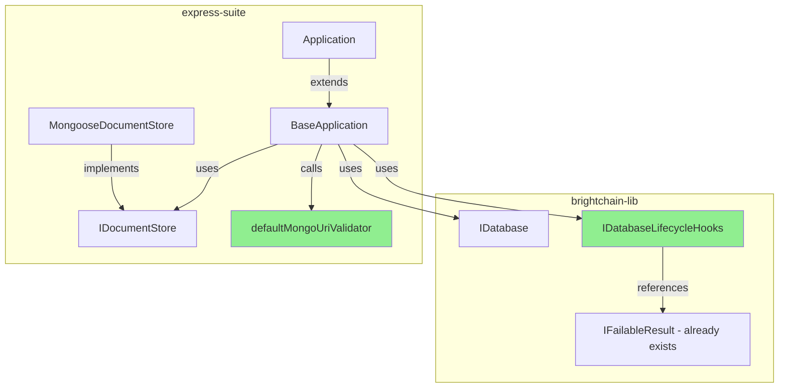
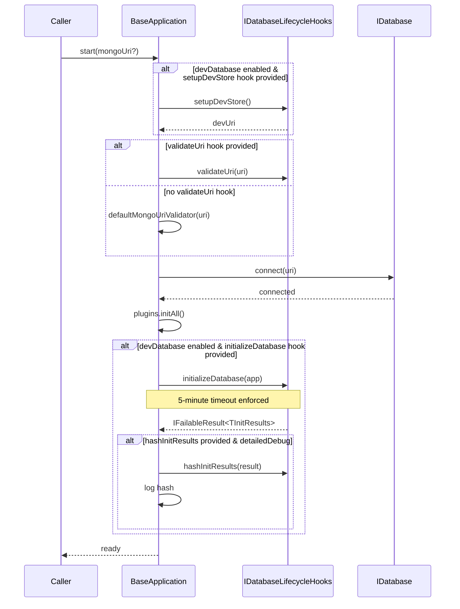
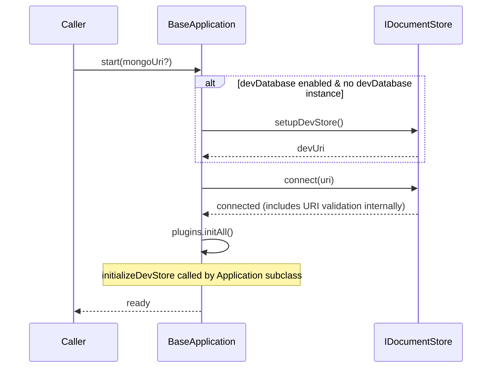

# Design Document: Restore Database Initialization Lifecycle Hooks

## Overview

The `BaseApplication` class was refactored to accept either an `IDatabase` or a legacy `IDocumentStore`. During this refactoring, database lifecycle capabilities (init functions, URI validation, dev store setup) were moved exclusively into `MongooseDocumentStore`, making them unavailable on the `IDatabase` path.

This design restores those capabilities by introducing a storage-agnostic `IDatabaseLifecycleHooks` interface in `brightchain-lib` and integrating it into `BaseApplication`. The hooks are optional, composable, and work with both database paths. The legacy `IDocumentStore` path remains fully backward compatible — when lifecycle hooks are not provided, `BaseApplication` falls back to the existing `IDocumentStore` delegation behavior.

### Design Decisions

1. **Hooks in `brightchain-lib`, not `express-suite`**: The `IDatabaseLifecycleHooks` interface goes in `brightchain-lib` alongside `IDatabase` because it defines a storage-agnostic contract. Any package that works with `IDatabase` should be able to define lifecycle hooks without depending on `express-suite`.

2. **Default URI validator in `express-suite`**: The concrete SSRF-protection validator stays in `express-suite` because it requires knowledge of MongoDB URI formats. The hook interface itself is protocol-agnostic.

3. **Hooks object, not constructor parameters**: Rather than adding 4+ new constructor parameters to `BaseApplication`, we pass a single optional `IDatabaseLifecycleHooks` object. This keeps the constructor clean and makes partial configuration natural.

4. **Application subclass bridges the gap**: The `Application` class already accepts `databaseInitFunction`, `initResultHashFunction`, and `schemaMapFactory`. When using the legacy path, `Application` continues to wrap these into a `MongooseDocumentStore`. When using the `IDatabase` path, `Application` can construct lifecycle hooks from the same parameters.

## Architecture



Green nodes are new additions.

### Lifecycle Flow (IDatabase path with hooks)



### Lifecycle Flow (Legacy IDocumentStore path — unchanged)



## Components and Interfaces

### IDatabaseLifecycleHooks (new — in `brightchain-lib`)

```typescript
/**
 * Storage-agnostic lifecycle hooks for database initialization.
 * Provided to BaseApplication to enable init, validation, and dev setup
 * regardless of which database backend (IDatabase or IDocumentStore) is used.
 */
export interface IDatabaseLifecycleHooks<TInitResults = unknown> {
  /**
   * Validate a database connection URI before connecting.
   * Should throw on invalid or unsafe URIs.
   * If not provided, BaseApplication uses a default validator.
   */
  validateUri?: (uri: string) => void;

  /**
   * Provision an ephemeral dev/test database.
   * Returns the connection URI for the provisioned store.
   * Called before connect() when environment.devDatabase is truthy.
   */
  setupDevStore?: () => Promise<string>;

  /**
   * Clean up the ephemeral dev/test database on shutdown.
   * Called during stop() if setupDevStore was invoked.
   */
  teardownDevStore?: () => Promise<void>;

  /**
   * Initialize/seed the database after connection.
   * Called after connect() when environment.devDatabase is truthy.
   * Must return a failable result indicating success or failure.
   */
  initializeDatabase?: (application: unknown) => Promise<IFailableResult<TInitResults>>;

  /**
   * Hash the initialization results for logging purposes.
   * Called after successful initializeDatabase when detailedDebug is enabled.
   */
  hashInitResults?: (initResults: TInitResults) => string;
}
```

### IFailableResult (existing — in `express-suite`, needs to move to `brightchain-lib`)

The `IFailableResult<T>` interface is currently defined in `express-suite`. Since `IDatabaseLifecycleHooks` references it and lives in `brightchain-lib`, we need `IFailableResult` available there too. 

**Approach**: Define `IFailableResult` in `brightchain-lib` and re-export it from `express-suite` for backward compatibility. This is a minimal, dependency-free interface (no Node.js types needed).

```typescript
// brightchain-lib/src/lib/interfaces/failableResult.ts
export interface IFailableResult<T> {
  success: boolean;
  data?: T;
  message?: string;
  error?: string | Error;
}
```

```typescript
// express-suite: re-export for backward compatibility
export type { IFailableResult } from '@brightchain/brightchain-lib';
```

### defaultMongoUriValidator (new — in `express-suite`)

A standalone function extracted from `MongooseDocumentStore.validateMongoUri()`. Takes the URI and a `production` boolean flag.

```typescript
/**
 * Default MongoDB URI validator with SSRF protection.
 * Rejects non-mongodb protocols and private/localhost addresses in production.
 */
export function defaultMongoUriValidator(uri: string, production: boolean): void {
  if (!uri.startsWith('mongodb://') && !uri.startsWith('mongodb+srv://')) {
    throw new TranslatableSuiteError(
      SuiteCoreStringKey.Admin_Error_InvalidMongoUri,
    );
  }

  if (production) {
    const urlMatch = uri.match(
      /^mongodb(?:\+srv)?:\/\/(?:[^@]+@)?(\[[^\]]+\]|[^:/]+)/,
    );
    if (urlMatch) {
      const hostname = urlMatch[1].replace(/[[\]]/g, '');
      if (
        hostname === 'localhost' ||
        hostname === '127.0.0.1' ||
        hostname.startsWith('10.') ||
        hostname.startsWith('192.168.') ||
        /^172\.(1[6-9]|2[0-9]|3[0-1])\./.test(hostname) ||
        hostname.startsWith('169.254.') ||
        hostname === '::1' ||
        hostname.startsWith('fc00:') ||
        hostname.startsWith('fd00:')
      ) {
        throw new TranslatableSuiteError(
          SuiteCoreStringKey.Admin_Error_InvalidMongoUri,
        );
      }
    }
  }
}
```

### BaseApplication Changes

The constructor gains an optional fourth parameter for lifecycle hooks when using the `IDatabase` path:

```typescript
constructor(
  environment: Environment<TID>,
  databaseOrStore: IDatabase | IDocumentStore<TID, TModelDocs>,
  constants: TConstants = Constants as TConstants,
  lifecycleHooks?: IDatabaseLifecycleHooks<TInitResults>,
)
```

New protected fields:
- `_lifecycleHooks?: IDatabaseLifecycleHooks<TInitResults>` — stored hooks
- `_devStoreProvisioned: boolean` — tracks whether setupDevStore was called (for teardown)

The `start()` method is updated to:
1. Call `setupDevStore` hook (IDatabase path, dev mode) before connecting
2. Call `validateUri` hook (or default validator) before connecting on the IDatabase path
3. Call `initializeDatabase` hook (IDatabase path, dev mode) after connecting
4. Enforce 5-minute timeout on `initializeDatabase`
5. Log hash via `hashInitResults` on success with detailed debug

The `stop()` method is updated to:
1. Call `teardownDevStore` hook if dev store was provisioned via hooks

### Application Changes

The `Application` constructor remains backward compatible. When a `documentStore` is provided (or defaulted to `MongooseDocumentStore`), the legacy path is used as-is. 

The `Application.start()` override continues to call `this._documentStore.initializeDevStore()` on the legacy path. No changes needed here — the lifecycle hooks are only used on the `IDatabase` path via `BaseApplication`.

## Data Models

### IDatabaseLifecycleHooks<TInitResults>

| Field | Type | Required | Description |
|-------|------|----------|-------------|
| `validateUri` | `(uri: string) => void` | No | URI validation function, throws on invalid |
| `setupDevStore` | `() => Promise<string>` | No | Provisions ephemeral dev database, returns URI |
| `teardownDevStore` | `() => Promise<void>` | No | Cleans up ephemeral dev database |
| `initializeDatabase` | `(application: unknown) => Promise<IFailableResult<TInitResults>>` | No | Seeds database after connection |
| `hashInitResults` | `(initResults: TInitResults) => string` | No | Hashes init results for logging |

### IFailableResult<T> (moved to brightchain-lib)

| Field | Type | Required | Description |
|-------|------|----------|-------------|
| `success` | `boolean` | Yes | Whether the operation succeeded |
| `data` | `T` | No | Result data on success |
| `message` | `string` | No | Informational message |
| `error` | `string \| Error` | No | Error details on failure |

### BaseApplication New Internal State

| Field | Type | Description |
|-------|------|-------------|
| `_lifecycleHooks` | `IDatabaseLifecycleHooks<TInitResults> \| undefined` | Stored lifecycle hooks |
| `_devStoreProvisioned` | `boolean` | Whether setupDevStore hook was called during start |


## Correctness Properties

*A property is a characteristic or behavior that should hold true across all valid executions of a system — essentially, a formal statement about what the system should do. Properties serve as the bridge between human-readable specifications and machine-verifiable correctness guarantees.*

### Property 1: Constructor stores lifecycle hooks

*For any* valid `IDatabase` mock and *for any* valid `IDatabaseLifecycleHooks` object, constructing a `BaseApplication` with both should succeed, and the stored hooks should be the same object that was passed in.

**Validates: Requirements 2.1**

### Property 2: URI validation occurs before connect on IDatabase path

*For any* URI string and *for any* `validateUri` hook, when `start()` is called on a `BaseApplication` using the `IDatabase` path, the `validateUri` hook must be invoked with the URI before `IDatabase.connect()` is called.

**Validates: Requirements 2.3**

### Property 3: Dev store setup provisions URI and forwards to connect

*For any* URI string returned by a `setupDevStore` hook, when `start()` is called on a `BaseApplication` using the `IDatabase` path with `environment.devDatabase` truthy, `setupDevStore` must be called before `IDatabase.connect()`, and the returned URI must be the one passed to `IDatabase.connect()`.

**Validates: Requirements 2.4, 6.1, 6.2**

### Property 4: Database initialization invoked after connect in dev mode

*For any* `initializeDatabase` hook and *for any* `IDatabase` mock, when `start()` is called with `environment.devDatabase` truthy, the `initializeDatabase` hook must be called after `IDatabase.connect()` completes successfully.

**Validates: Requirements 3.1**

### Property 5: Successful init with detailedDebug logs hash

*For any* `IFailableResult` where `success` is true and `data` is defined, and *for any* `hashInitResults` function, when `detailedDebug` is enabled, the hash function must be called with the init result data and the resulting hash must appear in console output.

**Validates: Requirements 3.3**

### Property 6: Failed init result throws error

*For any* `IFailableResult` where `success` is false, the `BaseApplication` must throw an error during `start()` rather than completing successfully.

**Validates: Requirements 3.4**

### Property 7: Non-mongodb protocol URIs rejected

*For any* URI string that does not start with `mongodb://` or `mongodb+srv://`, the default URI validator must throw an error.

**Validates: Requirements 4.1**

### Property 8: Private/localhost URIs rejected iff production

*For any* URI containing a private or localhost hostname (127.0.0.1, 10.x, 172.16-31.x, 192.168.x, 169.254.x, ::1, fc00:, fd00:, localhost), the default URI validator must throw when `production` is `true` and must not throw when `production` is `false`.

**Validates: Requirements 4.2, 4.3**

### Property 9: Custom validateUri replaces default

*For any* custom `validateUri` hook provided in lifecycle hooks, when `start()` is called on the `IDatabase` path, the custom hook must be called and the default validator must not be called.

**Validates: Requirements 4.4**

### Property 10: Teardown called on stop when dev store was provisioned

*For any* `BaseApplication` where `setupDevStore` was invoked during `start()` and a `teardownDevStore` hook is provided, calling `stop()` must invoke the `teardownDevStore` hook.

**Validates: Requirements 6.3**

### Property 11: Only provided hooks are invoked

*For any* subset of hooks provided in `IDatabaseLifecycleHooks` (including the empty set), `BaseApplication` must invoke only the hooks that are defined and must not throw or error due to missing hooks.

**Validates: Requirements 5.4, 7.2**

## Error Handling

| Scenario | Behavior |
|----------|----------|
| `validateUri` hook throws | Error propagates through `start()` catch block; application logs sanitized error and exits (or re-throws in test mode) |
| `setupDevStore` hook throws | Error propagates through `start()` catch block; same handling as above |
| `initializeDatabase` returns `{ success: false }` | `BaseApplication` throws `TranslatableSuiteError` with `Admin_Error_FailedToInitializeUserDatabase` |
| `initializeDatabase` exceeds 5-minute timeout | `BaseApplication` rejects with timeout error including elapsed duration |
| `teardownDevStore` hook throws during `stop()` | Error is logged but does not prevent the rest of `stop()` from completing (disconnect, plugin teardown) |
| No `IDatabase` and no `IDocumentStore` provided | Not possible — constructor requires one or the other via the union type |
| `IDatabase.connect()` fails | Existing error handling in `start()` applies — logs and exits (or re-throws in test) |

## Testing Strategy

### Property-Based Testing

**Library**: [fast-check](https://github.com/dubzzz/fast-check) for TypeScript property-based testing.

**Configuration**: Minimum 100 iterations per property test.

**Tag format**: `Feature: restore-db-init-lifecycle, Property {N}: {title}`

Properties 7 and 8 (URI validation) are the strongest candidates for property-based testing because they operate on generated string inputs with clear pass/fail criteria. Properties 1-6 and 9-11 involve mock orchestration and are better suited to example-based unit tests that verify call ordering and state, though they can still use property-based generation for the input values (URIs, init results, hook subsets).

### Unit Tests

Unit tests cover:
- Backward compatibility: constructing `BaseApplication` with `IDocumentStore` only (no hooks) works identically to current behavior
- Backward compatibility: `Application` subclass constructor signature unchanged
- Edge cases: `initializeDatabase` timeout (5-minute boundary)
- Edge cases: `teardownDevStore` failure during `stop()` doesn't prevent cleanup
- Integration: `Application.start()` with `MongooseDocumentStore` still calls `initializeDevStore`

### Test File Locations

- `express-suite/packages/digitaldefiance-node-express-suite/tests/application-base.spec.ts` — extend existing tests for lifecycle hook integration
- `express-suite/packages/digitaldefiance-node-express-suite/tests/default-mongo-uri-validator.spec.ts` — new file for URI validator property tests
- `brightchain-lib/src/lib/interfaces/storage/databaseLifecycleHooks.spec.ts` — type-level tests (compile-time verification)
