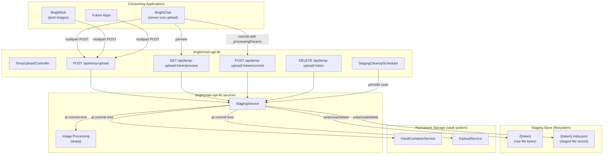

# Design Document: Temporary Upload Staging System

## Overview

This design introduces a filesystem-based temporary upload staging layer that sits between client uploads and the permanent Digital Burnbag vault system. Files are uploaded to a local staging directory, served back for preview via commit-token-based URLs, and only promoted into a vault container when the caller explicitly commits. The staging system is intentionally decoupled from the vault/block layer — staged files never enter the permanent storage pipeline, never get replicated, and never consume Joule credits.

The system is designed as shared infrastructure. BrightChat uses it for server icon uploads (crop → stage → preview → commit with 256×256 PNG processing). BrightHub uses it for post images (inline image → stage → preview URL in editor → commit on publish). Future upload scenarios plug in by calling the same `/api/temp-upload` endpoints with appropriate processing parameters at commit time.

Key design decisions:
- **Filesystem-based storage** with JSON sidecar metadata files — no database dependency, stateless across restarts, multi-instance safe via shared filesystem mount.
- **Processing deferred to commit time** — the same staged file can be committed with different transformations depending on the consuming application.
- **Commit token as bearer credential** — preview endpoints are unauthenticated; the unguessable UUID v4 token is the access control mechanism.
- **Periodic cleanup job** — expired staged files are reaped by a background scheduler following the existing `ExpirationScheduler` pattern.

## Architecture



## Components and Interfaces

### Shared Interfaces (brightchain-lib)

All data-shape interfaces live in `brightchain-lib` so both frontend and backend can consume them. They follow the existing `TId` generic parameter convention.

#### IStagedFileRecord

```typescript
// brightchain-lib/src/lib/interfaces/staging/stagedFileRecord.ts

/**
 * Metadata tracked for each staged file.
 * Persisted as a JSON sidecar file alongside the staged file bytes.
 *
 * TId defaults to string for frontend, GuidV4Buffer for backend.
 */
export interface IStagedFileRecord<TId = string> {
  /** Cryptographically random UUID v4 — acts as both ID and bearer credential */
  commitToken: string;
  /** Original filename from the upload */
  originalFilename: string;
  /** MIME type of the uploaded file */
  mimeType: string;
  /** File size in bytes */
  sizeBytes: number;
  /** ISO 8601 timestamp of when the file was staged */
  uploadedAt: Date | string;
  /** ISO 8601 timestamp of when the staged file expires */
  expiresAt: Date | string;
  /** ID of the user who uploaded the file */
  uploaderId: TId;
}
```

#### ITempUploadResponse

```typescript
// brightchain-lib/src/lib/interfaces/staging/tempUploadResponse.ts

/**
 * Response body returned after a successful staging upload.
 * Contains everything the client needs to preview, commit, or discard.
 */
export interface ITempUploadResponse {
  /** The commit token (UUID v4) for this staged file */
  commitToken: string;
  /** URL to preview the staged file */
  previewUrl: string;
  /** ISO 8601 timestamp when the staged file expires */
  expiresAt: string;
  /** Original filename from the upload */
  originalFilename: string;
  /** MIME type of the uploaded file */
  mimeType: string;
  /** File size in bytes */
  sizeBytes: number;
}
```

#### IProcessingParams

```typescript
// brightchain-lib/src/lib/interfaces/staging/processingParams.ts

/**
 * Optional image transformation parameters supplied at commit time.
 * Processing is deferred to commit so the same staged file can be
 * committed with different transformations.
 */
export interface IProcessingParams {
  /** Target width in pixels */
  width?: number;
  /** Target height in pixels */
  height?: number;
  /** Output format */
  format?: 'png' | 'jpeg' | 'webp';
  /** Whether to strip EXIF/XMP/IPTC metadata */
  stripExif?: boolean;
}
```

#### ICommitRequest

```typescript
// brightchain-lib/src/lib/interfaces/staging/commitRequest.ts

import { VaultVisibility } from '@brightchain/digitalburnbag-lib';
import { IProcessingParams } from './processingParams';

/**
 * Request body for committing a staged file to permanent vault storage.
 * Callers must provide either vaultContainerId or createContainer.
 */
export interface ICommitRequest<TId = string> {
  /** Existing vault container to store the file in */
  vaultContainerId?: TId;
  /** Target folder within the vault container */
  targetFolderId?: TId;
  /** Create a new vault container for this file */
  createContainer?: {
    name: string;
    ownerId: TId;
    visibility?: VaultVisibility;
  };
  /** Optional image processing to apply before storing */
  processingParams?: IProcessingParams;
}
```

#### ICommitResponse

```typescript
// brightchain-lib/src/lib/interfaces/staging/commitResponse.ts

/**
 * Response body returned after a successful commit.
 * Contains the permanent file metadata.
 */
export interface ICommitResponse<TId = string> {
  /** Permanent file ID in the vault system */
  fileId: TId;
  /** Vault container the file was stored in */
  vaultContainerId: TId;
  /** Filename in the vault */
  fileName: string;
  /** MIME type of the stored file (may differ from original if processed) */
  mimeType: string;
  /** Size in bytes of the stored file (may differ from original if processed) */
  sizeBytes: number;
}
```

#### Barrel Export

```typescript
// brightchain-lib/src/lib/interfaces/staging/index.ts
export type * from './stagedFileRecord';
export type * from './tempUploadResponse';
export type * from './processingParams';
export type * from './commitRequest';
export type * from './commitResponse';
```

### Staging Configuration

```typescript
// brightchain-lib/src/lib/interfaces/staging/stagingConfig.ts

/**
 * Configuration for the temporary upload staging system.
 * All values have sensible defaults; override via environment variables
 * or constructor injection.
 */
export interface IStagingConfig {
  /** Filesystem directory for staged files */
  stagingDir: string;
  /** Default TTL in seconds (default: 3600 = 1 hour) */
  defaultTtlSeconds: number;
  /** Maximum TTL in seconds (default: 86400 = 24 hours) */
  maxTtlSeconds: number;
  /** Maximum upload file size in bytes (default: 52428800 = 50MB) */
  maxFileSizeBytes: number;
  /** Cleanup interval in milliseconds (default: 300000 = 5 minutes) */
  cleanupIntervalMs: number;
}

export const DEFAULT_STAGING_CONFIG: IStagingConfig = {
  stagingDir: `${process.cwd()}/tmp/staging`,
  defaultTtlSeconds: 3600,
  maxTtlSeconds: 86400,
  maxFileSizeBytes: 50 * 1024 * 1024,
  cleanupIntervalMs: 5 * 60 * 1000,
};
```

### API Response Interfaces (brightchain-api-lib)

```typescript
// brightchain-api-lib/src/lib/interfaces/responses/stagingResponses.ts

import { Response } from 'express';
import type {
  ITempUploadResponse,
  ICommitResponse,
} from '@brightchain/brightchain-lib';

/**
 * Express response wrapper for the staging upload endpoint.
 */
export interface ITempUploadApiResponse extends Response {
  body: ITempUploadResponse;
}

/**
 * Express response wrapper for the commit endpoint.
 */
export interface ICommitApiResponse extends Response {
  body: ICommitResponse<string>;
}
```

### StagingService (brightchain-api-lib)

The core service handles all staging lifecycle operations. It is a plain class with injected dependencies — no database, no ORM, just filesystem I/O and JSON sidecar files.

```typescript
// brightchain-api-lib/src/lib/services/staging/stagingService.ts

export interface IStagingServiceDeps {
  /** Generate a UUID v4 commit token */
  generateToken: () => string;
  /** Get current time (injectable for testing) */
  now: () => Date;
}

export class StagingService {
  constructor(
    private readonly config: IStagingConfig,
    private readonly deps: IStagingServiceDeps,
  ) {}

  /** Initialize: ensure staging directory exists and is writable */
  async initialize(): Promise<void>;

  /** Stage a file: write bytes + sidecar, return record */
  async stage(
    fileBuffer: Buffer,
    originalFilename: string,
    mimeType: string,
    uploaderId: string,
    ttlSeconds?: number,
  ): Promise<IStagedFileRecord>;

  /** Get a staged file record by commit token */
  async getRecord(commitToken: string): Promise<IStagedFileRecord | null>;

  /** Read staged file bytes */
  async readFile(commitToken: string): Promise<Buffer>;

  /** Delete a staged file and its sidecar */
  async remove(commitToken: string): Promise<void>;

  /** Find all expired records */
  async findExpired(): Promise<IStagedFileRecord[]>;

  /** Check if a record is expired */
  isExpired(record: IStagedFileRecord): boolean;
}
```

**Filesystem layout** (flat, no nesting):
```
$TEMP_UPLOAD_STAGING_DIR/
  {commitToken}              ← raw file bytes
  {commitToken}.meta.json    ← IStagedFileRecord as JSON
```

The flat layout simplifies cleanup (single `readdir` + filter) and avoids directory-nesting complexity. The commit token is a UUID v4, so collisions are not a practical concern.

**Multi-instance safety**: All state lives on the filesystem. Multiple API server instances sharing the same staging directory (e.g., NFS mount, EFS) will see each other's staged files. The sidecar JSON is written atomically (write to temp file, then rename) to prevent partial reads.

### StagingCleanupScheduler (brightchain-api-lib)

Follows the existing `ExpirationScheduler` pattern — extends `EventEmitter`, uses `setInterval`, exposes `start()`/`stop()`/`tick()`.

```typescript
// brightchain-api-lib/src/lib/services/staging/stagingCleanupScheduler.ts

export enum StagingCleanupEvent {
  FILE_CLEANED = 'staging:file_cleaned',
  BATCH_CLEANED = 'staging:batch_cleaned',
  ERROR = 'staging:error',
  STARTED = 'staging:started',
  STOPPED = 'staging:stopped',
}

export class StagingCleanupScheduler extends EventEmitter {
  constructor(
    private readonly stagingService: StagingService,
    private readonly intervalMs: number,
  ) { super(); }

  start(): void;
  stop(): void;
  get isRunning(): boolean;
  async tick(): Promise<number>; // returns count of cleaned files
}
```

Each `tick()`:
1. Calls `stagingService.findExpired()`
2. For each expired record, calls `stagingService.remove(commitToken)`
3. Logs each cleanup (commit token, original filename, age)
4. If a single file deletion fails, logs the error and continues
5. Emits `FILE_CLEANED` per file and `BATCH_CLEANED` at the end

### TempUploadController (brightchain-api-lib)

Follows the `BaseController` pattern with `routeConfig` definitions. Uses `multer` for multipart parsing on the upload endpoint.

```typescript
// brightchain-api-lib/src/lib/controllers/api/tempUploadController.ts

export interface ITempUploadHandlers {
  stage: RequestHandler;
  preview: RequestHandler;
  commit: RequestHandler;
  discard: RequestHandler;
}

export interface ITempUploadControllerDeps {
  stagingService: StagingService;
  vaultContainerService: IVaultContainerService<NodePlatformID>;
  uploadService: IUploadService<NodePlatformID>;
  parseId: (idString: string) => NodePlatformID;
}
```

**Route definitions:**

| Method | Path | Auth | Middleware | Description |
|--------|------|------|-----------|-------------|
| POST | `/` | Required | `multer.single('file')` | Stage a file upload |
| GET | `/:commitToken/preview` | None | — | Serve staged file for preview |
| POST | `/:commitToken/commit` | Required | — | Commit staged file to vault |
| DELETE | `/:commitToken` | Required | — | Discard staged file |

**Multer configuration:**

```typescript
const stagingUpload = multer({
  storage: multer.memoryStorage(),
  limits: { fileSize: config.maxFileSizeBytes },
});
```

No file-type filtering at the multer level — the staging system accepts any file type. Type-specific validation (e.g., "must be an image") happens at commit time when `processingParams` is provided.

### Endpoint Flows

#### POST / — Stage Upload

```
1. Authenticate user (required)
2. multer parses multipart/form-data, extracts file buffer
3. Validate file size ≤ maxFileSizeBytes (multer handles this via limits)
4. Read optional ttlSeconds from request body
5. stagingService.stage(buffer, filename, mimeType, userId, ttlSeconds)
   - Generate UUID v4 commit token
   - Compute expiresAt = now + min(ttlSeconds ?? defaultTtl, maxTtl)
   - Write file bytes to {stagingDir}/{commitToken}
   - Write sidecar JSON to {stagingDir}/{commitToken}.meta.json (atomic)
   - Return IStagedFileRecord
6. Return 201 with ITempUploadResponse:
   { commitToken, previewUrl: `/api/temp-upload/${commitToken}/preview`,
     expiresAt, originalFilename, mimeType, sizeBytes }
```

#### GET /:commitToken/preview — Preview

```
1. No authentication required (commit token is bearer credential)
2. stagingService.getRecord(commitToken)
3. If not found → 404
4. If expired → 410 Gone
5. stagingService.readFile(commitToken)
6. Return file bytes with:
   - Content-Type: {record.mimeType}
   - Cache-Control: private, no-store
   - Content-Disposition: inline; filename="{record.originalFilename}"
```

#### POST /:commitToken/commit — Commit

```
1. Authenticate user (required)
2. stagingService.getRecord(commitToken)
3. If not found → 404
4. If expired → 410 Gone
5. If req.user.id !== record.uploaderId → 403 Forbidden
6. Read staged file bytes
7. If processingParams provided:
   a. Validate staged file is a supported image type, else → 422
   b. Apply sharp transformations (resize, format convert, EXIF strip)
   c. Update mimeType and sizeBytes to reflect processed output
8. Determine target vault container:
   a. If createContainer provided → create via IVaultContainerService
   b. Else use provided vaultContainerId
9. Upload processed/original bytes to vault via IUploadService pipeline
   (createSession → receiveChunk → finalize)
10. stagingService.remove(commitToken)
11. Return 200 with ICommitResponse:
    { fileId, vaultContainerId, fileName, mimeType, sizeBytes }
```

#### DELETE /:commitToken — Discard

```
1. Authenticate user (required)
2. stagingService.getRecord(commitToken)
3. If not found → 404
4. If req.user.id !== record.uploaderId → 403 Forbidden
5. stagingService.remove(commitToken)
6. Return 204 No Content
```

### Image Processing at Commit Time

The commit endpoint reuses the existing `sharp` dependency (already in `brightchain-api-lib`) for image processing. Processing is a thin wrapper:

```typescript
// brightchain-api-lib/src/lib/utils/stagingImageProcessor.ts

import sharp from 'sharp';
import { IProcessingParams } from '@brightchain/brightchain-lib';

const SUPPORTED_IMAGE_TYPES = [
  'image/png', 'image/jpeg', 'image/gif', 'image/webp',
];

export function isSupportedImageType(mimeType: string): boolean {
  return SUPPORTED_IMAGE_TYPES.includes(mimeType);
}

export async function processImage(
  buffer: Buffer,
  params: IProcessingParams,
): Promise<{ buffer: Buffer; mimeType: string }> {
  let pipeline = sharp(buffer);

  if (params.width || params.height) {
    pipeline = pipeline.resize(params.width, params.height, {
      fit: 'cover',
      position: 'centre',
    });
  }

  const format = params.format ?? 'png';
  switch (format) {
    case 'png':
      pipeline = pipeline.png({ quality: 90 });
      break;
    case 'jpeg':
      pipeline = pipeline.jpeg({ quality: 85 });
      break;
    case 'webp':
      pipeline = pipeline.webp({ quality: 85 });
      break;
  }

  // sharp strips EXIF by default; this is explicit for clarity
  if (params.stripExif !== false) {
    pipeline = pipeline.rotate(); // auto-rotate based on EXIF, then strip
  }

  const outputBuffer = await pipeline.toBuffer();
  return {
    buffer: outputBuffer,
    mimeType: `image/${format}`,
  };
}
```

### Route Registration

The `TempUploadController` is mounted at `/api/temp-upload` in the Express app router, following the same pattern as other controllers:

```typescript
// In the API router setup
app.use('/api/temp-upload', tempUploadController.router);
```

## Data Models

### Staged File Record (JSON sidecar)

| Field | Type | Description |
|-------|------|-------------|
| commitToken | string | UUID v4 — identifier and bearer credential |
| originalFilename | string | Original filename from the upload |
| mimeType | string | MIME type of the uploaded file |
| sizeBytes | number | File size in bytes |
| uploadedAt | string | ISO 8601 upload timestamp |
| expiresAt | string | ISO 8601 expiry timestamp |
| uploaderId | string | ID of the user who uploaded |

### Filesystem Layout

```
$TEMP_UPLOAD_STAGING_DIR/
├── a1b2c3d4-e5f6-7890-abcd-ef1234567890           ← raw file bytes
├── a1b2c3d4-e5f6-7890-abcd-ef1234567890.meta.json ← sidecar metadata
├── f9e8d7c6-b5a4-3210-fedc-ba0987654321
├── f9e8d7c6-b5a4-3210-fedc-ba0987654321.meta.json
└── ...
```

### Configuration (Environment Variables)

| Variable | Default | Description |
|----------|---------|-------------|
| `TEMP_UPLOAD_STAGING_DIR` | `{cwd}/tmp/staging` | Staging directory path |
| `TEMP_UPLOAD_DEFAULT_TTL` | `3600` | Default TTL in seconds |
| `TEMP_UPLOAD_MAX_TTL` | `86400` | Maximum TTL in seconds |
| `TEMP_UPLOAD_MAX_FILE_SIZE` | `52428800` | Maximum file size in bytes |
| `TEMP_UPLOAD_CLEANUP_INTERVAL` | `300000` | Cleanup interval in ms |


## Correctness Properties

*A property is a characteristic or behavior that should hold true across all valid executions of a system — essentially, a formal statement about what the system should do. Properties serve as the bridge between human-readable specifications and machine-verifiable correctness guarantees.*

### Property 1: Staging round-trip preserves file data and metadata

*For any* valid file buffer, original filename, MIME type, and uploader ID, staging the file SHALL produce a `IStagedFileRecord` where: the `commitToken` is a valid UUID v4, `originalFilename` matches the input, `mimeType` matches the input, `sizeBytes` equals the buffer length, `uploaderId` matches the input, and both the raw file and the `.meta.json` sidecar exist in the staging directory with the commit token as the filename.

**Validates: Requirements 1.1, 1.2, 1.7, 1.10, 7.4, 7.5**

### Property 2: Preview URL derived from commit token

*For any* staged file, the preview URL in the response SHALL equal `/api/temp-upload/${commitToken}/preview` where `commitToken` is the UUID v4 returned by the staging operation.

**Validates: Requirements 1.3, 2.6**

### Property 3: Preview returns original staged bytes

*For any* staged file that has not expired, reading the file via the preview flow SHALL return a byte buffer identical to the original uploaded buffer, with `Content-Type` matching the original MIME type.

**Validates: Requirements 2.1**

### Property 4: TTL is capped at the configured maximum

*For any* requested TTL value (including values above, below, and equal to the maximum), the effective TTL applied to the staged file SHALL equal `min(requestedTtl, maxTtlSeconds)`. When no TTL is provided, the effective TTL SHALL equal `defaultTtlSeconds`. The `expiresAt` timestamp SHALL equal `uploadedAt + effectiveTtl` in all cases.

**Validates: Requirements 1.5, 1.6**

### Property 5: File size boundary validation

*For any* file size value, the staging system SHALL accept the upload if and only if the size is less than or equal to `maxFileSizeBytes`. Files exceeding this limit SHALL be rejected.

**Validates: Requirements 1.8**

### Property 6: Owner-only authorization for commit and discard

*For any* staged file and any requesting user, commit and discard operations SHALL succeed if and only if the requesting user's ID matches the `uploaderId` recorded in the staged file record. When the IDs do not match, the system SHALL return 403 Forbidden.

**Validates: Requirements 3.9, 3.10, 4.4, 4.5**

### Property 7: Commit promotes file to vault and cleans up staging

*For any* staged file that has not expired, committing it with a valid vault target SHALL: (a) pass the file bytes to the vault upload pipeline, (b) delete the staged file from the staging directory, (c) delete the sidecar metadata file, and (d) return an `ICommitResponse` with non-empty `fileId` and `vaultContainerId`.

**Validates: Requirements 3.1, 3.5, 3.6**

### Property 8: Image processing produces correct output

*For any* valid image buffer and any `IProcessingParams` specifying width, height, format, and/or stripExif, the processed output SHALL have dimensions matching the requested width and height (when specified), format matching the requested format, and no EXIF/XMP/IPTC metadata when `stripExif` is true.

**Validates: Requirements 6.1, 6.2, 6.3**

### Property 9: Processing rejected for non-image MIME types

*For any* staged file whose MIME type is not in `['image/png', 'image/jpeg', 'image/gif', 'image/webp']`, committing with `processingParams` SHALL be rejected with a 422 Unprocessable Entity response.

**Validates: Requirements 6.4**

### Property 10: Discard removes staged file and sidecar

*For any* staged file, discarding it SHALL remove both the raw file and the `.meta.json` sidecar from the staging directory. After discard, `getRecord(commitToken)` SHALL return null.

**Validates: Requirements 4.1**

### Property 11: Cleanup removes exactly the expired files

*For any* set of staged files with various expiry timestamps, given a fixed current time, the cleanup job SHALL remove exactly those files where `expiresAt` is in the past and SHALL leave all non-expired files untouched.

**Validates: Requirements 5.1, 5.2**

### Property 12: Cleanup continues on individual file deletion failure

*For any* set of expired staged files where one or more individual deletions fail, the cleanup job SHALL continue processing the remaining files and SHALL successfully delete all files that do not have deletion errors.

**Validates: Requirements 5.5**

## Error Handling

### HTTP Error Responses

| Error Condition | HTTP Status | Error Code | Description |
|----------------|-------------|------------|-------------|
| File too large | 413 | `PAYLOAD_TOO_LARGE` | Upload exceeds `maxFileSizeBytes` |
| Unauthenticated request (stage/commit/discard) | 401 | `UNAUTHORIZED` | Missing or invalid auth token |
| User doesn't match uploader | 403 | `FORBIDDEN` | Requesting user ≠ original uploader |
| Unknown commit token | 404 | `NOT_FOUND` | No staged file record for token |
| Staged file expired | 410 | `GONE` | File past TTL expiry |
| Processing on non-image | 422 | `UNPROCESSABLE_ENTITY` | `processingParams` on non-image file |
| Image processing failed | 422 | `UNPROCESSABLE_ENTITY` | Corrupt image data or sharp failure |
| Vault creation failed | 500 | `INTERNAL_ERROR` | IVaultContainerService error during commit |
| Upload pipeline failed | 500 | `INTERNAL_ERROR` | IUploadService error during commit |
| Staging directory not writable | 500 | `INTERNAL_ERROR` | Filesystem permission error |

All error responses follow the existing `StandardErrorResponse` format from `brightchain-api-lib/src/lib/utils/errorResponse.ts`:

```typescript
{
  success: false,
  error: {
    code: string,
    message: string,
  }
}
```

### Filesystem Error Handling

- **Atomic sidecar writes**: The sidecar JSON is written to a temporary file first, then renamed to the final path. This prevents partial reads by other instances or the cleanup job.
- **Missing file on read**: If the raw file is missing but the sidecar exists (e.g., manual deletion), the service treats it as not found and cleans up the orphaned sidecar.
- **Missing sidecar on read**: If the sidecar is missing but the raw file exists, the service treats it as not found. The cleanup job will eventually remove the orphaned raw file.
- **Cleanup resilience**: Individual file deletion failures are logged and do not abort the cleanup batch. The next cleanup cycle will retry.

### Commit Failure Handling

- If image processing fails, the staged file is **not** deleted — the user can retry with different parameters or discard.
- If vault container creation fails, the staged file is **not** deleted — the user can retry.
- If the vault upload pipeline fails after processing, the staged file is **not** deleted — the user can retry.
- The staged file is only deleted after the entire commit flow succeeds.

## Testing Strategy

### Property-Based Testing

**Library**: `fast-check` (already used in the workspace — see `imageProcessing.property.spec.ts`)

**Configuration**: Minimum 100 iterations per property test. Each test tagged with:
```
Feature: temp-upload-staging, Property {number}: {property_text}
```

**Property tests target:**
- `StagingService.stage()` round-trip (Property 1)
- Preview URL derivation (Property 2)
- Stage → read round-trip (Property 3)
- TTL capping logic (Property 4)
- File size boundary validation (Property 5)
- Owner-only authorization (Property 6)
- Commit flow with mocked vault services (Property 7)
- `processImage()` output correctness (Property 8)
- Non-image processing rejection (Property 9)
- Discard cleanup (Property 10)
- Cleanup expiry identification (Property 11)
- Cleanup resilience (Property 12)

### Unit Tests

Unit tests cover specific examples, edge cases, and integration points:

- **StagingService**: initialization creates directory, stage/read/remove lifecycle, getRecord returns null for unknown token, isExpired boundary (exactly at expiry time)
- **StagingCleanupScheduler**: start/stop lifecycle, tick with no expired files, tick with mixed expired/valid files, error event emission
- **TempUploadController**: each endpoint's happy path and error paths (404, 410, 403, 413, 422), multer integration for multipart parsing
- **processImage()**: specific dimension/format combinations, corrupt input handling
- **isSupportedImageType()**: each supported type, common non-image types

### Integration Tests

- Full staging lifecycle: upload → preview → commit → verify vault entry
- Full staging lifecycle: upload → preview → discard → verify cleanup
- Expiry flow: upload with short TTL → wait → verify 410 on preview
- Multi-file cleanup: stage multiple files with different TTLs → run cleanup → verify correct files removed

### Test Organization

```
brightchain-lib/src/lib/interfaces/staging/__tests__/
  stagingInterfaces.spec.ts              — Interface type validation tests

brightchain-api-lib/src/lib/services/staging/__tests__/
  stagingService.spec.ts                 — StagingService unit tests
  stagingService.property.spec.ts        — Properties 1-6, 10-12
  stagingCleanupScheduler.spec.ts        — Cleanup scheduler unit tests

brightchain-api-lib/src/lib/controllers/api/__tests__/
  tempUploadController.spec.ts           — Controller handler unit tests
  tempUploadController.integration.spec.ts — Full lifecycle integration tests

brightchain-api-lib/src/lib/utils/__tests__/
  stagingImageProcessor.spec.ts          — Image processing unit tests
  stagingImageProcessor.property.spec.ts — Properties 8-9
```
