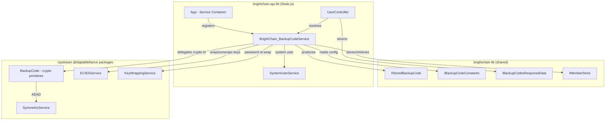
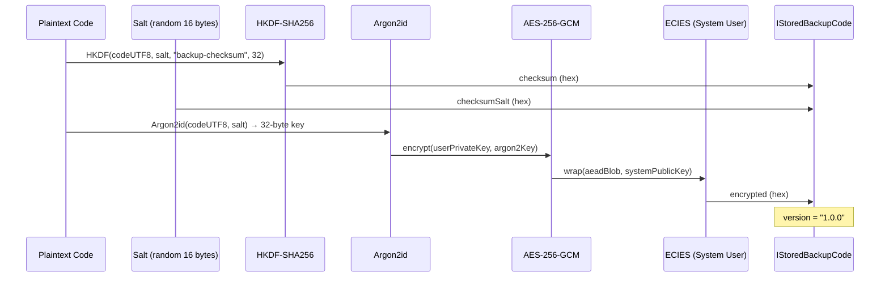
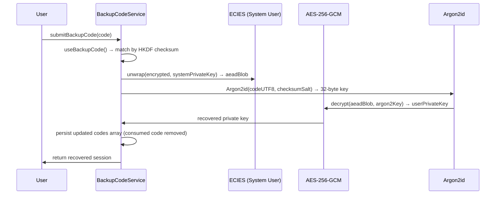

# Design Document: Upstream Backup Codes

## Overview

This design ports the cryptographic backup code scheme from the upstream `@digitaldefiance/node-express-suite` `BackupCode` class and `BackupCodeService` into a BrightChain-native implementation. The upstream scheme uses a multi-layer cryptographic pipeline:

1. **Code Generation**: 32 lowercase alphanumeric characters displayed as 8 groups of 4 (`xxxx-xxxx-xxxx-xxxx-xxxx-xxxx-xxxx-xxxx`)
2. **Checksum**: HKDF-SHA256 with a per-code random salt and info string `"backup-checksum"` → 32-byte tag for constant-time validation
3. **KDF**: Argon2id (timeCost=3, memoryCost=64MiB, parallelism=1) derives a 32-byte AES key from the UTF-8 code bytes
4. **AEAD Encryption**: AES-256-GCM encrypts the user's ECIES private key using the Argon2id-derived key
5. **ECIES Wrapping**: The AEAD ciphertext blob is wrapped with the System User's ECIES public key

The existing local `BackupCodeService` uses a simplified bcrypt-hash-and-compare scheme that cannot recover the user's private key. This port replaces it with the full upstream scheme, enabling backup-code-based key recovery.

The key architectural change is replacing all MongoDB/Mongoose storage interactions with `MemberStore` and BrightDB block storage, while preserving the cryptographic scheme exactly.

## Architecture



### Design Decisions

1. **Delegate to upstream `BackupCode` static methods**: Rather than re-implementing the cryptographic primitives (Argon2id KDF, HKDF-SHA256, AEAD encryption, ECIES wrapping), the `BrightChain_BackupCodeService` delegates to the existing `BackupCode.encryptBackupCodes()`, `BackupCode.validateBackupCode()`, `BackupCode.getBackupKeyV1()`, and `BackupCode.hkdfSha256()` static methods. This ensures cryptographic correctness and avoids divergence.

2. **`IStoredBackupCode` mirrors `IBackupCode`**: The `IStoredBackupCode` interface in `brightchain-lib` is redefined to match the upstream `IBackupCode` shape (`{ version, checksumSalt, checksum, encrypted }`). This eliminates the need for a mapping layer between storage and crypto operations. The `IBackupCode` type from `@digitaldefiance/suite-core-lib` is structurally identical, so the two are interchangeable.

3. **Consumption removes entries instead of marking `used`**: The upstream scheme removes consumed codes from the array (filter by checksum). The old local scheme marked codes as `used: true`. The new approach is simpler and reduces storage size over time.

4. **MemberStore as the sole persistence layer**: All backup code data is stored in the member's private profile (`IPrivateMemberData.backupCodes`) via `MemberStore.updateMember()`. No MongoDB collections are involved.

5. **System User via `SystemUserService`**: The `BrightChain_BackupCodeService` obtains the System User `BackendMember` lazily from `SystemUserService.getSystemUser()`, matching the upstream pattern. A `setSystemUser()` escape hatch is provided for database initialization scenarios.

## Components and Interfaces

### IStoredBackupCode (brightchain-lib) — Updated

```typescript
/**
 * A single stored backup code entry.
 * Matches the upstream IBackupCode shape from @digitaldefiance/suite-core-lib.
 * The plaintext code is never persisted — only its encrypted form.
 */
export interface IStoredBackupCode {
  /** Backup code scheme version (e.g. "1.0.0") */
  version: string;
  /** Hex-encoded random salt used for HKDF-SHA256 checksum and Argon2id KDF */
  checksumSalt: string;
  /** Hex-encoded HKDF-SHA256 checksum for constant-time validation */
  checksum: string;
  /** Hex-encoded ECIES-wrapped AEAD ciphertext of the user's private key */
  encrypted: string;
}
```

### BrightChain_BackupCodeService (brightchain-api-lib)

```typescript
import { IStoredBackupCode, MemberStore, IBackupCodeConstants } from '@brightchain/brightchain-lib';
import { Member as BackendMember, ECIESService, PlatformID } from '@digitaldefiance/node-ecies-lib';
import { BackupCode } from '@digitaldefiance/node-express-suite';
import { KeyWrappingService } from '@digitaldefiance/node-express-suite';

export class BrightChainBackupCodeService<TID extends PlatformID = Uint8Array> {
  private readonly memberStore: MemberStore<TID>;
  private readonly eciesService: ECIESService<TID>;
  private readonly keyWrappingService: KeyWrappingService;
  private readonly backupCodeConstants: IBackupCodeConstants;
  private systemUser?: BackendMember<TID>;

  constructor(
    memberStore: MemberStore<TID>,
    eciesService: ECIESService<TID>,
    keyWrappingService: KeyWrappingService,
    backupCodeConstants: IBackupCodeConstants,
  );

  /** Lazily resolve or forcibly set the system user. */
  setSystemUser(user: BackendMember<TID>): void;
  private getSystemUser(): BackendMember<TID>;

  /** Generate N plaintext codes, encrypt them, persist to member profile, return plaintexts. */
  async generateCodes(memberId: TID): Promise<string[]>;

  /** Return the count of stored backup codes for a member. */
  async getCodeCount(memberId: TID): Promise<number>;

  /** Validate and consume a backup code. Returns updated array and matched entry. */
  useBackupCode(
    encryptedBackupCodes: IStoredBackupCode[],
    backupCode: string,
  ): { newCodesArray: IStoredBackupCode[]; code: IStoredBackupCode };

  /** Recover the user's private key from a consumed backup code entry. */
  async recoverKeyWithBackupCode(
    memberId: TID,
    backupCode: string,
    newPassword?: string,
  ): Promise<{ user: BackendMember<TID>; codeCount: number }>;

  /** Clear existing codes and generate a fresh set. */
  async regenerateCodes(memberId: TID): Promise<string[]>;

  /** Re-wrap all users' backup codes with a new system key (key rotation). */
  async rewrapAllUsersBackupCodes(
    oldSystem: BackendMember,
    newSystem: BackendMember,
  ): Promise<number>;
}
```

### UserController Endpoints (brightchain-api-lib)

| Method | Path | Auth | Description |
|--------|------|------|-------------|
| POST | `/api/user/backup-codes` | Yes | Generate (or regenerate) backup codes |
| GET | `/api/user/backup-codes` | Yes | Get remaining backup code count |
| POST | `/api/user/recover-backup` | Yes/No | Recover account with a backup code |

### IBrightChainUserInitEntry Update

The `backupCodes` field type changes from `IBackupCode[]` (imported from `@digitaldefiance/suite-core-lib`) to `IStoredBackupCode[]` (from `@brightchain/brightchain-lib`). Since the shapes are structurally identical, this is a type-only change with no runtime impact.

## Data Models

### IStoredBackupCode (new shape)

| Field | Type | Description |
|-------|------|-------------|
| `version` | `string` | Scheme version, e.g. `"1.0.0"` |
| `checksumSalt` | `string` | Hex-encoded random salt (16 bytes = 32 hex chars) |
| `checksum` | `string` | Hex-encoded HKDF-SHA256 tag (32 bytes = 64 hex chars) |
| `encrypted` | `string` | Hex-encoded ECIES-wrapped AEAD blob |

### Storage Location

Backup codes are stored in the member's private profile:

```
MemberStore → getMemberProfile(memberId) → privateProfile.backupCodes: IStoredBackupCode[]
MemberStore → updateMember(memberId, { privateChanges: { backupCodes } })
```

### Cryptographic Flow (per backup code)



### Recovery Flow




## Correctness Properties

*A property is a characteristic or behavior that should hold true across all valid executions of a system — essentially, a formal statement about what the system should do. Properties serve as the bridge between human-readable specifications and machine-verifiable correctness guarantees.*

### Property 1: Generation invariant

*For any* configured `IBackupCodeConstants.Count` value and any member, calling `generateCodes(memberId)` should return exactly `Count` distinct plaintext strings, each matching `IBackupCodeConstants.DisplayRegex`, and immediately calling `getCodeCount(memberId)` should return `Count`.

**Validates: Requirements 2.1, 3.1, 3.2, 4.6, 5.2**

### Property 2: Encrypt-then-validate round-trip

*For any* generated backup code and its corresponding `IStoredBackupCode[]` array, calling `BackupCode.validateBackupCode(storedCodes, plaintextCode)` with the original plaintext should return `true`. Conversely, *for any* random string that is not in the generated set, validation should return `false`.

**Validates: Requirements 2.3, 2.9**

### Property 3: Consumption removes exactly one code

*For any* `IStoredBackupCode[]` array of length N and any valid plaintext code from that set, calling `useBackupCode(storedCodes, code)` should return a `newCodesArray` of length N-1, and the consumed code's checksum should not appear in the new array. Subsequently, `getCodeCount` should return N-1.

**Validates: Requirements 2.4, 5.2, 6.2, 6.4**

### Property 4: Encrypt-then-recover round-trip

*For any* member with a known private key and any of their generated backup codes, encrypting the backup codes and then calling `recoverKeyWithBackupCode` with the original plaintext should produce a private key equal to the member's original private key.

**Validates: Requirements 2.5, 2.10, 6.3**

### Property 5: Regeneration invalidates old codes

*For any* member with existing backup codes, calling `regenerateCodes(memberId)` should return `Count` new distinct plaintext codes, and every previously-generated plaintext code should fail validation against the new stored codes. The new `getCodeCount` should equal `Count`.

**Validates: Requirements 7.1, 7.2, 7.4**

### Property 6: Key rotation preserves recoverability

*For any* member with backup codes encrypted under an old system key, after re-wrapping all codes with a new system key via `rewrapAllUsersBackupCodes`, every previously-valid plaintext code should still validate against the re-wrapped stored codes, and recovery should still produce the member's original private key.

**Validates: Requirements 9.1, 9.3, 9.5**

## Error Handling

| Scenario | Error Type | HTTP Status | Description |
|----------|-----------|-------------|-------------|
| System user not available | `Error('System user not available')` | 500 | Thrown when backup code operations are attempted before the system user is initialized |
| Invalid backup code format | `InvalidBackupCodeError` (from suite-core-lib) | 401 | Thrown when the submitted code doesn't match `NormalizedHexRegex` |
| No matching backup code | `InvalidBackupCodeError` | 401 | Thrown when no stored code's checksum matches the submitted code |
| Unsupported backup code version | `InvalidBackupCodeVersionError` | 500 | Thrown when stored codes have an unrecognized version string |
| AEAD decryption failure | `Error` (from SymmetricService) | 500 | Thrown when the Argon2id-derived key doesn't decrypt the AEAD blob (corrupted data) |
| ECIES unwrap failure | `Error` (from ECIES) | 500 | Thrown when the system user's private key can't unwrap the ECIES layer |
| Member not found | `Error('Member not found')` | 500 | Thrown when `MemberStore.getMemberProfile()` fails |
| Re-wrap failure for individual user | Logged, continues | N/A | During key rotation, per-user failures are logged and processing continues |

### Error Propagation Strategy

- **Service layer**: Throws typed errors (`InvalidBackupCodeError`, `InvalidBackupCodeVersionError`) that the controller can map to HTTP status codes.
- **Controller layer**: Catches service errors and maps them to appropriate HTTP responses (401 for invalid codes, 500 for internal failures).
- **Key rotation**: Uses a try/catch per user with logging, so one user's failure doesn't abort the entire rotation batch.

## Testing Strategy

### Property-Based Testing

- **Library**: `fast-check` (already used in the existing test suite)
- **Minimum iterations**: 100 per property test
- **Tag format**: `Feature: upstream-backup-codes, Property {number}: {title}`

Each of the 6 correctness properties above maps to exactly one `fast-check` `asyncProperty` test. The tests will:

1. Create isolated in-memory `MemberStore` + `MemoryBlockStore` instances per run
2. Create a test member with real ECIES key material
3. Create a system user `BackendMember` for ECIES wrapping
4. Instantiate `BrightChainBackupCodeService` with the test dependencies
5. Exercise the property under test with randomly generated inputs (usernames, emails, code indices)

### Unit Tests

Unit tests complement property tests for specific examples and edge cases:

- **System user not available**: Verify that operations throw before system user is set
- **Empty backup codes array**: Verify `getCodeCount` returns 0
- **Invalid code format**: Verify validation rejects malformed strings
- **Double consumption**: Verify a code can only be consumed once
- **Controller HTTP responses**: Verify correct status codes for success and error paths

### Test File Location

- Property tests: `brightchain-api-lib/src/__tests__/services/backupCodeService.property.spec.ts` (updated/replaced)
- Unit tests: `brightchain-api-lib/src/__tests__/services/backupCodeService.spec.ts`
- E2E tests: `brightchain-api-e2e/src/brightchain-api/user-management.e2e.spec.ts` (updated)

### Property Test Configuration

Each property test must:
- Run a minimum of 100 iterations (`{ numRuns: 100 }`)
- Reference the design property in a comment tag
- Use `fc.asyncProperty` since crypto operations are async
- Set a generous timeout (600s) due to Argon2id cost per iteration
