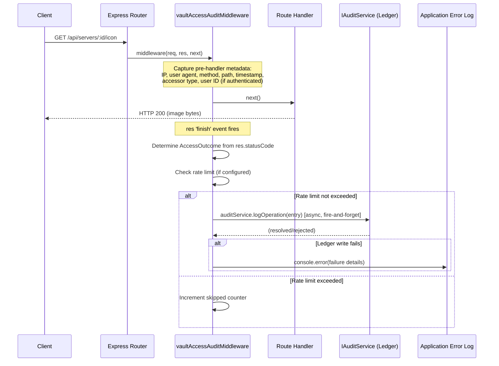
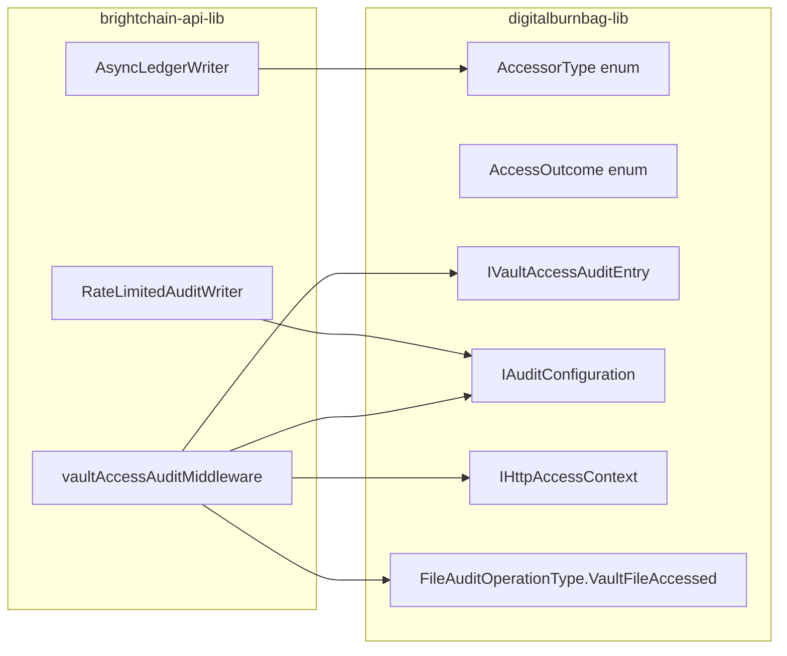

# Design Document: Vault Access Audit Logging

## Overview

This feature adds systematic audit logging for every vault file access across the BrightChain platform by introducing an Express middleware (`vaultAccessAuditMiddleware`) and supporting types. The middleware intercepts HTTP requests to vault-serving endpoints, captures request metadata before the handler runs, determines the access outcome from the response status code after the handler completes, and writes an immutable audit entry to the Digital Burnbag append-only ledger — all without blocking the HTTP response.

### Design Goals

1. **Non-blocking**: Ledger writes happen asynchronously after `res.finish`, adding ≤5ms synchronous overhead to the request path.
2. **Reusable**: A single middleware factory configurable per-route, applicable to any Express route that serves vault file content.
3. **Consistent**: Both authenticated and anonymous accesses produce structurally identical audit entries, differing only in accessor type and actor ID.
4. **Fail-safe**: Audit write failures are logged to the application error log and never interrupt the HTTP response.
5. **Rate-aware**: Optional per-route rate limiting prevents ledger flooding on high-traffic public endpoints (e.g., server icon CDN cache misses).

### Key Design Decisions

| Decision | Rationale |
|---|---|
| Extend existing `IAccessContext` rather than create a new interface | The existing `IAccessContext` already carries `ipAddress` and `timestamp`; extending it with HTTP metadata keeps the type hierarchy flat and reusable by ACL evaluation. |
| Add new `FileAuditOperationType.VaultFileAccessed` enum value | Distinguishes HTTP-level access audit entries from the existing `FileDownloaded` entries written by the service layer, enabling independent querying. |
| Use `res.on('finish', ...)` for outcome capture | Express 5 fires `finish` after the response is fully written; this is the earliest reliable point to read `res.statusCode` without monkey-patching `res.send`. |
| Place rate limiter state in-memory (Map) | Rate limiting is best-effort and per-process; no shared state needed. Process restarts naturally reset counters. |
| Define `AccessorType` and `AccessOutcome` as string enums in `digitalburnbag-lib` | These are domain concepts shared across frontend audit viewers and backend middleware, matching the existing pattern for `VaultVisibility`, `VaultContainerState`, etc. |

## Architecture



### Package Placement



## Components and Interfaces

### 1. New Enumerations (digitalburnbag-lib)

#### AccessorType

```typescript
// digitalburnbag-lib/src/lib/enumerations/accessor-type.ts
export enum AccessorType {
  Authenticated = 'authenticated',
  Anonymous = 'anonymous',
}
```

#### AccessOutcome

```typescript
// digitalburnbag-lib/src/lib/enumerations/access-outcome.ts
export enum AccessOutcome {
  Success = 'success',
  Denied = 'denied',
  NotFound = 'not_found',
  Error = 'error',
}
```

#### FileAuditOperationType Extension

```typescript
// Add to existing enum in digitalburnbag-lib/src/lib/enumerations/file-audit-operation-type.ts
export enum FileAuditOperationType {
  // ... existing values ...
  /** HTTP-level vault file access (middleware-generated) */
  VaultFileAccessed = 'vault_file_accessed',
}
```

### 2. Extended Access Context (digitalburnbag-lib)

Extends the existing `IAccessContext` with HTTP request metadata:

```typescript
// digitalburnbag-lib/src/lib/interfaces/params/http-access-context.ts
import { IAccessContext } from './access-context';

/**
 * Extended access context capturing HTTP request metadata.
 * Used by the vault access audit middleware to record full request details.
 */
export interface IHttpAccessContext extends IAccessContext {
  /** HTTP method (GET, POST, etc.) */
  httpMethod: string;
  /** Request endpoint path (e.g., /api/servers/:serverId/icon) */
  endpointPath: string;
  /** User-Agent header value */
  userAgent: string;
}
```

### 3. Vault Access Audit Entry (digitalburnbag-lib)

```typescript
// digitalburnbag-lib/src/lib/interfaces/bases/vault-access-audit-entry.ts
import { PlatformID } from '@digitaldefiance/ecies-lib';
import { AccessOutcome } from '../../enumerations/access-outcome';
import { AccessorType } from '../../enumerations/accessor-type';

/**
 * Metadata shape for a vault file access audit entry.
 * Stored in the IAuditEntryBase.metadata field.
 *
 * This is NOT a new base interface — it defines the metadata contract
 * for audit entries with operationType = VaultFileAccessed.
 */
export interface IVaultAccessAuditMetadata {
  /** Classification of the accessor */
  accessorType: AccessorType;
  /** Result of the access attempt */
  accessOutcome: AccessOutcome;
  /** HTTP method */
  httpMethod: string;
  /** Request endpoint path */
  endpointPath: string;
  /** User-Agent header */
  userAgent: string;
  /** Vault container ID (string-serialized for metadata) */
  vaultContainerId?: string;
  /** File ID (string-serialized for metadata) */
  fileId?: string;
  /** Whether this access broke a vault seal */
  sealBroken?: boolean;
  /** Share link ID if accessed via share link */
  shareLinkId?: string;
  /** Number of skipped entries due to rate limiting (on the next written entry) */
  skippedEntries?: number;
}
```

### 4. Audit Configuration (digitalburnbag-lib)

```typescript
// digitalburnbag-lib/src/lib/interfaces/params/audit-configuration.ts

/**
 * Per-route audit configuration passed to the middleware factory.
 */
export interface IRouteAuditConfig {
  /** Whether audit logging is enabled for this route. Defaults to true. */
  enabled?: boolean;
  /** When true, only log failed accesses (denied, not_found, error). Defaults to false. */
  failuresOnly?: boolean;
  /**
   * Optional rate limit. When set, limits the number of audit entries
   * written per time window for this route.
   */
  rateLimit?: {
    /** Maximum entries per window */
    maxEntries: number;
    /** Window duration in milliseconds */
    windowMs: number;
  };
}

/**
 * Global audit configuration.
 */
export interface IGlobalAuditConfig {
  /** Master switch: when false, all audit logging is disabled regardless of per-route settings. */
  enabled: boolean;
}
```

### 5. Vault Access Audit Middleware (brightchain-api-lib)

```typescript
// brightchain-api-lib/src/lib/middlewares/vault-access-audit.ts

import { Request, Response, NextFunction } from 'express';
import { AccessOutcome, AccessorType, IGlobalAuditConfig,
         IRouteAuditConfig, IVaultAccessAuditMetadata,
         FileAuditOperationType } from '@brightchain/digitalburnbag-lib';
import { IAuditService } from '@brightchain/digitalburnbag-lib';
import { PlatformID } from '@digitaldefiance/ecies-lib';
import { IAuthenticatedRequest } from './authentication';

/** Sentinel value for anonymous actor IDs */
export const ANONYMOUS_ACTOR_SENTINEL = '00000000-0000-0000-0000-000000000000';

/**
 * Dependencies injected into the middleware factory.
 */
export interface IVaultAccessAuditDeps<TID extends PlatformID> {
  auditService: IAuditService<TID>;
  globalConfig: IGlobalAuditConfig;
  /** Convert a string ID to the platform ID type */
  parseId: (id: string) => TID;
  /** Application error logger */
  logger: { error: (message: string, ...args: unknown[]) => void };
}

/**
 * Optional context that route handlers can attach to the request
 * to provide file-specific audit metadata (file ID, vault container ID,
 * seal break status, share link ID).
 */
export interface IVaultAuditContext {
  fileId?: string;
  vaultContainerId?: string;
  sealBroken?: boolean;
  shareLinkId?: string;
}

/**
 * Factory function that creates the vault access audit middleware.
 *
 * Usage:
 *   const auditMw = createVaultAccessAuditMiddleware(deps);
 *   router.get('/icon', auditMw({ failuresOnly: false }), handleServeIcon);
 */
export function createVaultAccessAuditMiddleware<TID extends PlatformID>(
  deps: IVaultAccessAuditDeps<TID>,
): (routeConfig?: IRouteAuditConfig) => (req: Request, res: Response, next: NextFunction) => void;
```

### 6. Rate Limiter (brightchain-api-lib)

```typescript
// brightchain-api-lib/src/lib/middlewares/audit-rate-limiter.ts

/**
 * In-memory sliding-window rate limiter for audit writes.
 * Keyed by route path. Returns whether the write should proceed
 * and tracks skipped entry counts.
 */
export class AuditRateLimiter {
  /** Check if a write is allowed for the given route key. */
  tryAcquire(routeKey: string, maxEntries: number, windowMs: number): boolean;

  /** Get and reset the skipped count for a route key. */
  getAndResetSkipped(routeKey: string): number;
}
```

### 7. Access Outcome Mapper (brightchain-api-lib)

A pure function that maps HTTP status codes to `AccessOutcome` values:

```typescript
/**
 * Maps an HTTP response status code to an AccessOutcome.
 *
 * - 2xx → Success
 * - 403 → Denied
 * - 404 → NotFound
 * - 5xx → Error
 * - All others → Error (conservative default)
 */
export function mapStatusToOutcome(statusCode: number): AccessOutcome;
```

## Data Models

### Audit Entry Structure (on Ledger)

Each vault access audit entry is stored as a standard `IAuditEntryBase<TID>` with the following field mapping:

| IAuditEntryBase Field | Value |
|---|---|
| `sequenceNumber` | Auto-assigned by `IAuditRepository.getNextSequenceNumber()` |
| `operationType` | `FileAuditOperationType.VaultFileAccessed` |
| `actorId` | Authenticated user ID, or `ANONYMOUS_ACTOR_SENTINEL` parsed to TID |
| `targetId` | File ID if known, otherwise vault container ID, otherwise sentinel |
| `targetType` | `'file'` |
| `timestamp` | ISO 8601 UTC string (set by `AuditService.logOperation`) |
| `ipAddress` | `req.ip` as-is (IPv4 or IPv6) |
| `metadata` | `IVaultAccessAuditMetadata` object (see above) |
| `isDuress` | `undefined` (not applicable for HTTP access) |
| `isRubberStamped` | `undefined` (not applicable for HTTP access) |
| `ledgerEntryHash` | Computed by ledger during `recordOnLedger` |

### IAuditEntryParams Mapping

The middleware constructs an `IAuditEntryParams<TID>` to pass to `auditService.logOperation()`:

```typescript
{
  operationType: FileAuditOperationType.VaultFileAccessed,
  actorId: authenticatedUserId ?? parseId(ANONYMOUS_ACTOR_SENTINEL),
  targetId: fileId ?? vaultContainerId ?? parseId(ANONYMOUS_ACTOR_SENTINEL),
  targetType: 'file',
  ipAddress: req.ip,
  metadata: {
    accessorType: AccessorType.Authenticated | AccessorType.Anonymous,
    accessOutcome: mapStatusToOutcome(res.statusCode),
    httpMethod: req.method,
    endpointPath: req.originalUrl,
    userAgent: req.get('user-agent') ?? '',
    vaultContainerId: context?.vaultContainerId,
    fileId: context?.fileId,
    sealBroken: context?.sealBroken,
    shareLinkId: context?.shareLinkId,
    skippedEntries: rateLimiter.getAndResetSkipped(routeKey) || undefined,
  },
}
```

### Rate Limiter State (In-Memory)

```typescript
// Per-route sliding window state
Map<string, {
  timestamps: number[];  // Timestamps of writes within the current window
  skippedCount: number;  // Entries skipped since last successful write
}>
```


## Correctness Properties

*A property is a characteristic or behavior that should hold true across all valid executions of a system — essentially, a formal statement about what the system should do. Properties serve as the bridge between human-readable specifications and machine-verifiable correctness guarantees.*

### Property 1: Authentication state determines accessor type and actor ID

*For any* HTTP request processed by the audit middleware, if the request has an authenticated session (user ID present), the audit entry SHALL have `accessorType = 'authenticated'` and `actorId` equal to the authenticated user's ID; if the request has no authenticated session, the audit entry SHALL have `accessorType = 'anonymous'` and `actorId` equal to the `ANONYMOUS_ACTOR_SENTINEL`.

**Validates: Requirements 1.3, 1.4, 1.5, 2.1, 3.1, 3.2**

### Property 2: IP address passthrough

*For any* HTTP request with any IP address string (IPv4 or IPv6) set as `req.ip`, the audit entry's `ipAddress` field SHALL be identical to `req.ip` with no transformation or normalization applied.

**Validates: Requirements 1.6, 2.2, 2.4, 3.3**

### Property 3: Status code to access outcome mapping

*For any* HTTP status code in the range 100–599, `mapStatusToOutcome` SHALL return exactly one of the four `AccessOutcome` values, where: 2xx → `Success`, 403 → `Denied`, 404 → `NotFound`, and all 5xx → `Error`. All other status codes SHALL map to `Error`.

**Validates: Requirements 1.7, 4.1, 4.2, 4.3, 4.4, 5.3**

### Property 4: Metadata construction preserves request context

*For any* HTTP request with arbitrary method, endpoint path, user agent, and optional vault audit context (file ID, vault container ID, share link ID, seal broken flag), the audit entry metadata SHALL contain all provided values with no mutation, and SHALL omit fields that were not provided in the context.

**Validates: Requirements 1.2, 1.8, 4.5, 6.5**

### Property 5: Configuration filtering controls audit entry creation

*For any* HTTP request and any combination of global and per-route audit configuration: (a) if global config is disabled, no audit entry SHALL be created regardless of per-route settings; (b) if per-route config is disabled, no audit entry SHALL be created for that route; (c) if `failuresOnly` is true, audit entries SHALL be created only for non-2xx status codes; (d) if both global and per-route are enabled with `failuresOnly` false, an audit entry SHALL be created for every request.

**Validates: Requirements 7.1, 7.2, 7.3, 7.4, 7.5**

### Property 6: Rate limiter enforces window limits

*For any* sequence of N requests to a rate-limited route with `maxEntries = M` and `windowMs = W`, the number of audit entries written within any sliding window of duration W SHALL not exceed M. When no rate limit is configured, every request SHALL produce an audit entry.

**Validates: Requirements 10.1, 10.2, 10.4**

### Property 7: Rate limiter skipped counter accuracy

*For any* sequence of requests to a rate-limited route where K requests are skipped due to rate limiting, the next audit entry written after the skipped requests SHALL have `skippedEntries = K` in its metadata, and the counter SHALL reset to 0 after being reported.

**Validates: Requirements 10.3**

## Error Handling

### Ledger Write Failures

The middleware uses fire-and-forget async writes. When `auditService.logOperation()` rejects:

1. The rejection is caught in a `.catch()` handler on the promise.
2. The error is logged via `deps.logger.error()` with the full error message, the route path, and the request ID (if available from `requestIdMiddleware`).
3. No retry is attempted synchronously. The failure is logged for later reconciliation.
4. The HTTP response is never affected — it was already sent before the ledger write began.

```typescript
// Fire-and-forget pattern
auditPromise.catch((err: unknown) => {
  deps.logger.error(
    `[VaultAccessAudit] Failed to write audit entry for ${req.method} ${req.originalUrl}: ${err instanceof Error ? err.message : String(err)}`,
  );
});
```

### Middleware Initialization Failures

If `deps.auditService` is `null` or `undefined` at middleware creation time, the factory throws immediately during application startup rather than failing silently at request time.

### Malformed Request Data

- Missing `req.ip`: Falls back to `'0.0.0.0'` (should not happen with Express, but defensive).
- Missing `user-agent` header: Stored as empty string `''`.
- Missing `req.originalUrl`: Stored as empty string `''`.
- Missing vault audit context on request: Metadata fields (`fileId`, `vaultContainerId`, `shareLinkId`, `sealBroken`) are omitted from the metadata object (not set to `null` or `undefined`).

### Rate Limiter Edge Cases

- If the rate limiter's in-memory state grows unbounded (many unique route keys), a periodic cleanup removes entries older than `2 * windowMs`.
- On process restart, all rate limiter state is lost. The first `maxEntries` requests after restart will be logged normally, which is acceptable for a best-effort mechanism.

## Testing Strategy

### Property-Based Tests (fast-check)

Each correctness property maps to a single property-based test with ≥100 iterations. Tests use `fast-check` (already a project dependency) and are tagged with the property they validate.

| Property | Test Location | Generators |
|---|---|---|
| P1: Auth state → accessor/actor | `brightchain-api-lib/src/lib/middlewares/__tests__/vault-access-audit.property.spec.ts` | Random user IDs, boolean auth flag |
| P2: IP passthrough | Same file | Random IPv4 (`fc.ipV4()`) and IPv6 (`fc.ipV6()`) addresses |
| P3: Status → outcome | Same file | Random integers 100–599 |
| P4: Metadata construction | Same file | Random strings for method/path/userAgent, optional random IDs for context fields |
| P5: Config filtering | Same file | Random booleans for global/route enabled, failuresOnly; random status codes |
| P6: Rate limiter window | `brightchain-api-lib/src/lib/middlewares/__tests__/audit-rate-limiter.property.spec.ts` | Random maxEntries (1–100), windowMs (100–10000), request count (1–500) |
| P7: Skipped counter | Same file | Random skip sequences |

**Test Configuration:**
- Minimum 100 iterations per property (`{ numRuns: 100 }`)
- Tag format: `Feature: vault-access-audit-logging, Property N: <property text>`
- Import from `@jest/globals` per workspace convention

### Unit Tests (Jest)

Focused example-based tests for specific scenarios and edge cases:

| Test | What it verifies |
|---|---|
| Seal broken flag | When `sealBroken: true` in context, metadata includes it (Req 1.9) |
| 403 → Denied | Specific status code mapping (Req 4.1) |
| 404 → NotFound | Specific status code mapping (Req 4.2) |
| Ledger write failure | Error is logged, response not interrupted (Req 5.8, 9.3) |
| Async write timing | Response sent before logOperation resolves (Req 5.4, 9.1) |
| Middleware factory validation | Throws on missing auditService (startup safety) |
| VaultFileAccessed operation type | Correct enum value used (Req 6.2) |

### Integration Tests

| Test | What it verifies |
|---|---|
| Server icon route with middleware | End-to-end: request → middleware → handler → audit entry (Req 5.5) |
| Staging preview route with middleware | End-to-end for unauthenticated route (Req 5.6) |
| Trust proxy configuration | `req.ip` resolves correctly behind proxy (Req 8.1, 8.2, 8.3) |

### Test Organization

```
brightchain-api-lib/src/lib/middlewares/
├── __tests__/
│   ├── vault-access-audit.property.spec.ts    # Property tests P1–P5
│   ├── vault-access-audit.spec.ts             # Unit tests
│   └── audit-rate-limiter.property.spec.ts    # Property tests P6–P7
├── vault-access-audit.ts                      # Middleware implementation
└── audit-rate-limiter.ts                      # Rate limiter

digitalburnbag-lib/src/lib/
├── enumerations/
│   ├── accessor-type.ts                       # New enum
│   ├── access-outcome.ts                      # New enum
│   └── file-audit-operation-type.ts           # Extended with VaultFileAccessed
└── interfaces/
    ├── bases/
    │   └── vault-access-audit-entry.ts        # IVaultAccessAuditMetadata
    └── params/
        ├── http-access-context.ts             # IHttpAccessContext
        └── audit-configuration.ts             # IRouteAuditConfig, IGlobalAuditConfig
```
