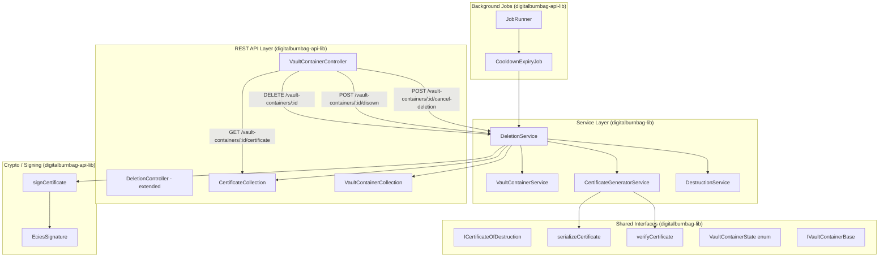
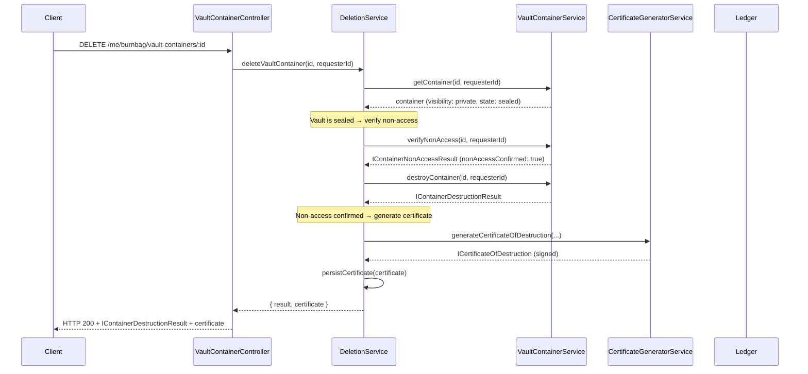
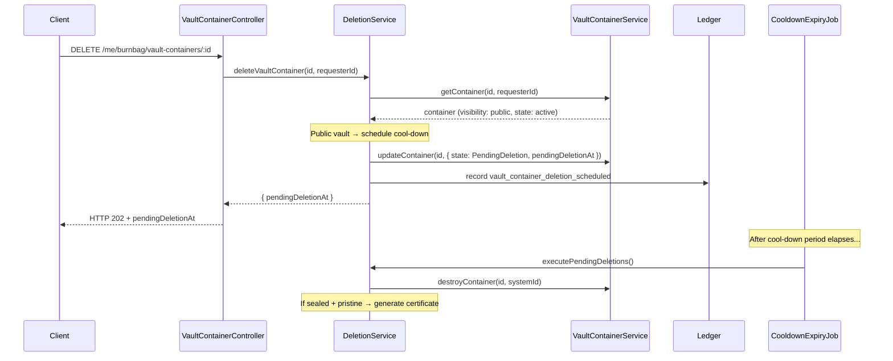

# Design — Vault Deletion Certificate

## Overview

This design adds vault container deletion and Certificate of Destruction
capabilities to Digital Burnbag. The feature spans three visibility-dependent
deletion workflows (immediate, disown, cool-down), a server-signed certificate
proving sealed vaults were destroyed without access, and offline certificate
verification.

### Key Design Decisions

1. **Reuse existing `IDestructionCertificateBase` as the internal certificate
   and introduce a new `ICertificateOfDestruction` for the exportable,
   ECDSA-signed certificate.** The existing `IDestructionCertificateBase`
   carries vault-level cryptographic attestation (Merkle root, access seal,
   destruction signature). The new `ICertificateOfDestruction` wraps the
   container-level non-access result, per-file destruction proofs, and an
   operator ECDSA signature — a different document with a different purpose
   (auditor-facing proof vs internal verification record).

2. **Certificate signing reuses the WCAP `EciesSignature` infrastructure.**
   The operator's secp256k1 key pair already exists for WCAP response signing.
   We sign the SHA-256 hash of canonical JSON with `EciesSignature.signMessage()`
   and verify with `EciesSignature.verifyMessage()` — identical to the WCAP
   middleware pattern.

3. **`serializeCertificate` and `verifyCertificate` live in `digitalburnbag-lib`
   (browser-safe).** `signCertificate` lives in `digitalburnbag-api-lib`
   (Node.js only, needs the private key). This split mirrors the existing
   WCAP pattern where the public key endpoint is browser-accessible but
   signing is server-side.

4. **State machine extensions are additive.** Two new `VaultContainerState`
   values (`Disowned`, `PendingDeletion`) and four new optional fields on
   `IVaultContainerBase` are backward-compatible — existing records remain
   valid without migration.

5. **The `DeletionService` is a new service in `digitalburnbag-lib`** that
   orchestrates the deletion workflow, delegating to `VaultContainerService`
   for destruction and `CertificateGeneratorService` for certificate
   generation. The API controller dispatches to `DeletionService` based on
   vault visibility.

6. **Background cool-down job follows the existing `JobRunner` +
   `platform-jobs` pattern.** A new `createCooldownExpiryJob` factory
   function is registered alongside existing scheduled jobs.

---

## Architecture



### Request Flow: Private/Unlisted Vault Deletion



### Request Flow: Public Vault Deletion (Cool-Down)



---

## Components and Interfaces

### New Interfaces (digitalburnbag-lib)

#### `ICertificateOfDestruction`

The exportable, auditor-facing certificate. Distinct from the existing
`IDestructionCertificateBase` which is an internal verification record.

```typescript
// digitalburnbag-lib/src/lib/interfaces/bases/certificate-of-destruction.ts

/**
 * Exportable Certificate of Destruction — a server-signed JSON document
 * proving a sealed vault was destroyed without its contents being accessed.
 *
 * Designed for offline verification: a third party holding only this
 * certificate and the operator's public key can confirm destruction
 * and non-access independently of the server.
 */
export interface ICertificateOfDestruction {
  /** Certificate format version. Initially 1. */
  version: number;
  /** ID of the vault container that was destroyed. */
  containerId: string;
  /** Human-readable name of the vault container at destruction time. */
  containerName: string;
  /** Hex-encoded Merkle root recorded at seal time. */
  sealHash: string;
  /** ISO-8601 timestamp when the vault was sealed. */
  sealedAt: string;
  /** ISO-8601 timestamp when the vault was destroyed. */
  destroyedAt: string;
  /** Full non-access verification result. */
  nonAccessVerification: ICertificateNonAccessVerification;
  /** Per-file destruction proofs. */
  fileDestructionProofs: ICertificateFileDestructionProof[];
  /** Hex-encoded ledger entry hash for the container destruction record. */
  containerLedgerEntryHash: string;
  /** Hex-encoded compressed secp256k1 operator public key. */
  operatorPublicKey: string;
  /**
   * Base64-encoded 64-byte compact ECDSA signature over the SHA-256 hash
   * of the canonical JSON payload (all fields except `signature`).
   */
  signature: string;
}
```

#### `ICertificateNonAccessVerification`

Serializable subset of `IContainerNonAccessResult` for embedding in the
certificate (uses string IDs instead of `TID`).

```typescript
export interface ICertificateNonAccessVerification {
  containerId: string;
  nonAccessConfirmed: boolean;
  accessedFileIds: string[];
  inconsistentFileIds: string[];
  totalFilesChecked: number;
}
```

#### `ICertificateFileDestructionProof`

Serializable subset of `IFileDestructionProof` for embedding in the
certificate (hex-encoded hashes instead of `Uint8Array`).

```typescript
export interface ICertificateFileDestructionProof {
  fileId: string;
  destructionHash: string;   // hex-encoded
  ledgerEntryHash: string;   // hex-encoded
  timestamp: string;          // ISO-8601
}
```

#### `ICertificateVerifyResult`

```typescript
export interface ICertificateVerifyResult {
  valid: boolean;
  reason?: 'SIGNATURE_MISMATCH';
}
```

### New Functions (digitalburnbag-lib — browser-safe)

```typescript
// digitalburnbag-lib/src/lib/serialization/certificate-serializer.ts

/**
 * Produce a canonical JSON string of the certificate payload
 * (all fields except `signature`), with keys sorted alphabetically
 * and no optional whitespace.
 */
export function serializeCertificate(
  certificate: ICertificateOfDestruction,
): string;

/**
 * Verify a Certificate of Destruction against an operator public key.
 * Recomputes the SHA-256 hash of the canonical JSON payload and verifies
 * the ECDSA signature.
 *
 * @param certificate - The full certificate including signature
 * @param operatorPublicKey - 33-byte compressed secp256k1 public key
 * @returns { valid: true } or { valid: false, reason: 'SIGNATURE_MISMATCH' }
 */
export function verifyCertificate(
  certificate: ICertificateOfDestruction,
  operatorPublicKey: Uint8Array,
): ICertificateVerifyResult;
```

### New Functions (digitalburnbag-api-lib — Node.js only)

```typescript
// digitalburnbag-api-lib/src/lib/services/certificate-signing-service.ts

/**
 * Sign a certificate payload with the operator's private key.
 * Computes SHA-256 of the canonical JSON, signs with EciesSignature.signMessage(),
 * and returns the base64-encoded 64-byte compact signature.
 *
 * @param certificate - Certificate payload (signature field will be overwritten)
 * @param operatorPrivateKey - 32-byte secp256k1 private key
 * @returns The certificate with the `signature` field populated
 */
export function signCertificate(
  certificate: Omit<ICertificateOfDestruction, 'signature'>,
  operatorPrivateKey: Uint8Array,
): ICertificateOfDestruction;
```

### New Service Interface (digitalburnbag-lib)

```typescript
// digitalburnbag-lib/src/lib/interfaces/services/deletion-service.ts

export interface IDeletionService<TID extends PlatformID> {
  /**
   * Delete a vault container. Behavior depends on visibility:
   * - private/unlisted: immediate cascade destruction
   * - public: schedule cool-down period
   *
   * Returns the destruction result (immediate) or pending-deletion info (public).
   */
  deleteVaultContainer(
    containerId: TID,
    requesterId: TID,
  ): Promise<IVaultDeletionResult<TID>>;

  /**
   * Disown a public vault — remove owner, make read-only.
   */
  disownVaultContainer(
    containerId: TID,
    requesterId: TID,
  ): Promise<IVaultContainerBase<TID>>;

  /**
   * Cancel a pending public vault deletion.
   */
  cancelPendingDeletion(
    containerId: TID,
    requesterId: TID,
  ): Promise<IVaultContainerBase<TID>>;

  /**
   * Execute all pending deletions whose cool-down has expired.
   * Called by the background job.
   */
  executePendingDeletions(): Promise<ICooldownExpiryResult>;

  /**
   * Retrieve a stored Certificate of Destruction.
   */
  getCertificate(
    containerId: TID,
    requesterId: TID,
  ): Promise<ICertificateOfDestruction | null>;
}
```

#### Result Types

```typescript
export type IVaultDeletionResult<TID extends PlatformID> =
  | IImmediateDeletionResult<TID>
  | IPendingDeletionResult;

export interface IImmediateDeletionResult<TID extends PlatformID> {
  type: 'immediate';
  destructionResult: IContainerDestructionResult<TID>;
  certificate?: ICertificateOfDestruction;
  certificateOmittedReason?: 'NOT_SEALED' | 'SEAL_BROKEN';
  accessedFileIds?: string[];
}

export interface IPendingDeletionResult {
  type: 'pending';
  pendingDeletionAt: string;
}

export interface ICooldownExpiryResult {
  vaultsDestroyed: number;
  certificatesGenerated: number;
  failures: number;
}
```

### New Repository Interface (digitalburnbag-lib)

```typescript
// digitalburnbag-lib/src/lib/interfaces/services/certificate-repository.ts

export interface ICertificateRepository {
  /**
   * Persist a Certificate of Destruction, indexed by containerId.
   */
  storeCertificate(certificate: ICertificateOfDestruction): Promise<void>;

  /**
   * Retrieve a stored certificate by container ID.
   */
  getCertificateByContainerId(
    containerId: string,
  ): Promise<ICertificateOfDestruction | null>;
}
```

### New Collection (digitalburnbag-api-lib)

```typescript
// digitalburnbag-api-lib/src/lib/collections/certificate-collection.ts

/**
 * BrightDB-backed certificate repository.
 * Collection: burnbag_destruction_certificates
 * Index: { containerId: 1 } (unique)
 */
export class BrightDBCertificateRepository implements ICertificateRepository {
  constructor(private readonly certificates: Collection) {}

  async storeCertificate(certificate: ICertificateOfDestruction): Promise<void>;
  async getCertificateByContainerId(
    containerId: string,
  ): Promise<ICertificateOfDestruction | null>;
}
```

### New Error Classes (digitalburnbag-lib)

```typescript
// Added to digitalburnbag-lib/src/lib/errors.ts

export class InvalidStateTransitionError extends BurnBagError {
  constructor(currentState: string, requestedState: string) {
    super(`INVALID_STATE_TRANSITION: cannot transition from '${currentState}' to '${requestedState}'`);
  }
}

export class VaultAlreadyDisownedError extends BurnBagError {
  constructor(containerId: string) {
    super(`VAULT_ALREADY_DISOWNED: vault '${containerId}' has already been disowned`);
  }
}

export class DisownRequiresPublicVisibilityError extends BurnBagError {
  constructor(containerId: string) {
    super(`DISOWN_REQUIRES_PUBLIC_VISIBILITY: vault '${containerId}' is not public`);
  }
}

export class DeletionAlreadyScheduledError extends BurnBagError {
  constructor(containerId: string, public readonly pendingDeletionAt: string) {
    super(`DELETION_ALREADY_SCHEDULED: vault '${containerId}' already has pending deletion at ${pendingDeletionAt}`);
  }
}

export class CertificateNotFoundError extends BurnBagError {
  constructor(containerId: string) {
    super(`CERTIFICATE_NOT_FOUND: no certificate exists for vault '${containerId}'`);
  }
}
```

### Controller Extensions (digitalburnbag-api-lib)

The existing `VaultContainerController` gains four new route definitions:

| Method | Path | Handler | Description |
|--------|------|---------|-------------|
| `DELETE` | `/:id` | `handleDestroyContainer` | **Modified** — delegates to `DeletionService` instead of `VaultContainerService.destroyContainer()` directly. Returns 200/202/207 based on visibility and outcome. |
| `POST` | `/:id/disown` | `handleDisownContainer` | New — disown a public vault |
| `POST` | `/:id/cancel-deletion` | `handleCancelDeletion` | New — cancel pending public vault deletion |
| `GET` | `/:id/certificate` | `handleGetCertificate` | New — retrieve stored certificate |

### Configuration (digitalburnbag-api-lib)

```typescript
// digitalburnbag-api-lib/src/lib/config/deletionConfig.ts

export interface IBurnbagDeletionConfig {
  /** Cool-down period in days for public vault deletion. Default: 30 */
  cooldownDays: number;
  /** Certificate retention in days. Default: 3650 (10 years) */
  certificateRetentionDays: number;
  /** Cool-down expiry job interval in milliseconds. Default: 3600000 (1 hour) */
  cooldownJobIntervalMs: number;
}

export function validateDeletionConfig(): IBurnbagDeletionConfig {
  const cooldownDays = parsePositiveIntOrDefault(
    'BURNBAG_PUBLIC_VAULT_COOLDOWN_DAYS', 30
  );
  const certificateRetentionDays = parsePositiveIntOrDefault(
    'BURNBAG_CERTIFICATE_RETENTION_DAYS', 3650
  );
  const cooldownJobIntervalMs = parsePositiveIntOrDefault(
    'BURNBAG_COOLDOWN_JOB_INTERVAL_MS', 3_600_000
  );

  if (cooldownDays < 1) {
    throw new Error('CONFIG_INVALID_VALUE: BURNBAG_PUBLIC_VAULT_COOLDOWN_DAYS must be >= 1');
  }
  if (certificateRetentionDays < 1) {
    throw new Error('CONFIG_INVALID_VALUE: BURNBAG_CERTIFICATE_RETENTION_DAYS must be >= 1');
  }

  return { cooldownDays, certificateRetentionDays, cooldownJobIntervalMs };
}
```

### Background Job (digitalburnbag-api-lib)

```typescript
// Added to digitalburnbag-api-lib/src/lib/scheduled/platform-jobs.ts

export function createCooldownExpiryJob(
  deps: { executePendingDeletions: () => Promise<ICooldownExpiryResult> },
  intervalMs: number,
): IScheduledJob {
  return {
    name: 'cooldown-expiry',
    intervalMs,
    execute: async () => {
      const result = await deps.executePendingDeletions();
      // Emit metrics: result.vaultsDestroyed, result.certificatesGenerated, result.failures
    },
  };
}
```

---

## Data Models

### `ICertificateOfDestruction` (new — `digitalburnbag-lib`)

| Field | Type | Description |
|-------|------|-------------|
| `version` | `number` | Certificate format version (initially `1`) |
| `containerId` | `string` | Vault container ID |
| `containerName` | `string` | Vault name at destruction time |
| `sealHash` | `string` | Hex-encoded Merkle root from seal time |
| `sealedAt` | `string` | ISO-8601 seal timestamp |
| `destroyedAt` | `string` | ISO-8601 destruction timestamp |
| `nonAccessVerification` | `ICertificateNonAccessVerification` | Non-access proof summary |
| `fileDestructionProofs` | `ICertificateFileDestructionProof[]` | Per-file proofs |
| `containerLedgerEntryHash` | `string` | Hex-encoded ledger hash |
| `operatorPublicKey` | `string` | Hex-encoded 33-byte compressed secp256k1 key |
| `signature` | `string` | Base64-encoded 64-byte compact ECDSA signature |

### `IVaultContainerBase` Extensions (modified — `digitalburnbag-lib`)

| New Field | Type | Description |
|-----------|------|-------------|
| `pendingDeletionAt?` | `string` | ISO-8601 timestamp for scheduled destruction |
| `previousState?` | `VaultContainerState` | State before `PendingDeletion`, for cancellation restore |
| `disownedAt?` | `string` | ISO-8601 timestamp when disowned |
| `disownedBy?` | `TID` | Former owner who disowned the vault |

### `VaultContainerState` Extensions (modified — `digitalburnbag-lib`)

| New Value | String | Description |
|-----------|--------|-------------|
| `Disowned` | `'disowned'` | Public vault disowned — read-only, no owner |
| `PendingDeletion` | `'pending-deletion'` | Public vault awaiting cool-down expiry |

### State Transition Matrix

```mermaid
stateDiagram-v2
    [*] --> Active
    Active --> Sealed: seal
    Active --> Locked: lock
    Active --> Destroyed: delete (private/unlisted)
    Active --> PendingDeletion: delete (public)
    Active --> Disowned: disown (public, via Locked)

    Sealed --> Destroyed: delete (private/unlisted, +certificate if pristine)
    Sealed --> PendingDeletion: delete (public)
    Sealed --> Disowned: disown (public)

    Locked --> Destroyed: delete
    Locked --> PendingDeletion: delete (public)
    Locked --> Disowned: disown (public)

    PendingDeletion --> Destroyed: cool-down elapsed
    PendingDeletion --> Active: cancel (if previousState=Active)
    PendingDeletion --> Sealed: cancel (if previousState=Sealed)
    PendingDeletion --> Locked: cancel (if previousState=Locked)

    Destroyed --> [*]
    Disowned --> [*]

    note right of Destroyed: Terminal — no transitions out
    note right of Disowned: Terminal — only burnbag:admin can destroy
```

### MongoDB Collections

#### `burnbag_destruction_certificates`

```json
{
  "_id": "<auto>",
  "containerId": "<string, unique index>",
  "version": 1,
  "containerName": "...",
  "sealHash": "...",
  "sealedAt": "...",
  "destroyedAt": "...",
  "nonAccessVerification": { ... },
  "fileDestructionProofs": [ ... ],
  "containerLedgerEntryHash": "...",
  "operatorPublicKey": "...",
  "signature": "...",
  "createdAt": "<ISO-8601>",
  "expiresAt": "<ISO-8601, TTL index>"
}
```

Indexes:
- `{ containerId: 1 }` — unique, for retrieval by container ID
- `{ expiresAt: 1 }` — TTL index for automatic certificate expiration after `BURNBAG_CERTIFICATE_RETENTION_DAYS`


---

## Correctness Properties

*A property is a characteristic or behavior that should hold true across all
valid executions of a system — essentially, a formal statement about what the
system should do. Properties serve as the bridge between human-readable
specifications and machine-verifiable correctness guarantees.*

The following properties were derived from the acceptance criteria in
Requirements 2, 3, 7, and 12. Each property is universally quantified and
suitable for property-based testing with `fast-check`.

### Property 1: Sign-then-verify round-trip

*For any* valid `ICertificateOfDestruction` payload (generated with random
container IDs, seal hashes, timestamps, and file destruction proofs) and
*for any* valid secp256k1 key pair, signing the certificate with
`signCertificate(payload, privateKey)` and then verifying with
`verifyCertificate(signedCertificate, publicKey)` SHALL return
`{ valid: true }`.

**Validates: Requirements 2.3, 3.2, 3.3, 12.1**

### Property 2: Canonical JSON serialization idempotence

*For any* valid `ICertificateOfDestruction` payload,
`serializeCertificate(payload)` followed by `JSON.parse()` followed by
re-serialization with `serializeCertificate()` SHALL produce a byte-identical
string. Additionally, the serialized output SHALL have keys sorted
alphabetically and contain no optional whitespace.

**Validates: Requirements 3.1, 12.2**

### Property 3: Wrong-key rejection

*For any* valid `ICertificateOfDestruction` payload signed with key pair A,
verifying with a different key pair B (where A ≠ B) SHALL return
`{ valid: false, reason: 'SIGNATURE_MISMATCH' }`.

**Validates: Requirements 3.5, 12.3**

### Property 4: Tamper detection (byte flip)

*For any* valid `ICertificateOfDestruction` payload that has been signed, if
any single byte of the serialized canonical JSON payload is flipped before
verification, `verifyCertificate` SHALL return `{ valid: false }`.

**Validates: Requirements 3.4, 12.4**

### Property 5: State transition correctness

*For any* `VaultContainerState` value and *for any* target state, the state
transition function SHALL succeed if and only if the (current, target) pair
is in the set of allowed transitions. Specifically:

- Transitions **from** `Destroyed` to any state SHALL be rejected.
- Transitions **from** `Disowned` to `Active` or `Destroyed` (without admin)
  SHALL be rejected.
- All transitions listed in Requirement 7.2 SHALL succeed.
- All other transitions SHALL be rejected with `INVALID_STATE_TRANSITION`.

**Validates: Requirements 7.2, 7.3, 7.4**

### Property 6: Certificate completeness

*For any* valid set of inputs (container metadata, seal hash, timestamps,
non-access verification result, file destruction proofs, operator key pair),
the generated `ICertificateOfDestruction` SHALL contain all required fields:
`version`, `containerId`, `containerName`, `sealHash`, `sealedAt`,
`destroyedAt`, `nonAccessVerification`, `fileDestructionProofs`,
`containerLedgerEntryHash`, `operatorPublicKey`, and `signature` — all
non-empty and well-formed.

**Validates: Requirements 2.2**

---

## Error Handling

### HTTP Error Responses

All error responses follow the existing `IApiMessageResponse` shape with
`message` and `error` fields.

| Scenario | HTTP Status | Error Code | Requirement |
|----------|-------------|------------|-------------|
| Vault already destroyed | 410 | `VAULT_ALREADY_DESTROYED` | 1.6, 5.6 |
| Requester not owner / no admin scope | 403 | `FORBIDDEN` | 1.7, 4.3 |
| Partial file destruction failure | 207 | (Multi-Status body) | 1.5 |
| Certificate not found | 404 | `CERTIFICATE_NOT_FOUND` | 4.2 |
| Disown on non-public vault | 409 | `DISOWN_REQUIRES_PUBLIC_VISIBILITY` | 5.4 |
| Vault already disowned | 409 | `VAULT_ALREADY_DISOWNED` | 5.5 |
| Deletion already scheduled | 409 | `DELETION_ALREADY_SCHEDULED` | 6.7 |
| Invalid state transition | 400 | `INVALID_STATE_TRANSITION` | 7.4 |
| Invalid container ID | 400 | `INVALID_CONTAINER_ID` | (existing) |
| Unauthenticated request | 401 | `UNAUTHORIZED` | (existing) |

### Service-Level Error Handling

- **Best-effort destruction**: When individual file destructions fail during
  cascade, the service continues processing remaining files and collects
  both `succeeded` and `failed` arrays. The caller receives the full picture.

- **Certificate generation failure**: If certificate signing fails (e.g.,
  operator key unavailable), the destruction still proceeds. The response
  includes `certificateOmittedReason: 'SIGNING_FAILED'` and logs the error.
  The vault is still marked as destroyed.

- **Background job resilience**: The cool-down expiry job processes each
  vault independently. If one vault's destruction fails, the error is logged
  and the job continues with remaining vaults. The job emits a `failures`
  count in its summary metrics.

- **Configuration validation**: Invalid configuration values cause a
  fail-fast at process startup with descriptive error messages, following
  the existing `validateBurnbagConfig()` pattern.

### Error Classes

New error classes extend the existing `BurnBagError` base class:

- `InvalidStateTransitionError` — thrown when a state transition is not in
  the allowed set
- `VaultAlreadyDisownedError` — thrown when disown is called on an already
  disowned vault
- `DisownRequiresPublicVisibilityError` — thrown when disown is called on a
  non-public vault
- `DeletionAlreadyScheduledError` — thrown when DELETE is called on a vault
  that already has a pending deletion; includes the `pendingDeletionAt`
  timestamp
- `CertificateNotFoundError` — thrown when a certificate is requested for a
  vault that has no certificate

---

## Testing Strategy

### Property-Based Tests (fast-check)

Property-based tests are the primary correctness mechanism for the
certificate signing/verification and state transition logic. These are pure
functions with clear input/output behavior and large input spaces — ideal
for PBT.

**Library**: `fast-check` (already used in the codebase)
**Minimum iterations**: 1000 per property (per Requirement 12.5)

Each property test references its design document property with a tag comment:

```
// Feature: vault-deletion-certificate, Property N: <property text>
```

| Property | Test File Location | What Varies |
|----------|--------------------|-------------|
| 1: Sign-then-verify round-trip | `digitalburnbag-lib/src/lib/__tests__/certificate-of-destruction.property.spec.ts` | Certificate payloads (random IDs, hashes, timestamps, file counts), key pairs |
| 2: Canonical JSON idempotence | Same file | Certificate payloads |
| 3: Wrong-key rejection | Same file | Certificate payloads, two independent key pairs |
| 4: Tamper detection | Same file | Certificate payloads, byte position to flip |
| 5: State transition correctness | `digitalburnbag-lib/src/lib/__tests__/vault-container-state-transitions.property.spec.ts` | All (currentState, targetState) pairs |
| 6: Certificate completeness | `digitalburnbag-lib/src/lib/__tests__/certificate-of-destruction.property.spec.ts` | Certificate input parameters |

**Generators needed** (added to `arbitraries.ts`):

- `arbCertificatePayload` — generates random `ICertificateOfDestruction`
  payloads with valid structure (random hex strings for hashes, random
  ISO timestamps, random file destruction proof arrays)
- `arbSecp256k1KeyPair` — generates a fresh secp256k1 key pair per iteration
  (reuses the pattern from `wcap-signing-middleware.property.spec.ts`)
- `arbVaultContainerState` — generates random `VaultContainerState` values
  including the new `Disowned` and `PendingDeletion` states
- `arbByteFlipIndex` — generates a random index within the serialized
  certificate payload for tamper detection testing

### Unit Tests (example-based)

Unit tests cover specific scenarios, edge cases, and error conditions that
don't benefit from randomized input:

| Test Area | File | Key Scenarios |
|-----------|------|---------------|
| DeletionService | `digitalburnbag-lib/src/lib/__tests__/deletion-service.spec.ts` | Private vault immediate delete, sealed vault with certificate, non-sealed vault without certificate, seal-broken vault without certificate, public vault cool-down scheduling, disown flow, cancel-deletion flow |
| Certificate serializer | `digitalburnbag-lib/src/lib/__tests__/certificate-serializer.spec.ts` | Sorted keys, no whitespace, specific field values |
| Configuration validation | `digitalburnbag-api-lib/src/lib/__tests__/config/deletionConfig.spec.ts` | Default values, custom values, out-of-range values, missing values |
| Error classes | `digitalburnbag-lib/src/lib/__tests__/deletion-errors.spec.ts` | Error messages, error codes |

### Integration Tests

Integration tests verify the full request/response cycle through the
controller layer with mocked dependencies:

| Test Area | File | Key Scenarios |
|-----------|------|---------------|
| Vault deletion endpoints | `digitalburnbag-api-lib/src/lib/__tests__/controller-integration/vault-deletion.integration.spec.ts` | DELETE private vault → 200, DELETE sealed vault → 200 + certificate, DELETE public vault → 202, partial failure → 207, already destroyed → 410, unauthorized → 403 |
| Disown endpoint | Same file | POST disown public → 200, disown non-public → 409, already disowned → 409 |
| Cancel deletion endpoint | Same file | POST cancel → 200, no pending deletion → 409 |
| Certificate retrieval | Same file | GET certificate → 200, no certificate → 404, unauthorized → 403 |
| Cool-down expiry job | `digitalburnbag-api-lib/src/lib/__tests__/services/cooldown-expiry-job.spec.ts` | Expired vaults destroyed, non-expired vaults skipped, individual failure doesn't block others |
