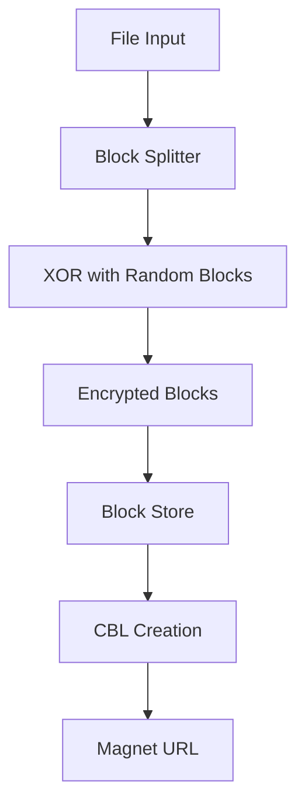

# BrightChain Library

[](https://opensource.org/licenses/MIT)
[](https://badge.fury.io/js/%40brightchain%2Fbrightchain-lib)

**BrightChain** is a revolutionary cryptographic ecosystem that reimagines digital governance, storage, and communication. At its core, it implements the Owner-Free File System (OFFS) with advanced cryptographic features including ECIES encryption, homomorphic voting capabilities, and brokered anonymity.

## 🌟 Key Features

### 🔐 Unified Cryptographic Architecture
- **ECIES Integration**: Elliptic Curve Integrated Encryption Scheme for secure messaging and file storage
- **Homomorphic Encryption**: Paillier keys derived from ECDH keypairs for secure voting and computation
- **Brokered Anonymity**: Forward Error Correction with quorum-based identity recovery

### 📦 Owner-Free File System (OFFS)
- **Block-based Storage**: Files broken into encrypted blocks with XOR randomization
- **Deduplication**: SHA-512 based block identification prevents duplicate storage
- **Distributed Architecture**: Decentralized storage with no single point of failure

### ⚡ Energy-Efficient Design
- **Joule Currency**: All operations measured in actual energy consumption
- **Proof of Work Throttling**: Bad actors face increased computational requirements
- **Sustainable Operations**: Optimized for minimal energy consumption

## 🚀 Quick Start

### Installation

```bash
npm install @brightchain/brightchain-lib
```

### Basic Usage

```typescript
import { BrightChain, BlockSize } from '@brightchain/brightchain-lib';

// Initialize BrightChain
const brightChain = new BrightChain(BlockSize.Small);

// Store a file
const fileData = new TextEncoder().encode("Hello, BrightChain!");
const receipt = await brightChain.storeFile(fileData, "greeting.txt");

console.log(`File stored with ID: ${receipt.id}`);
console.log(`Magnet URL: ${receipt.magnetUrl}`);

// Retrieve the file
const retrievedData = await brightChain.retrieveFile(receipt);
const retrievedText = new TextDecoder().decode(retrievedData);
console.log(`Retrieved: ${retrievedText}`);
```

## 📚 Core Concepts

### Block Types

BrightChain supports several block types for different use cases:

- **RawDataBlock**: Unencrypted data blocks
- **EncryptedBlock**: ECIES-encrypted blocks with single or multiple recipients
- **ConstituentBlockList (CBL)**: Metadata blocks that reference other blocks
- **EphemeralBlock**: Temporary blocks for processing
- **WhitenedBlock**: XOR-randomized blocks for anonymization

### Block Sizes

```typescript
import { BlockSize } from '@brightchain/brightchain-lib';

// Available block sizes
BlockSize.Tiny      // 1024 bytes
BlockSize.Small     // 8192 bytes  
BlockSize.Medium    // 32768 bytes
BlockSize.Large     // 131072 bytes
BlockSize.Huge      // 524288 bytes
BlockSize.Message   // 1024 bytes (alias for Tiny)
```

### Encryption Types

```typescript
import { BlockEncryptionType } from '@brightchain/brightchain-lib';

BlockEncryptionType.None              // No encryption
BlockEncryptionType.SingleRecipient   // Single recipient ECIES
BlockEncryptionType.MultiRecipient    // Multiple recipient ECIES
```

## 🔧 Advanced Usage

### Error Handling

BrightChain v2.0 introduces a unified error handling system with rich context and type safety:

```typescript
import {
  BrightChainError,
  ValidationError,
  ChecksumError,
  FactoryPatternViolationError,
  isValidationError,
  isChecksumError,
  isBrightChainError
} from '@brightchain/brightchain-lib';

try {
  // Perform operations
  const block = await blockService.createBlock(params);
} catch (error) {
  // Type-safe error handling with type guards
  if (isValidationError(error)) {
    console.error(`Validation failed for field: ${error.field}`);
    console.error(`Message: ${error.message}`);
    console.error(`Context:`, error.context);
  } else if (isChecksumError(error)) {
    console.error(`Checksum error type: ${error.checksumErrorType}`);
    console.error(`Message: ${error.message}`);
  } else if (isBrightChainError(error)) {
    // Generic BrightChain error
    console.error(`Error type: ${error.type}`);
    console.error(`Message: ${error.message}`);
    console.error(`Context:`, error.context);
    
    // Check for underlying cause
    if (error.cause) {
      console.error(`Caused by:`, error.cause);
    }
  } else {
    // Non-BrightChain error
    console.error('Unexpected error:', error);
  }
}
```

**Error Types:**
- `BrightChainError`: Base class for all BrightChain errors
- `ValidationError`: Input validation failures
- `ChecksumError`: Checksum calculation or validation errors
- `FactoryPatternViolationError`: Attempted direct instantiation of factory-only classes
- `BlockCapacityError`: Block capacity calculation errors
- `ExtendedCblError`: Extended CBL validation errors

**Error Context:**
All BrightChain errors include:
- `type`: Error type identifier
- `message`: Human-readable error message
- `context`: Additional context (parameters, state, etc.)
- `cause`: Original error if this error wraps another

### Type System

BrightChain v2.0 introduces improved type safety with the `Checksum` class and typed `BlockHandle`:

#### Checksum Class

The unified `Checksum` class replaces separate `ChecksumBuffer` and `ChecksumUint8Array` types:

```typescript
import { Checksum } from '@brightchain/brightchain-lib';

// Create from different sources
const checksumFromBuffer = Checksum.fromBuffer(buffer);
const checksumFromArray = Checksum.fromUint8Array(uint8Array);
const checksumFromHex = Checksum.fromHex('abc123...');

// Compare checksums
if (checksum1.equals(checksum2)) {
  console.log('Checksums match!');
}

// Convert to different formats
const buffer = checksum.toBuffer();
const array = checksum.toUint8Array();
const hex = checksum.toHex();
const str = checksum.toString(); // Same as toHex()

// Use with services
const checksumService = ServiceProvider.getInstance().checksumService;
const checksum = checksumService.calculateChecksumAsClass(data);
console.log(`Checksum: ${checksum.toHex()}`);
```

#### Typed BlockHandle

`BlockHandle<T>` now requires a type parameter for full type safety:

```typescript
import { BlockHandle, BaseBlock, RawDataBlock } from '@brightchain/brightchain-lib';

// Type-safe block handles
const baseHandle: BlockHandle<BaseBlock> = ...;
const rawDataHandle: BlockHandle<RawDataBlock> = ...;

// TypeScript enforces type safety
function processBlock(handle: BlockHandle<RawDataBlock>) {
  // TypeScript knows this is a RawDataBlock handle
}

// Compile-time error if type parameter is missing
// const handle: BlockHandle = ...; // ❌ Error: Type parameter required
```

### Factory Patterns

BrightChain enforces factory patterns at runtime to ensure proper object initialization:

```typescript
import { MemberDocument, FactoryPatternViolationError } from '@brightchain/brightchain-lib';

// ✅ Correct: Use factory method
const member = MemberDocument.create(
  publicMember,
  privateMember,
  data
);

// ❌ Incorrect: Direct instantiation throws error
try {
  const member = new MemberDocument(...); // Throws FactoryPatternViolationError
} catch (error) {
  if (error instanceof FactoryPatternViolationError) {
    console.error('Use factory method instead:', error.message);
  }
}
```

**Classes with Factory Patterns:**
- `MemberDocument`: Use `MemberDocument.create()`
- `BaseBlock` subclasses: Use `BlockType.from()` or specific factory methods
- `Checksum`: Use `Checksum.fromBuffer()`, `Checksum.fromUint8Array()`, or `Checksum.fromHex()`

**Why Factory Patterns?**
- Ensures proper validation during object creation
- Prevents invalid object states
- Provides clear, documented creation APIs
- Enables future enhancements without breaking changes

### Migration from v1.x to v2.0

If you're upgrading from BrightChain v1.x, see our comprehensive [Migration Guide](./MIGRATION.md) for:

- Step-by-step migration instructions
- Before/after code examples
- Automated migration scripts
- Deprecation timeline
- Breaking changes documentation

**Quick Migration Checklist:**
- [ ] Replace `ChecksumBuffer`/`ChecksumUint8Array` with `Checksum` class
- [ ] Update direct constructor calls to use factory methods
- [ ] Add type parameters to `BlockHandle` declarations
- [ ] Update property names (`typeSpecificHeader` → `typeSpecificOverhead`, `payload` → `data`)
- [ ] Update error handling to use new error types and type guards

See [MIGRATION.md](./MIGRATION.md) for complete details.

### Working with Encrypted Blocks

```typescript
import { 
  EncryptedBlock, 
  BlockType, 
  BlockDataType,
  BlockSize,
  Member,
  MemberType
} from '@brightchain/brightchain-lib';

// Create a member (user) with cryptographic keys
const eciesService = ServiceProvider.getInstance().eciesService;
const member = Member.newMember(
  eciesService,
  MemberType.User,
  'Alice',
  new EmailString('alice@example.com')
).member;

// Create encrypted data
const plaintext = new TextEncoder().encode("Secret message");
const encryptedData = await eciesService.encryptSimpleOrSingle(
  true,
  member.publicKey,
  plaintext
);

// Create encrypted block
const block = await EncryptedBlock.from(
  BlockType.EncryptedOwnedDataBlock,
  BlockDataType.EncryptedData,
  BlockSize.Small,
  encryptedData,
  checksumService.calculateChecksum(encryptedData),
  member
);

// Decrypt the block
const decryptedBlock = await block.decrypt(BlockType.RawDataBlock);
```

### Constituent Block Lists (CBL)

CBLs are metadata blocks that reference other blocks, enabling complex file structures:

```typescript
import { ConstituentBlockListBlock, CBLService } from '@brightchain/brightchain-lib';

const cblService = ServiceProvider.getInstance().cblService;

// Calculate capacity for CBL blocks
const capacity = cblService.calculateCBLAddressCapacity(
  BlockSize.Medium,
  BlockEncryptionType.SingleRecipient
);

console.log(`CBL can hold ${capacity} block references`);
```

### Service Provider Pattern

BrightChain uses a service provider pattern for dependency injection:

```typescript
import { ServiceProvider } from '@brightchain/brightchain-lib';

// Get service instances
const provider = ServiceProvider.getInstance();
const checksumService = provider.checksumService;
const eciesService = provider.eciesService;
const blockService = provider.blockService;

// Calculate checksums
const data = new Uint8Array([1, 2, 3, 4]);
const checksum = checksumService.calculateChecksum(data);
```

## 🏗️ Architecture

### Block Structure

All blocks follow a layered structure:

```
[Base Header][Layer Headers][Layer Data][Padding]
```

**Base Header includes:**
- Block Type
- Block Size  
- Data Type
- Checksum
- Date Created

**Encrypted Block Header adds:**
- Encryption Type (1 byte)
- Recipient GUID (16 bytes)
- Ephemeral Public Key (65 bytes)
- IV (16 bytes)
- Auth Tag (16 bytes)

### Storage Architecture



## 🔒 Security Features

### Brokered Anonymity

BrightChain provides privacy through Forward Error Correction:

1. **Identity Replacement**: Real identities replaced with FEC datasets
2. **Quorum Distribution**: Identity shards distributed among trusted agents
3. **Majority Recovery**: Requires quorum majority to recover identity
4. **Digital Statute of Limitations**: FEC data expires after predetermined time

### Cryptographic Guarantees

- **ECIES Security**: Elliptic curve cryptography with AES-256-GCM
- **Homomorphic Voting**: Paillier encryption for private voting
- **Block Integrity**: SHA-512 checksums for all blocks
- **Forward Secrecy**: Temporal key rotation support

## 📊 Constants and Configuration

### Core Constants

```typescript
import CONSTANTS from '@brightchain/brightchain-lib';

// ECIES Configuration
CONSTANTS.ECIES.CURVE_NAME           // 'secp256k1'
CONSTANTS.ECIES.PUBLIC_KEY_LENGTH    // 65 bytes
CONSTANTS.ECIES.PRIVATE_KEY_LENGTH   // 32 bytes

// Block Configuration  
CONSTANTS.CBL.MAX_FILE_NAME_LENGTH   // 255 characters
CONSTANTS.TUPLE.SIZE                 // 3 blocks per tuple
CONSTANTS.FEC.MAX_SHARD_SIZE        // 1MB

// Encryption Settings
CONSTANTS.ENCRYPTION.RECIPIENT_ID_SIZE  // 16 bytes
CONSTANTS.ENCRYPTION.ENCRYPTION_TYPE_SIZE // 1 byte
```

### ECIES Configuration

```typescript
import { EciesConfig } from '@brightchain/brightchain-lib';

const config = EciesConfig;
console.log(config.curveName);          // 'secp256k1'
console.log(config.symmetricAlgorithm); // 'aes-256-gcm'
```

## 🧪 Testing

### Running Tests

```bash
# Run all tests
npm test

# Run with specific configuration
npm run test:dev:16

# Run with logging
npm run test:dev:16:logged
```

### Test Structure

The library includes comprehensive tests:

- **Unit Tests**: Individual component testing
- **Integration Tests**: Service interaction testing  
- **Property Tests**: Cryptographic property verification
- **System Tests**: End-to-end functionality testing

## 🔧 Development

### Building

```bash
# Development build
npm run build:dev

# Production build (via Nx)
npx nx build brightchain-lib
```

### Linting

```bash
# Check code style
npm run lint

# Fix code style issues
npm run lint:fix
```

## 🌐 Browser Compatibility

BrightChain is designed to work in both Node.js and browser environments:

```typescript
// Browser-specific entry point
import { BrightChain } from '@brightchain/brightchain-lib/browser';

// Node.js entry point  
import { BrightChain } from '@brightchain/brightchain-lib';
```

## 📖 API Reference

For detailed naming conventions and terminology, see [NAMING_CONVENTIONS.md](./NAMING_CONVENTIONS.md).

### Core Classes

#### BrightChain
Main interface for file storage and retrieval.

**Methods:**
- `storeFile(data: Uint8Array, fileName?: string): Promise<FileReceipt>`
- `retrieveFile(receipt: FileReceipt): Promise<Uint8Array>`

#### BaseBlock
Abstract base class for all block types.

**Properties:**
- `blockSize: BlockSize` - Size category of the block
- `blockType: BlockType` - Type of block (raw, encrypted, CBL, etc)
- `idChecksum: ChecksumUint8Array` - Unique identifier
- `dateCreated: Date` - Creation timestamp

**Methods:**
- `validateAsync(): Promise<void>` - Async validation
- `validateSync(): void` - Sync validation

#### EncryptedBlock
Encrypted block implementation with ECIES.

**Properties:**
- `encryptionType: BlockEncryptionType` - Single or multi-recipient
- `recipients: Array<TID>` - List of recipient IDs
- `recipientWithKey: Member<TID>` - Member with decryption key

**Methods:**
- `decrypt<D>(newBlockType: BlockType): Promise<D>` - Decrypt block

### Services

#### ChecksumService
Handles SHA-512 checksum operations.

**Methods:**
- `calculateChecksum(data: Uint8Array): ChecksumUint8Array`
- `checksumToHexString(checksum: ChecksumUint8Array): ChecksumString`

#### ECIESService  
Provides ECIES encryption/decryption.

**Methods:**
- `encryptSimpleOrSingle(simple: boolean, publicKey: Uint8Array, data: Uint8Array): Promise<Uint8Array>`
- `decryptSimpleOrSingle(simple: boolean, privateKey: Uint8Array, data: Uint8Array): Promise<Uint8Array>`

## 🤝 Contributing

We welcome contributions! Please see our [Contributing Guide](../CONTRIBUTING.md) for details.

### Development Setup

1. Clone the repository
2. Install dependencies: `yarn install`
3. Run tests: `npm test`
4. Build: `npm run build:dev`

## 📄 License

This project is licensed under the MIT License - see the [LICENSE](../LICENSE) file for details.

## 🔗 Related Projects

- **@digitaldefiance/ecies-lib**: Core cryptographic primitives
- **@digitaldefiance/i18n-lib**: Internationalization support
- **brightchain-api**: REST API server
- **brightchain-react**: React frontend components

## 📞 Support

- **GitHub Issues**: [Report bugs or request features](https://github.com/Digital-Defiance/BrightChain/issues)
- **Documentation**: [Full documentation](https://github.com/Digital-Defiance/BrightChain#readme)
- **Community**: [Join our discussions](https://github.com/Digital-Defiance/BrightChain/discussions)

## 🎯 Roadmap

BrightChain is actively developed with ambitious goals:

- **Phase 1**: Complete Owner-Free File System ✅
- **Phase 2**: Identity and reputation systems (In Progress)
- **Phase 3**: Digital contracts and governance
- **Phase 4**: Global adoption and interplanetary standards

---

**BrightChain** - *Illuminating the future of decentralized digital governance*