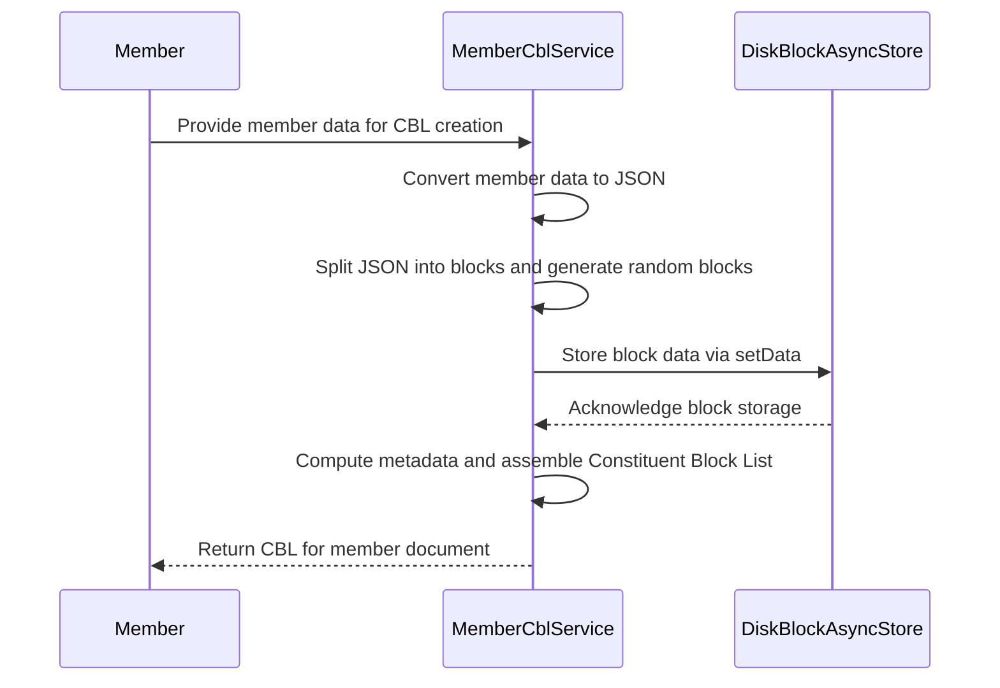

# Member Storage in BrightChain

## Overview

Member data is split across two CBLs to separate public and private information, with an index system for efficient lookups.



## Storage Structure

### 1. Public Member CBL

```typescript
interface PublicMemberData {
  // Identity
  id: GuidV4;
  type: MemberType;
  name: string;
  dateCreated: Date;
  dateUpdated: Date;

  // Public Keys
  publicKey: Buffer;
  votingPublicKey: PublicKey;

  // Network Status
  status: MemberStatusType;
  lastSeen: Date;
  reputation: number;

  // Storage Metrics
  storageContributed: number;
  storageUsed: number;

  // Geographic
  region?: string;
  geographicSpread?: number;
}
```

### 2. Private Member CBL

```typescript
interface PrivateMemberData {
  // Identity
  id: GuidV4;
  contactEmail: EmailString;

  // Security
  recoveryData?: Buffer;

  // Network
  trustedPeers: GuidV4[];
  blockedPeers: GuidV4[];

  // Preferences
  settings: {
    autoReplication: boolean;
    minRedundancy: number;
    preferredRegions: string[];
  };

  // History
  activityLog: {
    timestamp: Date;
    action: string;
    details: any;
  }[];
}
```

### 3. Member Index

```typescript
interface MemberIndex {
  entries: Map<
    GuidV4,
    {
      publicCBL: ChecksumBuffer;
      privateCBL: ChecksumBuffer;
      status: 'ACTIVE' | 'INACTIVE' | 'SUSPENDED';
      lastUpdate: Date;
    }
  >;

  // Lookup indices
  byRegion: Map<string, Set<GuidV4>>;
  byStatus: Map<string, Set<GuidV4>>;
  byReputation: SortedSet<{
    memberId: GuidV4;
    reputation: number;
  }>;
}
```

## Member References

When referring to members in documents, use a lightweight reference:

```typescript
interface MemberReference {
  id: GuidV4;
  type: MemberType;
  dateVerified: Date;
  publicCBL?: ChecksumBuffer; // Optional cached reference
}
```

## Storage Operations

### 1. Member Creation

1. Generate member keys and data
2. Create public CBL with basic info
3. Create private CBL with sensitive data
4. Add entry to member index
5. Return member reference

### 2. Member Lookup

1. Check local cache for member data
2. If not found, query member index
3. Fetch public CBL
4. Fetch private CBL if authorized
5. Return hydrated member object

### 3. Member Update

1. Load existing CBLs
2. Create new CBLs with updated data
3. Update index with new CBL references
4. Propagate changes to network

## Index Distribution

The member index is distributed across the network:

1. Sharding

   - Primary shard by region
   - Secondary shard by member ID range
   - Each node maintains complete shard for its region

2. Replication

   - Each shard replicated across multiple nodes
   - Minimum 3 copies per shard
   - Geographic distribution of replicas

3. Updates
   - Changes propagated through gossip protocol
   - Version vector for conflict resolution
   - Periodic full sync between nodes

## Implementation

### 1. Member Store

```typescript
interface MemberStore {
  // Basic operations
  createMember(data: NewMemberData): Promise<MemberReference>;
  getMember(id: GuidV4): Promise<Member>;
  updateMember(id: GuidV4, changes: Partial<MemberData>): Promise<void>;

  // Index operations
  updateIndex(entry: MemberIndexEntry): Promise<void>;
  queryIndex(criteria: QueryCriteria): Promise<MemberReference[]>;

  // Sync operations
  syncShard(region: string): Promise<void>;
  propagateChanges(changes: MemberChanges[]): Promise<void>;
}
```

### 2. Hydration

```typescript
interface MemberHydrator {
  // Convert between formats
  referenceToMember(ref: MemberReference): Promise<Member>;
  memberToReference(member: Member): MemberReference;

  // Cache management
  cachePublicData(id: GuidV4, data: PublicMemberData): void;
  invalidateCache(id: GuidV4): void;
}
```

## Benefits

1. Security

   - Sensitive data separated from public data
   - Granular access control
   - Encrypted private data

2. Performance

   - Efficient lookups via index
   - Minimal data transfer for references
   - Local caching of public data

3. Scalability

   - Distributed index
   - Regional sharding
   - Efficient updates

4. Flexibility
   - Easy to add new member attributes
   - Support for different member types
   - Extensible index structure

Would you like to proceed with implementing this design?
