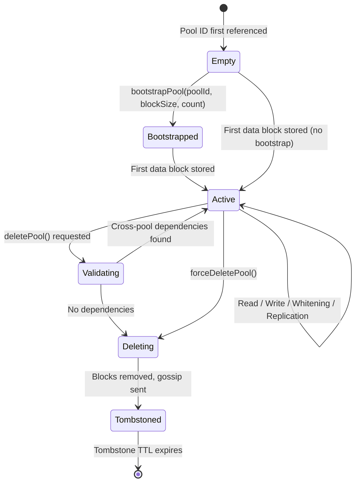

# Storage Pools Architecture

## Overview

Storage Pools are BrightChain's mechanism for logical namespace isolation within the block store. A pool is a lightweight string prefix on block IDs (format: `<poolId>:<hash>`) that groups blocks together without requiring separate physical storage. Pools enable multi-tenant isolation, per-pool policies, independent lifecycle management, and safe deletion — all while preserving BrightChain's content-addressable, copy-on-write storage model.

Pools are the foundation for higher-level features: database isolation (`BrightChainDb` routes all I/O through a pool), encrypted storage (encryption mode is per-pool), access control (ACLs are per-pool), and cross-node coordination (gossip, reconciliation, and discovery are all pool-scoped).

### Why Pools Exist

Without pools, blocks from different databases, tenants, or applications share a single flat namespace. This makes it impossible to:

- Delete all data for a tenant without scanning every block
- Apply per-tenant quotas, retention, or replication policies
- Ensure XOR whitening components stay within a single logical boundary
- Coordinate cross-node replication at the namespace level

Pools solve all of these by introducing a cheap namespace prefix that threads through every layer of the system.

## Pool Concepts

### PoolId

A `PoolId` is a string identifier matching `/^[a-zA-Z0-9_-]{1,64}$/`. Pool IDs are case-sensitive — `"Users"` and `"users"` are distinct pools.

```typescript
import { PoolId, DEFAULT_POOL } from '@brightchain/brightchain-lib';

// Valid pool IDs
const tenantPool: PoolId = 'tenant-alice';
const dbPool: PoolId = 'db_orders';
const tempPool: PoolId = 'temp-session-abc123';

// The default pool for legacy/unpooled blocks
const legacy: PoolId = DEFAULT_POOL; // "default"
```

### Namespace Isolation

Blocks are stored with composite keys: `${poolId}:${hash}`. Two blocks with the same content hash but different pool IDs are distinct entries:

```
Pool A:  tenant-alice:a1b2c3d4...
Pool B:  tenant-bob:a1b2c3d4...
```

Operations on Pool A never affect Pool B. `hasInPool('tenant-alice', hash)` returns `true` while `hasInPool('tenant-bob', hash)` returns `false`, even if the underlying data is identical.

### Default Pool

The `"default"` pool provides backward compatibility. All legacy `IBlockStore` methods (`has`, `get`, `put`, `delete`) delegate to the default pool automatically. Existing code continues to work without modification.

### Storage Key Round-Trip

The composite key format guarantees a lossless round-trip:

```typescript
// Construct: poolId + ":" + hash
const key = `${poolId}:${hash}`;

// Parse: split on first ":"
const [parsedPool, parsedHash] = [
  key.slice(0, key.indexOf(':')),
  key.slice(key.indexOf(':') + 1),
];

// parsedPool === poolId, parsedHash === hash — always
```

## Pool-Scoped Whitening

BrightChain uses the Owner Free Filesystem (OFF) pattern: data is XOR'd with random blocks to produce whitened blocks, and a Constituent Block List (CBL) records the component block IDs needed for reconstruction. Pool-scoped whitening ensures all XOR components live in the same pool.

### Why Pool-Scoped Whitening Matters

Without pool scoping, `getRandomBlocks()` pulls from global storage. A tuple could contain blocks from multiple pools, creating cross-pool XOR dependencies. Deleting Pool A could destroy a random block needed to reconstruct data in Pool B.

Pool-scoped whitening makes each pool a self-contained unit with no external XOR dependencies, enabling safe pool deletion.

### How It Works

1. **Random block sourcing**: `getRandomBlocksFromPool(poolId, count)` returns only blocks from the specified pool
2. **Tuple creation**: All blocks in a tuple (whitened block + random blocks) belong to the same pool
3. **CBL storage**: Both XOR component blocks are stored in the pool via `storeCBLWithWhiteningInPool()`
4. **CBL retrieval**: Both components are retrieved from the pool via `retrieveCBLFromPool()`


### Pool Bootstrapping

New pools start empty — there are no random blocks for whitening. The `bootstrapPool()` method seeds a pool with cryptographically random blocks:

```typescript
// Seed a new pool with 100 random blocks of size 256
await store.bootstrapPool('tenant-alice', BlockSize.Small, 100);

// Now whitening operations have material to work with
const result = await store.storeCBLWithWhiteningInPool('tenant-alice', cblData);
```

### CBL Index Tracking

The `CBLIndex` (a `brightchain-db` collection) tracks all whitened CBL storage results with metadata, pool scoping, and user-level organization. Each entry records the magnet URL, both XOR component block IDs, block size, pool ID, creator, visibility, and optional file metadata.

The CBL Index also detects cross-pool dependencies via `getCrossPoolDependencies()` — if a CBL's XOR components somehow span multiple pools, neither pool can be safely deleted until the dependency is resolved.

## Cross-Node Coordination

BrightChain's networking layer — gossip, reconciliation, and discovery — is fully pool-aware. Every protocol includes pool context so blocks are replicated, synchronized, and discovered within the correct namespace.

### Gossip Protocol

The `IGossipService` propagates block announcements across nodes. All announcements include the pool ID:


Announcement types include:

- `add` / `remove` — block added or removed from a pool
- `pool_deleted` — entire pool deleted (with TTL-based tombstone propagation)
- `head_update` — HeadRegistry pointer updated for a collection
- `cbl_index_update` / `cbl_index_delete` — CBL Index entry changes
- `acl_update` — Pool ACL changes

### Reconciliation

The `IReconciliationService` synchronizes block state after network partition recovery. Manifests are pool-scoped — each manifest maps pool IDs to their block identifier lists:


If a pool has a deletion tombstone locally, reconciliation skips that pool entirely.

### Discovery Protocol

The `IDiscoveryProtocol` locates blocks across the network. Discovery queries accept an optional pool ID and use pool-scoped Bloom filters (keys formatted as `poolId:blockId`) to avoid false positives from blocks in other pools:

```typescript
// Discover a block within a specific pool
const locations = await discovery.discoverBlock(blockId, {
  poolId: 'tenant-alice',
});

// Search for CBLs by metadata across pool peers
const results = await discovery.searchCBLMetadata({
  poolId: 'tenant-alice',
  fileName: 'report.pdf',
  mimeType: 'application/pdf',
});
```

## Pool Lifecycle


### Creation

Pool creation is implicit — storing a block in a new pool ID creates the pool. For pools with access control, an ACL is bootstrapped automatically with the creator as sole Admin.

### Configuration

Pool configuration includes:

- **Encryption mode**: `None`, `NodeSpecific`, or `PoolShared`
- **Searchable metadata fields**: which CBL Index metadata remains unencrypted
- **Public access flags**: `publicRead` and `publicWrite`
- **Replication targets**: per-pool replication count

### Deletion

Pool deletion follows a safety protocol:

1. `validatePoolDeletion(poolId)` scans for cross-pool XOR dependencies
2. If dependencies exist, deletion is rejected with a list of dependent pools and block IDs
3. If no dependencies, all blocks in the pool are removed
4. A `pool_deleted` gossip announcement propagates to peers with a TTL-based tombstone
5. While the tombstone exists, new blocks for that pool ID are rejected

`forceDeletePool()` bypasses the dependency check for administrative use.

## Authentication

Node identity in BrightChain is based on ECDSA key pairs. The `INodeAuthenticator` interface (defined in `brightchain-lib`, implemented as `ECDSANodeAuthenticator` in `brightchain-api-lib`) provides challenge-response authentication:


Node IDs are derived from public keys via `deriveNodeId(publicKey)`, providing a stable identity tied to the cryptographic key pair. The secp256k1 curve is used, consistent with BrightChain's existing crypto stack.

## Access Control

### PoolPermission Enum

Four permission levels control pool access:

| Permission  | Grants                                                            |
| ----------- | ----------------------------------------------------------------- |
| `Read`      | Retrieve blocks from the pool                                     |
| `Write`     | Store blocks in the pool                                          |
| `Replicate` | Receive and serve replicas                                        |
| `Admin`     | Modify ACL and pool configuration (implies all other permissions) |

### IPoolACL

The `IPoolACL<TId>` interface uses a generic type parameter for DTO flexibility — `string` for frontend, `Uint8Array` for backend:

```typescript
interface IPoolACL<TId = string> {
  poolId: PoolId;
  owner: TId;
  members: IPoolACLMember<TId>[];
  publicRead: boolean;
  publicWrite: boolean;
  previousAclBlockId?: string; // audit chain
  approvalSignatures: Array<{ nodeId: TId; signature: Uint8Array }>;
  version: number;
  updatedAt: Date;
}
```

### ACL Storage

ACLs are stored as signed blocks in the block store itself. This makes them tamper-evident, auditable, and subject to the same replication and durability mechanisms as data blocks. Each ACL update references the previous ACL's block ID, forming an auditable chain.

### Quorum-Based Updates

ACL changes require majority approval from current Admins:

- **Multi-admin pools**: >50% of Admins must sign the update
- **Single-admin pools**: the sole Admin's signature suffices
- **Invariant**: at least one Admin must always remain — removing the last Admin is rejected

ACL updates are propagated via `acl_update` gossip announcements to all pool peers.

### Enforcement Points

ACL checks are enforced at every layer:


The `ACLEnforcedBlockStore` wrapper intercepts all pool operations and checks permissions before delegating to the underlying store. Permission denied errors include the required permission, actual permissions, and pool ID.

## Encrypted Pool Storage

### Encryption Modes

Pools support three encryption modes, set at creation time:

| Mode           | Behavior                                                            | Replication |
| -------------- | ------------------------------------------------------------------- | ----------- |
| `None`         | No encryption                                                       | Allowed     |
| `NodeSpecific` | Encrypted with storing node's ECIES key; only that node can decrypt | Not allowed |
| `PoolShared`   | Encrypted with shared AES-256-GCM key; any pool member can decrypt  | Allowed     |

### Key Management

- **Node-specific**: encryption key derived from the node's existing ECDSA key pair
- **Pool-shared**: a symmetric key is generated and distributed to each member, encrypted with their public key via ECIES

Block IDs are always computed from the ciphertext (not plaintext), so Bloom filters and block lookups work unchanged on encrypted pools.

### Key Rotation

Key rotation generates a new key version without re-encrypting existing blocks:

1. New symmetric key generated
2. New key encrypted per-member via ECIES
3. Old key retained in `keyVersions` history for decrypting older blocks
4. New blocks use the new key version

Member removal automatically triggers key rotation so the removed member cannot decrypt new blocks.

### Searchable Metadata

Pool configuration specifies which CBL Index metadata fields remain unencrypted and searchable. Block IDs always remain unencrypted. Queries on encrypted fields return a descriptive error.

## Read Concerns

The `ReadConcern` enum controls consistency guarantees for cross-node reads:

| Level        | Behavior                                                                                                        |
| ------------ | --------------------------------------------------------------------------------------------------------------- |
| `Local`      | Return only locally stored blocks. Fail for remote/unknown blocks.                                              |
| `Available`  | Return local blocks immediately. Attempt to fetch remote blocks; return pending indicator if not yet available. |
| `Consistent` | Block until the requested block is available locally or fetched from a remote node, up to the fetch timeout.    |

```typescript
import { ReadConcern } from '@brightchain/brightchain-lib';

// Fast local-only read
const doc = await collection.findOne(query, { readConcern: ReadConcern.Local });

// Wait for cross-node consistency
const doc = await collection.findOne(query, {
  readConcern: ReadConcern.Consistent,
});
```

## Architecture Diagrams

### Component Relationships


### Cross-Node Sync Flow


### Pool Lifecycle State Machine



## Code Examples

### Creating a Pool with ACL

```typescript
import { PooledMemoryBlockStore } from '@brightchain/brightchain-lib';
import { PooledStoreAdapter } from '@brightchain/brightchain-db';
import {
  PoolAclStore,
  ECDSANodeAuthenticator,
} from '@brightchain/brightchain-api-lib';
import { PoolPermission } from '@brightchain/brightchain-lib';
import { BlockSize } from '@brightchain/brightchain-lib';

// Create the pooled block store
const store = new PooledMemoryBlockStore();

// Bootstrap the pool with random blocks for whitening
await store.bootstrapPool('secure-pool', BlockSize.Small, 50);

// Create an authenticator and generate a key pair
const auth = new ECDSANodeAuthenticator();
const { publicKey, privateKey } = generateKeyPair(); // your ECDSA key pair
const nodeId = auth.deriveNodeId(publicKey);

// Bootstrap the pool ACL — creator becomes sole Admin
const aclStore = new PoolAclStore(store, auth);
const acl = await aclStore.bootstrapPool('secure-pool', nodeId, privateKey, {
  publicRead: false,
  publicWrite: false,
});

// Add a member with Read + Write permissions (single-admin, no quorum needed)
await aclStore.addMember(
  'secure-pool',
  {
    nodeId: peerNodeId,
    permissions: [PoolPermission.Read, PoolPermission.Write],
    addedBy: nodeId,
  },
  privateKey,
);
```

### Storing and Retrieving Data in a Pool

```typescript
import { PooledMemoryBlockStore } from '@brightchain/brightchain-lib';
import { PooledStoreAdapter } from '@brightchain/brightchain-db';
import { BrightChainDb } from '@brightchain/brightchain-db';

// Create a pool-scoped adapter
const store = new PooledMemoryBlockStore();
const adapter = new PooledStoreAdapter(store, 'tenant-alice');

// Use with BrightChainDb — all I/O routes through the pool
const db = new BrightChainDb({ blockStore: adapter });
const users = db.collection('users');

// Insert a document — stored in pool "tenant-alice"
await users.insert({ name: 'Alice', email: 'alice@example.com' });

// Query — only sees data in pool "tenant-alice"
const result = await users.findOne({ name: 'Alice' });

// Data in other pools is invisible
const otherAdapter = new PooledStoreAdapter(store, 'tenant-bob');
const otherDb = new BrightChainDb({ blockStore: otherAdapter });
const otherUsers = otherDb.collection('users');
const notFound = await otherUsers.findOne({ name: 'Alice' }); // null
```

### Pool-Scoped CBL Whitening

```typescript
import { PooledMemoryBlockStore } from '@brightchain/brightchain-lib';
import { PooledStoreAdapter } from '@brightchain/brightchain-db';
import { BlockSize } from '@brightchain/brightchain-lib';

const store = new PooledMemoryBlockStore();

// Bootstrap pool with random blocks
await store.bootstrapPool('my-pool', BlockSize.Small, 50);

// Store a CBL with whitening — both XOR components stay in the pool
const cblData = new Uint8Array([
  /* CBL content */
]);
const result = await store.storeCBLWithWhiteningInPool('my-pool', cblData);

// result contains: { blockId1, blockId2, blockSize, magnetUrl }
console.log(result.magnetUrl);
// "magnet:?xt=urn:brightchain:cbl&bs=256&b1=abc123...&b2=def456..."

// Both blocks exist in the pool
console.log(await store.hasInPool('my-pool', result.blockId1)); // true
console.log(await store.hasInPool('my-pool', result.blockId2)); // true

// Retrieve — reconstructs original data from pool-scoped components
const reconstructed = await store.retrieveCBLFromPool(
  'my-pool',
  result.blockId1,
  result.blockId2,
);
// reconstructed === cblData

// Using the adapter, whitening is automatic
const adapter = new PooledStoreAdapter(store, 'my-pool');
const adapterResult = await adapter.storeCBLWithWhitening(cblData);
const adapterReconstructed = await adapter.retrieveCBL(
  adapterResult.blockId1,
  adapterResult.blockId2,
);
```

### Cross-Node Discovery

```typescript
import { ReadConcern } from '@brightchain/brightchain-lib';
import type { IDiscoveryProtocol } from '@brightchain/brightchain-lib';

// Discover a block within a specific pool across the network
async function findBlockInPool(
  discovery: IDiscoveryProtocol,
  blockId: string,
  poolId: string,
): Promise<void> {
  // Pool-scoped discovery uses pool-prefixed Bloom filters
  // to avoid false positives from other pools
  const locations = await discovery.discoverBlock(blockId, { poolId });

  for (const loc of locations) {
    console.log(`Block found on node ${loc.nodeId} in pool ${loc.poolId}`);
  }
}

// Search for CBLs by metadata across pool peers
async function searchPoolCBLs(
  discovery: IDiscoveryProtocol,
  poolId: string,
): Promise<void> {
  const results = await discovery.searchCBLMetadata({
    poolId,
    mimeType: 'application/pdf',
    tags: ['reports'],
  });

  for (const entry of results) {
    console.log(`Found: ${entry.metadata?.fileName} — ${entry.magnetUrl}`);
  }
}
```

## Related Specs

This document synthesizes concepts from four detailed specs:

| Spec                                                                               | Covers                                                                                                                                                                                         |
| ---------------------------------------------------------------------------------- | ---------------------------------------------------------------------------------------------------------------------------------------------------------------------------------------------- |
| [Pool-Based Storage Isolation](../.kiro/specs/pool-based-storage-isolation/)       | Core pool primitives: `IPooledBlockStore`, `PooledMemoryBlockStore`, `PooledStoreAdapter`, storage keys, pool stats, deletion, backward compatibility                                          |
| [Pool-Scoped Whitening](../.kiro/specs/pool-scoped-whitening/)                     | Pool-scoped random block sourcing, tuple creation, `BlockHandleTuple` pool validation, pool bootstrapping, safe deletion with cross-pool dependency checks, CBL pool awareness                 |
| [Cross-Node Eventual Consistency](../.kiro/specs/cross-node-eventual-consistency/) | Block fetching protocol, `ReadConcern` levels, query result enrichment, fetch queue deduplication, pool-scoped remote fetching, gossip-triggered proactive fetching                            |
| [Cross-Node Pool Coordination](../.kiro/specs/cross-node-pool-coordination/)       | Pool-aware block announcements, pool deletion gossip, pool-scoped reconciliation, pool-scoped discovery with Bloom filters, pool metadata in location records, pool-aware replication tracking |

Each spec has its own requirements, design, and task documents in `.kiro/specs/`.
