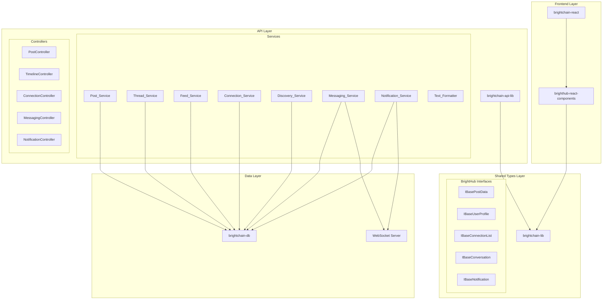
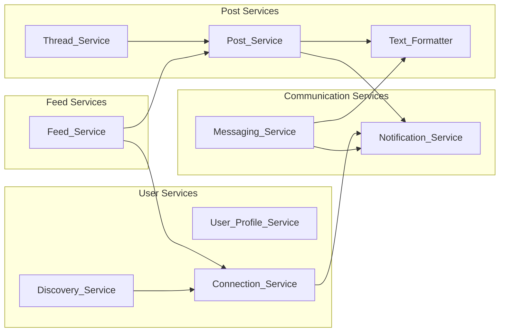
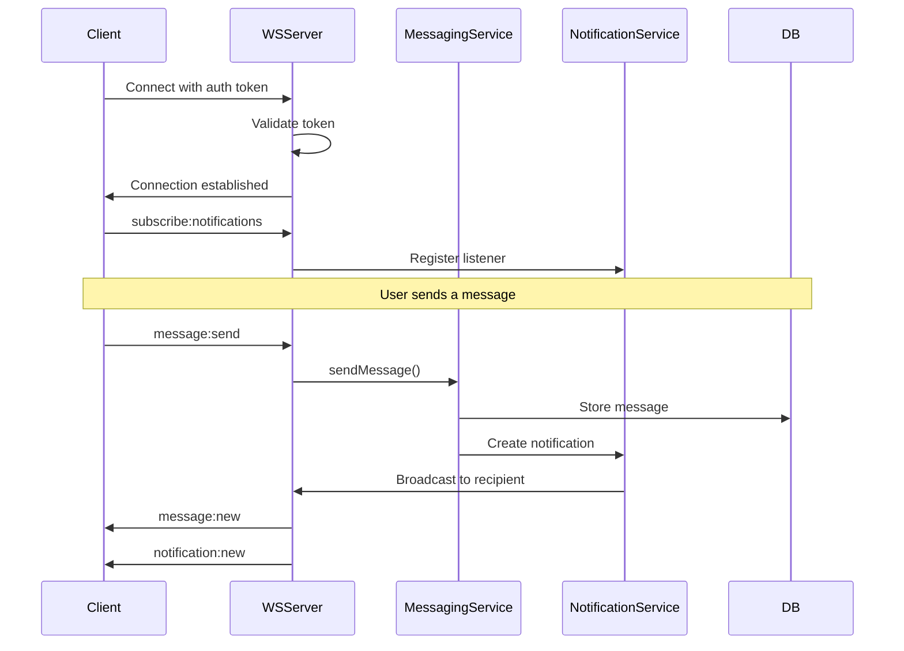
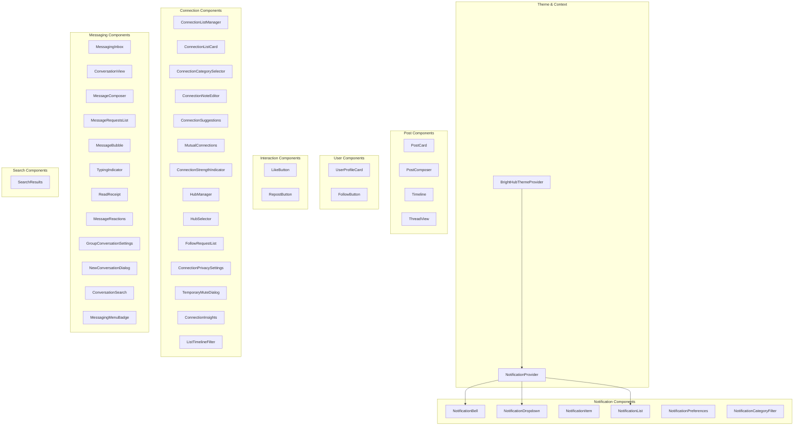

# BrightHub Social Network - Technical Design Document

## Overview

BrightHub is a Twitter-like social network module for the BrightChain ecosystem, providing decentralized social networking capabilities. This design document outlines the technical architecture for implementing posts, threads, replies, likes, reposts, follows, rich text formatting, connection management, direct messaging, and a comprehensive notification system.

The module integrates with the existing BrightChain blockchain/database infrastructure and follows established Nx monorepo patterns, with shared interfaces in `brighthub-lib` (social-network-specific) and `brightchain-lib` (core blockchain types), Node.js-specific code in `brightchain-api-lib`, and React components in a new `brighthub-react-components` library.

### Key Design Principles

1. **Generic Type System**: All interfaces use `IBase*<TId>` pattern to support both frontend (string IDs) and backend (GuidV4Buffer IDs) contexts
2. **Separation of Concerns**: Social network interfaces in `brighthub-lib`, API responses in `brightchain-api-lib`, React components in `brighthub-react-components`
3. **Real-time First**: WebSocket architecture for messaging and notifications
4. **Block-based Storage**: All data stored using BrightChain's block-based storage model in `brightchain-db`
5. **Rich Content Formatting**: Unique FontAwesome icon markup syntax (`{{icon}}`) and full markdown support as key differentiators

### Existing brighthub-lib Foundation

The `brighthub-lib` library already provides critical functionality that this design builds upon:

#### Existing Enumerations
- `DefaultReactionsTypeEnum` - Rich reaction types (Angry, Care, Celebrate, Hug, Huh?, Laugh, Like, Love, Sad, Wow, Yuck)
- `DefaultReactionsEmoji` - Emoji mappings for each reaction
- `DefaultReactionsIcons` - FontAwesome icon mappings for each reaction
- `ReportTypeEnum` - Content report categories (HateSpeech, Harassment, Spam, etc.)
- `FontAwesomeTextStyleTypeEnum` - FA style types (Classic, DuoTone, Light, Regular, Solid, etc.)
- `FontAwesomeTextAbbreviation` - FA abbreviations (fad, fak, fal, far, fas, etc.)

#### Existing Interfaces
- `IDefaultReaction` - Single reaction with type, icon, and emoji
- `IDefaultReactions` - Collection of all default reactions

#### Existing Text Formatting (Key Differentiator)
The FontAwesome icon markup syntax is a unique feature:
- `parseMarkdown()` - Full markdown-it based parsing with plugins (task lists, footnotes, TOC, etc.)
- `parsePostContent()` - Complete content pipeline: HTML sanitization → markdown → icon markup
- `parseIconMarkup()` - Custom `{{icon}}` syntax: `{{solid heart lg spin; color: red}}`
- `isValidIconMarkup()` - Validation for icon syntax
- `getCharacterCount()` - Smart character counting (icons = 1 char, emojis = 1 char)
- `sanitizeForAi()` - AI-safe content preparation

#### FontAwesome Icon Syntax (Special Sauce)
```
{{iconName}}                           → fa-regular fa-iconName
{{solid heart}}                        → fa-solid fa-heart
{{solid heart lg spin}}                → fa-solid fa-heart fa-lg fa-spin
{{solid heart; color: red}}            → fa-solid fa-heart with inline style
{{duotone star 2x; color: gold}}       → fa-duotone fa-star fa-2x with gold color
```

## Architecture

### High-Level System Architecture



### New Nx Libraries

| Library | Purpose | Dependencies |
|---------|---------|--------------|
| `brighthub-react-components` | React UI components for social features | `brightchain-lib`, `@mui/material` |
| (extends) `brightchain-lib` | Shared interfaces and types | None |
| (extends) `brightchain-api-lib` | API services and controllers | `brightchain-lib`, `brightchain-db` |
| (extends) `brightchain-db` | Database schemas | `brightchain-lib` |

## Components and Interfaces

### Core Type System (brightchain-lib)

All interfaces follow the generic `<TId>` pattern for frontend/backend compatibility:

```typescript
// Base ID type for generic interfaces
type FrontendId = string;
type BackendId = GuidV4Buffer;

// Post interfaces
interface IBasePostData<TId> {
  _id: TId;
  authorId: TId;
  content: string;
  formattedContent: string;
  postType: PostType;
  parentPostId?: TId;
  quotedPostId?: TId;
  mediaAttachments: IBaseMediaAttachment<TId>[];
  mentions: string[];
  hashtags: string[];
  likeCount: number;
  repostCount: number;
  replyCount: number;
  quoteCount: number;
  isEdited: boolean;
  editedAt?: TId extends string ? string : Date;
  hubIds?: TId[];
  createdAt: TId extends string ? string : Date;
  updatedAt: TId extends string ? string : Date;
  createdBy: TId;
  updatedBy: TId;
}

// User profile interfaces
interface IBaseUserProfile<TId> {
  _id: TId;
  username: string;
  displayName: string;
  bio: string;
  profilePictureUrl?: string;
  headerImageUrl?: string;
  location?: string;
  websiteUrl?: string;
  followerCount: number;
  followingCount: number;
  postCount: number;
  isVerified: boolean;
  isProtected: boolean;
  approveFollowersMode: ApproveFollowersMode;
  privacySettings: IBasePrivacySettings;
  createdAt: TId extends string ? string : Date;
}

// Thread interfaces
interface IBaseThread<TId> {
  rootPost: IBasePostData<TId>;
  replies: IBasePostData<TId>[];
  replyCount: number;
  participantCount: number;
}

// Follow interfaces
interface IBaseFollow<TId> {
  _id: TId;
  followerId: TId;
  followedId: TId;
  createdAt: TId extends string ? string : Date;
}

// Like interfaces
interface IBaseLike<TId> {
  _id: TId;
  userId: TId;
  postId: TId;
  createdAt: TId extends string ? string : Date;
}

// Repost interfaces
interface IBaseRepost<TId> {
  _id: TId;
  userId: TId;
  postId: TId;
  createdAt: TId extends string ? string : Date;
}

// Connection list interfaces
interface IBaseConnectionList<TId> {
  _id: TId;
  ownerId: TId;
  name: string;
  description?: string;
  visibility: ConnectionVisibility;
  memberCount: number;
  followerCount: number;
  createdAt: TId extends string ? string : Date;
  updatedAt: TId extends string ? string : Date;
}

// Connection category interfaces
interface IBaseConnectionCategory<TId> {
  _id: TId;
  ownerId: TId;
  name: string;
  color?: string;
  icon?: string;
  isDefault: boolean;
  createdAt: TId extends string ? string : Date;
}

// Hub interfaces
interface IBaseHub<TId> {
  _id: TId;
  ownerId: TId;
  name: string;
  memberCount: number;
  isDefault: boolean;
  createdAt: TId extends string ? string : Date;
}

// Follow request interfaces
interface IBaseFollowRequest<TId> {
  _id: TId;
  requesterId: TId;
  targetId: TId;
  message?: string;
  status: FollowRequestStatus;
  createdAt: TId extends string ? string : Date;
}

// Connection insights interfaces
interface IBaseConnectionInsights<TId> {
  connectionId: TId;
  followedAt: TId extends string ? string : Date;
  totalLikesGiven: number;
  totalLikesReceived: number;
  totalReplies: number;
  totalMentions: number;
  lastInteractionAt?: TId extends string ? string : Date;
  strength: ConnectionStrength;
}

// Connection suggestion interfaces
interface IBaseConnectionSuggestion<TId> {
  userId: TId;
  userProfile: IBaseUserProfile<TId>;
  mutualConnectionCount: number;
  score: number;
  reason: SuggestionReason;
}

// Conversation interfaces
interface IBaseConversation<TId> {
  _id: TId;
  type: ConversationType;
  participantIds: TId[];
  name?: string;
  avatarUrl?: string;
  lastMessageAt?: TId extends string ? string : Date;
  lastMessagePreview?: string;
  createdAt: TId extends string ? string : Date;
  updatedAt: TId extends string ? string : Date;
}

// Group conversation extends base conversation
interface IBaseGroupConversation<TId> extends IBaseConversation<TId> {
  type: ConversationType.Group;
  adminIds: TId[];
  creatorId: TId;
}

// Direct message interfaces
interface IBaseDirectMessage<TId> {
  _id: TId;
  conversationId: TId;
  senderId: TId;
  content: string;
  formattedContent: string;
  attachments: IBaseMediaAttachment<TId>[];
  replyToMessageId?: TId;
  forwardedFromId?: TId;
  isEdited: boolean;
  editedAt?: TId extends string ? string : Date;
  isDeleted: boolean;
  createdAt: TId extends string ? string : Date;
}

// Message request interfaces
interface IBaseMessageRequest<TId> {
  _id: TId;
  senderId: TId;
  recipientId: TId;
  messagePreview: string;
  status: MessageRequestStatus;
  createdAt: TId extends string ? string : Date;
}

// Message reaction interfaces
interface IBaseMessageReaction<TId> {
  _id: TId;
  messageId: TId;
  userId: TId;
  emoji: string;
  createdAt: TId extends string ? string : Date;
}

// Read receipt interfaces
interface IBaseReadReceipt<TId> {
  conversationId: TId;
  userId: TId;
  lastReadAt: TId extends string ? string : Date;
  lastReadMessageId: TId;
}

// Notification interfaces
interface IBaseNotification<TId> {
  _id: TId;
  recipientId: TId;
  type: NotificationType;
  category: NotificationCategory;
  actorId: TId;
  targetId?: TId;
  content: string;
  clickThroughUrl: string;
  groupId?: TId;
  isRead: boolean;
  createdAt: TId extends string ? string : Date;
}

// Notification group interfaces
interface IBaseNotificationGroup<TId> {
  _id: TId;
  groupKey: string;
  notificationIds: TId[];
  actorIds: TId[];
  count: number;
  latestAt: TId extends string ? string : Date;
}

// Notification preferences interfaces
interface IBaseNotificationPreferences<TId> {
  userId: TId;
  categorySettings: Record<NotificationCategory, INotificationCategorySettings>;
  channelSettings: Record<NotificationChannel, boolean>;
  quietHours?: IQuietHoursConfig;
  dndConfig?: IDoNotDisturbConfig;
  soundEnabled: boolean;
}

// Quiet hours config
interface IQuietHoursConfig {
  enabled: boolean;
  startTime: string; // HH:mm format
  endTime: string;   // HH:mm format
  timezone: string;
}

// Do not disturb config
interface IDoNotDisturbConfig {
  enabled: boolean;
  duration?: MuteDuration;
  expiresAt?: string;
}

// Notification provider state (for React context)
interface INotificationProviderState {
  notifications: IBaseNotification<string>[];
  unreadCount: number;
  isLoading: boolean;
  isConnected: boolean;
  error?: string;
}

// Notification actions (for React context)
interface INotificationActions {
  markAsRead: (notificationId: string) => Promise<void>;
  markAllAsRead: () => Promise<void>;
  deleteNotification: (notificationId: string) => Promise<void>;
  refreshNotifications: () => Promise<void>;
  subscribe: (type: NotificationType, callback: (notification: IBaseNotification<string>) => void) => () => void;
}
```

### Enumerations (brightchain-lib)

```typescript
enum PostType {
  Original = 'original',
  Reply = 'reply',
  Repost = 'repost',
  Quote = 'quote',
}

enum ApproveFollowersMode {
  ApproveAll = 'approve_all',
  ApproveNonMutuals = 'approve_non_mutuals',
  ApproveNone = 'approve_none',
}

enum FollowRequestStatus {
  Pending = 'pending',
  Approved = 'approved',
  Rejected = 'rejected',
}

enum ConnectionVisibility {
  Private = 'private',
  FollowersOnly = 'followers_only',
  Public = 'public',
}

enum ConnectionStrength {
  Strong = 'strong',
  Moderate = 'moderate',
  Weak = 'weak',
  Dormant = 'dormant',
}

enum MuteDuration {
  OneHour = '1h',
  EightHours = '8h',
  TwentyFourHours = '24h',
  SevenDays = '7d',
  ThirtyDays = '30d',
  Permanent = 'permanent',
}

enum SuggestionReason {
  MutualConnections = 'mutual_connections',
  SimilarInterests = 'similar_interests',
  SimilarToUser = 'similar_to_user',
}

enum ConversationType {
  Direct = 'direct',
  Group = 'group',
}

enum MessageRequestStatus {
  Pending = 'pending',
  Accepted = 'accepted',
  Declined = 'declined',
}

enum GroupParticipantRole {
  Admin = 'admin',
  Participant = 'participant',
}

enum ConversationStatus {
  Active = 'active',
  Archived = 'archived',
  Muted = 'muted',
}

enum NotificationType {
  Like = 'like',
  Reply = 'reply',
  Mention = 'mention',
  Follow = 'follow',
  FollowRequest = 'follow_request',
  Repost = 'repost',
  Quote = 'quote',
  NewMessage = 'new_message',
  MessageRequest = 'message_request',
  MessageReaction = 'message_reaction',
  SystemAlert = 'system_alert',
  ReconnectReminder = 'reconnect_reminder',
}

enum NotificationCategory {
  Social = 'social',
  Messages = 'messages',
  Connections = 'connections',
  System = 'system',
}

enum NotificationChannel {
  InApp = 'in_app',
  Email = 'email',
  Push = 'push',
}
```

### API Response Types (brightchain-api-lib)

```typescript
import { Response } from 'express';

// Post API responses
interface IPostApiResponse extends Response {
  body: IBasePostData<string>;
}

interface IPostListApiResponse extends Response {
  body: {
    posts: IBasePostData<string>[];
    cursor?: string;
    hasMore: boolean;
  };
}

// Timeline API responses
interface ITimelineApiResponse extends Response {
  body: {
    posts: IBasePostData<string>[];
    cursor?: string;
    hasMore: boolean;
  };
}

// User profile API responses
interface IUserProfileApiResponse extends Response {
  body: IBaseUserProfile<string>;
}

// Connection list API responses
interface IConnectionListApiResponse extends Response {
  body: IBaseConnectionList<string>;
}

interface IConnectionListsApiResponse extends Response {
  body: {
    lists: IBaseConnectionList<string>[];
    cursor?: string;
    hasMore: boolean;
  };
}

// Conversation API responses
interface IConversationApiResponse extends Response {
  body: IBaseConversation<string>;
}

interface IConversationsApiResponse extends Response {
  body: {
    conversations: IBaseConversation<string>[];
    cursor?: string;
    hasMore: boolean;
  };
}

// Message API responses
interface IMessageApiResponse extends Response {
  body: IBaseDirectMessage<string>;
}

interface IMessagesApiResponse extends Response {
  body: {
    messages: IBaseDirectMessage<string>[];
    cursor?: string;
    hasMore: boolean;
  };
}

// Notification API responses
interface INotificationApiResponse extends Response {
  body: IBaseNotification<string>;
}

interface INotificationsApiResponse extends Response {
  body: {
    notifications: IBaseNotification<string>[];
    cursor?: string;
    hasMore: boolean;
  };
}

interface IUnreadCountApiResponse extends Response {
  body: {
    unreadCount: number;
  };
}
```

## Data Models

### Database Schemas (brightchain-db)

All schemas support BrightChain's block-based storage model.

#### Posts Collection

```typescript
const POSTS_COLLECTION = 'brighthub_posts';

const POSTS_SCHEMA: CollectionSchema = {
  name: 'brighthub_post',
  properties: {
    _id: { type: 'string', required: true },
    authorId: { type: 'string', required: true },
    content: { type: 'string', required: true },
    formattedContent: { type: 'string', required: true },
    postType: { type: 'string', required: true, enum: ['original', 'reply', 'repost', 'quote'] },
    parentPostId: { type: 'string' },
    quotedPostId: { type: 'string' },
    mediaAttachments: { type: 'array', required: true },
    mentions: { type: 'array', required: true },
    hashtags: { type: 'array', required: true },
    likeCount: { type: 'number', required: true },
    repostCount: { type: 'number', required: true },
    replyCount: { type: 'number', required: true },
    quoteCount: { type: 'number', required: true },
    isEdited: { type: 'boolean', required: true },
    editedAt: { type: 'string' },
    hubIds: { type: 'array' },
    isDeleted: { type: 'boolean', required: true },
    createdAt: { type: 'string', required: true },
    updatedAt: { type: 'string', required: true },
    createdBy: { type: 'string', required: true },
    updatedBy: { type: 'string', required: true },
  },
  indexes: [
    { fields: { authorId: 1, createdAt: -1 } },
    { fields: { parentPostId: 1, createdAt: -1 } },
    { fields: { hashtags: 1 } },
    { fields: { createdAt: -1 } },
    { fields: { content: 'text' }, options: { name: 'post_content_text' } },
  ],
};
```

#### Follows Collection

```typescript
const FOLLOWS_COLLECTION = 'brighthub_follows';

const FOLLOWS_SCHEMA: CollectionSchema = {
  name: 'brighthub_follow',
  properties: {
    _id: { type: 'string', required: true },
    followerId: { type: 'string', required: true },
    followedId: { type: 'string', required: true },
    createdAt: { type: 'string', required: true },
  },
  indexes: [
    { fields: { followerId: 1, followedId: 1 }, options: { unique: true } },
    { fields: { followerId: 1 } },
    { fields: { followedId: 1 } },
  ],
};
```

#### Likes Collection

```typescript
const LIKES_COLLECTION = 'brighthub_likes';

const LIKES_SCHEMA: CollectionSchema = {
  name: 'brighthub_like',
  properties: {
    _id: { type: 'string', required: true },
    userId: { type: 'string', required: true },
    postId: { type: 'string', required: true },
    createdAt: { type: 'string', required: true },
  },
  indexes: [
    { fields: { userId: 1, postId: 1 }, options: { unique: true } },
    { fields: { postId: 1 } },
  ],
};
```

#### Reposts Collection

```typescript
const REPOSTS_COLLECTION = 'brighthub_reposts';

const REPOSTS_SCHEMA: CollectionSchema = {
  name: 'brighthub_repost',
  properties: {
    _id: { type: 'string', required: true },
    userId: { type: 'string', required: true },
    postId: { type: 'string', required: true },
    createdAt: { type: 'string', required: true },
  },
  indexes: [
    { fields: { userId: 1, postId: 1 }, options: { unique: true } },
    { fields: { postId: 1 } },
  ],
};
```

#### Connection Lists Collection

```typescript
const CONNECTION_LISTS_COLLECTION = 'brighthub_connection_lists';

const CONNECTION_LISTS_SCHEMA: CollectionSchema = {
  name: 'brighthub_connection_list',
  properties: {
    _id: { type: 'string', required: true },
    ownerId: { type: 'string', required: true },
    name: { type: 'string', required: true },
    description: { type: 'string' },
    visibility: { type: 'string', required: true, enum: ['private', 'followers_only', 'public'] },
    memberCount: { type: 'number', required: true },
    followerCount: { type: 'number', required: true },
    createdAt: { type: 'string', required: true },
    updatedAt: { type: 'string', required: true },
  },
  indexes: [
    { fields: { ownerId: 1 } },
    { fields: { visibility: 1 } },
  ],
};
```

#### Connection List Members Collection

```typescript
const CONNECTION_LIST_MEMBERS_COLLECTION = 'brighthub_connection_list_members';

const CONNECTION_LIST_MEMBERS_SCHEMA: CollectionSchema = {
  name: 'brighthub_connection_list_member',
  properties: {
    _id: { type: 'string', required: true },
    listId: { type: 'string', required: true },
    userId: { type: 'string', required: true },
    addedAt: { type: 'string', required: true },
  },
  indexes: [
    { fields: { listId: 1, userId: 1 }, options: { unique: true } },
    { fields: { userId: 1 } },
  ],
};
```

#### Hubs Collection

```typescript
const HUBS_COLLECTION = 'brighthub_hubs';

const HUBS_SCHEMA: CollectionSchema = {
  name: 'brighthub_hub',
  properties: {
    _id: { type: 'string', required: true },
    ownerId: { type: 'string', required: true },
    name: { type: 'string', required: true },
    memberCount: { type: 'number', required: true },
    isDefault: { type: 'boolean', required: true },
    createdAt: { type: 'string', required: true },
  },
  indexes: [
    { fields: { ownerId: 1 } },
  ],
};
```

#### Follow Requests Collection

```typescript
const FOLLOW_REQUESTS_COLLECTION = 'brighthub_follow_requests';

const FOLLOW_REQUESTS_SCHEMA: CollectionSchema = {
  name: 'brighthub_follow_request',
  properties: {
    _id: { type: 'string', required: true },
    requesterId: { type: 'string', required: true },
    targetId: { type: 'string', required: true },
    message: { type: 'string' },
    status: { type: 'string', required: true, enum: ['pending', 'approved', 'rejected'] },
    createdAt: { type: 'string', required: true },
  },
  indexes: [
    { fields: { targetId: 1, status: 1 } },
    { fields: { requesterId: 1 } },
  ],
};
```

#### Conversations Collection

```typescript
const CONVERSATIONS_COLLECTION = 'brighthub_conversations';

const CONVERSATIONS_SCHEMA: CollectionSchema = {
  name: 'brighthub_conversation',
  properties: {
    _id: { type: 'string', required: true },
    type: { type: 'string', required: true, enum: ['direct', 'group'] },
    participantIds: { type: 'array', required: true },
    name: { type: 'string' },
    avatarUrl: { type: 'string' },
    adminIds: { type: 'array' },
    creatorId: { type: 'string' },
    lastMessageAt: { type: 'string' },
    lastMessagePreview: { type: 'string' },
    createdAt: { type: 'string', required: true },
    updatedAt: { type: 'string', required: true },
  },
  indexes: [
    { fields: { participantIds: 1 } },
    { fields: { lastMessageAt: -1 } },
  ],
};
```

#### Messages Collection

```typescript
const MESSAGES_COLLECTION = 'brighthub_messages';

const MESSAGES_SCHEMA: CollectionSchema = {
  name: 'brighthub_message',
  properties: {
    _id: { type: 'string', required: true },
    conversationId: { type: 'string', required: true },
    senderId: { type: 'string', required: true },
    content: { type: 'string', required: true },
    formattedContent: { type: 'string', required: true },
    attachments: { type: 'array', required: true },
    replyToMessageId: { type: 'string' },
    forwardedFromId: { type: 'string' },
    isEdited: { type: 'boolean', required: true },
    editedAt: { type: 'string' },
    isDeleted: { type: 'boolean', required: true },
    createdAt: { type: 'string', required: true },
  },
  indexes: [
    { fields: { conversationId: 1, createdAt: -1 } },
    { fields: { content: 'text' }, options: { name: 'message_content_text' } },
  ],
};
```

#### Notifications Collection

```typescript
const NOTIFICATIONS_COLLECTION = 'brighthub_notifications';

const NOTIFICATIONS_SCHEMA: CollectionSchema = {
  name: 'brighthub_notification',
  properties: {
    _id: { type: 'string', required: true },
    recipientId: { type: 'string', required: true },
    type: { type: 'string', required: true },
    category: { type: 'string', required: true, enum: ['social', 'messages', 'connections', 'system'] },
    actorId: { type: 'string', required: true },
    targetId: { type: 'string' },
    content: { type: 'string', required: true },
    clickThroughUrl: { type: 'string', required: true },
    groupId: { type: 'string' },
    isRead: { type: 'boolean', required: true },
    createdAt: { type: 'string', required: true },
  },
  indexes: [
    { fields: { recipientId: 1, createdAt: -1 } },
    { fields: { recipientId: 1, isRead: 1 } },
    { fields: { recipientId: 1, category: 1 } },
    { fields: { groupId: 1 } },
  ],
};
```

#### Notification Preferences Collection

```typescript
const NOTIFICATION_PREFERENCES_COLLECTION = 'brighthub_notification_preferences';

const NOTIFICATION_PREFERENCES_SCHEMA: CollectionSchema = {
  name: 'brighthub_notification_preferences',
  properties: {
    _id: { type: 'string', required: true },
    userId: { type: 'string', required: true },
    categorySettings: { type: 'object', required: true },
    channelSettings: { type: 'object', required: true },
    quietHours: { type: 'object' },
    dndConfig: { type: 'object' },
    soundEnabled: { type: 'boolean', required: true },
    updatedAt: { type: 'string', required: true },
  },
  indexes: [
    { fields: { userId: 1 }, options: { unique: true } },
  ],
};
```


### Service Layer Architecture



#### Post_Service

Handles post creation, editing, deletion, likes, reposts, and quotes.

```typescript
interface IPostService {
  createPost(authorId: string, content: string, options?: CreatePostOptions): Promise<IBasePostData<string>>;
  editPost(postId: string, userId: string, newContent: string): Promise<IBasePostData<string>>;
  deletePost(postId: string, userId: string): Promise<void>;
  getPost(postId: string): Promise<IBasePostData<string>>;
  likePost(postId: string, userId: string): Promise<void>;
  unlikePost(postId: string, userId: string): Promise<void>;
  repostPost(postId: string, userId: string): Promise<IBasePostData<string>>;
  createQuotePost(postId: string, userId: string, commentary: string): Promise<IBasePostData<string>>;
  getInteractionStatus(postId: string, userId: string): Promise<InteractionStatus>;
}

interface CreatePostOptions {
  parentPostId?: string;
  mediaAttachments?: MediaAttachment[];
  hubIds?: string[];
}

interface InteractionStatus {
  hasLiked: boolean;
  hasReposted: boolean;
}
```

#### Thread_Service

Manages threaded conversations and reply hierarchies.

```typescript
interface IThreadService {
  createReply(parentPostId: string, authorId: string, content: string): Promise<IBasePostData<string>>;
  getThread(rootPostId: string, options?: ThreadOptions): Promise<IBaseThread<string>>;
  getReplyDepth(postId: string): Promise<number>;
}

interface ThreadOptions {
  maxDepth?: number;
  cursor?: string;
  limit?: number;
}
```

#### Feed_Service

Generates personalized and public timelines with filtering.

```typescript
interface IFeedService {
  getHomeTimeline(userId: string, options?: TimelineOptions): Promise<TimelineResult>;
  getPublicTimeline(options?: TimelineOptions): Promise<TimelineResult>;
  getUserFeed(targetUserId: string, options?: TimelineOptions): Promise<TimelineResult>;
  getHashtagFeed(hashtag: string, options?: TimelineOptions): Promise<TimelineResult>;
  getListTimeline(listId: string, userId: string, options?: TimelineOptions): Promise<TimelineResult>;
}

interface TimelineOptions {
  cursor?: string;
  limit?: number;
  listId?: string;
  categoryId?: string;
  excludeMuted?: boolean;
}

interface TimelineResult {
  posts: IBasePostData<string>[];
  cursor?: string;
  hasMore: boolean;
}
```

#### Connection_Service

Manages connection lists, categories, hubs, and relationship metadata.

```typescript
interface IConnectionService {
  // Lists
  createList(ownerId: string, name: string, options?: CreateListOptions): Promise<IBaseConnectionList<string>>;
  updateList(listId: string, ownerId: string, updates: Partial<IBaseConnectionList<string>>): Promise<IBaseConnectionList<string>>;
  deleteList(listId: string, ownerId: string): Promise<void>;
  addMembersToList(listId: string, ownerId: string, userIds: string[]): Promise<void>;
  removeMembersFromList(listId: string, ownerId: string, userIds: string[]): Promise<void>;
  getListMembers(listId: string, options?: PaginationOptions): Promise<PaginatedResult<IBaseUserProfile<string>>>;
  
  // Categories
  createCategory(ownerId: string, name: string, options?: CreateCategoryOptions): Promise<IBaseConnectionCategory<string>>;
  assignCategory(connectionId: string, categoryId: string): Promise<void>;
  getConnectionsByCategory(ownerId: string, categoryId: string, options?: PaginationOptions): Promise<PaginatedResult<IBaseUserProfile<string>>>;
  
  // Hubs
  createHub(ownerId: string, name: string): Promise<IBaseHub<string>>;
  addToHub(hubId: string, ownerId: string, userIds: string[]): Promise<void>;
  removeFromHub(hubId: string, ownerId: string, userIds: string[]): Promise<void>;
  
  // Connection metadata
  setPriority(userId: string, connectionId: string, isPriority: boolean): Promise<void>;
  setQuietMode(userId: string, connectionId: string, isQuiet: boolean): Promise<void>;
  setTemporaryMute(userId: string, connectionId: string, duration: MuteDuration): Promise<void>;
  addNote(userId: string, connectionId: string, note: string): Promise<void>;
  
  // Mutual connections
  getMutualConnections(userId: string, targetUserId: string, options?: PaginationOptions): Promise<PaginatedResult<IBaseUserProfile<string>>>;
  getMutualConnectionCount(userId: string, targetUserId: string): Promise<number>;
  
  // Import/Export
  exportConnections(userId: string): Promise<ConnectionExport>;
  importConnections(userId: string, data: ConnectionImport): Promise<ImportResult>;
}
```

#### Discovery_Service

Provides connection recommendations and strength calculations.

```typescript
interface IDiscoveryService {
  getSuggestions(userId: string, options?: SuggestionOptions): Promise<IBaseConnectionSuggestion<string>[]>;
  dismissSuggestion(userId: string, suggestedUserId: string): Promise<void>;
  calculateConnectionStrength(userId: string, connectionId: string): Promise<ConnectionStrength>;
  getConnectionInsights(userId: string, connectionId: string): Promise<IBaseConnectionInsights<string>>;
  getSimilarUsers(userId: string, targetUserId: string, options?: PaginationOptions): Promise<PaginatedResult<IBaseUserProfile<string>>>;
}

interface SuggestionOptions {
  limit?: number;
  includeInterestBased?: boolean;
}
```

#### Messaging_Service

Handles direct messages, group conversations, and real-time delivery.

```typescript
interface IMessagingService {
  // Conversations
  createConversation(creatorId: string, participantIds: string[], options?: CreateConversationOptions): Promise<IBaseConversation<string>>;
  getConversation(conversationId: string, userId: string): Promise<IBaseConversation<string>>;
  getConversations(userId: string, options?: ConversationListOptions): Promise<PaginatedResult<IBaseConversation<string>>>;
  deleteConversation(conversationId: string, userId: string): Promise<void>;
  
  // Messages
  sendMessage(conversationId: string, senderId: string, content: string, options?: SendMessageOptions): Promise<IBaseDirectMessage<string>>;
  editMessage(messageId: string, userId: string, newContent: string): Promise<IBaseDirectMessage<string>>;
  deleteMessage(messageId: string, userId: string): Promise<void>;
  getMessages(conversationId: string, userId: string, options?: PaginationOptions): Promise<PaginatedResult<IBaseDirectMessage<string>>>;
  
  // Reactions
  addReaction(messageId: string, userId: string, emoji: string): Promise<void>;
  removeReaction(messageId: string, userId: string, emoji: string): Promise<void>;
  
  // Read receipts
  markAsRead(conversationId: string, userId: string): Promise<void>;
  
  // Typing indicators
  sendTypingIndicator(conversationId: string, userId: string): Promise<void>;
  
  // Message requests
  getMessageRequests(userId: string, options?: PaginationOptions): Promise<PaginatedResult<IBaseMessageRequest<string>>>;
  acceptMessageRequest(requestId: string, userId: string): Promise<IBaseConversation<string>>;
  declineMessageRequest(requestId: string, userId: string): Promise<void>;
  
  // Conversation management
  pinConversation(conversationId: string, userId: string): Promise<void>;
  unpinConversation(conversationId: string, userId: string): Promise<void>;
  archiveConversation(conversationId: string, userId: string): Promise<void>;
  unarchiveConversation(conversationId: string, userId: string): Promise<void>;
  muteConversation(conversationId: string, userId: string, duration?: MuteDuration): Promise<void>;
  unmuteConversation(conversationId: string, userId: string): Promise<void>;
  
  // Group management
  addParticipants(conversationId: string, adminId: string, userIds: string[]): Promise<void>;
  removeParticipant(conversationId: string, adminId: string, userId: string): Promise<void>;
  promoteToAdmin(conversationId: string, adminId: string, userId: string): Promise<void>;
  demoteFromAdmin(conversationId: string, adminId: string, userId: string): Promise<void>;
  leaveGroup(conversationId: string, userId: string): Promise<void>;
  updateGroupSettings(conversationId: string, adminId: string, settings: GroupSettings): Promise<void>;
  
  // Search
  searchMessages(userId: string, query: string, options?: SearchOptions): Promise<PaginatedResult<IBaseDirectMessage<string>>>;
  searchInConversation(conversationId: string, userId: string, query: string, options?: PaginationOptions): Promise<PaginatedResult<IBaseDirectMessage<string>>>;
}
```

#### Notification_Service

Manages notification creation, delivery, preferences, and real-time updates.

```typescript
interface INotificationService {
  // Notification CRUD
  createNotification(recipientId: string, type: NotificationType, actorId: string, options?: CreateNotificationOptions): Promise<IBaseNotification<string>>;
  getNotifications(userId: string, options?: NotificationListOptions): Promise<PaginatedResult<IBaseNotification<string>>>;
  getUnreadCount(userId: string): Promise<number>;
  markAsRead(notificationId: string, userId: string): Promise<void>;
  markAllAsRead(userId: string): Promise<void>;
  deleteNotification(notificationId: string, userId: string): Promise<void>;
  deleteAllNotifications(userId: string): Promise<void>;
  
  // Preferences
  getPreferences(userId: string): Promise<IBaseNotificationPreferences<string>>;
  updatePreferences(userId: string, preferences: Partial<IBaseNotificationPreferences<string>>): Promise<IBaseNotificationPreferences<string>>;
  setQuietHours(userId: string, config: IQuietHoursConfig): Promise<void>;
  setDoNotDisturb(userId: string, config: IDoNotDisturbConfig): Promise<void>;
  
  // Grouping
  groupNotifications(notifications: IBaseNotification<string>[]): Promise<IBaseNotificationGroup<string>[]>;
  
  // Real-time
  subscribeToNotifications(userId: string, callback: (notification: IBaseNotification<string>) => void): () => void;
  broadcastNotification(notification: IBaseNotification<string>): Promise<void>;
}

interface CreateNotificationOptions {
  targetId?: string;
  content?: string;
  clickThroughUrl?: string;
}

interface NotificationListOptions extends PaginationOptions {
  category?: NotificationCategory;
  isRead?: boolean;
}
```

#### Text_Formatter

Processes markdown, emojis, and FontAwesome icons for posts and messages.

```typescript
interface ITextFormatter {
  format(content: string): FormattedContent;
  extractMentions(content: string): string[];
  extractHashtags(content: string): string[];
  sanitize(html: string): string;
}

interface FormattedContent {
  raw: string;
  html: string;
  mentions: string[];
  hashtags: string[];
}
```

## Real-Time WebSocket Architecture

### WebSocket Events

```typescript
// Server -> Client events
interface ServerToClientEvents {
  // Messaging
  'message:new': (message: IBaseDirectMessage<string>) => void;
  'message:edited': (message: IBaseDirectMessage<string>) => void;
  'message:deleted': (messageId: string, conversationId: string) => void;
  'message:reaction': (messageId: string, reactions: IBaseMessageReaction<string>[]) => void;
  'conversation:typing': (conversationId: string, userId: string) => void;
  'conversation:read': (conversationId: string, userId: string, lastReadAt: string) => void;
  'conversation:updated': (conversation: IBaseConversation<string>) => void;
  
  // Notifications
  'notification:new': (notification: IBaseNotification<string>) => void;
  'notification:read': (notificationId: string) => void;
  'notification:deleted': (notificationId: string) => void;
  'notification:count': (unreadCount: number) => void;
}

// Client -> Server events
interface ClientToServerEvents {
  // Messaging
  'message:send': (conversationId: string, content: string, options?: SendMessageOptions) => void;
  'message:typing': (conversationId: string) => void;
  'message:read': (conversationId: string) => void;
  
  // Subscriptions
  'subscribe:conversation': (conversationId: string) => void;
  'unsubscribe:conversation': (conversationId: string) => void;
  'subscribe:notifications': () => void;
  'unsubscribe:notifications': () => void;
}
```

### WebSocket Connection Management



## React Component Architecture (brighthub-react-components)

### Component Hierarchy



### NotificationProvider Context

```typescript
// NotificationContext.tsx
const NotificationContext = createContext<{
  state: INotificationProviderState;
  actions: INotificationActions;
} | null>(null);

export const NotificationProvider: React.FC<{ children: React.ReactNode }> = ({ children }) => {
  const [state, setState] = useState<INotificationProviderState>({
    notifications: [],
    unreadCount: 0,
    isLoading: true,
    isConnected: false,
  });
  
  // WebSocket connection with auto-reconnect
  useEffect(() => {
    const ws = connectWebSocket();
    ws.on('notification:new', handleNewNotification);
    ws.on('notification:count', handleCountUpdate);
    // ... reconnection logic with exponential backoff
    return () => ws.disconnect();
  }, []);
  
  const actions: INotificationActions = {
    markAsRead: async (id) => { /* ... */ },
    markAllAsRead: async () => { /* ... */ },
    deleteNotification: async (id) => { /* ... */ },
    refreshNotifications: async () => { /* ... */ },
    subscribe: (type, callback) => { /* ... */ },
  };
  
  return (
    <NotificationContext.Provider value={{ state, actions }}>
      {children}
    </NotificationContext.Provider>
  );
};

export const useNotifications = () => {
  const context = useContext(NotificationContext);
  if (!context) throw new Error('useNotifications must be used within NotificationProvider');
  return context;
};
```

### Key Component Specifications

| Component | Props | Description |
|-----------|-------|-------------|
| `PostCard` | `post: IBasePostData<string>`, `onLike`, `onRepost`, `onReply` | Displays a single post with interactions |
| `PostComposer` | `onSubmit`, `replyTo?`, `quotedPost?`, `hubOptions?` | Rich text editor for creating posts |
| `Timeline` | `posts`, `onLoadMore`, `isLoading`, `filter?` | Infinite scroll timeline display |
| `ThreadView` | `thread: IBaseThread<string>`, `onReply` | Hierarchical thread display |
| `NotificationBell` | None (uses context) | Bell icon with unread badge |
| `NotificationDropdown` | `onClose`, `onViewAll` | Quick-view notification panel |
| `NotificationList` | `filter?`, `onLoadMore` | Full notifications page with infinite scroll |
| `MessagingInbox` | `onSelectConversation` | Conversation list with unread indicators |
| `ConversationView` | `conversationId`, `onSend` | Message thread with real-time updates |
| `ConnectionListManager` | `onCreateList`, `onEditList` | CRUD interface for connection lists |
| `HubSelector` | `selectedHubs`, `onChange` | Multi-select for post visibility |


## Correctness Properties

*A property is a characteristic or behavior that should hold true across all valid executions of a system—essentially, a formal statement about what the system should do. Properties serve as the bridge between human-readable specifications and machine-verifiable correctness guarantees.*

### Property Reflection

After analyzing all 60 requirements, the following redundancies were identified and consolidated:

1. **Post validation properties** (1.2, 1.3): Combined into a single "invalid content rejection" property
2. **Like/unlike and repost/unrepost** (3.1-3.2, 3.5-3.6): Combined into idempotence properties
3. **Follow/unfollow** (4.1-4.2): Combined into a round-trip property
4. **Timeline filtering** (5.6, 5.8-5.12): Combined into a single "timeline respects filters" property
5. **Notification creation** (9.1-9.5): Combined into "events create notifications with correct category"
6. **Connection list operations** (19.1-19.12): Combined into list membership invariants
7. **Message privacy** (42.1-42.12): Combined into "non-follower messages become requests"

### Property 1: Post Content Validation

*For any* string content, if the content length exceeds 280 characters OR the content is empty/whitespace-only, then submitting it as a post SHALL be rejected with a validation error and no post SHALL be created.

**Validates: Requirements 1.2, 1.3**

### Property 2: Post Edit Window Enforcement

*For any* post and any edit attempt, the edit SHALL succeed if and only if the requesting user is the author AND the post was created within the last 15 minutes. Successful edits SHALL set the `isEdited` flag to true.

**Validates: Requirements 1.4, 1.5, 1.7**

### Property 3: Post Deletion Cascade

*For any* post with associated likes, reposts, and replies, when the author deletes the post, the post SHALL be soft-deleted AND all associated interactions SHALL be cascaded (soft-deleted or orphaned appropriately).

**Validates: Requirements 1.6, 2.5**

### Property 4: Thread Hierarchy Preservation

*For any* sequence of replies creating a thread, retrieving the thread SHALL return all posts in correct parent-child hierarchical order, with reply counts accurately reflecting the number of direct children for each post.

**Validates: Requirements 2.1, 2.2, 2.6**

### Property 5: Thread Depth Limiting

*For any* reply chain exceeding 10 levels of nesting, replies beyond level 10 SHALL be attached to the level-10 ancestor, ensuring no reply is ever nested deeper than 10 levels.

**Validates: Requirements 2.3, 2.4**

### Property 6: Like Idempotence

*For any* user and post, liking the post multiple times SHALL result in exactly one like record, and the post's like count SHALL equal the number of unique users who have liked it. Unliking SHALL remove exactly one like and decrement the count by one.

**Validates: Requirements 3.1, 3.2, 3.5**

### Property 7: Repost Idempotence

*For any* user and post, reposting the post multiple times SHALL result in exactly one repost record, and the post's repost count SHALL equal the number of unique users who have reposted it.

**Validates: Requirements 3.3, 3.6**

### Property 8: Quote Post Structure

*For any* quote post, the post SHALL contain a valid reference to the quoted post AND the user's commentary, and the quoted post's quote count SHALL be incremented by exactly one.

**Validates: Requirements 3.4**

### Property 9: Interaction Status Consistency

*For any* user and post, the interaction status returned SHALL accurately reflect whether the user has an active like record AND whether the user has an active repost record for that post.

**Validates: Requirements 3.7**

### Property 10: Follow Relationship Round-Trip

*For any* two distinct users A and B, if A follows B then unfollows B, the follow relationship SHALL be removed AND both users' follower/following counts SHALL return to their original values.

**Validates: Requirements 4.1, 4.2**

### Property 11: Self-Follow Prevention

*For any* user, attempting to follow themselves SHALL be rejected and no follow relationship SHALL be created.

**Validates: Requirements 4.3**

### Property 12: Protected Account Follow Request Flow

*For any* user with approve-followers mode enabled, new follow attempts from non-approved users SHALL create pending follow requests instead of immediate follow relationships. Approving a request SHALL create the follow relationship; rejecting SHALL delete the request without creating a relationship.

**Validates: Requirements 4.7, 4.8, 4.9, 4.10, 4.11**

### Property 13: Home Timeline Content Correctness

*For any* user's home timeline request, the returned posts SHALL contain only posts from users the requester follows (plus their own posts), in reverse chronological order, excluding posts from blocked users, respecting mute filters, and including hub-restricted posts only when the requester is a hub member.

**Validates: Requirements 5.1, 5.6, 5.11, 5.12**

### Property 14: Timeline Pagination Limit

*For any* timeline request, the response SHALL contain at most 50 posts.

**Validates: Requirements 5.7**

### Property 15: Timeline List and Category Filtering

*For any* timeline request with a list or category filter, the returned posts SHALL contain only posts from users who are members of the specified list or assigned to the specified category.

**Validates: Requirements 5.8, 5.9**

### Property 16: Priority Connection Timeline Ordering

*For any* home timeline containing posts from both priority and non-priority connections, posts from priority connections SHALL appear before posts from non-priority connections (within the same time window).

**Validates: Requirements 5.10, 23.2**

### Property 17: Text Formatter Round-Trip

*For any* valid post content, formatting the content to HTML and then extracting the semantic text content SHALL produce content equivalent to the original (preserving meaning while allowing formatting differences).

**Validates: Requirements 6.6, 16.6**

### Property 18: Text Formatter XSS Prevention

*For any* post content containing potentially malicious HTML or script tags, the formatted output SHALL have all dangerous content sanitized, preventing XSS attacks.

**Validates: Requirements 6.4**

### Property 19: Mention and Hashtag Extraction

*For any* post content, all @username mentions and #hashtag tags SHALL be correctly extracted, with a maximum of 10 mentions and 10 hashtags per post.

**Validates: Requirements 7.1, 7.3, 7.5, 7.6**

### Property 20: Mention Notification Creation

*For any* post containing valid @username mentions, a notification SHALL be created for each mentioned user (up to 10).

**Validates: Requirements 7.2**

### Property 21: Profile Bio Length Validation

*For any* user profile update, if the bio exceeds 160 characters, the update SHALL be rejected with a validation error.

**Validates: Requirements 8.2**

### Property 22: Notification Category Assignment

*For any* notification-triggering event (like, reply, mention, follow, repost, quote, message, follow request), the created notification SHALL be assigned to exactly one correct category: social (likes, replies, mentions, reposts, quotes), messages (new messages, message requests, reactions), connections (follows, follow requests), or system (alerts).

**Validates: Requirements 9.1, 9.2, 9.3, 9.4, 9.5, 9.13**

### Property 23: Notification Click-Through URL

*For any* notification, the notification SHALL contain a valid click-through URL linking to the relevant content.

**Validates: Requirements 9.14**

### Property 24: Search Result Relevance

*For any* search query, the returned posts SHALL contain the query terms (for text search) or the specified hashtag (for hashtag search), and returned users SHALL match by username or display name.

**Validates: Requirements 10.1, 10.2, 10.3**

### Property 25: Media Attachment Validation

*For any* post with media attachments, the attachments SHALL be validated for format (JPEG, PNG, GIF, WebP only), count (maximum 4), and total size (maximum 20MB). Invalid attachments SHALL cause rejection.

**Validates: Requirements 17.1, 17.2, 17.4, 17.5**

### Property 26: Block Effect on Content Visibility

*For any* blocked user relationship, the blocked user SHALL NOT be able to view the blocker's content, and any existing follow relationship SHALL be removed.

**Validates: Requirements 18.1, 18.2**

### Property 27: Mute Effect on Timeline

*For any* muted user relationship, the muted user's posts SHALL be excluded from the muting user's timeline, but the mute SHALL be reversible (unmuting restores posts to timeline).

**Validates: Requirements 18.3, 18.4**

### Property 28: Connection List Membership Invariants

*For any* connection list, the member count SHALL equal the actual number of members, bulk add/remove operations SHALL be atomic, and the list SHALL support up to 5000 members and users SHALL support up to 100 lists.

**Validates: Requirements 19.2, 19.3, 19.4, 19.5, 19.8, 19.9**

### Property 29: Connection List Deletion Cascade

*For any* deleted connection list, all memberships SHALL be removed along with the list itself.

**Validates: Requirements 19.10**

### Property 30: Connection Category Assignment

*For any* connection, multiple categories can be assigned, and deleting a category SHALL remove that category assignment from all connections without deleting the connections.

**Validates: Requirements 20.4, 20.7**

### Property 31: Connection Note Privacy

*For any* connection note, the note SHALL be visible only to the note creator, even when viewing the connection's profile.

**Validates: Requirements 21.1, 21.5**

### Property 32: Connection Export/Import Round-Trip

*For any* user's connections, exporting to JSON and then importing SHALL recreate the same connection relationships (for usernames that exist).

**Validates: Requirements 22.1, 22.3, 22.4**

### Property 33: Quiet Mode Notification Suppression

*For any* connection with quiet mode enabled, notifications from that connection SHALL be suppressed, but their posts SHALL still appear in the timeline.

**Validates: Requirements 24.1, 24.2, 24.3**

### Property 34: Temporary Mute Expiration

*For any* temporary mute with a specified duration, the mute SHALL automatically expire after the duration, restoring normal timeline inclusion for the muted user.

**Validates: Requirements 25.1, 25.2, 25.3**

### Property 35: Connection Suggestion Exclusions

*For any* connection suggestion list, the suggestions SHALL NOT include already-followed users, blocked users, or muted users.

**Validates: Requirements 26.5**

### Property 36: Mutual Connection Calculation

*For any* two users A and B, the mutual connection count SHALL equal the number of users who are followed by both A and B.

**Validates: Requirements 28.1, 28.2**

### Property 37: Hub Content Visibility

*For any* post with hub visibility restrictions, the post SHALL be visible only to members of the specified hubs. Non-members requesting the post SHALL receive a not-found or access-denied response.

**Validates: Requirements 30.3, 30.4, 30.5, 30.7**

### Property 38: Block Inheritance on Lists

*For any* blocked user, they SHALL be automatically removed from all lists owned by the blocker and prevented from viewing or following the blocker's public lists.

**Validates: Requirements 32.1, 32.2, 32.3**

### Property 39: Message Delivery for Followers

*For any* message sent between users with a mutual follow relationship, the message SHALL be delivered directly to the conversation without creating a message request.

**Validates: Requirements 42.12**

### Property 40: Message Request for Non-Followers

*For any* message sent from a non-follower to a user, the message SHALL create a message request instead of delivering directly, and the recipient can accept (creating conversation) or decline (deleting request).

**Validates: Requirements 42.1, 42.3, 42.4**

### Property 41: Message Edit Window

*For any* message edit attempt, the edit SHALL succeed if and only if the requesting user is the sender AND the message was sent within the last 15 minutes.

**Validates: Requirements 39.3**

### Property 42: Message Reaction Limits

*For any* message, the total number of unique emoji reactions SHALL NOT exceed 10.

**Validates: Requirements 39.10**

### Property 43: Group Conversation Participant Limits

*For any* group conversation, the participant count SHALL NOT exceed 50.

**Validates: Requirements 40.7**

### Property 44: Group Admin Preservation

*For any* group conversation, there SHALL always be at least one admin. The last admin cannot leave without assigning a new admin.

**Validates: Requirements 40.11**

### Property 45: Conversation Pin Limits

*For any* user, the number of pinned conversations SHALL NOT exceed 10.

**Validates: Requirements 43.4**

### Property 46: Read Receipt Accuracy

*For any* conversation, when a user opens it, all unread messages SHALL be marked as read and the read receipt SHALL be updated to reflect the current timestamp.

**Validates: Requirements 39.5**

### Property 47: Real-Time Message Delivery

*For any* message sent to online recipients, the message SHALL be delivered via WebSocket within a reasonable time frame (< 1 second under normal conditions).

**Validates: Requirements 49.1**

### Property 48: Notification Deduplication

*For any* notification stream, duplicate notifications (same type, actor, target, within a short time window) SHALL be deduplicated to prevent duplicate display.

**Validates: Requirements 52.10**

### Property 49: Notification Grouping

*For any* set of notifications of the same type on the same target within 1 hour, the notifications SHALL be grouped into a single notification displaying the count and list of actors.

**Validates: Requirements 55.6, 55.7**

### Property 50: Quiet Hours Enforcement

*For any* user with quiet hours configured, in-app notifications SHALL be suppressed during the specified time window (respecting timezone), except for critical system notifications.

**Validates: Requirements 56.5, 56.9**

### Property 51: Do Not Disturb Mode

*For any* user with Do Not Disturb enabled, all non-critical notifications SHALL be suppressed until the mode expires or is manually disabled.

**Validates: Requirements 56.7, 56.8, 56.9**

### Property 52: Notification Mark as Read

*For any* notification marked as read (individually or via mark-all-as-read), the notification's `isRead` flag SHALL be set to true and the unread count SHALL be decremented accordingly.

**Validates: Requirements 54.2, 54.3**


## Error Handling

### Error Categories

| Category | HTTP Status | Description |
|----------|-------------|-------------|
| Validation | 400 | Invalid input (content too long, empty, invalid format) |
| Authentication | 401 | Missing or invalid auth token |
| Authorization | 403 | User lacks permission for the action |
| Not Found | 404 | Resource doesn't exist or is inaccessible |
| Conflict | 409 | Duplicate action (already liked, already following) |
| Rate Limit | 429 | Too many requests |
| Server Error | 500 | Internal server error |

### Error Response Format

```typescript
interface IApiError {
  code: string;
  message: string;
  details?: Record<string, unknown>;
  timestamp: string;
  requestId: string;
}

// Example error codes
enum BrightHubErrorCode {
  // Post errors
  POST_CONTENT_TOO_LONG = 'POST_CONTENT_TOO_LONG',
  POST_CONTENT_EMPTY = 'POST_CONTENT_EMPTY',
  POST_EDIT_WINDOW_EXPIRED = 'POST_EDIT_WINDOW_EXPIRED',
  POST_NOT_FOUND = 'POST_NOT_FOUND',
  POST_NOT_AUTHORIZED = 'POST_NOT_AUTHORIZED',
  
  // Follow errors
  CANNOT_FOLLOW_SELF = 'CANNOT_FOLLOW_SELF',
  ALREADY_FOLLOWING = 'ALREADY_FOLLOWING',
  NOT_FOLLOWING = 'NOT_FOLLOWING',
  FOLLOW_REQUEST_PENDING = 'FOLLOW_REQUEST_PENDING',
  
  // Connection errors
  LIST_LIMIT_EXCEEDED = 'LIST_LIMIT_EXCEEDED',
  LIST_MEMBER_LIMIT_EXCEEDED = 'LIST_MEMBER_LIMIT_EXCEEDED',
  HUB_LIMIT_EXCEEDED = 'HUB_LIMIT_EXCEEDED',
  HUB_MEMBER_LIMIT_EXCEEDED = 'HUB_MEMBER_LIMIT_EXCEEDED',
  
  // Messaging errors
  CONVERSATION_NOT_FOUND = 'CONVERSATION_NOT_FOUND',
  MESSAGE_NOT_FOUND = 'MESSAGE_NOT_FOUND',
  MESSAGE_EDIT_WINDOW_EXPIRED = 'MESSAGE_EDIT_WINDOW_EXPIRED',
  GROUP_PARTICIPANT_LIMIT_EXCEEDED = 'GROUP_PARTICIPANT_LIMIT_EXCEEDED',
  CANNOT_REMOVE_LAST_ADMIN = 'CANNOT_REMOVE_LAST_ADMIN',
  USER_BLOCKED = 'USER_BLOCKED',
  
  // Media errors
  INVALID_MEDIA_FORMAT = 'INVALID_MEDIA_FORMAT',
  MEDIA_SIZE_EXCEEDED = 'MEDIA_SIZE_EXCEEDED',
  MEDIA_COUNT_EXCEEDED = 'MEDIA_COUNT_EXCEEDED',
  
  // Notification errors
  NOTIFICATION_NOT_FOUND = 'NOTIFICATION_NOT_FOUND',
}
```

### Error Handling Strategy

1. **Validation Errors**: Return immediately with specific field-level error details
2. **Authorization Errors**: Log attempt, return generic "not authorized" message
3. **Not Found Errors**: For privacy, blocked content returns 404 (not 403)
4. **Rate Limiting**: Implement per-user, per-endpoint limits with exponential backoff headers
5. **WebSocket Errors**: Automatic reconnection with exponential backoff, queue messages during disconnect

## Testing Strategy

### Dual Testing Approach

This feature requires both unit tests and property-based tests for comprehensive coverage:

- **Unit tests**: Verify specific examples, edge cases, integration points, and error conditions
- **Property tests**: Verify universal properties across all valid inputs using randomized testing

### Property-Based Testing Configuration

**Library**: `fast-check` (already available in the monorepo)

**Configuration**:
- Minimum 100 iterations per property test
- Each property test must reference its design document property
- Tag format: `Feature: brighthub-social-network, Property {number}: {property_text}`

### Test Organization

```
brightchain-api-e2e/
  src/
    brighthub/
      posts.e2e-spec.ts           # Post CRUD, likes, reposts
      threads.e2e-spec.ts         # Thread creation, retrieval
      timeline.e2e-spec.ts        # Timeline generation, filtering
      connections.e2e-spec.ts     # Lists, categories, hubs
      messaging.e2e-spec.ts       # Conversations, messages
      notifications.e2e-spec.ts   # Notification CRUD, preferences
      search.e2e-spec.ts          # Search functionality

brightchain-react-e2e/
  src/
    brighthub/
      post-composer.spec.ts       # PostComposer component
      timeline.spec.ts            # Timeline component
      thread-view.spec.ts         # ThreadView component
      messaging-inbox.spec.ts     # MessagingInbox component
      notification-bell.spec.ts   # NotificationBell component
      connection-manager.spec.ts  # Connection management components
```

### Property Test Examples

```typescript
// Example: Property 6 - Like Idempotence
describe('Feature: brighthub-social-network, Property 6: Like Idempotence', () => {
  it('liking multiple times results in exactly one like', async () => {
    await fc.assert(
      fc.asyncProperty(
        fc.uuid(), // userId
        fc.uuid(), // postId
        fc.integer({ min: 1, max: 10 }), // number of like attempts
        async (userId, postId, attempts) => {
          // Setup: create user and post
          const post = await createTestPost(postId);
          
          // Action: like multiple times
          for (let i = 0; i < attempts; i++) {
            await postService.likePost(postId, userId);
          }
          
          // Assert: exactly one like exists
          const likes = await getLikesForPost(postId);
          const userLikes = likes.filter(l => l.userId === userId);
          expect(userLikes.length).toBe(1);
          expect(post.likeCount).toBe(1);
        }
      ),
      { numRuns: 100 }
    );
  });
});

// Example: Property 17 - Text Formatter Round-Trip
describe('Feature: brighthub-social-network, Property 17: Text Formatter Round-Trip', () => {
  it('formatting then extracting text preserves semantic content', async () => {
    await fc.assert(
      fc.asyncProperty(
        fc.string({ minLength: 1, maxLength: 280 }),
        async (content) => {
          // Action: format and extract
          const formatted = textFormatter.format(content);
          const extracted = extractTextFromHtml(formatted.html);
          
          // Assert: semantic equivalence (whitespace-normalized)
          expect(normalizeWhitespace(extracted)).toContain(
            normalizeWhitespace(content)
          );
        }
      ),
      { numRuns: 100 }
    );
  });
});

// Example: Property 37 - Hub Content Visibility
describe('Feature: brighthub-social-network, Property 37: Hub Content Visibility', () => {
  it('hub-restricted posts are only visible to hub members', async () => {
    await fc.assert(
      fc.asyncProperty(
        fc.uuid(), // authorId
        fc.array(fc.uuid(), { minLength: 1, maxLength: 10 }), // hubMemberIds
        fc.uuid(), // nonMemberId
        async (authorId, hubMemberIds, nonMemberId) => {
          // Setup: create hub and post
          const hub = await createHub(authorId, 'Test Hub');
          await addToHub(hub.id, hubMemberIds);
          const post = await createPost(authorId, 'Secret content', { hubIds: [hub.id] });
          
          // Assert: members can see, non-members cannot
          for (const memberId of hubMemberIds) {
            const result = await getPost(post.id, memberId);
            expect(result).toBeDefined();
          }
          
          await expect(getPost(post.id, nonMemberId)).rejects.toThrow();
        }
      ),
      { numRuns: 100 }
    );
  });
});
```

### Unit Test Coverage Requirements

| Area | Coverage Target | Focus |
|------|-----------------|-------|
| Post_Service | 90% | Validation, authorization, edge cases |
| Thread_Service | 85% | Depth limiting, orphan handling |
| Feed_Service | 85% | Filter combinations, pagination |
| Connection_Service | 90% | List limits, cascade deletes |
| Messaging_Service | 90% | Privacy rules, group management |
| Notification_Service | 85% | Category assignment, grouping |
| Text_Formatter | 95% | XSS prevention, round-trip |

### E2E Test Scenarios

1. **Post Lifecycle**: Create → Edit → Like → Repost → Delete
2. **Thread Conversation**: Create post → Reply → Nested reply → View thread
3. **Follow Flow**: Follow → View timeline → Unfollow → Verify timeline update
4. **Protected Account**: Enable protection → Receive request → Approve/Reject
5. **Messaging Flow**: Send message → Receive → React → Reply → Delete
6. **Notification Flow**: Trigger event → Receive notification → Mark read → Delete
7. **Connection Lists**: Create list → Add members → Filter timeline → Delete list
8. **Hub Privacy**: Create hub → Add members → Post to hub → Verify visibility

### Playwright Component Tests

```typescript
// Example: NotificationBell badge updates
test('notification bell updates badge on new notification', async ({ page }) => {
  // Setup: render with NotificationProvider
  await page.goto('/');
  
  // Initial state
  const badge = page.locator('[data-testid="notification-badge"]');
  await expect(badge).toHaveText('0');
  
  // Simulate WebSocket notification
  await page.evaluate(() => {
    window.dispatchEvent(new CustomEvent('ws:notification', {
      detail: { type: 'like', unreadCount: 5 }
    }));
  });
  
  // Assert badge updated
  await expect(badge).toHaveText('5');
});

// Example: NotificationDropdown keyboard navigation
test('notification dropdown supports keyboard navigation', async ({ page }) => {
  await page.goto('/');
  await page.click('[data-testid="notification-bell"]');
  
  const dropdown = page.locator('[data-testid="notification-dropdown"]');
  await expect(dropdown).toBeVisible();
  
  // Navigate with keyboard
  await page.keyboard.press('ArrowDown');
  await page.keyboard.press('ArrowDown');
  await page.keyboard.press('Enter');
  
  // Assert navigation occurred
  await expect(page).toHaveURL(/\/notifications\//);
});
```

