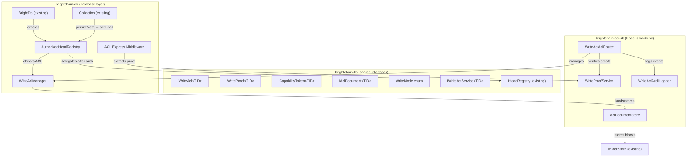
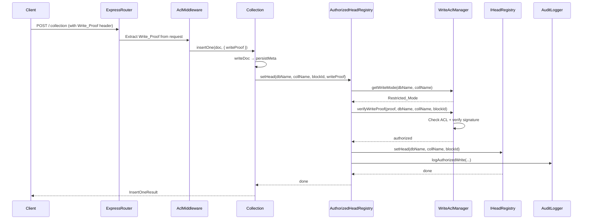
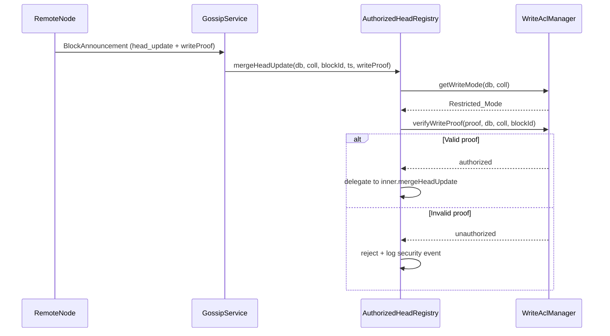

# Design Document: BrightDB Write ACLs

## Overview

This design introduces Write ACLs for BrightDB — a signature-based authorization layer that controls which members can update the head registry for a given database or collection. The block store is an open, content-addressed store that cannot prevent arbitrary writes; therefore, the head registry is the sole enforcement point. Every mutation to the head registry (`setHead`, `removeHead`, `mergeHeadUpdate`) must pass through a write authorization check before the pointer is updated.

The system supports three write modes:
- **Open_Mode** (default): No signature required — backward compatible with existing behavior.
- **Restricted_Mode**: Requires a `Write_Proof` signed by an `Authorized_Writer` listed in the active `Write_ACL`.
- **Owner_Only_Mode**: Requires a `Write_Proof` signed by the database/collection creator.

ACL configuration is stored as signed, versioned `ACL_Documents` in the block store itself, making them auditable, replicable, and tamper-evident. Capability tokens provide time-limited delegated write access without permanent ACL modification.

### Key Design Decisions

1. **Head registry as enforcement point**: Since the block store is content-addressed and open, we cannot prevent block storage. Authorization is enforced at the head registry level — the mapping from `(dbName, collectionName)` to the latest metadata block ID.

2. **Decorator/wrapper pattern for IHeadRegistry**: Rather than modifying the existing `PersistentHeadRegistry` and `InMemoryHeadRegistry` implementations, we introduce an `AuthorizedHeadRegistry` wrapper that decorates any `IHeadRegistry` with write authorization checks. This preserves backward compatibility and follows the open/closed principle.

3. **Reuse of existing crypto patterns**: Write proofs use the same secp256k1 ECDSA signing pattern as `ECDSANodeAuthenticator` and `PoolACLStore`. The `INodeAuthenticator` interface provides `signChallenge`/`verifySignature` which we reuse for write proof creation and verification.

4. **ACL documents in the block store**: Following the `PoolACLStore` pattern, ACL documents are serialized to JSON, signed, and stored as blocks. This makes them replicable through the existing gossip/sync infrastructure.

5. **Generic TID pattern**: All interfaces in `brightchain-lib` use `<TID extends PlatformID = Uint8Array>` for frontend/backend DTO compatibility, consistent with `IPoolACL<TId>`, `MemberDocument<TID>`, etc.

## Architecture

### Component Diagram



### Write Flow (Restricted_Mode)



### Cross-Node Sync Flow



## Components and Interfaces

### 1. WriteMode Enum (brightchain-lib)

```typescript
// brightchain-lib/src/lib/enumerations/writeMode.ts
export enum WriteMode {
  Open = 'open',
  Restricted = 'restricted',
  OwnerOnly = 'owner-only',
}
```

### 2. IWriteAcl<TID> (brightchain-lib)

Core ACL data structure, following the existing `IPoolACL<TId>` generic pattern.

```typescript
// brightchain-lib/src/lib/interfaces/auth/writeAcl.ts
import { PlatformID } from '@digitaldefiance/ecies-lib';
import { WriteMode } from '../../enumerations/writeMode';

export interface IAclScope {
  dbName: string;
  collectionName?: string; // undefined = database-level scope
}

export interface IWriteAcl<TID extends PlatformID = Uint8Array> {
  writeMode: WriteMode;
  authorizedWriters: TID[];    // public keys of authorized writers
  aclAdministrators: TID[];    // public keys of ACL admins
  scope: IAclScope;
  version: number;
  createdAt: Date;
  updatedAt: Date;
  creatorPublicKey: TID;       // the database/collection creator
}
```

### 3. IWriteProof<TID> (brightchain-lib)

```typescript
// brightchain-lib/src/lib/interfaces/auth/writeProof.ts
import { PlatformID } from '@digitaldefiance/ecies-lib';

export interface IWriteProof<TID extends PlatformID = Uint8Array> {
  signerPublicKey: TID;
  signature: Uint8Array;       // ECDSA signature over (dbName + collectionName + blockId)
  dbName: string;
  collectionName: string;
  blockId: string;
}
```

### 4. ICapabilityToken<TID> (brightchain-lib)

```typescript
// brightchain-lib/src/lib/interfaces/auth/capabilityToken.ts
import { PlatformID } from '@digitaldefiance/ecies-lib';
import { IAclScope } from './writeAcl';

export interface ICapabilityToken<TID extends PlatformID = Uint8Array> {
  granteePublicKey: TID;
  scope: IAclScope;
  expiresAt: Date;
  grantorSignature: Uint8Array;
  grantorPublicKey: TID;
}
```

### 5. IAclDocument<TID> (brightchain-lib)

Extends `IWriteAcl<TID>` with block-store metadata for storage and chaining.

```typescript
// brightchain-lib/src/lib/interfaces/auth/aclDocument.ts
import { PlatformID } from '@digitaldefiance/ecies-lib';
import { IWriteAcl } from './writeAcl';

export interface IAclDocument<TID extends PlatformID = Uint8Array>
  extends IWriteAcl<TID> {
  documentId: string;                    // block ID in the block store
  creatorSignature: Uint8Array;          // signature of the creating/modifying admin
  previousVersionBlockId?: string;       // chain to previous version
}
```

### 6. IWriteAclService<TID> (brightchain-lib)

Platform-agnostic service interface for ACL operations.

```typescript
// brightchain-lib/src/lib/interfaces/services/writeAclService.ts
import { PlatformID } from '@digitaldefiance/ecies-lib';
import { IAclDocument } from '../auth/aclDocument';
import { ICapabilityToken } from '../auth/capabilityToken';
import { IWriteProof } from '../auth/writeProof';
import { WriteMode } from '../../enumerations/writeMode';

export interface IWriteAclService<TID extends PlatformID = Uint8Array> {
  getWriteMode(dbName: string, collectionName?: string): WriteMode;
  getAclDocument(dbName: string, collectionName?: string): IAclDocument<TID> | undefined;
  verifyWriteProof(proof: IWriteProof<TID>, dbName: string, collectionName: string, blockId: string): Promise<boolean>;
  verifyCapabilityToken(token: ICapabilityToken<TID>): Promise<boolean>;
  isAuthorizedWriter(publicKey: TID, dbName: string, collectionName?: string): boolean;
  isAclAdministrator(publicKey: TID, dbName: string, collectionName?: string): boolean;
}
```

### 7. AuthorizedHeadRegistry (brightchain-db)

Decorator around any `IHeadRegistry` that adds write authorization checks. This is the core enforcement component.

```typescript
// brightchain-db/src/lib/authorizedHeadRegistry.ts

/**
 * Wraps an IHeadRegistry with write authorization enforcement.
 * 
 * - In Open_Mode: delegates directly to the inner registry (no auth check).
 * - In Restricted_Mode: verifies Write_Proof against the active Write_ACL.
 * - In Owner_Only_Mode: verifies Write_Proof is from the creator.
 * 
 * Read operations (getHead, getAllHeads, getHeadTimestamp) pass through unchanged.
 * Write operations (setHead, removeHead, mergeHeadUpdate) require authorization.
 */
export class AuthorizedHeadRegistry implements IHeadRegistry {
  constructor(
    private readonly inner: IHeadRegistry,
    private readonly aclService: IWriteAclService,
    private readonly authenticator: INodeAuthenticator,
    private readonly auditLogger?: IWriteAclAuditLogger,
  ) {}

  // Read operations: pass through
  getHead(dbName: string, collectionName: string): string | undefined { ... }
  getAllHeads(): Map<string, string> { ... }
  getHeadTimestamp(dbName: string, collectionName: string): Date | undefined { ... }

  // Write operations: authorize then delegate
  async setHead(dbName: string, collectionName: string, blockId: string, writeProof?: IWriteProof): Promise<void> { ... }
  async removeHead(dbName: string, collectionName: string, writeProof?: IWriteProof): Promise<void> { ... }
  async mergeHeadUpdate(dbName: string, collectionName: string, blockId: string, timestamp: Date, writeProof?: IWriteProof): Promise<boolean> { ... }

  // Remaining IHeadRegistry methods delegate directly
  async clear(): Promise<void> { ... }
  async load(): Promise<void> { ... }
  async deferHeadUpdate(...): Promise<void> { ... }
  async applyDeferredUpdates(blockId: string): Promise<number> { ... }
  getDeferredUpdates(): DeferredHeadUpdate[] { ... }
}
```

**Design Decision — Extended setHead signature**: The `IHeadRegistry.setHead` signature is `(dbName, collectionName, blockId)`. The `AuthorizedHeadRegistry` adds an optional `writeProof` parameter. Since TypeScript allows extra parameters in implementations, this is backward compatible. Callers that don't provide a proof will be rejected in Restricted/OwnerOnly modes. The `ICollectionHeadRegistry` interface in `brightchain-db/src/lib/collection.ts` will be extended with an optional `writeProof` parameter.

### 8. WriteAclManager (brightchain-db)

Manages ACL state for a database instance. Loads ACL documents from the block store, caches them in memory, and provides query/mutation operations.

```typescript
// brightchain-db/src/lib/writeAclManager.ts
export class WriteAclManager implements IWriteAclService {
  private readonly aclCache = new Map<string, IAclDocument>(); // key: "dbName" or "dbName:collName"
  
  constructor(
    private readonly blockStore: IBlockStore,
    private readonly authenticator: INodeAuthenticator,
  ) {}

  getWriteMode(dbName: string, collectionName?: string): WriteMode { ... }
  getAclDocument(dbName: string, collectionName?: string): IAclDocument | undefined { ... }
  
  // ACL scope resolution: collection-level overrides database-level
  private resolveAcl(dbName: string, collectionName?: string): IAclDocument | undefined { ... }
  
  // ACL mutations (require admin signature)
  async setAcl(aclDoc: IAclDocument, adminSignature: Uint8Array, adminPublicKey: Uint8Array): Promise<string> { ... }
  async addWriter(dbName: string, collectionName: string | undefined, writerPublicKey: Uint8Array, adminSignature: Uint8Array, adminPublicKey: Uint8Array): Promise<string> { ... }
  async removeWriter(dbName: string, collectionName: string | undefined, writerPublicKey: Uint8Array, adminSignature: Uint8Array, adminPublicKey: Uint8Array): Promise<string> { ... }
  async addAdmin(dbName: string, collectionName: string | undefined, adminPublicKey: Uint8Array, existingAdminSignature: Uint8Array, existingAdminPublicKey: Uint8Array): Promise<string> { ... }
  async removeAdmin(dbName: string, collectionName: string | undefined, adminPublicKey: Uint8Array, existingAdminSignature: Uint8Array, existingAdminPublicKey: Uint8Array): Promise<string> { ... }
  
  // Capability token operations
  async issueCapabilityToken(token: ICapabilityToken, adminSignature: Uint8Array): Promise<ICapabilityToken> { ... }
  async verifyCapabilityToken(token: ICapabilityToken): Promise<boolean> { ... }
  
  // Write proof verification
  async verifyWriteProof(proof: IWriteProof, dbName: string, collectionName: string, blockId: string): Promise<boolean> { ... }
  
  // ACL document storage
  async storeAclDocument(doc: IAclDocument, adminPrivateKey: Uint8Array): Promise<string> { ... }
  async loadAclDocument(blockId: string): Promise<IAclDocument> { ... }
}
```

### 9. AclDocumentStore (brightchain-api-lib)

Node.js-specific ACL document storage, following the `PoolACLStore` pattern. Uses `ECDSANodeAuthenticator` for signing/verification and the `IBlockStore` for persistence.

```typescript
// brightchain-api-lib/src/lib/auth/aclDocumentStore.ts
export class AclDocumentStore {
  constructor(
    private readonly blockStore: IBlockStore,
    private readonly authenticator: ECDSANodeAuthenticator,
  ) {}

  async storeAclDocument(doc: IAclDocument<string>, signerPrivateKey: Uint8Array): Promise<string> { ... }
  async loadAclDocument(blockId: string): Promise<IAclDocument<string>> { ... }
  async updateAclDocument(currentBlockId: string, updatedDoc: IAclDocument<string>, signerPrivateKey: Uint8Array): Promise<string> { ... }
}
```

### 10. WriteAclApiRouter (brightchain-api-lib)

Express router for Write ACL management endpoints, mounted alongside the existing `createDbRouter`.

```
REST API Endpoints:
  GET    /acl/:dbName                          - Get database-level Write_ACL
  GET    /acl/:dbName/:collectionName          - Get collection-level Write_ACL
  PUT    /acl/:dbName                          - Set/update database-level Write_ACL
  PUT    /acl/:dbName/:collectionName          - Set/update collection-level Write_ACL
  POST   /acl/:dbName/writers                  - Add an Authorized_Writer
  POST   /acl/:dbName/:collectionName/writers  - Add an Authorized_Writer (collection)
  DELETE /acl/:dbName/writers/:publicKeyHex     - Remove an Authorized_Writer
  DELETE /acl/:dbName/:collectionName/writers/:publicKeyHex - Remove (collection)
  POST   /acl/:dbName/tokens                   - Issue a Capability_Token
  POST   /acl/:dbName/:collectionName/tokens   - Issue a Capability_Token (collection)
```

All mutating endpoints require an `X-Acl-Admin-Signature` header containing the hex-encoded ECDSA signature from an ACL administrator, and an `X-Acl-Admin-PublicKey` header with the admin's public key.

Write operations on the existing data routes (`POST /:collection`, `PUT /:collection/:id`, etc.) require an `X-Write-Proof` header containing the JSON-serialized `IWriteProof` when the collection is in Restricted_Mode or Owner_Only_Mode.

### 11. WriteAclAuditLogger (brightchain-api-lib)

Structured audit logging for all write ACL events.

```typescript
// brightchain-api-lib/src/lib/auth/writeAclAuditLogger.ts
export interface IWriteAclAuditLogger {
  logAuthorizedWrite(writerPublicKey: string, dbName: string, collectionName: string, blockId: string): void;
  logRejectedWrite(requesterPublicKey: string, dbName: string, collectionName: string, reason: string): void;
  logAclModification(adminPublicKey: string, changeType: string, affectedMember: string, dbName: string, collectionName?: string): void;
  logCapabilityTokenIssued(granteePublicKey: string, scope: IAclScope, expiresAt: Date, grantorPublicKey: string): void;
  logCapabilityTokenUsed(granteePublicKey: string, scope: IAclScope, dbName: string, collectionName: string, blockId: string): void;
  logSecurityEvent(event: string, details: Record<string, unknown>): void;
}
```

### 12. Pool Encryption Integration

When pool encryption is active (`EncryptionMode.PoolShared`), the `WriteAclManager` enforces that `authorizedWriters` is a subset of the pool encryption member list. If a member is removed from the pool encryption member list, they are automatically removed from the Write_ACL.

This is implemented as a validation step in `WriteAclManager.setAcl()` and `WriteAclManager.addWriter()` that cross-references the `IPoolEncryptionConfig.keyVersions[current].encryptedKeys` member list.

## Data Models

### ACL Document JSON Schema

```json
{
  "documentId": "sha256-hex-block-id",
  "writeMode": "restricted",
  "authorizedWriters": ["hex-encoded-public-key-1", "hex-encoded-public-key-2"],
  "aclAdministrators": ["hex-encoded-admin-public-key"],
  "scope": {
    "dbName": "mydb",
    "collectionName": "users"
  },
  "version": 3,
  "createdAt": "2025-01-15T10:00:00.000Z",
  "updatedAt": "2025-01-16T14:30:00.000Z",
  "creatorPublicKey": "hex-encoded-creator-public-key",
  "creatorSignature": "base64-encoded-ecdsa-signature",
  "previousVersionBlockId": "sha256-hex-of-previous-version"
}
```

### Signed ACL Block Format (on-disk)

Following the `SignedACLBlock` pattern from `PoolACLStore`:

```json
{
  "aclJson": "{...serialized IAclDocument without signature...}",
  "signatures": [
    {
      "publicKeyHex": "hex-encoded-admin-public-key",
      "signature": "hex-encoded-ecdsa-signature"
    }
  ]
}
```

### Write Proof Format (in HTTP headers / sync messages)

```json
{
  "signerPublicKey": "hex-encoded-public-key",
  "signature": "hex-encoded-ecdsa-signature",
  "dbName": "mydb",
  "collectionName": "users",
  "blockId": "sha256-hex-of-new-head-block"
}
```

The signature is computed over: `SHA-256(dbName + ":" + collectionName + ":" + blockId)` using the signer's secp256k1 private key via ECDSA.

### Capability Token Format

```json
{
  "granteePublicKey": "hex-encoded-grantee-public-key",
  "scope": {
    "dbName": "mydb",
    "collectionName": "users"
  },
  "expiresAt": "2025-01-20T00:00:00.000Z",
  "grantorSignature": "hex-encoded-ecdsa-signature",
  "grantorPublicKey": "hex-encoded-grantor-public-key"
}
```

The grantor signature is computed over: `SHA-256(granteePublicKey + ":" + dbName + ":" + collectionName + ":" + expiresAt.toISOString())`.

### BlockAnnouncement Extension for Write Proofs

The existing `BlockAnnouncement` interface is extended with an optional `writeProof` field for `head_update` type announcements:

```typescript
// Addition to BlockAnnouncement in gossipService.ts
export interface BlockAnnouncement {
  // ... existing fields ...
  
  /**
   * Optional write proof for head_update announcements in Restricted_Mode.
   * Contains the original writer's signature for cross-node verification.
   */
  writeProof?: {
    signerPublicKey: string;  // hex-encoded
    signature: string;        // hex-encoded
    dbName: string;
    collectionName: string;
    blockId: string;
  };
}
```

### ACL Scope Resolution

```
resolveAcl(dbName, collectionName):
  1. Look up collection-level ACL: cache.get("dbName:collectionName")
  2. If found → return it
  3. Look up database-level ACL: cache.get("dbName")
  4. If found → return it
  5. Return undefined (implies Open_Mode)
```

### Head Registry ACL Mapping

The `WriteAclManager` maintains a mapping from ACL scope keys to ACL document block IDs. This mapping is persisted as a special metadata entry in the head registry itself, using a reserved collection name `__acl__`:

```
headRegistry.setHead(dbName, "__acl__", aclDocumentBlockId)
headRegistry.setHead(dbName, "__acl__:collectionName", aclDocumentBlockId)
```

This leverages the existing head registry persistence mechanism and ensures ACL pointers survive restarts and are included in cross-node sync.

## Correctness Properties

*A property is a characteristic or behavior that should hold true across all valid executions of a system — essentially, a formal statement about what the system should do. Properties serve as the bridge between human-readable specifications and machine-verifiable correctness guarantees.*

### Property 1: ACL Document Serialization Round Trip

*For any* valid `IAclDocument` with arbitrary authorized writers, administrators, scope, version, and timestamps, serializing to JSON and deserializing back SHALL produce an equivalent `IAclDocument` with all fields preserved.

**Validates: Requirements 2.7**

### Property 2: Capability Token Serialization Round Trip

*For any* valid `ICapabilityToken` with arbitrary grantee public key, scope, expiration, and grantor signature, serializing to JSON and deserializing back SHALL produce an equivalent `ICapabilityToken` with all fields preserved.

**Validates: Requirements 6.6**

### Property 3: ACL Scope Resolution

*For any* database name, collection name, database-level ACL, and optional collection-level ACL: if a collection-level ACL exists, `resolveAcl` SHALL return the collection-level ACL; otherwise, it SHALL return the database-level ACL. If neither exists, the effective write mode SHALL be `Open_Mode`.

**Validates: Requirements 1.3, 1.4**

### Property 4: Restricted Mode Write Authorization Enforcement

*For any* head registry mutation (`setHead`, `removeHead`, `mergeHeadUpdate`) on a database/collection in `Restricted_Mode`, the operation SHALL succeed if and only if a valid `Write_Proof` is provided where: (a) the signature verifies against the signer's public key over `(dbName + ":" + collectionName + ":" + blockId)`, and (b) the signer's public key appears in the active `Write_ACL`'s `authorizedWriters` list. Without a valid proof, the head pointer SHALL remain unchanged.

**Validates: Requirements 3.1, 3.2, 3.3, 5.1, 5.2**

### Property 5: Open Mode Accepts All Writes

*For any* head registry mutation on a database/collection in `Open_Mode`, the operation SHALL succeed without requiring a `Write_Proof`.

**Validates: Requirements 3.5**

### Property 6: Owner Only Mode Restricts to Creator

*For any* head registry mutation on a database/collection in `Owner_Only_Mode` and *for any* signer, the operation SHALL succeed if and only if the `Write_Proof` is signed by the `creatorPublicKey` recorded in the ACL document.

**Validates: Requirements 3.6**

### Property 7: ACL Management Requires Administrator Signature

*For any* ACL mutation (add writer, remove writer, add admin, remove admin, change write mode), the operation SHALL succeed if and only if the request is signed by a public key that appears in the current `Write_ACL`'s `aclAdministrators` list. The resulting ACL document SHALL have a version number strictly greater than the previous version.

**Validates: Requirements 4.1, 4.2, 4.3, 4.4, 1.5**

### Property 8: Writer Removal Immediately Revokes Access

*For any* `Authorized_Writer` that is removed from a `Write_ACL`, any subsequent `Write_Proof` signed by that member's key SHALL be rejected by the head registry, even if the proof was valid before the removal.

**Validates: Requirements 4.6**

### Property 9: ACL Version Monotonicity

*For any* ACL document update (whether from local mutation or sync peer), the system SHALL accept the update if and only if the incoming version number is strictly greater than the current version number. Updates with equal or lower version numbers SHALL be rejected.

**Validates: Requirements 2.6, 7.4**

### Property 10: ACL Document Signature Verification on Load

*For any* stored ACL document, loading it SHALL verify the creator's signature against the document content. If the signature does not verify (e.g., the document was tampered with), the load SHALL fail and the ACL SHALL not be applied.

**Validates: Requirements 2.3, 2.4**

### Property 11: Capability Token Temporal Validity

*For any* valid `Capability_Token` signed by a current `ACL_Administrator`, a write request using that token SHALL succeed if and only if the current time is before the token's `expiresAt` timestamp and the token's scope matches the target database/collection.

**Validates: Requirements 6.3**

### Property 12: Sync Write Proof Propagation

*For any* head update announcement propagated to a sync peer for a collection in `Restricted_Mode`, the announcement SHALL include the original writer's `Write_Proof`. The receiving node SHALL verify the proof before applying the head update, and SHALL reject the update if verification fails.

**Validates: Requirements 7.1, 7.2, 7.3, 5.3**

### Property 13: Pool Encryption Member Subset Invariant

*For any* `Write_ACL` on a pool with `EncryptionMode.PoolShared`, every public key in `authorizedWriters` SHALL also appear in the pool encryption member list. Adding a writer not in the pool member list SHALL be rejected. Removing a member from the pool encryption list SHALL automatically remove them from the `Write_ACL`.

**Validates: Requirements 8.2, 8.4**

### Property 14: API Admin Authentication Enforcement

*For any* mutating ACL API request (PUT, POST, DELETE on ACL endpoints), the request SHALL succeed if and only if it includes a valid ECDSA signature from a current `ACL_Administrator`. Requests without a valid admin signature SHALL receive HTTP 403.

**Validates: Requirements 9.2, 9.3, 9.4, 9.5, 9.6**

### Property 15: Audit Log Completeness

*For any* write ACL event (authorized write, rejected write, ACL modification, capability token issuance, capability token usage), the audit logger SHALL record an entry containing the actor's public key, the operation type, the target scope, and a timestamp. The number of audit log entries SHALL equal the number of write ACL events processed.

**Validates: Requirements 11.1, 11.2, 11.3, 11.4, 11.5**

### Property 16: Write Proof Signature Correctness

*For any* secp256k1 key pair and *for any* `(dbName, collectionName, blockId)` triple, creating a `Write_Proof` by signing `SHA-256(dbName + ":" + collectionName + ":" + blockId)` with the private key and then verifying with the corresponding public key SHALL return true. Verifying with any other public key SHALL return false.

**Validates: Requirements 3.2**

### Property 17: Last Administrator Protection

*For any* `Write_ACL` with exactly one `ACL_Administrator`, attempting to remove that administrator SHALL be rejected, leaving the ACL unchanged.

**Validates: Requirements 4.5**

## Error Handling

### Authorization Errors

| Error | Condition | HTTP Status | Action |
|-------|-----------|-------------|--------|
| `WriteAuthorizationError` | Write_Proof missing or invalid in Restricted/OwnerOnly mode | 403 | Reject write, log security event |
| `AclAdminRequiredError` | ACL mutation without valid admin signature | 403 | Reject mutation, log event |
| `CapabilityTokenExpiredError` | Capability token past expiration | 403 | Reject write, return expiration details |
| `CapabilityTokenInvalidError` | Token signature doesn't match any current admin | 403 | Reject write, log security event |
| `LastAdministratorError` | Attempt to remove the last ACL administrator | 400 | Reject removal |
| `AclVersionConflictError` | ACL document version ≤ current version | 409 | Reject update |
| `AclSignatureVerificationError` | ACL document signature fails verification on load | 500 | Reject ACL, log security event |
| `WriterNotInPoolError` | Adding writer not in pool encryption member list | 400 | Reject addition |

### Error Propagation

- **Head registry errors**: `AuthorizedHeadRegistry` throws `WriteAuthorizationError` which propagates up through `Collection.persistMeta()` to the Express route handler, which converts it to HTTP 403.
- **Sync errors**: `mergeHeadUpdate` returns `false` for rejected updates (existing behavior) and additionally logs security events for authorization failures.
- **ACL load errors**: If an ACL document fails signature verification during `load()`, the system falls back to `Open_Mode` for that scope and logs a critical security event. This prevents a corrupted ACL from locking out all writers.

### Graceful Degradation

- If the ACL document block is missing from the block store (e.g., not yet synced), the system treats the scope as `Open_Mode` and logs a warning. This ensures new nodes can operate while ACL documents are being replicated.
- If the `INodeAuthenticator` is not configured (e.g., in test environments), the `AuthorizedHeadRegistry` can be constructed without it, defaulting all scopes to `Open_Mode`.

## Testing Strategy

### Property-Based Testing

All correctness properties (Properties 1–17) SHALL be implemented as property-based tests using `fast-check`. Each test SHALL:
- Run a minimum of 100 iterations
- Reference its design document property via a comment tag
- Tag format: `Feature: brightdb-write-acls, Property {N}: {title}`

**Library**: `fast-check` (already used throughout the codebase, e.g., `poolAcl.property.spec.ts`, `gossipService.property.spec.ts`)

**Test file locations**:
- `brightchain-lib/src/lib/interfaces/auth/writeAcl.property.spec.ts` — Properties 1, 2, 3, 16
- `brightchain-db/src/lib/authorizedHeadRegistry.property.spec.ts` — Properties 4, 5, 6, 8, 9, 17
- `brightchain-db/src/lib/writeAclManager.property.spec.ts` — Properties 7, 10, 11, 13
- `brightchain-api-lib/src/lib/auth/writeAclApiRouter.property.spec.ts` — Property 14
- `brightchain-api-lib/src/lib/auth/writeAclAuditLogger.property.spec.ts` — Property 15
- `brightchain-api-lib/src/lib/auth/aclDocumentStore.property.spec.ts` — Property 12

### Generators

Key `fast-check` generators needed:

```typescript
// Arbitrary secp256k1 key pair
const arbKeyPair = fc.uint8Array({ minLength: 32, maxLength: 32 })
  .map(seed => generateKeyPairFromSeed(seed));

// Arbitrary WriteMode
const arbWriteMode = fc.constantFrom(WriteMode.Open, WriteMode.Restricted, WriteMode.OwnerOnly);

// Arbitrary ACL scope
const arbAclScope = fc.record({
  dbName: fc.string({ minLength: 1, maxLength: 64 }).filter(s => !s.includes(':')),
  collectionName: fc.option(fc.string({ minLength: 1, maxLength: 64 }).filter(s => !s.includes(':'))),
});

// Arbitrary IWriteAcl
const arbWriteAcl = fc.record({
  writeMode: arbWriteMode,
  authorizedWriters: fc.array(arbPublicKey, { minLength: 0, maxLength: 10 }),
  aclAdministrators: fc.array(arbPublicKey, { minLength: 1, maxLength: 5 }),
  scope: arbAclScope,
  version: fc.nat({ max: 1000 }),
  createdAt: fc.date(),
  updatedAt: fc.date(),
  creatorPublicKey: arbPublicKey,
});

// Arbitrary ICapabilityToken
const arbCapabilityToken = fc.record({
  granteePublicKey: arbPublicKey,
  scope: arbAclScope,
  expiresAt: fc.date({ min: new Date(), max: new Date(Date.now() + 86400000) }),
  grantorSignature: fc.uint8Array({ minLength: 64, maxLength: 72 }),
  grantorPublicKey: arbPublicKey,
});
```

### Unit Tests

Unit tests complement property tests for specific examples and edge cases:

- **Edge cases**: Empty ACL (no writers), single admin removal, expired token boundary, version number overflow
- **Integration**: Express middleware extracts Write_Proof from headers correctly, API routes return correct HTTP status codes
- **Error paths**: Tampered ACL document, invalid signature format, missing required fields
- **Backward compatibility**: Existing code paths without Write_Proof work in Open_Mode

### Test Execution

```bash
# Run all write ACL tests
yarn nx test brightchain-lib --testPathPatterns="writeAcl"
yarn nx test brightchain-db --testPathPatterns="authorizedHeadRegistry|writeAclManager"
yarn nx test brightchain-api-lib --testPathPatterns="writeAcl|aclDocument"
```

# Requirements

## Introduction

BrightDB currently supports encrypted pools that restrict participation to a select group of members, but lacks a mechanism for public-read, restricted-write access control. In a decentralized system where the block store is an open, content-addressed store that cannot prevent arbitrary writes, the head registry becomes the sole enforcement point for write authorization. Without write ACLs, any participant who can reach the DB server can update the head registry and thus effectively "write" to a collection.

This feature introduces Write ACLs for BrightDB — a system that controls which members are authorized to update the head registry for a given database or collection. The design is informed by the following architectural constraints:

1. **The block store cannot be protected.** Any node can write blocks to the content-addressed store. Blocks are immutable and identified by their checksum; there is no way to prevent a block from being stored.
2. **The head registry is the enforcement point.** The head registry maps (dbName, collectionName) to the latest metadata block ID. Controlling who can update this mapping is equivalent to controlling who can write to the database.
3. **The DB server is the arbiter.** In a server-mediated topology, the BrightDB server validates write requests before updating the head registry. In a decentralized topology, nodes validate incoming head updates during sync/merge.
4. **Signatures provide cryptographic proof of authorship.** Members already have signing keys (EC key pairs). Write requests can carry signatures that the head registry validates against an ACL before accepting the update.
5. **Multiple deployment scenarios must be supported:** private clusters (no encryption, no ACLs), encrypted pools (pool-shared encryption restricts both read and write), public-read/restricted-write (ACLs on head registry, no encryption), and fully open (anyone can read and write).

The approach combines:
- **Signature-based write authorization** at the head registry level, where every write operation must be signed by an authorized member's key.
- **Write ACL configuration** per database/collection, stored as a signed ACL document in the block store itself (self-describing, auditable, replicable).
- **Capability tokens** for delegated write access, enabling scenarios where a dApp grants temporary write permission without sharing private keys.
- **Compatibility with pool encryption**, where the pool's shared key already restricts participation — ACLs add finer-grained write control within an encrypted pool or enable write restriction on unencrypted pools.

## Glossary

- **Head_Registry**: The component that maps (dbName, collectionName) pairs to the block ID of the latest metadata block. The sole enforcement point for write authorization.
- **Write_ACL**: An Access Control List that specifies which members are authorized to update the Head_Registry for a given database or collection. Stored as a signed document in the block store.
- **ACL_Document**: A signed, versioned JSON document stored in the block store that contains the Write_ACL configuration for a database or collection.
- **Write_Mode**: The access control mode for a database or collection. One of: Open (anyone can write), Restricted (only authorized members can write), or Owner_Only (only the creator can write).
- **Authorized_Writer**: A member whose public key appears in the Write_ACL for a given database or collection, granting permission to update the Head_Registry.
- **ACL_Administrator**: A member authorized to modify the Write_ACL itself. The database creator is always an ACL_Administrator.
- **Signed_Write_Request**: A write operation (head registry update) accompanied by a cryptographic signature from the requesting member, proving authorship.
- **Capability_Token**: A time-limited, scope-limited token signed by an ACL_Administrator that grants temporary write access to a member not on the permanent ACL.
- **Write_Proof**: The combination of a member's signature over the new head block ID and the member's public key, submitted alongside a head registry update for verification.
- **ACL_Scope**: The granularity at which a Write_ACL applies: database-level (all collections inherit) or collection-level (overrides database-level).
- **Open_Mode**: A Write_Mode where the Head_Registry accepts updates from any requester without signature verification. This is the current default behavior.
- **Restricted_Mode**: A Write_Mode where the Head_Registry requires a valid Write_Proof from an Authorized_Writer before accepting an update.
- **Owner_Only_Mode**: A Write_Mode where only the database/collection creator can update the Head_Registry.
- **BrightDB_Server**: The server process that hosts BrightDB and mediates access to the Head_Registry and block store.
- **Sync_Peer**: A remote BrightDB node that exchanges head registry updates during cross-node synchronization.
- **Collection**: A named group of documents within a BrightDB database, backed by blocks in the block store and tracked by the Head_Registry.
- **Member**: A BrightChain participant with an EC key pair (signing key and data key), identified by a GuidV4 ID.

## Requirements

### Requirement 1: Write Mode Configuration

**User Story:** As a database administrator, I want to configure the write access mode for each database and collection, so that I can control whether writes are open, restricted to specific members, or limited to the owner.

#### Acceptance Criteria

1. THE BrightDB_Server SHALL support three Write_Modes for each database: Open_Mode, Restricted_Mode, and Owner_Only_Mode
2. WHEN a database is created without specifying a Write_Mode, THE BrightDB_Server SHALL default to Open_Mode for backward compatibility
3. THE BrightDB_Server SHALL allow Write_Mode to be configured at database-level and overridden at collection-level (ACL_Scope)
4. WHEN a collection does not have a collection-level Write_Mode, THE BrightDB_Server SHALL inherit the database-level Write_Mode for that collection
5. WHEN a Write_Mode is changed from Open_Mode to Restricted_Mode, THE BrightDB_Server SHALL require the request to be signed by the database creator or an ACL_Administrator

### Requirement 2: Write ACL Document Storage

**User Story:** As a database administrator, I want the Write ACL to be stored as a signed, versioned document in the block store, so that ACL configuration is auditable, replicable, and tamper-evident.

#### Acceptance Criteria

1. THE BrightDB_Server SHALL store each Write_ACL as an ACL_Document in the block store
2. THE ACL_Document SHALL contain: the list of Authorized_Writer public keys, the list of ACL_Administrator public keys, the Write_Mode, the ACL_Scope (database or collection name), a version number, a creation timestamp, and the creator's signature
3. THE BrightDB_Server SHALL sign each ACL_Document with the creating or modifying ACL_Administrator's key
4. WHEN an ACL_Document is loaded, THE BrightDB_Server SHALL verify the signature before applying the ACL configuration
5. IF the ACL_Document signature verification fails, THEN THE BrightDB_Server SHALL reject the ACL_Document and log a security event
6. THE BrightDB_Server SHALL track ACL_Document versions using a monotonically increasing version number, and THE BrightDB_Server SHALL reject ACL_Documents with a version number less than or equal to the current version
7. THE ACL_Document SHALL be serializable to JSON and deserializable from JSON (round-trip property: parse(serialize(aclDoc)) produces an equivalent ACL_Document)

### Requirement 3: Signed Write Requests

**User Story:** As a BrightDB server operator, I want every write operation in Restricted_Mode to carry a cryptographic signature, so that the head registry can verify the requester is an Authorized_Writer before accepting the update.

#### Acceptance Criteria

1. WHILE a database or collection is in Restricted_Mode, THE BrightDB_Server SHALL require a Write_Proof with every head registry update request
2. THE Write_Proof SHALL consist of the member's signature over the concatenation of the database name, collection name, and new head block ID
3. WHEN a Write_Proof is received, THE BrightDB_Server SHALL verify the signature against the Authorized_Writer public keys in the active Write_ACL
4. IF the Write_Proof signature is invalid or the signer is not an Authorized_Writer, THEN THE BrightDB_Server SHALL reject the head registry update and return an authorization error
5. WHILE a database or collection is in Open_Mode, THE BrightDB_Server SHALL accept head registry updates without requiring a Write_Proof
6. WHILE a database or collection is in Owner_Only_Mode, THE BrightDB_Server SHALL accept head registry updates only when the Write_Proof is signed by the database or collection creator

### Requirement 4: ACL Management Operations

**User Story:** As a database administrator, I want to add and remove authorized writers from the Write ACL, so that I can grant and revoke write access as team membership changes.

#### Acceptance Criteria

1. THE BrightDB_Server SHALL provide an operation to add an Authorized_Writer to a Write_ACL, requiring a valid signature from an ACL_Administrator
2. THE BrightDB_Server SHALL provide an operation to remove an Authorized_Writer from a Write_ACL, requiring a valid signature from an ACL_Administrator
3. THE BrightDB_Server SHALL provide an operation to add an ACL_Administrator to a Write_ACL, requiring a valid signature from an existing ACL_Administrator
4. THE BrightDB_Server SHALL provide an operation to remove an ACL_Administrator from a Write_ACL, requiring a valid signature from an existing ACL_Administrator
5. IF an ACL_Administrator removal would leave the Write_ACL with zero ACL_Administrators, THEN THE BrightDB_Server SHALL reject the removal
6. WHEN an Authorized_Writer is removed, THE BrightDB_Server SHALL immediately reject subsequent write requests from that member
7. THE BrightDB_Server SHALL emit a change event when the Write_ACL is modified, including the operation type, the affected member, and the acting ACL_Administrator

### Requirement 5: Head Registry Write Authorization Enforcement

**User Story:** As a BrightDB server operator, I want the head registry to enforce write authorization on every mutation, so that unauthorized writes are rejected regardless of how the request arrives (API, sync, or direct call).

#### Acceptance Criteria

1. THE Head_Registry SHALL check write authorization before executing setHead, removeHead, and mergeHeadUpdate operations
2. WHEN a setHead call is made in Restricted_Mode without a valid Write_Proof, THE Head_Registry SHALL throw an authorization error and leave the head pointer unchanged
3. WHEN a mergeHeadUpdate is received from a Sync_Peer in Restricted_Mode, THE Head_Registry SHALL verify the Write_Proof carried in the sync message before applying the update
4. IF a mergeHeadUpdate from a Sync_Peer fails Write_Proof verification, THEN THE Head_Registry SHALL reject the update and log a security event with the peer identity and attempted block ID
5. THE Head_Registry SHALL enforce write authorization consistently across all code paths: direct API calls, Express middleware routes, transaction commits, and cross-node sync

### Requirement 6: Capability Token Support

**User Story:** As a dApp developer, I want to issue time-limited write tokens to users, so that I can grant temporary write access without permanently modifying the ACL.

#### Acceptance Criteria

1. THE BrightDB_Server SHALL support Capability_Tokens that grant temporary write access to a specific database or collection
2. THE Capability_Token SHALL contain: the grantee's public key, the ACL_Scope (database and optional collection), an expiration timestamp, and the granting ACL_Administrator's signature
3. WHEN a write request includes a valid Capability_Token instead of permanent ACL membership, THE BrightDB_Server SHALL accept the write if the token is not expired and the signature is valid
4. IF a Capability_Token has expired, THEN THE BrightDB_Server SHALL reject the write request and return an expiration error
5. IF a Capability_Token signature does not match any current ACL_Administrator, THEN THE BrightDB_Server SHALL reject the write request
6. THE Capability_Token SHALL be serializable to JSON and deserializable from JSON (round-trip property: parse(serialize(token)) produces an equivalent Capability_Token)

### Requirement 7: Cross-Node Sync with Write ACLs

**User Story:** As a cluster operator, I want Write ACLs to be enforced during cross-node synchronization, so that unauthorized head updates from compromised or misconfigured peers are rejected.

#### Acceptance Criteria

1. WHEN a Sync_Peer announces a head update for a collection in Restricted_Mode, THE receiving node SHALL require a Write_Proof in the sync message
2. THE Sync_Peer SHALL include the original writer's Write_Proof when propagating head updates to other nodes
3. WHEN a node receives an ACL_Document update from a Sync_Peer, THE node SHALL verify the ACL_Document signature and version before applying the ACL change
4. IF an ACL_Document from a Sync_Peer has a lower or equal version number to the local ACL_Document, THEN THE node SHALL reject the incoming ACL_Document
5. THE BrightDB_Server SHALL replicate ACL_Documents through the same block store synchronization mechanism used for data blocks

### Requirement 8: Integration with Pool Encryption

**User Story:** As a system architect, I want Write ACLs to work alongside pool encryption, so that encrypted pools can have fine-grained write control in addition to the read restriction provided by encryption.

#### Acceptance Criteria

1. WHEN a pool uses PoolShared encryption mode, THE BrightDB_Server SHALL allow Write_ACL configuration independently of the pool encryption member list
2. THE Write_ACL Authorized_Writer list SHALL be a subset of or equal to the pool encryption member list when pool encryption is active (a member cannot write if the member cannot participate in the pool)
3. WHEN a pool uses no encryption (EncryptionMode.None), THE BrightDB_Server SHALL allow Write_ACL to restrict writes while keeping reads open to all participants
4. IF an Authorized_Writer is removed from the pool encryption member list, THEN THE BrightDB_Server SHALL automatically remove that member from the Write_ACL

### Requirement 9: Express API for Write ACL Management

**User Story:** As a dApp developer, I want REST API endpoints for managing Write ACLs, so that I can configure access control through the standard BrightDB HTTP interface.

#### Acceptance Criteria

1. THE BrightDB_Server SHALL expose a GET endpoint to retrieve the current Write_ACL for a database or collection
2. THE BrightDB_Server SHALL expose a PUT endpoint to set or update the Write_ACL for a database or collection, requiring a signed request from an ACL_Administrator
3. THE BrightDB_Server SHALL expose a POST endpoint to add an Authorized_Writer, requiring a signed request from an ACL_Administrator
4. THE BrightDB_Server SHALL expose a DELETE endpoint to remove an Authorized_Writer, requiring a signed request from an ACL_Administrator
5. THE BrightDB_Server SHALL expose a POST endpoint to issue a Capability_Token, requiring a signed request from an ACL_Administrator
6. WHEN an API request modifying the Write_ACL lacks a valid ACL_Administrator signature, THE BrightDB_Server SHALL return HTTP 403 with a descriptive error message

### Requirement 10: Write ACL Interfaces in brightchain-lib

**User Story:** As a library consumer, I want Write ACL interfaces and types defined in brightchain-lib, so that both frontend and backend code can work with ACL data structures using the standard generic TID pattern.

#### Acceptance Criteria

1. THE brightchain-lib SHALL export an IWriteAcl<TID> interface containing: writeMode, authorizedWriters (array of TID), aclAdministrators (array of TID), scope (database name and optional collection name), version number, createdAt, and updatedAt
2. THE brightchain-lib SHALL export an IWriteProof<TID> interface containing: signerPublicKey (TID), signature (Uint8Array), dbName (string), collectionName (string), and blockId (string)
3. THE brightchain-lib SHALL export an ICapabilityToken<TID> interface containing: granteePublicKey (TID), scope, expiresAt (Date), grantorSignature (Uint8Array), and grantorPublicKey (TID)
4. THE brightchain-lib SHALL export a WriteMode enum with values: Open, Restricted, and OwnerOnly
5. THE brightchain-lib SHALL export an IAclDocument<TID> interface that extends IWriteAcl<TID> with: documentId (string), creatorSignature (Uint8Array), and previousVersionBlockId (optional string)

### Requirement 11: Audit Logging for Write ACL Events

**User Story:** As a security auditor, I want all Write ACL operations and authorization decisions logged, so that I can review access patterns and detect unauthorized write attempts.

#### Acceptance Criteria

1. WHEN a write request is authorized in Restricted_Mode, THE BrightDB_Server SHALL log the event with the writer's public key, database name, collection name, and new block ID
2. WHEN a write request is rejected due to authorization failure, THE BrightDB_Server SHALL log the event with the requester's public key, the reason for rejection, and the attempted operation
3. WHEN the Write_ACL is modified, THE BrightDB_Server SHALL log the modification with the acting ACL_Administrator's public key, the change type, and the affected member
4. WHEN a Capability_Token is issued, THE BrightDB_Server SHALL log the issuance with the grantee's public key, the scope, the expiration, and the granting ACL_Administrator
5. WHEN a Capability_Token is used for a write, THE BrightDB_Server SHALL log the usage with the token details and the write operation
