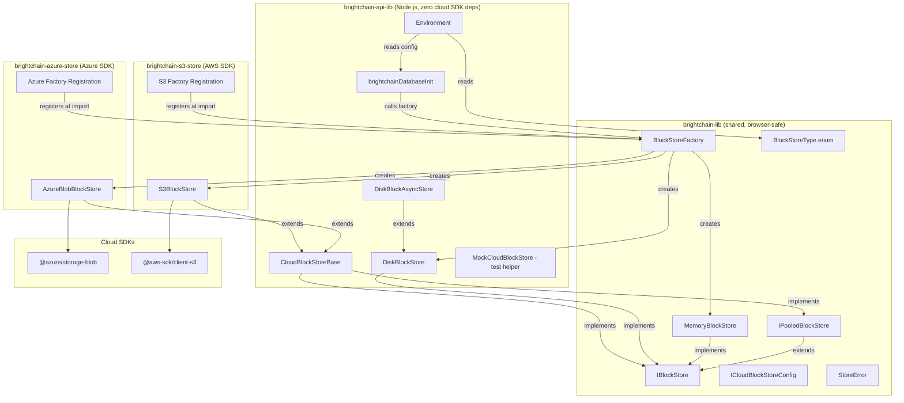
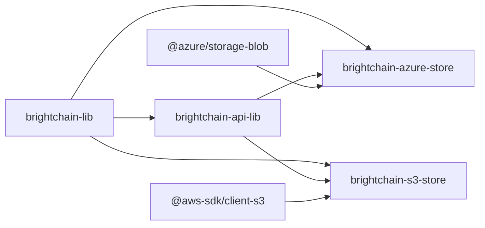
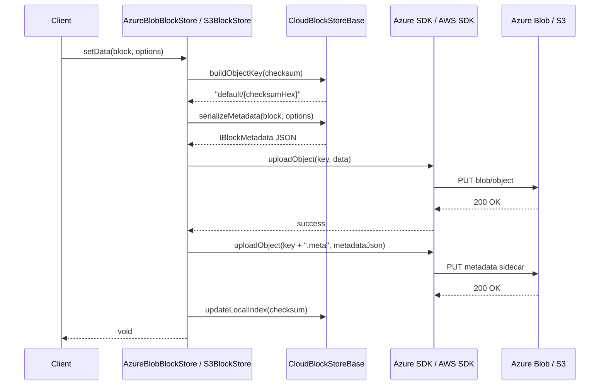

# Design Document: Cloud Block Store Drivers

## Overview

This design adds two cloud-backed `IBlockStore` implementations — `AzureBlobBlockStore` and `S3BlockStore` — to the BrightChain system. Shared, provider-agnostic types (`ICloudBlockStoreConfig`, `BlockStoreType` enum) live in `brightchain-lib` so that frontend and backend code can reference cloud store configuration without depending on cloud SDKs.

The abstract base class `CloudBlockStoreBase`, the `MockCloudBlockStore` test helper, and all property-based tests reside in `brightchain-api-lib` (Node.js-specific, zero cloud SDK deps).

Each concrete cloud provider driver lives in its own dedicated Nx library to keep heavy cloud SDK dependencies isolated:

- **`@brightchain/azure-store`** — contains `AzureBlobBlockStore`, depends on `@azure/storage-blob`, `brightchain-lib`, and `brightchain-api-lib`
- **`@brightchain/s3-store`** — contains `S3BlockStore`, depends on `@aws-sdk/client-s3`, `brightchain-lib`, and `brightchain-api-lib`

This separation means consumers who don't need cloud storage never pull in Azure or AWS SDKs. The consuming application imports whichever cloud lib it needs and the factory registration modules in each lib register with `BlockStoreFactory` at import time.

The cloud stores follow the same architectural patterns as the existing `DiskBlockStore` / `DiskBlockAsyncStore`:

- Factory registration at import time via `BlockStoreFactory`
- Environment-driven configuration via the `Environment` class
- Metadata stored as sidecar objects (`.meta` suffix)
- Parity blocks stored under a `parity/` prefix
- Pool isolation via key prefixes (`{poolId}/{checksum}`)
- Retry with exponential backoff for transient cloud errors

### Key Design Decisions

1. **Separate Nx libraries per cloud provider**: Azure and AWS SDKs are heavy dependencies. Isolating each provider into its own library (`brightchain-azure-store`, `brightchain-s3-store`) means `brightchain-api-lib` stays free of cloud SDK deps. Consumers import only the cloud libs they need.

2. **Sidecar metadata objects over cloud-native metadata**: Azure blob metadata and S3 object metadata have size limits (8 KB for Azure, 2 KB for S3). `IBlockMetadata` can exceed these limits (especially `replicaNodeIds` and `parityBlockIds` arrays). Using `.meta` suffix sidecar JSON objects provides unlimited metadata size and consistent behavior across providers.

3. **Local checksum index for `getRandomBlocks`**: Listing all objects in a cloud container/bucket for random selection is expensive. A local in-memory index of stored checksums is maintained and lazily refreshed, matching the pattern used by `DiskBlockStore.getRandomBlocks` which reads directory listings.

4. **Abstract base class `CloudBlockStoreBase` in `brightchain-api-lib`**: Both Azure and S3 implementations share significant logic (metadata serialization, FEC orchestration, CBL whitening, pool key management, retry logic). The abstract base class in `brightchain-api-lib` encapsulates this shared behavior with zero cloud SDK deps, and subclasses in their respective libraries implement only the cloud-specific I/O primitives.

5. **Retry strategy**: Transient errors (network timeouts, throttling, 5xx responses) are retried up to 3 times with exponential backoff (base 1s, factor 2x). Non-transient errors (404, 403, validation) propagate immediately. This matches cloud SDK best practices.

6. **Pool isolation via key prefixes**: Cloud stores use `{poolId}/{checksum}` as the object key, mirroring the `{poolId}:{hash}` pattern in `PooledMemoryBlockStore` but using `/` as the separator for natural cloud storage hierarchy and prefix-based listing.

## Architecture



### Library Dependency Graph



### Data Flow: Block Storage



## Components and Interfaces

### 1. Shared Types in `brightchain-lib`

#### `BlockStoreType` Enum

Enumeration in `brightchain-lib/src/lib/enumerations/blockStoreType.ts`:

```typescript
export enum BlockStoreType {
  Memory = 'memory',
  Disk = 'disk',
  AzureBlob = 'azure',
  S3 = 's3',
}
```

#### `ICloudBlockStoreConfig` Interface

Interface in `brightchain-lib/src/lib/interfaces/storage/cloudBlockStoreConfig.ts`:

```typescript
export interface ICloudBlockStoreConfig {
  /** Cloud region (e.g., "us-east-1", "eastus") */
  region: string;
  /** Container name (Azure) or bucket name (S3) */
  containerOrBucketName: string;
  /** Block size for this store */
  blockSize: BlockSize;
  /** Optional key prefix for all objects in this store */
  keyPrefix?: string;
}
```

#### `BlockStoreFactory` Extensions

Added to existing `BlockStoreFactory` in `brightchain-lib/src/lib/factories/blockStoreFactory.ts`:

```typescript
// New factory function types
export type AzureStoreFactoryFn = (config: ICloudBlockStoreConfig) => IBlockStore;
export type S3StoreFactoryFn = (config: ICloudBlockStoreConfig) => IBlockStore;

// New static fields and methods on BlockStoreFactory
private static azureStoreFactory: AzureStoreFactoryFn | null = null;
private static s3StoreFactory: S3StoreFactoryFn | null = null;

public static registerAzureStoreFactory(factory: AzureStoreFactoryFn): void;
public static registerS3StoreFactory(factory: S3StoreFactoryFn): void;
public static clearAzureStoreFactory(): void;
public static clearS3StoreFactory(): void;
public static createAzureStore(config: ICloudBlockStoreConfig): IBlockStore;
public static createS3Store(config: ICloudBlockStoreConfig): IBlockStore;
```

`createAzureStore` and `createS3Store` throw a `StoreError` with `StoreErrorType.FactoryNotRegistered` if no factory is registered.

### 2. `CloudBlockStoreBase` Abstract Class

Located in `brightchain-api-lib/src/lib/stores/cloudBlockStoreBase.ts`.

This abstract class implements `IBlockStore` and `IPooledBlockStore`, encapsulating all shared cloud store logic with zero cloud SDK dependencies:

```typescript
export abstract class CloudBlockStoreBase implements IBlockStore, IPooledBlockStore {
  protected readonly config: ICloudBlockStoreConfig;
  protected readonly _blockSize: BlockSize;
  protected fecService: IFecService | null = null;
  protected localIndex: Set<string> = new Set();
  protected indexStale: boolean = true;

  constructor(config: ICloudBlockStoreConfig);

  // === Abstract primitives (implemented by Azure/S3 subclasses) ===
  protected abstract uploadObject(key: string, data: Uint8Array): Promise<void>;
  protected abstract downloadObject(key: string): Promise<Uint8Array>;
  protected abstract deleteObject(key: string): Promise<void>;
  protected abstract objectExists(key: string): Promise<boolean>;
  protected abstract listObjects(prefix: string, maxResults?: number): Promise<string[]>;
  protected abstract isTransientError(error: unknown): boolean;

  // === Retry logic ===
  protected async withRetry<T>(
    operation: string,
    blockChecksum: string,
    fn: () => Promise<T>,
    maxRetries?: number,
  ): Promise<T>;

  // === Key management ===
  protected buildObjectKey(checksum: string, poolId?: PoolId): string;
  protected buildMetaKey(checksum: string, poolId?: PoolId): string;
  protected buildParityKey(checksum: string, parityIndex: number, poolId?: PoolId): string;

  // === IBlockStore implementation (delegates to abstract primitives) ===
  // ... all methods from IBlockStore ...

  // === IPooledBlockStore implementation ===
  // ... all methods from IPooledBlockStore ...
}
```

#### Key Management Scheme

Object keys follow this pattern:

- Block data: `{keyPrefix}{poolId}/{checksumHex}`
- Metadata sidecar: `{keyPrefix}{poolId}/{checksumHex}.meta`
- Parity blocks: `{keyPrefix}{poolId}/parity/{checksumHex}/{parityIndex}`

Where `keyPrefix` is optional (from config) and `poolId` defaults to `"default"`.

#### Retry Logic

```typescript
protected async withRetry<T>(
  operation: string,
  blockChecksum: string,
  fn: () => Promise<T>,
  maxRetries = 3,
): Promise<T> {
  let lastError: unknown;
  for (let attempt = 0; attempt <= maxRetries; attempt++) {
    try {
      return await fn();
    } catch (error) {
      lastError = error;
      if (!this.isTransientError(error) || attempt === maxRetries) {
        break;
      }
      const delay = Math.pow(2, attempt) * 1000; // 1s, 2s, 4s
      await new Promise((resolve) => setTimeout(resolve, delay));
    }
  }
  throw new StoreError(StoreErrorType.CloudOperationFailed, undefined, {
    operation,
    blockChecksum,
    originalError: String(lastError),
  });
}
```

### 3. `AzureBlobBlockStore`

Located in `brightchain-azure-store/src/lib/stores/azureBlobBlockStore.ts` (in the `@brightchain/azure-store` library).

```typescript
export interface IAzureBlobBlockStoreConfig extends ICloudBlockStoreConfig {
  connectionString?: string;
  accountName?: string;
  accountKey?: string;
  useManagedIdentity?: boolean;
}

export class AzureBlobBlockStore extends CloudBlockStoreBase {
  private containerClient: ContainerClient;

  constructor(config: IAzureBlobBlockStoreConfig);

  // Implements abstract primitives using @azure/storage-blob SDK
  protected uploadObject(key: string, data: Uint8Array): Promise<void>;
  protected downloadObject(key: string): Promise<Uint8Array>;
  protected deleteObject(key: string): Promise<void>;
  protected objectExists(key: string): Promise<boolean>;
  protected listObjects(prefix: string, maxResults?: number): Promise<string[]>;
  protected isTransientError(error: unknown): boolean;
}
```

Authentication priority:

1. Connection string (`AZURE_STORAGE_CONNECTION_STRING`)
2. Account name + key (`AZURE_STORAGE_ACCOUNT_NAME` + `AZURE_STORAGE_ACCOUNT_KEY`)
3. Managed identity (`DefaultAzureCredential`)

Transient error detection: HTTP status codes 408, 429, 500, 502, 503, 504, and `RestError` with `code` matching known transient codes.

### 4. `S3BlockStore`

Located in `brightchain-s3-store/src/lib/stores/s3BlockStore.ts` (in the `@brightchain/s3-store` library).

```typescript
export interface IS3BlockStoreConfig extends ICloudBlockStoreConfig {
  accessKeyId?: string;
  secretAccessKey?: string;
  useIamRole?: boolean;
  endpoint?: string; // For S3-compatible services (MinIO, LocalStack)
}

export class S3BlockStore extends CloudBlockStoreBase {
  private s3Client: S3Client;

  constructor(config: IS3BlockStoreConfig);

  // Implements abstract primitives using @aws-sdk/client-s3 SDK
  protected uploadObject(key: string, data: Uint8Array): Promise<void>;
  protected downloadObject(key: string): Promise<Uint8Array>;
  protected deleteObject(key: string): Promise<void>;
  protected objectExists(key: string): Promise<boolean>;
  protected listObjects(prefix: string, maxResults?: number): Promise<string[]>;
  protected isTransientError(error: unknown): boolean;
}
```

Authentication priority:

1. Explicit credentials (`AWS_ACCESS_KEY_ID` + `AWS_SECRET_ACCESS_KEY`)
2. IAM role / environment credential chain (default SDK behavior)

Transient error detection: `$retryable` property on SDK errors, HTTP status codes 429, 500, 502, 503, 504, and `TimeoutError` / `NetworkingError` names.

### 5. Factory Registration Modules

Each cloud provider library contains its own factory registration module that registers with `BlockStoreFactory` at import time.

#### Azure Factory Registration

Located in `brightchain-azure-store/src/lib/factories/azureBlockStoreFactory.ts`:

```typescript
import { BlockStoreFactory, ICloudBlockStoreConfig } from '@brightchain/brightchain-lib';
import { AzureBlobBlockStore, IAzureBlobBlockStoreConfig } from '../stores/azureBlobBlockStore';

BlockStoreFactory.registerAzureStoreFactory(
  (config: ICloudBlockStoreConfig) => new AzureBlobBlockStore(config as IAzureBlobBlockStoreConfig),
);
```

Imported by `brightchain-azure-store/src/index.ts` so registration happens when the library is imported.

#### S3 Factory Registration

Located in `brightchain-s3-store/src/lib/factories/s3BlockStoreFactory.ts`:

```typescript
import { BlockStoreFactory, ICloudBlockStoreConfig } from '@brightchain/brightchain-lib';
import { S3BlockStore, IS3BlockStoreConfig } from '../stores/s3BlockStore';

BlockStoreFactory.registerS3StoreFactory(
  (config: ICloudBlockStoreConfig) => new S3BlockStore(config as IS3BlockStoreConfig),
);
```

Imported by `brightchain-s3-store/src/index.ts` so registration happens when the library is imported.

### 6. Environment Class Extensions

The `Environment` class in `brightchain-api-lib` gains:

```typescript
// New fields
private _blockStoreType: BlockStoreType;
private _azureConfig?: IAzureBlobBlockStoreConfig;
private _s3Config?: IS3BlockStoreConfig;

// New accessors
public get blockStoreType(): BlockStoreType;
public get azureConfig(): IAzureBlobBlockStoreConfig | undefined;
public get s3Config(): IS3BlockStoreConfig | undefined;
```

Constructor reads `BRIGHTCHAIN_BLOCKSTORE_TYPE` (defaults to `"disk"`) and validates that required environment variables are present for the selected type. Missing variables throw a descriptive error at construction time.

### 7. `brightchainDatabaseInit` Updates — Static Plugin Registration (No Dynamic Imports)

#### Design Rationale

Dynamic `import()` calls are fragile, hard to test, and create invisible coupling between `brightchain-api-lib` and the cloud store libraries. Instead, we use a **static plugin registration** pattern that is architecturally correct and future-forward:

1. Each cloud store library self-registers its factory with `BlockStoreFactory` at import time (already implemented in tasks 5.3 and 6.3).
2. The **consuming application** (e.g. `brightchain-api`, `brightchain-inituserdb`) is responsible for importing the cloud store libraries it needs at its entry point. This is a static, explicit opt-in — no magic.
3. `brightchainDatabaseInit` simply calls `BlockStoreFactory.createAzureStore()` or `BlockStoreFactory.createS3Store()` based on the environment config. If the factory isn't registered, `StoreErrorType.FactoryNotRegistered` fires with a clear, actionable error message.

This is the same pattern used by TypeORM drivers, Passport strategies, and NestJS modules: the consumer imports the plugin, the plugin self-registers, the core code calls the factory.

#### `brightchainDatabaseInit` Changes

The function gains two new branches in its store-creation logic. No imports of cloud libraries — just factory calls:

```typescript
case BlockStoreType.AzureBlob:
  // Factory must have been registered by the consuming app importing
  // '@brightchain/azure-store' at its entry point.
  blockStore = BlockStoreFactory.createAzureStore(environment.azureConfig!);
  break;
case BlockStoreType.S3:
  // Factory must have been registered by the consuming app importing
  // '@brightchain/s3-store' at its entry point.
  blockStore = BlockStoreFactory.createS3Store(environment.s3Config!);
  break;
```

`brightchain-api-lib` has zero static or dynamic dependencies on the cloud store libraries. It only depends on `BlockStoreFactory` from `brightchain-lib`, which defines the factory function types but not the implementations.

#### Consuming Application Responsibility

The consuming application opts in to cloud providers via static imports at its entry point. For example, in `brightchain-api`:

```typescript
// brightchain-api/src/main.ts (or application.ts)
// Static imports — opt in to the cloud providers you need.
// Each import triggers self-registration with BlockStoreFactory.
import '@brightchain/azure-store';  // registers AzureBlobBlockStore factory
import '@brightchain/s3-store';     // registers S3BlockStore factory
```

Or, if only Azure is needed:

```typescript
import '@brightchain/azure-store';
// S3 not imported — BlockStoreFactory.createS3Store() would throw FactoryNotRegistered
```

This pattern ensures:

- **No hidden dependencies**: The app's `package.json` and import graph explicitly declare which cloud providers are used.
- **Tree-shakeable**: Bundlers can eliminate unused cloud SDKs entirely.
- **Testable**: Tests can register mock factories without importing real cloud SDKs.
- **Clear error path**: If a user configures `BRIGHTCHAIN_BLOCKSTORE_TYPE=azure` but the app doesn't import `@brightchain/azure-store`, they get `StoreError(FactoryNotRegistered)` with a message telling them exactly what to do.

#### `FactoryNotRegistered` Error Message Enhancement

The `StoreError` for `FactoryNotRegistered` should include the store type name so the error message is actionable:

```typescript
public static createAzureStore(config: ICloudBlockStoreConfig): IBlockStore {
  if (!BlockStoreFactory.azureStoreFactory) {
    throw new StoreError(StoreErrorType.FactoryNotRegistered, undefined, {
      storeType: 'AzureBlob',
      hint: "Import '@brightchain/azure-store' in your application entry point to register the Azure factory.",
    });
  }
  return BlockStoreFactory.azureStoreFactory(config);
}
```

### 8. New Error Types

Add to `StoreErrorType` enum:

- `FactoryNotRegistered` — factory create method called without prior registration
- `CloudOperationFailed` — cloud SDK operation failed after all retries
- `CloudAuthenticationFailed` — invalid or expired cloud credentials

Add corresponding `BrightChainStrings` entries and `StoreError.reasonMap` mappings.

## Data Models

### Cloud Object Layout

For a block with checksum `abc123` in pool `mypool` with key prefix `bc/`:

| Object Key | Contents |
|---|---|
| `bc/mypool/abc123` | Raw block data (Uint8Array) |
| `bc/mypool/abc123.meta` | JSON-serialized `IBlockMetadata` |
| `bc/mypool/parity/abc123/0` | Parity shard 0 data |
| `bc/mypool/parity/abc123/1` | Parity shard 1 data |

For unpooled (default pool) blocks, the pool segment is `default/`:

| Object Key | Contents |
|---|---|
| `bc/default/abc123` | Raw block data |
| `bc/default/abc123.meta` | Metadata sidecar |

### Metadata Sidecar Format

The `.meta` sidecar object contains JSON matching the `IBlockMetadata` interface with dates serialized as ISO 8601 strings. This mirrors the `BlockMetadataFile` format used by `DiskBlockMetadataStore`:

```typescript
interface CloudBlockMetadataFile {
  blockId: string;
  createdAt: string;       // ISO 8601
  expiresAt: string | null;
  durabilityLevel: string;
  parityBlockIds: string[];
  accessCount: number;
  lastAccessedAt: string;  // ISO 8601
  replicationStatus: string;
  targetReplicationFactor: number;
  replicaNodeIds: string[];
  size: number;
  checksum: string;
  poolId?: string;
}
```

### Local Checksum Index

The `CloudBlockStoreBase` maintains an in-memory `Set<string>` of known block checksums for `getRandomBlocks`. The index is:

- Populated lazily on first `getRandomBlocks` call
- Updated incrementally on `setData` (add) and `deleteData` (remove)
- Marked stale after a configurable TTL (default 5 minutes)
- Refreshed by listing objects with the pool prefix, paginated with a configurable page size (default 1000)

### Environment Variables

| Variable | Required When | Description |
|---|---|---|
| `BRIGHTCHAIN_BLOCKSTORE_TYPE` | Always (defaults to "disk") | Backend type: "disk", "azure", "s3" |
| `AZURE_STORAGE_CONNECTION_STRING` | type="azure" (or account name) | Azure connection string |
| `AZURE_STORAGE_ACCOUNT_NAME` | type="azure" (or connection string) | Azure storage account name |
| `AZURE_STORAGE_ACCOUNT_KEY` | Optional with account name | Azure storage account key |
| `AZURE_STORAGE_CONTAINER_NAME` | type="azure" | Azure blob container name |
| `AWS_S3_BUCKET_NAME` | type="s3" | S3 bucket name |
| `AWS_S3_KEY_PREFIX` | Optional | Prefix for all S3 object keys |
| `AWS_REGION` | Optional (defaults to "us-east-1") | AWS region |
| `AWS_ACCESS_KEY_ID` | Optional (SDK credential chain) | AWS access key |
| `AWS_SECRET_ACCESS_KEY` | Optional (SDK credential chain) | AWS secret key |

### New Nx Library Structure

#### `brightchain-azure-store`

```
brightchain-azure-store/
├── project.json
├── tsconfig.json
├── tsconfig.lib.json
├── tsconfig.spec.json
├── jest.config.ts
├── src/
│   ├── index.ts                          # Barrel export + factory registration import
│   └── lib/
│       ├── stores/
│       │   └── azureBlobBlockStore.ts     # AzureBlobBlockStore class
│       ├── factories/
│       │   └── azureBlockStoreFactory.ts  # Factory registration side effect
│       └── __tests__/
│           └── azureBlobBlockStore.spec.ts # Azure-specific unit tests
```

`project.json` tags: `["type:lib", "scope:cloud"]`
Dependencies: `@azure/storage-blob`, `brightchain-lib`, `brightchain-api-lib`

#### `brightchain-s3-store`

```
brightchain-s3-store/
├── project.json
├── tsconfig.json
├── tsconfig.lib.json
├── tsconfig.spec.json
├── jest.config.ts
├── src/
│   ├── index.ts                      # Barrel export + factory registration import
│   └── lib/
│       ├── stores/
│       │   └── s3BlockStore.ts       # S3BlockStore class
│       ├── factories/
│       │   └── s3BlockStoreFactory.ts # Factory registration side effect
│       └── __tests__/
│           └── s3BlockStore.spec.ts   # S3-specific unit tests
```

`project.json` tags: `["type:lib", "scope:cloud"]`
Dependencies: `@aws-sdk/client-s3`, `brightchain-lib`, `brightchain-api-lib`

## Correctness Properties

*A property is a characteristic or behavior that should hold true across all valid executions of a system — essentially, a formal statement about what the system should do. Properties serve as the bridge between human-readable specifications and machine-verifiable correctness guarantees.*

Since `AzureBlobBlockStore` and `S3BlockStore` both extend `CloudBlockStoreBase`, the core storage logic is shared. Properties are written against the base class behavior and tested with a mock cloud backend that implements the abstract I/O primitives. This avoids duplicating every property for each provider while still validating the shared contract.

### Property 1: Factory registration round-trip

*For any* factory function that returns a valid `IBlockStore`, registering it via `registerAzureStoreFactory` (or `registerS3StoreFactory`) and then calling `createAzureStore` (or `createS3Store`) with a valid config should return the `IBlockStore` instance produced by that factory function.

**Validates: Requirements 1.3, 1.4**

### Property 2: Block store/retrieve round-trip

*For any* valid `RawDataBlock` with a valid checksum and block size, calling `setData(block)` followed by `getData(block.checksum)` on a cloud block store should return a `RawDataBlock` whose data bytes are identical to the original block's data.

**Validates: Requirements 2.3, 2.4, 3.3, 3.4**

### Property 3: Store state consistency (has/delete)

*For any* cloud block store and any valid block, `has(checksum)` should return `true` after `setData` and `false` after `deleteData`. Furthermore, after `deleteData`, `getMetadata(checksum)` should return `null` and `getParityBlocks(checksum)` should return an empty array.

**Validates: Requirements 2.5, 2.6, 3.5, 3.6**

### Property 4: Metadata round-trip

*For any* stored block and any valid partial `IBlockMetadata` update, calling `updateMetadata(checksum, updates)` followed by `getMetadata(checksum)` should return metadata that reflects the applied updates while preserving unchanged fields.

**Validates: Requirements 2.7, 3.7, 6.5, 6.6**

### Property 5: FEC parity generate/recover round-trip

*For any* stored block with parity count ≥ 1, calling `generateParityBlocks(checksum, parityCount)` and then simulating data loss followed by `recoverBlock(checksum)` should produce a `RecoveryResult` with `success: true` and `recoveredBlock.data` identical to the original block data.

**Validates: Requirements 6.1, 6.2, 6.3, 6.4, 2.8, 3.8**

### Property 6: Block integrity verification invariant

*For any* stored block with generated parity blocks, `verifyBlockIntegrity(checksum)` should return `true` when the block data has not been modified since storage.

**Validates: Requirements 6.7, 6.8**

### Property 7: CBL whitening round-trip

*For any* valid CBL data (Uint8Array of valid block size), calling `storeCBLWithWhitening(cblData)` and then `retrieveCBL(blockId1, blockId2)` using the returned block IDs should produce data byte-identical to the original `cblData`.

**Validates: Requirements 7.1, 7.2, 7.3, 7.4, 7.7**

### Property 8: Transient error retry behavior

*For any* cloud store operation and any transient error, the `withRetry` mechanism should invoke the operation exactly `maxRetries + 1` times (1 initial + 3 retries) before propagating the error, and should log a warning for each retry attempt containing the attempt number and error details.

**Validates: Requirements 2.10, 3.10, 9.3, 9.4**

### Property 9: Non-transient error immediate propagation

*For any* cloud store operation and any non-transient error, the operation should be invoked exactly once (no retries) and the error should propagate immediately.

**Validates: Requirements 2.11, 3.11**

### Property 10: Authentication error classification

*For any* cloud store operation that fails due to invalid or expired credentials, the thrown error should be a `StoreError` with type `CloudAuthenticationFailed`, distinct from `CloudOperationFailed`.

**Validates: Requirements 9.5, 9.6**

### Property 11: Pool isolation

*For any* two distinct pool IDs and any block, storing a block in pool A via `putInPool(poolA, data)` should not make it visible via `hasInPool(poolB, hash)` where `poolB ≠ poolA`.

**Validates: Requirements 8.1, 8.2**

### Property 12: Pool listing completeness

*For any* set of blocks stored in a pool, `listBlocksInPool(pool)` should yield exactly the set of checksums that were stored in that pool and not deleted.

**Validates: Requirements 8.3, 8.4**

### Property 13: Pool deletion completeness

*For any* pool containing blocks, after `deletePool(pool)`, `listBlocksInPool(pool)` should yield zero results and `hasInPool(pool, hash)` should return `false` for all previously stored block hashes.

**Validates: Requirements 8.5, 8.6**

### Property 14: Error structure completeness

*For any* cloud store operation that fails after all retries, the thrown `StoreError` should contain the operation name, the block checksum, and the original cloud SDK error message in its params.

**Validates: Requirements 9.1, 9.2**

### Property 15: Random blocks subset invariant

*For any* cloud block store containing N blocks and any requested count M, `getRandomBlocks(M)` should return an array of checksums where: (a) every returned checksum exists in the store, (b) the array length is `min(M, N)`, and (c) there are no duplicate checksums.

**Validates: Requirements 10.1, 10.2, 10.5**

### Property 16: Environment missing variables validation

*For any* `BlockStoreType` value other than "disk" and any subset of its required environment variables that is incomplete, constructing an `Environment` instance should throw an error listing the missing variable names.

**Validates: Requirements 5.6**

## Error Handling

### Error Classification

Cloud store errors are classified into three categories:

| Category | StoreErrorType | Retry? | Examples |
|---|---|---|---|
| Transient | `CloudOperationFailed` | Yes (up to 3x) | Network timeout, HTTP 429/500/502/503/504, throttling |
| Non-transient | `CloudOperationFailed` | No | HTTP 404 (not found), 400 (bad request), data validation |
| Authentication | `CloudAuthenticationFailed` | No | HTTP 401/403, expired credentials, invalid keys |

### Error Propagation

1. All cloud SDK errors are caught and wrapped in `StoreError` instances
2. `StoreError.params` includes `{ operation, blockChecksum, originalError }` for diagnostics
3. Authentication errors are detected by checking HTTP status (401/403) and SDK-specific error codes
4. The `withRetry` wrapper in `CloudBlockStoreBase` handles retry/propagation logic uniformly

### New StoreErrorType Values

```typescript
// Added to StoreErrorType enum in brightchain-lib
FactoryNotRegistered = 'FactoryNotRegistered',
CloudOperationFailed = 'CloudOperationFailed',
CloudAuthenticationFailed = 'CloudAuthenticationFailed',
```

### Logging

- Retry attempts: logged at `warn` level with `{ operation, blockChecksum, attempt, maxRetries, error }`
- Authentication failures: logged at `error` level with `{ operation, provider }`
- Successful operations after retry: logged at `info` level with `{ operation, blockChecksum, attempts }`

## Testing Strategy

### Property-Based Testing

Property-based tests use `fast-check` (already present in the project) with a minimum of 100 iterations per property. Tests run against a `MockCloudBackend` that implements the abstract I/O primitives of `CloudBlockStoreBase` using an in-memory `Map<string, Uint8Array>`, allowing full testing of the shared logic without cloud SDK dependencies.

Each property test is tagged with a comment referencing the design property:

```typescript
// Feature: cloud-block-store-drivers, Property 2: Block store/retrieve round-trip
```

Property tests reside in `brightchain-api-lib` since they test `CloudBlockStoreBase` via `MockCloudBlockStore` and have no cloud SDK dependency.

**Property tests (all in `brightchain-api-lib`):**

| Property | Test File | Description |
|---|---|---|
| P1 | `brightchain-lib/.../blockStoreFactory.cloud.property.spec.ts` | Factory registration round-trip |
| P2 | `cloudBlockStore.roundtrip.property.spec.ts` | setData/getData round-trip |
| P3 | `cloudBlockStore.stateConsistency.property.spec.ts` | has/delete consistency |
| P4 | `cloudBlockStore.metadata.property.spec.ts` | Metadata update/get round-trip |
| P5 | `cloudBlockStore.fec.property.spec.ts` | FEC generate/recover round-trip |
| P6 | `cloudBlockStore.fec.property.spec.ts` | Integrity verification invariant |
| P7 | `cloudBlockStore.cblWhitening.property.spec.ts` | CBL whitening round-trip |
| P8 | `cloudBlockStore.retry.property.spec.ts` | Transient retry behavior |
| P9 | `cloudBlockStore.retry.property.spec.ts` | Non-transient immediate propagation |
| P10 | `cloudBlockStore.retry.property.spec.ts` | Auth error classification |
| P11 | `cloudBlockStore.pool.property.spec.ts` | Pool isolation |
| P12 | `cloudBlockStore.pool.property.spec.ts` | Pool listing completeness |
| P13 | `cloudBlockStore.pool.property.spec.ts` | Pool deletion completeness |
| P14 | `cloudBlockStore.retry.property.spec.ts` | Error structure completeness |
| P15 | `cloudBlockStore.randomBlocks.property.spec.ts` | Random blocks subset invariant |
| P16 | `environment.cloudConfig.property.spec.ts` | Missing env vars validation |

### Unit Tests

Unit tests complement property tests by covering specific examples, edge cases, and integration points. Provider-specific unit tests live in their respective cloud store libraries:

**In `brightchain-azure-store`:**

- `AzureBlobBlockStore` construction with each auth mode (connection string, account key, managed identity)
- Azure transient error detection (specific HTTP codes, `RestError` codes)
- Factory registration at import time (verify side effect)

**In `brightchain-s3-store`:**

- `S3BlockStore` construction with each auth mode (explicit credentials, IAM role, custom endpoint)
- S3 transient error detection (`$retryable`, specific HTTP codes, error names)
- Factory registration at import time (verify side effect)

**In `brightchain-api-lib`:**

- `createAzureStore`/`createS3Store` without registration throws
- Environment defaults to "disk" when `BRIGHTCHAIN_BLOCKSTORE_TYPE` is unset
- Environment reads correct variables for each store type
- `databaseInit` dispatches to correct factory method
- Key prefix construction with and without optional prefix
- Pool key format (`{poolId}/{checksum}`)
- Index refresh after TTL expiration

### Mock Cloud Backend

A `MockCloudBlockStore` class in `brightchain-api-lib` provides an in-memory implementation of the abstract cloud I/O primitives:

```typescript
class MockCloudBlockStore extends CloudBlockStoreBase {
  private objects = new Map<string, Uint8Array>();

  protected async uploadObject(key: string, data: Uint8Array): Promise<void> {
    this.objects.set(key, new Uint8Array(data));
  }
  protected async downloadObject(key: string): Promise<Uint8Array> {
    const data = this.objects.get(key);
    if (!data) throw new Error(`Object not found: ${key}`);
    return new Uint8Array(data);
  }
  protected async deleteObject(key: string): Promise<void> {
    this.objects.delete(key);
  }
  protected async objectExists(key: string): Promise<boolean> {
    return this.objects.has(key);
  }
  protected async listObjects(prefix: string): Promise<string[]> {
    return [...this.objects.keys()].filter(k => k.startsWith(prefix));
  }
  protected isTransientError(error: unknown): boolean {
    return error instanceof TransientTestError;
  }
}
```

This allows testing all 16 properties without any cloud SDK dependency, while provider-specific unit tests in `brightchain-azure-store` and `brightchain-s3-store` verify the Azure and S3 subclass behavior (auth modes, transient error detection, SDK client construction).
