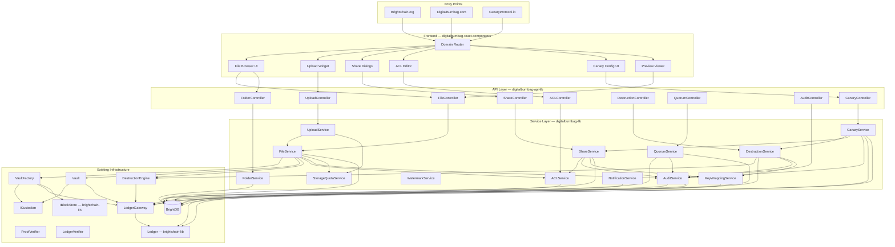
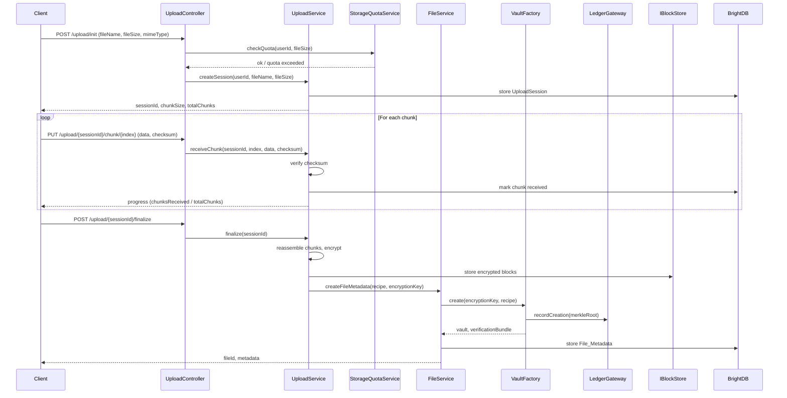
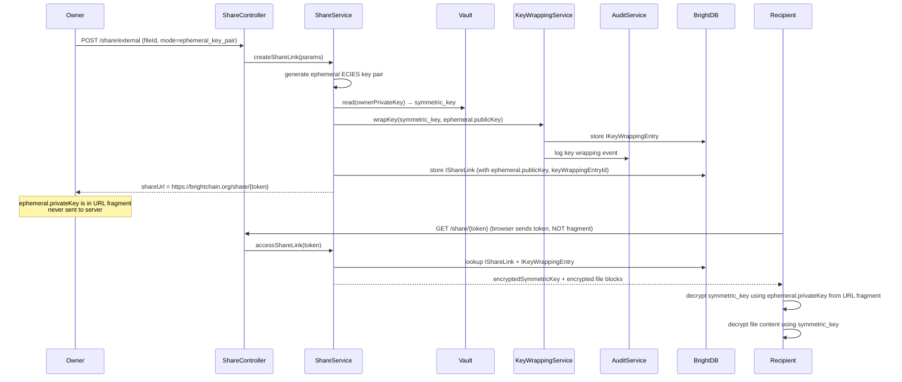
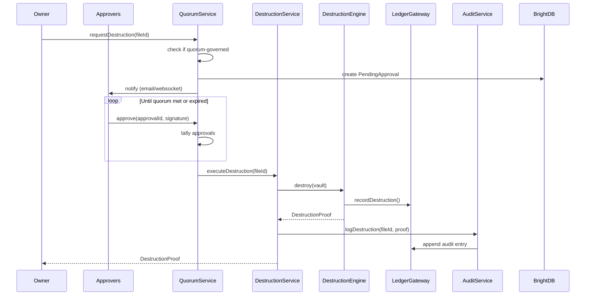

# Design Document: Digital Burnbag File Platform

## Overview

The Digital Burnbag File Platform extends the existing vault/crypto infrastructure (`digitalburnbag-lib`), blockchain ledger (`brightchain-lib`), and canary protocol engine into a full-featured file management system. It provides standard file operations (upload, download, folders, versioning, search, sharing) combined with capabilities unique to the platform: provable cryptographic destruction with blockchain proof, non-access verification, dead man's switch protocols, quorum-governed sensitive operations, and duress-aware security.

The platform is a single unified application deployed at BrightChain.org, with branded entry points at DigitalBurnbag.com (file management) and CanaryProtocol.io (canary protocols). Domain-based routing presents the appropriate branding without fragmenting the underlying application, authentication, or data.

### Key Design Decisions

| Decision | Rationale |
|---|---|
| Core logic in `digitalburnbag-lib` | Trade secret protection; shared between Node.js backend and browser |
| UI components in `digitalburnbag-react-components` | Private repo; only interface names referenced in public `brightchain` repo |
| Shared interfaces in `digitalburnbag-lib` | All `<TID>` templated interfaces for DTO compatibility (frontend `string` vs backend `GuidV4Buffer`) stay private; `brightchain-lib` gets no file platform interfaces |
| Node.js-specific code in `digitalburnbag-api-lib` | Express controllers, BrightDB collections, file system operations |
| Frontend in `digitalburnbag-react-components` | All UI including domain router, branded layout shells, page-level composition |
| One Vault per File_Version | Each version has independent encryption, destruction, and non-access proofs |
| BrightDB for metadata, IBlockStore for content | Metadata (names, ACLs, tags) in BrightDB; encrypted file blocks in the existing block store |
| Chunked upload with server-side session | Enables resume on unstable connections; sessions expire to prevent orphaned chunks |
| ACL inheritance with explicit override | Folder ACLs cascade to descendants unless overridden — matches user mental model of folder permissions |
| Blockchain audit for all operations | Extends existing Ledger; every file operation is a signed, hash-chained entry |
| Quorum gates reuse ledger governance | Extends existing admin quorum model for file-level multi-party approval |
| Key wrapping table for multi-recipient encryption | File encrypted once (AES-256-GCM); symmetric key wrapped per-recipient under their ECIES public key. Adding/revoking recipients only touches the wrapping table, never the file blocks |
| Three-tier external sharing (server-proxied, ephemeral key pair, recipient public key) | Balances security vs. usability: server-proxied is simplest (OneDrive/iCloud parity), ephemeral gives E2E encryption without requiring recipient keys, recipient key mode is strongest |
| Composable POSIX-style permission flags | Atomic flags (Read, Write, Delete, Share, etc.) composed into named Permission_Sets; built-in levels map to predefined sets; goes beyond OneDrive/iCloud tier model |

## Architecture

### System Architecture



### Request Flow: File Upload



### Request Flow: External Share with Ephemeral Key Pair



### Request Flow: File Destruction with Quorum



## Components and Interfaces

### Package Distribution

| Package | Contents | Visibility |
|---|---|---|
| `digitalburnbag-lib` | All services (FileService, FolderService, UploadService, ACLService, ShareService, CanaryService, DestructionService, QuorumService, AuditService, WatermarkService, StorageQuotaService, KeyWrappingService, NotificationService), all `<TID>` base interfaces (`IFileMetadataBase<TID>`, `IFolderMetadataBase<TID>`, `IACLDocumentBase<TID>`, `IShareLinkBase<TID>`, `ICanaryBindingBase<TID>`, `IAuditEntryBase<TID>`, `IQuorumRequestBase<TID>`, `IKeyWrappingEntryBase<TID>`, `IPermissionSetBase<TID>`, `INotification<TID>`), all enumerations, all service parameter/result interfaces, all binary serializers/deserializers, concrete backend-typed aliases | Private (trade secret) |
| `digitalburnbag-react-components` | FileBrowser, UploadWidget, ShareDialog, ACLEditor, CanaryConfigPanel, PreviewViewer, TrashBinView, PresenceIndicator, concrete frontend DTO-typed aliases | Private (trade secret) |
| `brightchain-lib` | Existing infrastructure only (`PlatformID`, `GuidV4Buffer`, `IBlockStore`, `Ledger`, `VaultFactory`, `DestructionEngine`, `ProofVerifier`, `LedgerGateway`, `LedgerVerifier`, `ICustodian`). No file platform interfaces — only minimal name references to `digitalburnbag-lib` | Public |
| `digitalburnbag-api-lib` | FileController, FolderController, UploadController, ShareController, ACLController, CanaryController, DestructionController, QuorumController, AuditController; BrightDB collections; Express route registrations. Imports types from `digitalburnbag-lib` | Private (trade secret) |
| `digitalburnbag-react-components` also includes | Domain router, branded layout shells, page-level composition. Imports types from `digitalburnbag-lib` | Private (trade secret) |

### Service Interfaces (digitalburnbag-lib)

#### FileService

```typescript
interface IFileService<TID extends PlatformID> {
  /** Upload finalization: create vault, store metadata */
  createFile(params: ICreateFileParams<TID>): Promise<IFileMetadata<TID>>;
  /** Download: ACL check → vault read → decrypt → stream */
  getFileContent(fileId: TID, requesterId: TID, context: IAccessContext): Promise<ReadableStream<Uint8Array>>;
  /** Get metadata only */
  getFileMetadata(fileId: TID, requesterId: TID): Promise<IFileMetadata<TID>>;
  /** Update metadata (rename, move, tag) */
  updateFileMetadata(fileId: TID, updates: Partial<IFileMetadataUpdate<TID>>, requesterId: TID): Promise<IFileMetadata<TID>>;
  /** Soft-delete to trash */
  softDelete(fileId: TID, requesterId: TID): Promise<void>;
  /** Restore from trash */
  restoreFromTrash(fileId: TID, requesterId: TID): Promise<void>;
  /** Search files by name, tags, MIME type with ACL filtering */
  search(query: IFileSearchQuery<TID>, requesterId: TID): Promise<ISearchResults<TID>>;
  /** Get version history */
  getVersionHistory(fileId: TID, requesterId: TID): Promise<IFileVersion<TID>[]>;
  /** Restore a specific version as current */
  restoreVersion(fileId: TID, versionId: TID, requesterId: TID): Promise<IFileMetadata<TID>>;
  /** Get non-access proof */
  getNonAccessProof(fileId: TID, requesterId: TID): Promise<ILedgerVerificationResult>;
}
```

#### UploadService

```typescript
interface IUploadService<TID extends PlatformID> {
  /** Create a new upload session */
  createSession(params: ICreateUploadSessionParams<TID>): Promise<IUploadSession<TID>>;
  /** Receive and verify a single chunk */
  receiveChunk(sessionId: TID, chunkIndex: number, data: Uint8Array, checksum: string): Promise<IChunkReceipt>;
  /** Finalize: reassemble, encrypt, create vault */
  finalize(sessionId: TID): Promise<IFileMetadata<TID>>;
  /** Get session status (for resume) */
  getSessionStatus(sessionId: TID): Promise<IUploadSessionStatus>;
  /** Clean up expired sessions */
  purgeExpiredSessions(): Promise<number>;
}
```

#### ACLService

```typescript
interface IACLService<TID extends PlatformID> {
  /** Get effective permissions for a user on a file/folder (resolves custom Permission_Sets to flags) */
  getEffectivePermission(
    targetId: TID,
    targetType: 'file' | 'folder',
    principalId: TID,
    context: IAccessContext
  ): Promise<IEffectivePermission>;
  /** Set ACL on a file or folder (explicit override) */
  setACL(targetId: TID, targetType: 'file' | 'folder', acl: IACLDocument<TID>, requesterId: TID): Promise<void>;
  /** Get the ACL document (explicit or inherited) */
  getACL(targetId: TID, targetType: 'file' | 'folder'): Promise<IResolvedACL<TID>>;
  /** Check a specific atomic permission flag (used internally by all services) */
  checkPermissionFlag(
    targetId: TID,
    targetType: 'file' | 'folder',
    principalId: TID,
    requiredFlag: PermissionFlag,
    context: IAccessContext
  ): Promise<boolean>;
  /** Check a permission level (resolves to flags, then checks all required flags) */
  checkPermission(
    targetId: TID,
    targetType: 'file' | 'folder',
    principalId: TID,
    requiredLevel: PermissionLevel,
    context: IAccessContext
  ): Promise<boolean>;
  /** Create a custom Permission_Set */
  createPermissionSet(params: ICreatePermissionSetParams<TID>): Promise<IPermissionSet<TID>>;
  /** List custom Permission_Sets for an organization */
  listPermissionSets(organizationId?: TID): Promise<IPermissionSet<TID>[]>;
}

/** Resolved effective permission — includes the atomic flags the user actually has */
interface IEffectivePermission {
  flags: PermissionFlag[];
  source: 'explicit' | 'inherited' | 'share_link' | 'organization';
  sourceId?: string;
}

interface IAccessContext {
  ipAddress: string;
  timestamp: Date;
  /** For share link access */
  shareLinkToken?: string;
  shareLinkPassword?: string;
}
```

#### ShareService

```typescript
interface IShareService<TID extends PlatformID> {
  /** Share with an internal user */
  shareWithUser(params: IInternalShareParams<TID>): Promise<void>;
  /** Create an external share link (specific people, organization, or anonymous) */
  createShareLink(params: ICreateShareLinkParams<TID>): Promise<IShareLink<TID>>;
  /** Revoke a share link */
  revokeShareLink(shareLinkId: TID, requesterId: TID): Promise<void>;
  /** Access a share link (external recipient) */
  accessShareLink(token: string, password?: string, context: IAccessContext): Promise<IShareLinkAccess<TID>>;
  /** Get share audit trail for a file */
  getShareAuditTrail(fileId: TID, requesterId: TID): Promise<IAuditEntry<TID>[]>;
  /** List items shared with a user */
  getSharedWithMe(userId: TID): Promise<ISharedItem<TID>[]>;
  /** Get magnet URL for direct P2P sharing (requires Download permission; logs disclosure) */
  getMagnetUrl(fileId: TID, requesterId: TID): Promise<IMagnetUrlResult>;
}

/** Result of requesting a magnet URL — includes the URL and a warning */
interface IMagnetUrlResult {
  magnetUrl: string;
  warning: string; // "This URL grants permanent, irrevocable access..."
}
```

#### CanaryService

```typescript
interface ICanaryService<TID extends PlatformID> {
  /** Create a canary binding for files/folders */
  createBinding(params: ICreateCanaryBindingParams<TID>): Promise<ICanaryBinding<TID>>;
  /** Update a canary binding */
  updateBinding(bindingId: TID, updates: Partial<ICanaryBindingUpdate<TID>>, requesterId: TID): Promise<ICanaryBinding<TID>>;
  /** Delete a canary binding */
  deleteBinding(bindingId: TID, requesterId: TID): Promise<void>;
  /** Execute a triggered protocol action */
  executeProtocolAction(bindingId: TID, triggerContext: ITriggerContext): Promise<IProtocolExecutionResult<TID>>;
  /** Dry-run a protocol (simulation only) */
  dryRun(bindingId: TID, requesterId: TID): Promise<IDryRunReport<TID>>;
  /** Manage recipient lists */
  createRecipientList(params: ICreateRecipientListParams<TID>): Promise<IRecipientList<TID>>;
  updateRecipientList(listId: TID, updates: Partial<IRecipientListUpdate<TID>>, requesterId: TID): Promise<IRecipientList<TID>>;
  /** Handle duress trigger for a user */
  handleDuressTrigger(userId: TID): Promise<void>;
  /** Evaluate and execute cascading protocols */
  executeCascade(primaryBindingId: TID, triggerContext: ITriggerContext): Promise<ICascadeResult<TID>>;
  /** Cancel pending cascade actions */
  cancelCascade(cascadeId: TID, requesterId: TID): Promise<void>;
}
```

#### DestructionService

```typescript
interface IDestructionService<TID extends PlatformID> {
  /** Destroy a single file's vault with blockchain proof */
  destroyFile(fileId: TID, requesterId: TID): Promise<IDestructionProof>;
  /** Batch destroy multiple files */
  batchDestroy(fileIds: TID[], requesterId: TID): Promise<IBatchDestructionResult<TID>>;
  /** Schedule future destruction */
  scheduleDestruction(fileId: TID, scheduledAt: Date, requesterId: TID): Promise<void>;
  /** Cancel scheduled destruction */
  cancelScheduledDestruction(fileId: TID, requesterId: TID): Promise<void>;
  /** Execute due scheduled destructions (called by scheduler) */
  executeScheduledDestructions(): Promise<IBatchDestructionResult<TID>>;
  /** Verify a destruction proof */
  verifyDestruction(proof: IDestructionProof, bundle: IVerificationBundle): IProofVerificationResult;
  /** Auto-purge trash bin items past retention */
  purgeExpiredTrash(): Promise<IBatchDestructionResult<TID>>;
}
```

#### QuorumService

```typescript
interface IQuorumService<TID extends PlatformID> {
  /** Check if an operation requires quorum approval */
  requiresQuorum(targetId: TID, operationType: QuorumOperationType): Promise<boolean>;
  /** Create a pending approval request */
  requestApproval(params: IQuorumApprovalRequest<TID>): Promise<IQuorumRequest<TID>>;
  /** Submit an approval vote */
  approve(requestId: TID, approverId: TID, signature: Uint8Array): Promise<IQuorumStatus>;
  /** Submit a rejection vote */
  reject(requestId: TID, approverId: TID, reason: string): Promise<IQuorumStatus>;
  /** Check if rubber-stamp mode applies */
  isRubberStamped(operationType: QuorumOperationType, targetId: TID): Promise<boolean>;
  /** Execute approved operation */
  executeApproved(requestId: TID): Promise<void>;
  /** Expire stale requests */
  expireStaleRequests(): Promise<number>;
}
```

#### AuditService

```typescript
interface IAuditService<TID extends PlatformID> {
  /** Log any file operation to the ledger */
  logOperation(entry: IAuditEntryParams<TID>): Promise<void>;
  /** Query audit entries with filters */
  queryAuditLog(filters: IAuditQueryFilters<TID>): Promise<IAuditEntry<TID>[]>;
  /** Export audit log with Merkle inclusion proofs */
  exportAuditLog(filters: IAuditQueryFilters<TID>): Promise<IAuditExport<TID>>;
  /** Generate compliance report */
  generateComplianceReport(params: IComplianceReportParams<TID>): Promise<IComplianceReport<TID>>;
}
```

#### WatermarkService

```typescript
interface IWatermarkService<TID extends PlatformID> {
  /** Apply visible watermark to document bytes */
  applyVisibleWatermark(
    content: Uint8Array,
    mimeType: string,
    accessor: IWatermarkIdentity<TID>
  ): Promise<Uint8Array>;
  /** Embed steganographic identifier */
  applyInvisibleWatermark(
    content: Uint8Array,
    mimeType: string,
    watermarkId: string
  ): Promise<Uint8Array>;
  /** Extract steganographic identifier from a document */
  extractWatermark(content: Uint8Array, mimeType: string): Promise<string | null>;
}
```

#### StorageQuotaService

```typescript
interface IStorageQuotaService<TID extends PlatformID> {
  /** Check if an upload of given size would exceed quota */
  checkQuota(userId: TID, additionalBytes: number): Promise<IQuotaCheckResult>;
  /** Get current usage and limit */
  getUsage(userId: TID): Promise<IStorageUsage>;
  /** Set quota for a user (admin only) */
  setQuota(userId: TID, quotaBytes: number, adminId: TID): Promise<void>;
  /** Recalculate usage (e.g., after destruction) */
  recalculateUsage(userId: TID): Promise<IStorageUsage>;
}
```

#### FolderService

```typescript
interface IFolderService<TID extends PlatformID> {
  /** Create a folder */
  createFolder(params: ICreateFolderParams<TID>): Promise<IFolderMetadata<TID>>;
  /** Get folder contents (files + subfolders) */
  getFolderContents(folderId: TID, requesterId: TID, sort?: ISortOptions): Promise<IFolderContents<TID>>;
  /** Move a file or folder to a new parent */
  move(itemId: TID, itemType: 'file' | 'folder', newParentId: TID, requesterId: TID): Promise<void>;
  /** Get or create root folder for a user */
  getRootFolder(userId: TID): Promise<IFolderMetadata<TID>>;
  /** Get folder path (breadcrumbs) */
  getFolderPath(folderId: TID): Promise<IFolderMetadata<TID>[]>;
}
```

#### KeyWrappingService

```typescript
interface IKeyWrappingService<TID extends PlatformID> {
  /** Wrap a symmetric key under a recipient's public key and store the entry */
  wrapKeyForMember(fileVersionId: TID, symmetricKey: Uint8Array, recipientUserId: TID, requesterId: TID): Promise<IKeyWrappingEntry<TID>>;
  /** Wrap a symmetric key under an ephemeral public key for an external share */
  wrapKeyForEphemeralShare(fileVersionId: TID, symmetricKey: Uint8Array, shareLinkId: TID, requesterId: TID): Promise<{ entry: IKeyWrappingEntry<TID>; ephemeralPrivateKey: Uint8Array }>;
  /** Wrap a symmetric key under a recipient-provided public key */
  wrapKeyForRecipientKey(fileVersionId: TID, symmetricKey: Uint8Array, recipientPublicKey: Uint8Array, keyType: 'ecies_secp256k1' | 'pgp', shareLinkId: TID, requesterId: TID): Promise<IKeyWrappingEntry<TID>>;
  /** Get the wrapped key for a specific recipient or share link */
  getWrappedKey(fileVersionId: TID, recipientUserId?: TID, shareLinkId?: TID): Promise<IKeyWrappingEntry<TID> | null>;
  /** Remove a wrapping entry (on share revocation) */
  revokeWrapping(entryId: TID, requesterId: TID): Promise<void>;
  /** Remove all wrapping entries for a file version (on destruction) */
  revokeAllWrappings(fileVersionId: TID, requesterId: TID): Promise<number>;
}
```

#### NotificationService

```typescript
interface INotificationService<TID extends PlatformID> {
  /** Send real-time notification to a user via WebSocket */
  notifyUser(userId: TID, notification: INotification<TID>): Promise<void>;
  /** Queue notification for offline delivery */
  queueNotification(userId: TID, notification: INotification<TID>): Promise<void>;
  /** Get queued notifications for a user (on reconnect) */
  getQueuedNotifications(userId: TID): Promise<INotification<TID>[]>;
  /** Mark notifications as delivered */
  markDelivered(notificationIds: TID[]): Promise<void>;
  /** Get notification preferences for a file/folder */
  getPreferences(targetId: TID, ownerId: TID): Promise<INotificationPreferences>;
  /** Set notification preferences */
  setPreferences(targetId: TID, ownerId: TID, prefs: Partial<INotificationPreferences>): Promise<void>;
}

interface INotification<TID extends PlatformID> {
  id: TID;
  type: 'share_accessed' | 'file_downloaded' | 'file_previewed' | 'quorum_requested' | 'canary_triggered';
  targetId: TID;
  actorId?: TID;
  actorName?: string; // "Anonymous" for anonymous links
  timestamp: Date | string;
  metadata: Record<string, unknown>;
}

interface INotificationPreferences {
  enabled: boolean;
  /** Notify on these access types only (empty = all) */
  accessTypes: ('view' | 'download' | 'preview')[];
  /** Notify via WebSocket, email, or both */
  channels: ('websocket' | 'email')[];
}
```

#### FolderExportService

```typescript
/** Options for folder export to TCBL */
interface IFolderExportOptions {
  /** Include only files matching these MIME type patterns (e.g., ['application/pdf', 'image/*']) */
  mimeTypeFilters?: string[];
  /** Maximum folder recursion depth (undefined = unlimited) */
  maxDepth?: number;
  /** Glob patterns for relative paths to exclude (e.g., ['*.tmp', 'drafts/**']) */
  excludePatterns?: string[];
}

/** A skipped file entry in the export result */
interface ISkippedFileEntry<TID extends PlatformID> {
  fileId: TID;
  relativePath: string;
  reason: 'acl_denied' | 'filtered_by_type' | 'filtered_by_pattern';
}

/** Result of a folder export to TCBL */
interface IFolderExportResult<TID extends PlatformID> {
  /** The TCBL block handle (caller manages from here) */
  tcblHandle: TarballConstituentBlockListBlock<TID>;
  /** The recipe for reconstructing the TCBL */
  recipe: IRecipe<TID>;
  /** Summary of the manifest */
  manifestSummary: {
    entryCount: number;
    totalSizeBytes: number;
  };
  /** Files that were skipped during export */
  skippedFiles: ISkippedFileEntry<TID>[];
}

interface IFolderExportService<TID extends PlatformID> {
  /**
   * Export a folder's contents to a TCBL archive.
   *
   * Recursively collects files from the folder, ACL-checks each against
   * the requester's permissions (Viewer+), preserves folder hierarchy as
   * relative paths in ITcblEntryDescriptor.fileName, builds the TCBL,
   * and logs the export to AuditService.
   *
   * @param folderId - The folder to export
   * @param requesterId - The user requesting the export (for ACL checks)
   * @param options - Optional filters (MIME types, max depth, exclude patterns)
   * @returns The TCBL handle, recipe, manifest summary, and list of skipped files
   * @throws Error if no exportable files are found after ACL filtering
   */
  exportFolderToTCBL(
    folderId: TID,
    requesterId: TID,
    options?: IFolderExportOptions
  ): Promise<IFolderExportResult<TID>>;
}
```

**Dependencies:** FolderService (recursive folder traversal), FileService (file content retrieval), ACLService (per-file permission checks), AuditService (export event logging), TCBL builder infrastructure from `brightchain-lib` (`TarballConstituentBlockListBlock`, `TcblManifestSerializer`, `ITcblManifest`, `ITcblEntryDescriptor`)

**Flow:**
1. Call `FolderService.getFolderContents()` recursively to collect all files, tracking relative paths from the export root
2. For each file, call `ACLService.checkPermission(fileId, 'file', requesterId, PermissionLevel.Viewer, context)` — skip files that fail
3. Apply optional filters (MIME type, exclude patterns, max depth)
4. For each included file, read the file content via `FileService.getFileContent()` and build an `ITcblEntryDescriptor` with the relative path as `fileName`
5. Assemble the TCBL using the TCBL builder infrastructure
6. Log the export event to `AuditService` with folder ID, requester, exported count, skipped count
7. Return `IFolderExportResult` with the TCBL handle, recipe, manifest summary, and skipped files list

### Real-Time Presence (digitalburnbag-react-components + digitalburnbag-api-lib)

```typescript
/** WebSocket events for file presence */
interface IPresenceEvents {
  'file:viewer-joined': { fileId: string; user: IPresenceUser };
  'file:viewer-left': { fileId: string; userId: string };
  'file:viewers-list': { fileId: string; viewers: IPresenceUser[] };
}

interface IPresenceUser {
  userId: string;
  username: string;
  avatarUrl?: string;
  joinedAt: string; // ISO timestamp
}
```

### Domain Router (digitalburnbag-react-components)

```typescript
interface IDomainRouteConfig {
  domain: string;
  basePath: string;
  brandName: string;
  brandLogo: string;
  /** Sub-brand indicator text, e.g., "BrightChain / Digital Burnbag" */
  headerText: string;
  /** Default landing section */
  defaultSection: 'burnbag' | 'canary' | 'home';
}

const domainRoutes: IDomainRouteConfig[] = [
  {
    domain: 'digitalburnbag.com',
    basePath: '/burnbag',
    brandName: 'Digital Burnbag',
    brandLogo: '/assets/burnbag-logo.svg',
    headerText: 'BrightChain / Digital Burnbag',
    defaultSection: 'burnbag',
  },
  {
    domain: 'canaryprotocol.io',
    basePath: '/canary',
    brandName: 'Canary Protocol',
    brandLogo: '/assets/canary-logo.svg',
    headerText: 'BrightChain / Canary Protocol',
    defaultSection: 'canary',
  },
  {
    domain: 'brightchain.org',
    basePath: '/',
    brandName: 'BrightChain',
    brandLogo: '/assets/brightchain-logo.svg',
    headerText: 'BrightChain',
    defaultSection: 'home',
  },
];
```

## Data Models

### Enumerations (digitalburnbag-lib)

```typescript
/** Atomic permission flags — composable into custom Permission_Sets */
enum PermissionFlag {
  Read = 'read',
  Write = 'write',
  Delete = 'delete',
  Share = 'share',
  Admin = 'admin',
  Preview = 'preview',
  Comment = 'comment',
  Download = 'download',
  ManageVersions = 'manage_versions',
}

/** Built-in permission levels (each maps to a predefined Permission_Set) */
enum PermissionLevel {
  Viewer = 'viewer',         // Read + Preview + Download
  Commenter = 'commenter',   // Read + Preview + Download + Comment
  Editor = 'editor',         // Read + Write + Preview + Download + Comment + ManageVersions
  Owner = 'owner',           // All flags
}

/** A named custom permission set composed of atomic flags */
interface IPermissionSetBase<TID extends PlatformID> {
  id: TID;
  name: string;
  organizationId?: TID;
  flags: PermissionFlag[];
  createdBy: TID;
  createdAt: Date | string;
  updatedAt: Date | string;
}

/** Types of operations that can be quorum-governed */
enum QuorumOperationType {
  Destruction = 'destruction',
  ExternalShare = 'external_share',
  BulkDelete = 'bulk_delete',
  ACLChange = 'acl_change',
}

/** Audit operation types (extends VaultLedgerEntryType) */
enum FileAuditOperationType {
  FileUploaded = 'file_uploaded',
  FileDownloaded = 'file_downloaded',
  FilePreviewed = 'file_previewed',
  FileDeleted = 'file_deleted',
  FileRestored = 'file_restored',
  FileDestroyed = 'file_destroyed',
  FileMoved = 'file_moved',
  FileRenamed = 'file_renamed',
  FileVersionCreated = 'file_version_created',
  FileVersionRestored = 'file_version_restored',
  FolderCreated = 'folder_created',
  FolderDeleted = 'folder_deleted',
  FolderMoved = 'folder_moved',
  ACLChanged = 'acl_changed',
  ShareCreated = 'share_created',
  ShareRevoked = 'share_revoked',
  ShareLinkAccessed = 'share_link_accessed',
  CanaryBindingCreated = 'canary_binding_created',
  CanaryBindingModified = 'canary_binding_modified',
  CanaryBindingDeleted = 'canary_binding_deleted',
  CanaryTriggered = 'canary_triggered',
  DuressTriggered = 'duress_triggered',
  DryRunExecuted = 'dry_run_executed',
  QuorumRequested = 'quorum_requested',
  QuorumApproved = 'quorum_approved',
  QuorumRejected = 'quorum_rejected',
  QuorumExpired = 'quorum_expired',
  RubberStamped = 'rubber_stamped',
  DestructionScheduled = 'destruction_scheduled',
  DestructionCancelled = 'destruction_cancelled',
  WatermarkApplied = 'watermark_applied',
  NonAccessProofGenerated = 'non_access_proof_generated',
  MagnetUrlDisclosed = 'magnet_url_disclosed',
  OwnerNotified = 'owner_notified',
  FolderExportedToTcbl = 'folder_exported_to_tcbl',
}
```

### Core Data Models (digitalburnbag-lib — private interfaces)

All interfaces use the generic `<TID extends PlatformID>` pattern for DTO compatibility. Frontend uses `string`, backend uses `GuidV4Buffer`.

```typescript
/** File metadata stored in BrightDB — no encrypted content */
interface IFileMetadataBase<TID extends PlatformID> {
  id: TID;
  ownerId: TID;
  folderId: TID;
  fileName: string;
  mimeType: string;
  sizeBytes: number;
  description?: string;
  tags: string[];
  /** Reference to the current version */
  currentVersionId: TID;
  /** Vault reference for the current version */
  vaultCreationLedgerEntryHash: Uint8Array;
  /** ACL document ID (null = inherit from parent folder) */
  aclId?: TID;
  /** Soft-delete timestamp (null = not deleted) */
  deletedAt?: Date | string;
  /** Original parent folder path before deletion (for restore) */
  deletedFromPath?: string;
  /** Scheduled destruction timestamp */
  scheduledDestructionAt?: Date | string;
  /** Whether this file requires quorum for sensitive ops */
  quorumGoverned: boolean;
  /** Watermark configuration */
  watermarkVisible: boolean;
  watermarkInvisible: boolean;
  createdAt: Date | string;
  updatedAt: Date | string;
  createdBy: TID;
  updatedBy: TID;
}

/** A single version snapshot */
interface IFileVersionBase<TID extends PlatformID> {
  id: TID;
  fileId: TID;
  versionNumber: number;
  sizeBytes: number;
  vaultCreationLedgerEntryHash: Uint8Array;
  /** Vault state: sealed, accessed, destroyed */
  vaultState: string;
  uploaderId: TID;
  createdAt: Date | string;
}

/** Folder metadata */
interface IFolderMetadataBase<TID extends PlatformID> {
  id: TID;
  ownerId: TID;
  parentFolderId?: TID; // null for root folder
  name: string;
  aclId?: TID;
  deletedAt?: Date | string;
  deletedFromPath?: string;
  quorumGoverned: boolean;
  createdAt: Date | string;
  updatedAt: Date | string;
  createdBy: TID;
  updatedBy: TID;
}
```

### ACL Data Model (digitalburnbag-lib)

```typescript
/** A complete ACL document */
interface IACLDocumentBase<TID extends PlatformID> {
  id: TID;
  entries: IACLEntryBase<TID>[];
  createdAt: Date | string;
  updatedAt: Date | string;
  updatedBy: TID;
}

/** A single permission grant */
interface IACLEntryBase<TID extends PlatformID> {
  /** User, group, or share link */
  principalType: 'user' | 'group' | 'share_link';
  principalId: TID;
  /** Built-in permission level OR custom permission set ID */
  permissionLevel: string; // PermissionLevel enum value or 'custom'
  /** Custom permission set ID (when permissionLevel is 'custom') */
  customPermissionSetId?: TID;
  /** Whether this grantee can re-share */
  canReshare: boolean;
  /** Block download — view-only in browser, no download or magnet URL */
  blockDownload: boolean;
  /** Optional IP range constraint (CIDR notation) */
  ipRange?: string;
  /** Optional time window constraint */
  timeWindowStart?: string; // HH:mm
  timeWindowEnd?: string;   // HH:mm
  timeWindowTimezone?: string;
  /** Expiration for time-limited grants */
  expiresAt?: Date | string;
}

/** Resolved ACL with inheritance info */
interface IResolvedACLBase<TID extends PlatformID> {
  acl: IACLDocumentBase<TID>;
  inherited: boolean;
  inheritedFromFolderId?: TID;
}
```

### Share Data Model (digitalburnbag-lib)

```typescript
/** External share link */
interface IShareLinkBase<TID extends PlatformID> {
  id: TID;
  fileId: TID;
  token: string; // unique URL token
  createdBy: TID;
  /** Bcrypt hash of password (if password-protected) */
  passwordHash?: string;
  expiresAt?: Date | string;
  maxAccessCount?: number;
  currentAccessCount: number;
  revokedAt?: Date | string;
  /** Permission level or custom permission set ID */
  permissionLevel: string;
  /** Link scope: specific_people, organization, anonymous */
  scope: 'specific_people' | 'organization' | 'anonymous';
  /** Organization ID (required for organization-scoped links) */
  organizationId?: TID;
  /** Block download — if true, only server-rendered previews; no download or magnet URL */
  blockDownload: boolean;
  /** Whether this share includes the magnet URL for direct P2P reconstruction */
  includeMagnetUrl: boolean;
  /** External sharing encryption mode */
  encryptionMode: 'server_proxied' | 'ephemeral_key_pair' | 'recipient_public_key';
  /** Ephemeral public key (stored on server; private key is in URL fragment) */
  ephemeralPublicKey?: Uint8Array;
  /** Reference to the key wrapping entry for this share (for ephemeral/recipient modes) */
  keyWrappingEntryId?: TID;
  /** Recipient's public key (for recipient_public_key mode) */
  recipientPublicKey?: Uint8Array;
  /** Recipient public key type */
  recipientKeyType?: 'ecies_secp256k1' | 'pgp';
  createdAt: Date | string;
}
```

### Key Wrapping Table (digitalburnbag-lib)

The file content is encrypted once with a symmetric key (AES-256-GCM). The symmetric key is then wrapped (encrypted) separately for each authorized party under their public key. The file on disk never changes — only the key wrapping table grows. This enables multi-recipient encrypted sharing without re-encrypting the file.

```
File content → AES-256-GCM(symmetric_key) → stored as blocks in IBlockStore (one copy)

symmetric_key wrapped for each authorized party:
  ├── Owner (vault)         → Vault contains symmetric_key encrypted under custodial ECIES
  ├── Internal Member A     → ECIES(memberA.publicKey, symmetric_key)
  ├── Internal Member B     → ECIES(memberB.publicKey, symmetric_key)
  ├── External Share Link 1 → ECIES(ephemeral1.publicKey, symmetric_key)
  │   └── ephemeral1.privateKey embedded in URL fragment (never sent to server)
  ├── External Share Link 2 → ECIES(ephemeral2.publicKey, symmetric_key)
  │   └── ephemeral2.privateKey embedded in different URL fragment
  └── External Recipient C  → ECIES(recipientC.publicKey, symmetric_key)
```

Revoking a share removes that entry from the wrapping table. The file and all other wrappings are unaffected. For server-proxied external shares, no wrapping entry is needed — the server reads the vault to get the symmetric key and re-serves over TLS.

```typescript
/**
 * A single entry in the key wrapping table for a file version.
 * Each entry represents one party's encrypted copy of the file's symmetric key.
 */
interface IKeyWrappingEntryBase<TID extends PlatformID> {
  id: TID;
  /** The file version this wrapping applies to */
  fileVersionId: TID;
  /** Type of recipient */
  recipientType: 'internal_member' | 'ephemeral_share' | 'recipient_key';
  /** For internal members: the member's user ID */
  recipientUserId?: TID;
  /** For shares: the share link ID */
  shareLinkId?: TID;
  /** The public key used to wrap the symmetric key */
  wrappingPublicKey: Uint8Array;
  /** The symmetric key encrypted under wrappingPublicKey via ECIES */
  encryptedSymmetricKey: Uint8Array;
  /** Key type used for wrapping */
  keyType: 'ecies_secp256k1' | 'pgp';
  /** When this wrapping was created */
  createdAt: Date | string;
  /** Who authorized this wrapping */
  createdBy: TID;
  /** Ledger entry hash recording this key disclosure */
  ledgerEntryHash: Uint8Array;
}
```

When a file is shared with a new internal member, the server reads the symmetric key from the vault (via the owner's custodial path), wraps it under the new member's ECIES public key, and adds a wrapping entry. When an ephemeral share link is created, the server generates an ephemeral ECIES key pair, wraps the symmetric key under the ephemeral public key, stores the wrapping entry (with the ephemeral public key), and returns the ephemeral private key in the URL fragment. The server never stores the ephemeral private key.

For file destruction, the `DestructionService` destroys the vault (which holds the master symmetric key) AND deletes all key wrapping entries. Since the symmetric key is gone, all wrapped copies become useless — the encrypted blocks in the store are irrecoverable.
```

### Canary Binding Data Model (digitalburnbag-lib)

```typescript
/** Association between a canary protocol and files/folders */
interface ICanaryBindingBase<TID extends PlatformID> {
  id: TID;
  /** Reference to the parent canary protocol */
  protocolId: TID;
  /** Files bound to this canary action */
  fileIds: TID[];
  /** Folders bound to this canary action */
  folderIds: TID[];
  /** The action to execute when triggered */
  protocolAction: ProtocolAction;
  /** Condition that triggers this binding */
  canaryCondition: CanaryCondition;
  /** Provider that evaluates the condition */
  canaryProvider: CanaryProvider;
  /** Recipient list for distribution actions */
  recipientListId?: TID;
  /** Cascading: secondary bindings triggered after delay */
  cascadeBindingIds?: TID[];
  cascadeDelayMs?: number[];
  createdBy: TID;
  createdAt: Date | string;
  updatedAt: Date | string;
}

/** Named recipient list for canary distribution */
interface IRecipientListBase<TID extends PlatformID> {
  id: TID;
  name: string;
  ownerId: TID;
  recipients: IRecipientBase[];
  createdAt: Date | string;
  updatedAt: Date | string;
}

interface IRecipientBase {
  email: string;
  label: string;
  pgpPublicKey?: string;
}
```

### Upload Session Data Model (digitalburnbag-lib)

```typescript
interface IUploadSessionBase<TID extends PlatformID> {
  id: TID;
  userId: TID;
  fileName: string;
  mimeType: string;
  totalSizeBytes: number;
  chunkSizeBytes: number;
  totalChunks: number;
  receivedChunks: Set<number>;
  /** Per-chunk checksums for integrity */
  chunkChecksums: Map<number, string>;
  expiresAt: Date | string;
  createdAt: Date | string;
  /** Target folder for the uploaded file */
  targetFolderId: TID;
}
```

### Quorum Request Data Model (digitalburnbag-lib)

```typescript
interface IQuorumRequestBase<TID extends PlatformID> {
  id: TID;
  operationType: string; // QuorumOperationType
  targetId: TID;
  targetType: 'file' | 'folder';
  requesterId: TID;
  /** Required approval count per quorum policy */
  requiredApprovals: number;
  approvals: IQuorumVoteBase<TID>[];
  rejections: IQuorumVoteBase<TID>[];
  status: 'pending' | 'approved' | 'rejected' | 'expired' | 'rubber_stamped';
  expiresAt: Date | string;
  createdAt: Date | string;
  resolvedAt?: Date | string;
}

interface IQuorumVoteBase<TID extends PlatformID> {
  voterId: TID;
  signature: Uint8Array;
  reason?: string;
  votedAt: Date | string;
}
```

### Audit Entry Data Model (digitalburnbag-lib)

```typescript
interface IAuditEntryBase<TID extends PlatformID> {
  /** Ledger sequence number */
  sequenceNumber: number;
  operationType: string; // FileAuditOperationType
  actorId: TID;
  targetId: TID;
  targetType: 'file' | 'folder' | 'share_link' | 'canary_binding' | 'quorum_request';
  timestamp: Date | string;
  ipAddress?: string;
  /** Operation-specific metadata (JSON-serializable) */
  metadata: Record<string, unknown>;
  /** Flags */
  isDuress?: boolean;
  isRubberStamped?: boolean;
  /** Ledger entry hash for verification */
  ledgerEntryHash: Uint8Array;
}
```

### Storage Quota Data Model (digitalburnbag-lib)

```typescript
interface IStorageQuotaBase<TID extends PlatformID> {
  userId: TID;
  quotaBytes: number;
  usedBytes: number;
  updatedAt: Date | string;
}
```

### Serialization Formats

#### File_Metadata Binary Serialization (digitalburnbag-lib)

For ledger recording and transport, File_Metadata is serialized to a deterministic binary format:

```
Offset  Size     Field
0       1        version (0x01)
1       4        fileNameLength (uint32 BE)
5       var      fileName (UTF-8)
...     4        mimeTypeLength (uint32 BE)
...     var      mimeType (UTF-8)
...     8        sizeBytes (uint64 BE)
...     2        tagCount (uint16 BE)
...     var      tags (each: 2-byte length + UTF-8 string)
...     64       vaultCreationLedgerEntryHash (SHA3-512)
...     1        flags (bit 0: quorumGoverned, bit 1: watermarkVisible, bit 2: watermarkInvisible)
...     1        hasScheduledDestruction (0x00 or 0x01)
...     0|8      scheduledDestructionAt (uint64 BE ms, if present)
end-2   2        CRC-16 checksum
```

#### ACL Document Binary Serialization (digitalburnbag-lib)

```
Offset  Size     Field
0       1        version (0x01)
1       2        entryCount (uint16 BE)
...     var      entries (each entry serialized as below)
end-2   2        CRC-16 checksum

Per ACL Entry:
0       1        principalType (0x00=user, 0x01=group, 0x02=share_link)
1       4        principalIdLength (uint32 BE)
5       var      principalId
...     1        permissionLevel (0x00=viewer, 0x01=editor, 0x02=owner)
...     1        flags (bit 0: canReshare, bit 1: hasIpRange, bit 2: hasTimeWindow, bit 3: hasExpiration)
...     var      ipRange (if flag set: 2-byte length + UTF-8)
...     var      timeWindow (if flag set: 5+5+2-byte-len+tz)
...     0|8      expiresAt (uint64 BE ms, if flag set)
```
