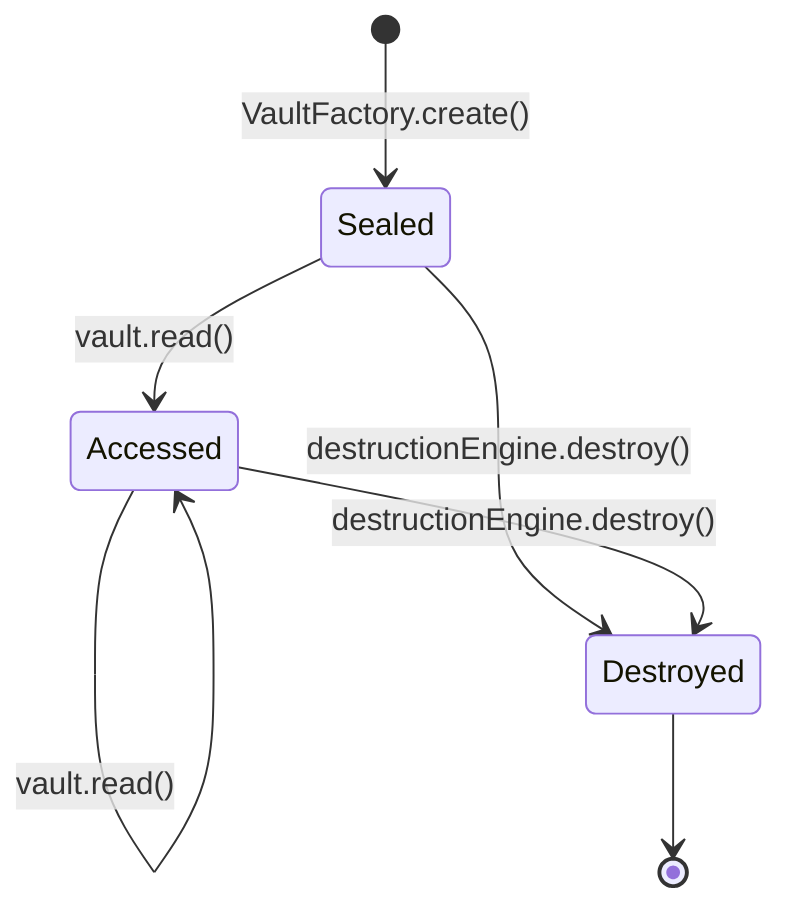

# Design Document: Digital Burnbag Vault

## Overview

The Digital Burnbag Vault library (`digitalburnbag-lib`) is a pure TypeScript cryptographic library providing two core guarantees:

1. **Provable Destruction** — cryptographic proof that encryption keys and file-reconstruction recipes have been irrecoverably destroyed.
2. **Proof of Non-Access** — cryptographic evidence that stored secrets were never read.

The library models a **Vault** containing a Secret_Payload (an AES-256-GCM encrypted bundle of an encryption key and a Recipe). The Vault is protected by a **three-layer protection model**:

1. **Cryptographic seals (Access_Seal)** — A SHA3-512 Merkle tree commitment scheme provides fast, local verification that a vault's internal state has not been mutated by a read operation. Any read irreversibly changes the seal from "pristine" to "accessed". Merkle proofs enable O(log N) deterministic selective disclosure of individual leaves.
2. **Blockchain ledger as immutable audit witness** — Every vault operation (creation, read, destruction) is recorded as a signed, hash-chained entry on an append-only blockchain `Ledger` from `brightchain-lib` *before* the operation executes. The ledger is the ground truth: an attacker who snapshots and restores vault bytes cannot erase the ledger record of a read without breaking the chain. The ledger uses role-based access control (admin/writer/reader) with configurable quorum policies.
3. **Custodial double-encryption** — The vault's Tree_Seed is additionally encrypted under a Custodian's ECIES public key. Reading the vault requires a key release from the Custodian, and that key release is itself recorded on the ledger. Even with raw access to vault storage bytes, an attacker cannot decrypt without a visible, auditable key release through the governed ledger.

Together, these layers ensure that any access to vault contents leaves an indelible, externally verifiable trace — the seal provides a fast local indicator, the ledger provides tamper-proof ground truth, and custodial encryption prevents bypass of both.

The library is browser-compatible, uses `Uint8Array` exclusively for binary data, and builds on:
- `@digitaldefiance/ecies-lib` — ECIESService (secp256k1 signatures/encryption), AESGCMService, Pbkdf2Service, CrcService, SecureBuffer
- `@noble/hashes` — SHA3-512, HMAC-SHA3-512
- `@noble/curves` — secp256k1 utilities
- `@scure/base` — base encoding
- `bloom-filters` — Bloom filter construction
- `brightchain-lib` — `Ledger`, `ILedgerEntry`, `ILedgerSigner`, `ILedgerSignatureVerifier`, `AuthorizedSignerSet`, governance types

### Design Decisions

| Decision | Rationale |
|---|---|
| SHA3-512 Merkle tree (not linear hash chain) | Merkle tree enables O(log N) deterministic proof paths for selective disclosure, parallel verification of independent subtrees, and natural extensibility to batch burn bags (multiple secrets per vault). The Bloom witness supplements with O(1) probabilistic membership checks. SHA3-512 aligns with the `brightchain-lib` ledger's `ChecksumService` and `IncrementalMerkleTree` |
| HMAC-SHA3-512 for seal derivation | Domain-separated HMAC prevents length-extension attacks and cleanly separates "pristine" vs "accessed" states. SHA3-512 is consistent with the rest of the system |
| Fixed SHA3-512 hash width (no configurable 256/512) | Configurable hash width would require branching in every serializer/deserializer, a hash-width indicator in the binary format, conditional field sizes in all interfaces, and incompatible verification bundles between hash widths. The security benefit is zero since SHA3-512 is already the system standard. Consistency with `brightchain-lib` outweighs the negligible space savings of SHA3-256 |
| Default tree depth 10, minimum 8, no hard maximum | Depth 10 (1,024 leaves) balances commitment granularity with creation cost. Depth 8 (256 leaves) is the minimum for meaningful commitment space. No hard maximum allows advanced use cases, but depths above 16 carry significant resource costs that callers should be aware of |
| PBKDF2 for tree-seed → AES key | Reuses existing Pbkdf2Service; adds key-stretching even though tree-seed is already 32 random bytes |
| Bloom filter witness + Merkle proofs | Bloom filter provides fast probabilistic membership checks; Merkle proofs provide deterministic O(log N) selective disclosure when certainty is required |
| Deterministic binary serialization | Avoids JSON overhead and ambiguity; CRC-16 checksum catches transport corruption |
| State machine with three states | Minimal states (Sealed → Accessed → Destroyed) enforce irreversible transitions at the type level |
| Ledger-gated operations | Append-only blockchain audit trail prevents snapshot-restore attacks; every operation is recorded *before* execution so an attacker who restores vault bytes cannot erase the ledger record without breaking the hash chain |
| Custodial double-encryption (ECIES) | Tree_Seed is encrypted under a Custodian's public key, preventing raw-byte access without a governed, ledger-recorded key release; even with storage access, decryption requires an auditable custodial action |
| ICustodian interface (dependency injection) | Abstracts custodian backends (HSM, threshold scheme, ledger admin quorum) behind a single interface; the default `LedgerQuorumCustodian` uses the ledger's existing admin quorum governance for key release approval |

## Architecture

```mermaid
graph TD
    subgraph "Public API"
        VF[VaultFactory]
        V[Vault]
        DE[DestructionEngine]
        PV[ProofVerifier]
        LV[LedgerVerifier]
    end

    subgraph "Ledger Integration"
        LG[LedgerGateway]
        IC[ICustodian]
        LQC[LedgerQuorumCustodian]
    end

    subgraph "Internal Components"
        MCT[MerkleCommitmentTree]
        AS[AccessSeal]
        BW[BloomWitness]
        ME[MemoryEraser]
        BS[BundleSerializer]
        RS[RecipeSerializer]
    end

    subgraph "External Dependencies"
        ECIES[ECIESService]
        AES[AESGCMService]
        PBKDF2[Pbkdf2Service]
        CRC[CrcService]
        SHA[noble/hashes SHA3-512]
        HMAC[noble/hashes HMAC-SHA3-512]
        BF[bloom-filters]
        LEDGER[Ledger - brightchain-lib]
    end

    VF -->|creates| V
    VF -->|builds| MCT
    VF -->|derives| AS
    VF -->|constructs| BW
    VF -->|encrypts payload| AES
    VF -->|derives key| PBKDF2
    VF -->|hashes tree| SHA
    VF -->|records creation| LG
    VF -->|encrypts tree seed| IC

    V -->|reads payload| AES
    V -->|mutates seal| AS
    V -->|state transitions| V
    V -->|records read| LG
    V -->|requests key release| IC

    DE -->|signs proof| ECIES
    DE -->|erases memory| ME
    DE -->|extracts tree seed| V
    DE -->|records destruction| LG

    PV -->|verifies signature| ECIES
    PV -->|recomputes tree| MCT
    PV -->|checks seal| AS

    LV -->|checks seal| AS
    LV -->|walks entries| LEDGER

    LG -->|appends entries| LEDGER
    LQC -.->|implements| IC
    LQC -->|records key release| LEDGER
    LQC -->|checks quorum| LEDGER

    BS -->|checksums| CRC
    RS -->|checksums| CRC
    BW -->|uses| BF
    AS -->|uses| HMAC
    CC -->|uses| SHA
```



### Component Responsibilities

| Component | Responsibility |
|---|---|
| `VaultFactory` | Constructs Vaults: generates tree seed, derives leaves, builds Merkle commitment tree, derives access seal, encrypts payload, encrypts tree seed under custodian key, records creation on ledger, builds bloom witness, assembles verification bundle |
| `Vault` | Holds encrypted payload and state; enforces state machine transitions; requests custodial key release and records read on ledger before decrypting payload; mutates seal on access |
| `MerkleCommitmentTree` | Builds and verifies SHA3-512 Merkle trees; derives leaves from seed; generates and verifies Merkle proofs (O(log N) authentication paths) |
| `AccessSeal` | Derives and verifies HMAC-SHA3-512 seals with domain separators |
| `DestructionEngine` | Records destruction on ledger; produces signed destruction proofs; securely erases vault contents including double-encrypted tree seed |
| `ProofVerifier` | Verifies destruction proofs (signature + Merkle root + timestamp) |
| `LedgerGateway` | Mediates all vault operations through the ledger; appends typed entries (vault_created, vault_read_requested, vault_destroyed) and validates ledger references |
| `LedgerVerifier` | Walks ledger entries for a vault to verify non-access; cross-checks seal state against ledger records to detect tampering |
| `ICustodian` | Interface for custodial key management: encrypt tree seed, request key release, query key release records |
| `LedgerQuorumCustodian` | Default ICustodian implementation using ledger admin quorum for key release approval; records key releases on ledger |
| `BloomWitness` | Constructs and queries Bloom filters over tree nodes |
| `MemoryEraser` | Overwrites Uint8Array buffers with random bytes then zeros |
| `BundleSerializer` | Deterministic binary serialization/deserialization of VerificationBundle |
| `RecipeSerializer` | Deterministic binary serialization/deserialization of Recipe |

### Vault Lifecycle State Machine



State transitions:
- **Sealed → Accessed**: First `read()` call. Access_Seal mutates from pristine to accessed domain.
- **Sealed → Destroyed**: `destroy()` without ever reading. Tree_Seed is revealed in the destruction proof.
- **Accessed → Accessed**: Subsequent `read()` calls. Seal is already in accessed state.
- **Accessed → Destroyed**: `destroy()` after reading.
- **Destroyed → ***: All operations rejected with `VaultDestroyedError`.

## Components and Interfaces

### VaultFactory

```typescript
interface IVaultFactoryConfig {
  treeDepth: number;           // Minimum 8, default 10 (yielding 1,024 leaves)
  bloomFalsePositiveRate: number; // Default 0.001
  pbkdf2Iterations: number;   // Default from Pbkdf2Service profile
}

class VaultFactory {
  constructor(
    eciesService: ECIESService,
    aesGcmService: AESGCMService,
    pbkdf2Service: Pbkdf2Service,
    ledgerGateway: LedgerGateway,
    custodian: ICustodian,
    config?: Partial<IVaultFactoryConfig>
  );

  async create(
    encryptionKey: Uint8Array,
    recipe: IRecipe,
    creatorPrivateKey: Uint8Array
  ): Promise<IVaultCreationResult>;
}

interface IVaultCreationResult {
  vault: Vault;
  verificationBundle: IVerificationBundle;
}
```

**Protocol — `create()`:**
1. Generate 32-byte random `treeSeed` via `crypto.getRandomValues`.
2. Derive tree leaves: `leaf[i] = SHA3-512(treeSeed || bigEndian32(i))` for `i` in `[0, 2^D)` where `D` is the configured tree depth.
3. Build Merkle commitment tree: internal nodes are `SHA3-512(left || right)`. `merkleRoot = tree.root`.
4. Derive pristine access seal: `HMAC-SHA3-512(key=treeSeed, data="burn-bag-v1-pristine")`.
5. Derive AES key from treeSeed via `Pbkdf2Service.deriveKeyFromPasswordAsync(treeSeed, salt)`.
6. Serialize recipe via `RecipeSerializer.serialize(recipe)`.
7. Concatenate `encryptionKey || serializedRecipe` with a 4-byte length prefix for the key.
8. Encrypt concatenated payload via `AESGCMService.encrypt(payload, derivedKey)`.
9. Encrypt `treeSeed` under the Custodian's ECIES public key via `custodian.encryptTreeSeed(treeSeed)`, producing `encryptedTreeSeed`.
10. **Append a `vault_created` ledger entry** via `ledgerGateway.recordCreation(merkleRoot, creatorPublicKey)`. If the ledger append fails, throw `LedgerWriteError` and abort. Store the returned `creationLedgerEntryHash`.
11. Build Bloom witness by inserting all tree nodes (leaves and internal nodes).
12. Assemble `Vault` (with `encryptedTreeSeed`, `custodialPublicKey`, and `creationLedgerEntryHash` in internals) and `VerificationBundle`.
13. Erase plaintext `treeSeed` and `derivedKey` from working memory via `MemoryEraser`.

### Vault

```typescript
class Vault {
  get state(): VaultState;

  constructor(
    internals: IVaultInternals,
    ledgerGateway: LedgerGateway,
    custodian: ICustodian,
    aesGcmService: AESGCMService,
    pbkdf2Service: Pbkdf2Service
  );

  async read(creatorPrivateKey: Uint8Array): Promise<IReadResult>;
}

interface IReadResult {
  encryptionKey: Uint8Array;
  recipe: IRecipe;
}
```

**Protocol — `read()`:**
1. Assert state is not `Destroyed`.
2. **Append a `vault_read_requested` ledger entry** via `ledgerGateway.recordRead(creationLedgerEntryHash)`. If the ledger append fails, throw `LedgerWriteError` and abort — seal unchanged.
3. **Request custodial key release** via `custodian.requestKeyRelease(creationLedgerEntryHash, creatorPrivateKey)`. The custodian records a `key_released` entry on the ledger and returns the decrypted `treeSeed`. If the custodian refuses, throw `CustodialKeyReleaseError` — seal unchanged.
4. Derive AES key from `treeSeed` via PBKDF2 (same salt stored with ciphertext).
5. Decrypt payload via `AESGCMService.decrypt()`. On failure, return error; seal unchanged.
6. If state is `Sealed`, mutate access seal to `HMAC-SHA3-512(key=treeSeed, data="burn-bag-v1-accessed")`. Transition to `Accessed`.
7. Parse decrypted payload: extract encryption key (first 4-byte length prefix + key bytes), then deserialize remaining bytes as Recipe.
8. Erase derived key and plaintext treeSeed via `MemoryEraser`.
9. Return `IReadResult`.

### MerkleCommitmentTree

```typescript
class MerkleCommitmentTree {
  /** Derive all leaves from seed and build the full Merkle tree */
  static build(treeSeed: Uint8Array, depth: number): IMerkleTree;

  /** Compute only the Merkle root (memory-efficient for verification) */
  static computeRoot(treeSeed: Uint8Array, depth: number): Uint8Array;

  /** Verify that a candidate seed produces the expected Merkle root */
  static verify(
    candidateSeed: Uint8Array,
    expectedRoot: Uint8Array,
    depth: number
  ): ITreeVerificationResult;

  /** Generate a Merkle proof (authentication path) for a specific leaf index */
  static generateProof(tree: IMerkleTree, leafIndex: number): IMerkleProof;

  /** Verify a Merkle proof against a known root */
  static verifyProof(
    proof: IMerkleProof,
    expectedRoot: Uint8Array
  ): boolean;
}

interface IMerkleTree {
  root: Uint8Array;            // 64 bytes (SHA3-512)
  leaves: Uint8Array[];        // 2^D leaves
  depth: number;
  /** All nodes in level-order for Bloom witness insertion */
  allNodes(): Uint8Array[];
}

interface IMerkleProof {
  leafValue: Uint8Array;       // The leaf being proved
  leafIndex: number;           // Position in the leaf array
  siblings: Uint8Array[];      // Sibling hashes from leaf to root (length = depth)
  directions: boolean[];       // true = sibling is on the right, false = left
}

interface ITreeVerificationResult {
  valid: boolean;
  error?: string;
}
```

Tree construction:
- Leaf derivation: `leaf[i] = SHA3-512(treeSeed || bigEndian32(i))` for `i` in `[0, 2^D)`.
- Internal nodes: `node = SHA3-512(leftChild || rightChild)`.
- Minimum depth enforced at 8 (yielding 256 leaves). Default depth is 10 (1,024 leaves).
- Depths above 16 (65,536 leaves) are permitted but will significantly increase creation time, memory usage (~8 MB leaf + internal node data at depth 16 with 64-byte hashes), and Bloom witness size. Callers should be aware of the resource implications.
- Uses `sha3_512` from `@noble/hashes/sha3`.

Merkle proof generation:
- For leaf at index `i`, collect sibling hashes at each level from leaf to root.
- Proof size is O(D) = O(log N) where N = 2^D is the number of leaves.
- Verification recomputes hashes from leaf to root using the sibling path and compares against the expected root.

### AccessSeal

```typescript
class AccessSeal {
  static readonly PRISTINE_DOMAIN = "burn-bag-v1-pristine";
  static readonly ACCESSED_DOMAIN = "burn-bag-v1-accessed";

  /** Derive a seal from tree seed and domain separator */
  static derive(treeSeed: Uint8Array, domain: string): Uint8Array;

  /** Check if a seal matches the pristine state */
  static verifyPristine(
    treeSeed: Uint8Array,
    seal: Uint8Array
  ): boolean;

  /** Check if a seal matches the accessed state */
  static verifyAccessed(
    treeSeed: Uint8Array,
    seal: Uint8Array
  ): boolean;
}
```

Implementation: `HMAC-SHA3-512(key=treeSeed, data=UTF8(domain))` using `@noble/hashes/hmac` and `@noble/hashes/sha3`.

### DestructionEngine

```typescript
class DestructionEngine {
  constructor(
    eciesService: ECIESService,
    ledgerGateway: LedgerGateway
  );

  async destroy(
    vault: Vault,
    creatorPrivateKey: Uint8Array
  ): Promise<IDestructionProof>;
}
```

**Protocol — `destroy()`:**
1. Assert vault state is not `Destroyed`.
2. **Append a `vault_destroyed` ledger entry** via `ledgerGateway.recordDestruction(vault.creationLedgerEntryHash)`. If the ledger append fails, throw `LedgerWriteError` and abort.
3. Extract `treeSeed` from vault internals (requires decrypting `encryptedTreeSeed` — for destruction, the tree seed is available from the vault's internal state if it was previously read, or the custodian releases it for destruction).
4. Generate 32-byte random `nonce`.
5. Record `timestamp` as current UTC milliseconds.
6. Construct message: `treeSeed || nonce || bigEndian64(timestamp)`.
7. Sign message via `eciesService.signMessage(creatorPrivateKey, message)`.
8. Get creator public key via `eciesService.getPublicKey(creatorPrivateKey)`.
9. Erase encrypted payload, `encryptedTreeSeed`, and plaintext `treeSeed` from vault via `MemoryEraser` (overwrite with random, then zero).
10. Mark vault as `Destroyed`.
11. Return `IDestructionProof`.

### ProofVerifier

```typescript
class ProofVerifier {
  constructor(eciesService: ECIESService);

  verify(
    proof: IDestructionProof,
    bundle: IVerificationBundle,
    options?: IVerificationOptions
  ): IProofVerificationResult;
}

interface IVerificationOptions {
  timestampToleranceSeconds: number; // Default 300
}

interface IProofVerificationResult {
  valid: boolean;
  signatureValid: boolean;
  chainValid: boolean;
  timestampValid: boolean;
  sealStatus: 'pristine' | 'accessed' | 'unknown';
  error?: string;
}
```

**Protocol — `verify()`:**
1. Reconstruct message: `proof.treeSeed || proof.nonce || bigEndian64(proof.timestamp)`.
2. Verify signature via `eciesService.verifyMessage(bundle.creatorPublicKey, message, proof.signature)`.
3. Verify tree: `MerkleCommitmentTree.verify(proof.treeSeed, bundle.merkleRoot, bundle.treeDepth)`.
4. Validate timestamp: `proof.timestamp <= now + tolerance`.
5. Check seal status: compare `AccessSeal.derive(proof.treeSeed, PRISTINE_DOMAIN)` against `bundle.accessSeal`.
6. Return composite result.

### BloomWitness

```typescript
class BloomWitness {
  static create(
    chainLinks: Uint8Array[],
    falsePositiveRate: number
  ): BloomWitness;

  static deserialize(data: Uint8Array): BloomWitness;

  query(candidate: Uint8Array): boolean;
  serialize(): Uint8Array;
}
```

Uses `bloom-filters` library's `BloomFilter` class. Tree nodes are hex-encoded before insertion (Bloom filters operate on strings). Serialization uses the library's `saveAsJSON()` / `fromJSON()` converted to `Uint8Array` via `TextEncoder`/`TextDecoder`.

### MemoryEraser

```typescript
class MemoryEraser {
  /** Overwrite buffer with random bytes, then zero it */
  static wipe(buffer: Uint8Array | null | undefined): void;

  /** Wipe multiple buffers */
  static wipeAll(...buffers: (Uint8Array | null | undefined)[]): void;
}
```

Implementation:
1. If buffer is null, undefined, or zero-length, return (no-op).
2. Fill buffer with `crypto.getRandomValues(buffer)`.
3. Fill buffer with zeros: `buffer.fill(0)`.

### BundleSerializer

```typescript
class BundleSerializer {
  static serialize(bundle: IVerificationBundle): Uint8Array;
  static deserialize(data: Uint8Array): IVerificationBundle;
}
```

### RecipeSerializer

```typescript
class RecipeSerializer {
  static serialize(recipe: IRecipe): Uint8Array;
  static deserialize(data: Uint8Array): IRecipe;
}
```

### ICustodian

```typescript
/**
 * Injectable interface for custodial key management.
 * Abstracts key storage and release logic so that different backends
 * (HSM, separate service, threshold scheme, ledger admin quorum) can be plugged in.
 *
 * All implementations MUST record key releases on the Ledger before returning keys.
 */
interface ICustodian {
  /**
   * Encrypt a Tree_Seed under the Custodian's ECIES public key.
   * Returns the ECIES-encrypted tree seed and the custodian's public key.
   */
  encryptTreeSeed(treeSeed: Uint8Array): Promise<ICustodialEncryptionResult>;

  /**
   * Request release of the decryption key for a vault's encrypted Tree_Seed.
   * The custodian MUST append a Key_Release_Record to the Ledger before returning.
   * @param creationLedgerEntryHash - identifies the vault
   * @param encryptedTreeSeed - the ECIES-encrypted tree seed to decrypt
   * @param requesterPublicKey - public key of the requesting party (for authorization)
   * @param adminSignatures - co-signatures from admin quorum (for LedgerQuorumCustodian)
   */
  requestKeyRelease(
    creationLedgerEntryHash: Uint8Array,
    encryptedTreeSeed: Uint8Array,
    requesterPublicKey: Uint8Array,
    adminSignatures?: IAdminSignature[]
  ): Promise<Uint8Array>; // Returns decrypted treeSeed

  /**
   * Query whether a key release has been recorded on the Ledger for a given vault.
   */
  hasKeyReleaseRecord(creationLedgerEntryHash: Uint8Array): Promise<boolean>;
}

interface ICustodialEncryptionResult {
  encryptedTreeSeed: Uint8Array;   // ECIES-encrypted tree seed
  custodialPublicKey: Uint8Array;  // 33 bytes (compressed secp256k1)
}

interface IAdminSignature {
  signerPublicKey: Uint8Array;
  signature: Uint8Array;
}
```

### LedgerQuorumCustodian

```typescript
/**
 * Default ICustodian implementation that uses the Ledger's admin quorum
 * for key release approval. A key release request is approved when the
 * configured quorum of active admin signers co-sign the release.
 *
 * Uses ECIESService for ECIES encryption/decryption of the tree seed.
 * The custodian's key pair is generated at construction or injected.
 */
class LedgerQuorumCustodian implements ICustodian {
  constructor(
    eciesService: ECIESService,
    ledger: Ledger,              // from brightchain-lib
    custodianPrivateKey: Uint8Array
  );

  async encryptTreeSeed(treeSeed: Uint8Array): Promise<ICustodialEncryptionResult>;

  /**
   * 1. Verify requesterPublicKey is an authorized signer on the Ledger (at least reader role).
   * 2. Verify adminSignatures meet the Ledger's current quorum policy.
   * 3. Append a Key_Release_Record (type "key_released") to the Ledger.
   * 4. Decrypt encryptedTreeSeed using custodianPrivateKey via ECIESService.
   * 5. Return the plaintext treeSeed.
   *
   * Throws CustodialKeyReleaseError if authorization or quorum check fails.
   */
  async requestKeyRelease(
    creationLedgerEntryHash: Uint8Array,
    encryptedTreeSeed: Uint8Array,
    requesterPublicKey: Uint8Array,
    adminSignatures?: IAdminSignature[]
  ): Promise<Uint8Array>;

  async hasKeyReleaseRecord(creationLedgerEntryHash: Uint8Array): Promise<boolean>;
}
```

### LedgerGateway

```typescript
/**
 * Mediates all vault operations through the Ledger.
 * Every vault lifecycle event is recorded as a typed ledger entry
 * BEFORE the corresponding operation executes.
 *
 * Uses ILedgerSigner from brightchain-lib for signing entries.
 */
class LedgerGateway {
  constructor(
    ledger: Ledger,              // from brightchain-lib
    signer: ILedgerSigner        // from brightchain-lib
  );

  /**
   * Append a "vault_created" entry to the ledger.
   * Payload: VaultLedgerEntryType.vault_created + merkleRoot + creatorPublicKey
   * Returns the ledger entry hash (Checksum) for storage in vault metadata.
   */
  async recordCreation(
    merkleRoot: Uint8Array,
    creatorPublicKey: Uint8Array
  ): Promise<Uint8Array>; // Returns creationLedgerEntryHash

  /**
   * Append a "vault_read_requested" entry to the ledger.
   * Payload: VaultLedgerEntryType.vault_read_requested + creationLedgerEntryHash
   */
  async recordRead(
    creationLedgerEntryHash: Uint8Array
  ): Promise<Uint8Array>; // Returns read entry hash

  /**
   * Append a "vault_destroyed" entry to the ledger.
   * Payload: VaultLedgerEntryType.vault_destroyed + creationLedgerEntryHash
   */
  async recordDestruction(
    creationLedgerEntryHash: Uint8Array
  ): Promise<Uint8Array>; // Returns destruction entry hash

  /**
   * Validate that a creationLedgerEntryHash references a real entry
   * of type "vault_created" in the ledger.
   */
  async validateLedgerReference(
    creationLedgerEntryHash: Uint8Array
  ): Promise<boolean>;
}
```

### LedgerVerifier

```typescript
/**
 * Walks ledger entries for a vault to verify non-access.
 * Cross-checks the vault's Access_Seal against ledger records
 * to detect snapshot-restore tampering.
 */
class LedgerVerifier {
  constructor(
    ledger: Ledger,              // from brightchain-lib
    signatureVerifier: ILedgerSignatureVerifier // from brightchain-lib
  );

  /**
   * Verify non-access for a vault by checking both the seal and the ledger.
   *
   * 1. Verify Access_Seal matches pristine state (fast local check).
   * 2. Walk all ledger entries referencing this vault's creationLedgerEntryHash.
   * 3. Count entries of type "vault_read_requested" and "key_released".
   * 4. Cross-check seal state against ledger records.
   *
   * Returns a composite result indicating non-access, access, or inconsistency.
   */
  async verifyNonAccess(
    creationLedgerEntryHash: Uint8Array,
    accessSeal: Uint8Array,
    treeSeed: Uint8Array
  ): Promise<ILedgerVerificationResult>;
}

interface ILedgerVerificationResult {
  nonAccessConfirmed: boolean;
  sealStatus: 'pristine' | 'accessed' | 'unknown';
  ledgerReadCount: number;
  ledgerKeyReleaseCount: number;
  consistent: boolean;          // true if seal and ledger agree
  error?: string;               // set if inconsistency detected
}
```

## Data Models

### Enumerations

```typescript
enum VaultState {
  Sealed = 'sealed',
  Accessed = 'accessed',
  Destroyed = 'destroyed',
}

/** Types of vault-related ledger entries */
enum VaultLedgerEntryType {
  vault_created = 'vault_created',
  vault_read_requested = 'vault_read_requested',
  vault_destroyed = 'vault_destroyed',
  key_released = 'key_released',
}
```

### Core Interfaces

```typescript
/** The sensitive material inside a Vault */
interface ISecretPayload {
  encryptionKey: Uint8Array;
  recipe: IRecipe;
}

/** File reconstruction metadata */
interface IRecipe {
  blockIds: Uint8Array[];       // Ordered array of block identifiers
  totalBlockCount: number;
  erasureCoding?: IErasureCodingParams;
}

interface IErasureCodingParams {
  dataShards: number;
  parityShards: number;
  shardSize: number;
}

/** Published commitment data for verifiers */
interface IVerificationBundle {
  version: number;              // Currently 1
  merkleRoot: Uint8Array;       // 64 bytes (SHA3-512)
  accessSeal: Uint8Array;       // 64 bytes (HMAC-SHA3-512)
  creatorPublicKey: Uint8Array;  // 33 bytes (compressed secp256k1)
  bloomWitness: Uint8Array;     // Serialized Bloom filter
  treeDepth: number;            // >= 8
  destructionProof?: IDestructionProof;
}

/** Signed attestation of secret destruction */
interface IDestructionProof {
  treeSeed: Uint8Array;         // 32 bytes
  nonce: Uint8Array;            // 32 bytes
  timestamp: number;            // UTC milliseconds
  signature: Uint8Array;        // secp256k1 signature
  creatorPublicKey: Uint8Array;  // 33 bytes
}

/** Internal vault data (not exposed to verifiers) */
interface IVaultInternals {
  encryptedPayload: Uint8Array; // AES-256-GCM ciphertext
  iv: Uint8Array;               // AES-GCM IV (12 bytes)
  authTag: Uint8Array;          // AES-GCM auth tag (16 bytes)
  pbkdf2Salt: Uint8Array;       // PBKDF2 salt
  encryptedTreeSeed: Uint8Array; // ECIES-encrypted tree seed (custodial double-encryption)
  custodialPublicKey: Uint8Array; // 33 bytes (compressed secp256k1) — identifies the Custodian
  creationLedgerEntryHash: Uint8Array; // Hash of the "vault_created" ledger entry
  merkleRoot: Uint8Array;       // 64 bytes
  treeDepth: number;
  accessSeal: Uint8Array;       // Mutable
  state: VaultState;
}
```

### Serialization Formats

#### VerificationBundle Binary Format

```
Offset  Size     Field
0       1        version (0x01)
1       64       merkleRoot
65      64       accessSeal
129     33       creatorPublicKey (compressed)
162     4        treeDepth (big-endian uint32)
166     4        bloomWitnessLength (big-endian uint32)
170     var      bloomWitness
170+bwl 1        hasDestructionProof (0x00 or 0x01)
...     var      destructionProof (if present, see below)
end-2   2        CRC-16 checksum (over all preceding bytes)
```

#### DestructionProof Binary Format (within bundle)

```
Offset  Size     Field
0       32       treeSeed
32      32       nonce
64      8        timestamp (big-endian uint64)
72      1        signatureLength
73      var      signature
73+sl   33       creatorPublicKey
```

#### Recipe Binary Format

```
Offset  Size     Field
0       1        version (0x01)
1       4        totalBlockCount (big-endian uint32)
5       4        blockIdCount (big-endian uint32)
9       4        blockIdSize (big-endian uint32, bytes per block ID)
13      var      blockIds (blockIdCount × blockIdSize bytes)
...     1        hasErasureCoding (0x00 or 0x01)
...     4        dataShards (big-endian uint32, if present)
...     4        parityShards (big-endian uint32, if present)
...     4        shardSize (big-endian uint32, if present)
end-2   2        CRC-16 checksum
```

### Cryptographic Protocol Details

#### Merkle Tree Construction
- `leaf[i] = SHA3-512(treeSeed || bigEndian32(i))` for `i` in `[0, 2^D)`
- Internal nodes: `node = SHA3-512(leftChild || rightChild)`
- `merkleRoot = root of the tree`
- Minimum `D = 8` (yielding 256 leaves)
- Uses `sha3_512` from `@noble/hashes/sha3`
- Merkle proofs: O(D) sibling hashes from leaf to root for selective disclosure

#### Seal Derivation
- `seal = HMAC-SHA3-512(key=treeSeed, data=UTF8(domainSeparator))`
- Pristine domain: `"burn-bag-v1-pristine"`
- Accessed domain: `"burn-bag-v1-accessed"`
- Uses `hmac(sha3_512, treeSeed, new TextEncoder().encode(domain))`

#### Payload Encryption
1. Derive AES key: `Pbkdf2Service.deriveKeyFromPasswordAsync(treeSeed, salt)` → 32-byte key
2. Serialize payload: `[4-byte keyLength BE] || encryptionKey || RecipeSerializer.serialize(recipe)`
3. Encrypt: `AESGCMService.encrypt(serializedPayload, derivedKey)` → `{encrypted, iv, tag}`
4. Store: `iv`, `authTag`, `encrypted`, `salt` in vault internals

#### Destruction Proof Construction
1. Message: `treeSeed (32) || nonce (32) || timestamp (8 BE)`
2. Signature: `ECIESService.signMessage(creatorPrivateKey, message)`
3. The revealed `treeSeed` allows any verifier to rebuild the full Merkle tree and verify the root matches the published `merkleRoot`

#### Memory Erasure Strategy
- JavaScript cannot guarantee memory erasure (GC may copy buffers), but we apply best-effort:
  1. Overwrite with `crypto.getRandomValues()` to destroy the original pattern
  2. Zero-fill to leave a clean state
  3. Use `SecureBuffer` from ecies-lib for intermediate key material where practical
- Sensitive buffers erased: `treeSeed`, derived AES keys, decrypted payload (after extraction)
- Erasure happens in `finally` blocks to ensure cleanup even on exceptions

## Correctness Properties

*A property is a characteristic or behavior that should hold true across all valid executions of a system — essentially, a formal statement about what the system should do. Properties serve as the bridge between human-readable specifications and machine-verifiable correctness guarantees.*

### Property 1: Vault payload round-trip

*For any* valid encryption key (Uint8Array) and valid Recipe, creating a Vault and then reading it with the correct tree seed SHALL return the original encryption key and an equivalent Recipe.

**Validates: Requirements 1.4, 4.1, 4.4**

### Property 2: Commitment tree verification round-trip

*For any* random 32-byte tree seed and valid tree depth D ≥ 8, computing the Merkle root from the seed and then verifying the seed against that root SHALL return a positive result.

**Validates: Requirements 2.1, 2.2**

### Property 3: Wrong tree seed fails verification

*For any* two distinct random 32-byte values A and B and valid tree depth D, computing the Merkle root from A and then verifying B against that root SHALL return a negative result with a root mismatch error.

**Validates: Requirements 2.3**

### Property 4: Seal mutation on read

*For any* newly created Vault, reading the payload SHALL change the Access_Seal from `HMAC-SHA3-512(treeSeed, "burn-bag-v1-pristine")` to `HMAC-SHA3-512(treeSeed, "burn-bag-v1-accessed")`, and subsequent reads SHALL not revert the seal to the pristine value.

**Validates: Requirements 3.1, 3.2, 3.3, 3.4, 3.5, 4.2**

### Property 5: Failed decryption preserves seal

*For any* newly created Vault, attempting to read with an incorrect tree seed SHALL fail with an error and the Access_Seal SHALL remain equal to the pristine seal.

**Validates: Requirements 4.3**

### Property 6: Destroyed vault rejects all operations

*For any* Vault that has been destroyed, both read and destroy operations SHALL be rejected with a descriptive error, and the vault state SHALL be `Destroyed`.

**Validates: Requirements 4.5, 5.6, 11.4**

### Property 7: Destruction proof verification round-trip

*For any* Vault created with a given creator key pair, destroying the vault and then verifying the resulting destruction proof against the original verification bundle SHALL return a positive result with valid signature, valid Merkle root, and valid timestamp.

**Validates: Requirements 5.1, 5.3, 5.5, 6.1, 6.2, 6.3**

### Property 8: Corrupted proof fails verification

*For any* valid destruction proof, modifying any single field (signature bytes, tree seed, or nonce) SHALL cause the proof verifier to return a negative result.

**Validates: Requirements 6.4, 6.5**

### Property 9: Bloom witness contains all tree nodes (no false negatives)

*For any* Vault, every node in the Commitment_Tree (all leaves and internal nodes) SHALL be found when queried against the Bloom witness.

**Validates: Requirements 7.1, 7.3**

### Property 10: Bloom witness serialization round-trip

*For any* Bloom witness, serializing to Uint8Array and deserializing back SHALL produce a filter that answers the same membership queries for all original tree nodes.

**Validates: Requirements 7.4**

### Property 11: VerificationBundle serialization round-trip

*For any* valid VerificationBundle (with or without a DestructionProof), serializing to Uint8Array and parsing back SHALL produce an object with equivalent fields. Additionally, corrupting any byte in the serialized output SHALL cause parsing to fail due to CRC-16 mismatch.

**Validates: Requirements 8.1, 8.2, 8.3, 8.6**

### Property 12: Recipe serialization round-trip

*For any* valid Recipe (with or without erasure-coding parameters), serializing to Uint8Array and parsing back SHALL produce an equivalent Recipe. Additionally, corrupting any byte in the serialized output SHALL cause parsing to fail due to CRC-16 mismatch.

**Validates: Requirements 9.1, 9.2, 9.3, 9.5**

### Property 13: Memory wipe zeros buffer

*For any* non-empty Uint8Array, calling `MemoryEraser.wipe()` SHALL result in every byte of the buffer being zero.

**Validates: Requirements 10.1, 10.2, 10.3**

### Property 14: Vault state machine transitions

*For any* sequence of operations on a Vault, the state SHALL follow the valid transition graph: Sealed permits read (→ Accessed) and destroy (→ Destroyed); Accessed permits read (→ Accessed) and destroy (→ Destroyed); Destroyed rejects all operations. No other transitions SHALL occur.

**Validates: Requirements 11.1, 11.2, 11.3, 11.5, 11.6**

### Property 15: Ledger records all operations

*For any* vault lifecycle operation (create, read, or destroy), executing the operation SHALL produce a corresponding ledger entry of the correct type (`vault_created`, `vault_read_requested`, or `vault_destroyed`), and the ledger entry SHALL be present in the ledger after the operation completes.

**Validates: Requirements 13.1, 13.2, 13.3, 13.5**

### Property 16: Vault refuses operation without ledger

*For any* vault operation (create, read, or destroy), if the ledger append fails, the operation SHALL be rejected with a `LedgerWriteError` and the vault state and access seal SHALL remain unchanged.

**Validates: Requirements 13.4**

### Property 17: Custodial key release round-trip

*For any* valid vault, encrypting the tree seed under the custodian's ECIES public key and then requesting a key release (with valid quorum signatures) SHALL return the original tree seed, and the ledger SHALL contain a `key_released` entry for that vault.

**Validates: Requirements 14.1, 14.2, 14.3, 14.5**

### Property 18: Vault read fails without custodial release

*For any* vault in the Sealed or Accessed state, attempting to read the secret payload when the custodian refuses key release SHALL fail with a `CustodialKeyReleaseError`, and the vault's access seal and state SHALL remain unchanged.

**Validates: Requirements 14.4**

### Property 19: Ledger-based non-access verification

*For any* vault that has never been read, the `LedgerVerifier` SHALL confirm non-access when the access seal is pristine and the ledger contains zero `vault_read_requested` and zero `key_released` entries for that vault. Conversely, *for any* vault where the ledger contains read or key-release entries but the access seal is pristine (simulating a snapshot-restore attack), the `LedgerVerifier` SHALL return a `SealLedgerInconsistencyError` indicating possible tampering.

**Validates: Requirements 15.1, 15.2, 15.3, 15.4, 15.5**

### Property 20: Merkle proof selective disclosure

*For any* Vault and any leaf index `i` in `[0, 2^D)`, generating a Merkle proof for leaf `i` and verifying it against the published Merkle_Root SHALL return true. Modifying any sibling hash in the proof SHALL cause verification to fail.

**Validates: Requirements 2.6, 2.7**

### Property 21: Snapshot-restore attack detection

*For any* vault that has been read (producing a ledger `vault_read_requested` entry), if the vault's Access_Seal is reverted to the pristine value (simulating byte-level restoration), the `LedgerVerifier` SHALL detect the inconsistency and return a `SealLedgerInconsistencyError`. The ledger entry for the read SHALL exist regardless of vault byte state.

**Validates: Requirements 17.1, 17.2, 17.3, 17.4**

### Property 22: Seal forgery infeasibility

*For any* vault, computing `HMAC-SHA3-512(key=X, data="burn-bag-v1-pristine")` with a random 32-byte value X that is not the vault's Tree_Seed SHALL produce a value that does not match the vault's Access_Seal. The pristine seal and accessed seal derived from the same Tree_Seed SHALL be cryptographically independent (not equal).

**Validates: Requirements 18.1, 18.2, 18.3**

### Property 23: Destruction proof replay rejection

*For any* two distinct vaults A and B, a valid Destruction_Proof for vault A SHALL fail verification when checked against vault B's Verification_Bundle, because the Merkle_Root derived from vault A's Tree_Seed does not match vault B's Merkle_Root.

**Validates: Requirements 19.1, 19.2, 19.3**

### Property 24: State machine concurrency safety

*For any* vault in the Sealed state, issuing two concurrent read operations SHALL result in both operations recording a `vault_read_requested` ledger entry, and the vault SHALL transition to Accessed exactly once. Issuing a concurrent read and destroy SHALL result in at most one succeeding, with the other rejected.

**Validates: Requirements 20.1, 20.2, 20.4**

### Property 25: Ledger chain integrity under tampering

*For any* ledger with N entries, modifying the payload of any single entry SHALL cause full-chain validation to fail due to hash mismatch. Removing any entry from the middle SHALL cause validation to fail due to broken previous-entry-hash linkage. Appending an entry with an invalid signature SHALL be rejected.

**Validates: Requirements 21.1, 21.2, 21.3, 21.4, 21.5**

### Property 26: Custodial bypass rejection

*For any* vault, attempting to decrypt the encrypted Tree_Seed without the custodian's private key SHALL fail. Attempting to forge a `key_released` ledger entry without valid admin quorum signatures SHALL be rejected by the ledger. Every successful key release SHALL produce a ledger entry.

**Validates: Requirements 22.1, 22.2, 22.3, 22.4**

### Property 27: Destruction proof field-level tamper evidence

*For any* valid Destruction_Proof and Verification_Bundle pair, independently modifying each field of the proof (tree seed, nonce, timestamp, signature) SHALL cause verification to fail. Substituting the Creator's public key in the bundle SHALL also cause verification to fail.

**Validates: Requirements 23.1, 23.2, 23.3, 23.4, 23.5**

### Property 28: Commitment scheme brute-force resistance

*For any* two distinct random 32-byte tree seeds, the resulting Merkle roots SHALL be distinct (collision resistance). The Tree_Seed search space of 2^256 SHALL make exhaustive search computationally infeasible. The HMAC-SHA3-512 seal SHALL not be derivable without the Tree_Seed.

**Validates: Requirements 24.1, 24.2, 24.3, 24.4**

## Error Handling

### Error Hierarchy

All library errors extend a base `BurnBagError` class for consistent handling:

```typescript
class BurnBagError extends Error {
  constructor(message: string, public readonly code: string) {
    super(message);
    this.name = 'BurnBagError';
  }
}

class VaultDestroyedError extends BurnBagError {
  constructor() {
    super('Vault has been destroyed', 'VAULT_DESTROYED');
  }
}

class DecryptionError extends BurnBagError {
  constructor(detail?: string) {
    super(`Decryption failed${detail ? ': ' + detail : ''}`, 'DECRYPTION_FAILED');
  }
}

class ChainVerificationError extends BurnBagError {
  constructor(detail: string) {
    super(detail, 'TREE_VERIFICATION_FAILED');
  }
}

class TreeDepthError extends BurnBagError {
  constructor(depth: number) {
    super(`Tree depth ${depth} is below minimum of 8`, 'TREE_DEPTH_INVALID');
  }
}

class SignatureVerificationError extends BurnBagError {
  constructor() {
    super('Invalid signature', 'SIGNATURE_INVALID');
  }
}

class SerializationError extends BurnBagError {
  constructor(detail: string) {
    super(detail, 'SERIALIZATION_FAILED');
  }
}

class DeserializationError extends BurnBagError {
  constructor(detail: string) {
    super(detail, 'DESERIALIZATION_FAILED');
  }
}

class TimestampError extends BurnBagError {
  constructor() {
    super('Destruction proof timestamp is in the future', 'TIMESTAMP_FUTURE');
  }
}

class LedgerWriteError extends BurnBagError {
  constructor(detail?: string) {
    super(`Ledger write failed${detail ? ': ' + detail : ''}`, 'LEDGER_WRITE_FAILED');
  }
}

class CustodialKeyReleaseError extends BurnBagError {
  constructor(detail?: string) {
    super(`Custodial key release failed${detail ? ': ' + detail : ''}`, 'CUSTODIAL_KEY_RELEASE_FAILED');
  }
}

class SealLedgerInconsistencyError extends BurnBagError {
  constructor(detail?: string) {
    super(
      `Seal and ledger are inconsistent — possible tampering${detail ? ': ' + detail : ''}`,
      'SEAL_LEDGER_INCONSISTENCY'
    );
  }
}
```

### Error Conditions by Component

| Component | Condition | Error |
|---|---|---|
| VaultFactory | Tree depth < 8 | `TreeDepthError` |
| VaultFactory | Ledger append fails during creation | `LedgerWriteError` |
| Vault.read() | Vault is destroyed | `VaultDestroyedError` |
| Vault.read() | Ledger append fails before read | `LedgerWriteError` |
| Vault.read() | Custodian refuses key release | `CustodialKeyReleaseError` |
| Vault.read() | Wrong tree seed / corrupted ciphertext | `DecryptionError` |
| DestructionEngine | Vault is destroyed | `VaultDestroyedError` |
| DestructionEngine | Ledger append fails before destruction | `LedgerWriteError` |
| MerkleCommitmentTree.verify() | Tree depth < 8 | `TreeDepthError` |
| MerkleCommitmentTree.verify() | Root mismatch | `ChainVerificationError` |
| MerkleCommitmentTree.verifyProof() | Proof invalid | `ChainVerificationError` |
| ProofVerifier | Invalid signature | `SignatureVerificationError` |
| ProofVerifier | Root mismatch | `ChainVerificationError` |
| ProofVerifier | Future timestamp | `TimestampError` |
| LedgerGateway | Ledger append fails | `LedgerWriteError` |
| LedgerGateway | Invalid ledger reference | `LedgerWriteError` |
| LedgerVerifier | Seal pristine but ledger has read/key-release entries | `SealLedgerInconsistencyError` |
| LedgerQuorumCustodian | Requester not authorized on ledger | `CustodialKeyReleaseError` |
| LedgerQuorumCustodian | Admin quorum not met | `CustodialKeyReleaseError` |
| LedgerQuorumCustodian | Ledger append fails for key release | `LedgerWriteError` |
| BundleSerializer.deserialize() | Unknown version | `DeserializationError` |
| BundleSerializer.deserialize() | Truncated data | `DeserializationError` |
| BundleSerializer.deserialize() | CRC mismatch | `DeserializationError` |
| RecipeSerializer.deserialize() | Malformed data | `DeserializationError` |
| RecipeSerializer.deserialize() | CRC mismatch | `DeserializationError` |
| BloomWitness.deserialize() | Malformed data | `DeserializationError` |

### Error Strategy

- All async operations use `Promise` rejection with typed errors (no callbacks).
- Cryptographic operations (AES-GCM decrypt, signature verify) catch underlying library errors and wrap them in `BurnBagError` subtypes.
- Memory erasure happens in `finally` blocks so sensitive material is wiped even when errors occur.
- Errors never leak sensitive material (tree seed, keys) in messages or stack traces.

## Testing Strategy

### Dual Testing Approach

The library uses both unit tests and property-based tests for comprehensive coverage:

- **Unit tests**: Verify specific examples, edge cases, error conditions, and integration points between components.
- **Property-based tests**: Verify universal properties (the 28 correctness properties above) across randomly generated inputs.

### Property-Based Testing Configuration

- **Library**: `fast-check` (TypeScript-native, browser-compatible, well-maintained)
- **Minimum iterations**: 100 per property test
- **Each property test MUST reference its design document property with a tag comment:**
  ```
  // Feature: digital-burn-bag, Property 1: Vault payload round-trip
  ```
- **Each correctness property is implemented by a single property-based test.**

### Test Organization

```
digitalburnbag-lib/
  src/
    lib/
      __tests__/
        merkle-commitment-tree.spec.ts # Properties 2, 3, 20
        access-seal.spec.ts            # Properties 4, 5, 22
        vault.spec.ts                  # Properties 1, 6, 14, 24
        destruction-engine.spec.ts     # Properties 7, 8, 27
        bloom-witness.spec.ts          # Properties 9, 10
        bundle-serializer.spec.ts      # Property 11
        recipe-serializer.spec.ts      # Property 12
        memory-eraser.spec.ts          # Property 13
        ledger-gateway.spec.ts         # Properties 15, 16, 25
        custodian.spec.ts              # Properties 17, 18, 26
        ledger-verifier.spec.ts        # Properties 19, 21
        adversarial.spec.ts            # Properties 23, 28 (cross-cutting attack scenarios)
```

### Unit Test Focus Areas

Unit tests complement property tests by covering:
- Edge cases: tree depth exactly 8, empty recipe block list, zero-length buffers for MemoryEraser
- Error conditions: all error types in the error table above (including `LedgerWriteError`, `CustodialKeyReleaseError`, `SealLedgerInconsistencyError`)
- Specific examples: known test vectors for HMAC-SHA3-512 seal derivation
- Integration: VaultFactory → Vault → DestructionEngine → ProofVerifier full lifecycle (with ledger and custodian)
- Ledger integration: LedgerGateway records correct entry types; LedgerVerifier detects tampering scenarios
- Custodian: LedgerQuorumCustodian rejects unauthorized requesters and insufficient quorum
- Merkle proofs: verify proof generation and verification for boundary leaf indices (0, 2^D - 1)
- Adversarial scenarios: snapshot-restore simulation, seal forgery attempts, proof replay across vaults, concurrent operation races, ledger entry tampering, custodial bypass attempts, proof field mutation, brute-force resistance validation

### Custom Generators (fast-check)

Property tests require custom `fast-check` arbitraries:

- `arbEncryptionKey()`: Random Uint8Array of 32 bytes
- `arbRecipe()`: Random Recipe with 1–100 block IDs of 32 bytes each, random totalBlockCount, optional erasure coding params
- `arbTreeDepth()`: Integer in [8, 12] (capped for test performance; 2^12 = 4,096 leaves max in tests, though no hard max in production)
- `arbTreeSeed()`: Random Uint8Array of 32 bytes
- `arbLeafIndex(depth)`: Integer in [0, 2^depth) for Merkle proof tests
- `arbVerificationBundle()`: Composed from the above, builds a full bundle via VaultFactory
- `arbVaultState()`: One of Sealed, Accessed, Destroyed
- `arbOperationSequence()`: Random sequence of read/destroy operations for state machine testing
- `arbVaultLedgerEntryType()`: One of vault_created, vault_read_requested, vault_destroyed, key_released
- `arbLedgerSigner()`: Random ILedgerSigner with valid key pair (for ledger gateway tests)
- `arbAdminSignatures(count)`: Array of random admin co-signatures for quorum custodian tests
- `arbProofFieldMutation()`: One of tree_seed, nonce, timestamp, signature, creator_public_key — for adversarial proof tampering tests
- `arbLedgerTamperAction()`: One of modify_payload, remove_entry, reorder_entries, forge_signature — for ledger tampering tests
