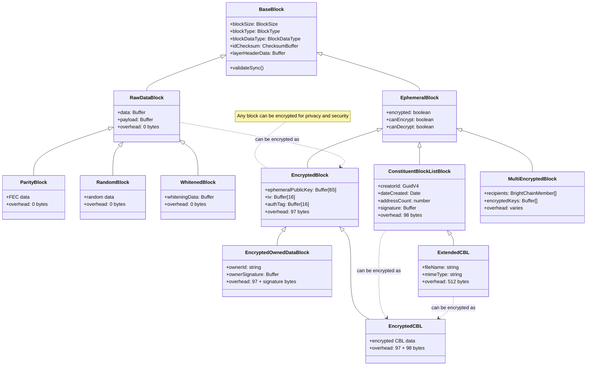
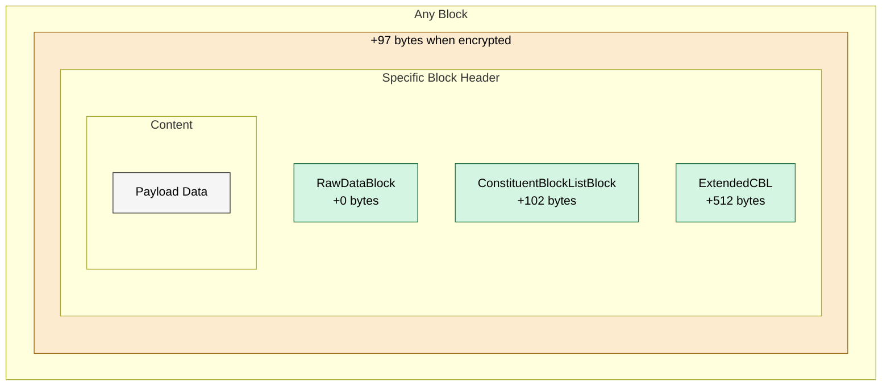

# Block Hierarchy for BrightChain

BrightChain has concepts for a few different block types. Blocks on disk have no inherent meaning, but at various phases of certain processes, they may have temporary meaning like whether the source is a random block or a reused block as a whitener. Ephemeral blocks in memory can have several different meanings, and should never be committed to disk.

## Core Blocks

### BaseBlock (abstract)

- Core block functionality
- Size, type, checksum
- Header/payload structure
- Basic validation

### RawDataBlock extends BaseBlock

- Simple data storage
- No encryption/metadata
- Used for basic disk storage
- Minimal overhead

## File System Blocks

### ConstituentBlockListBlock extends BaseBlock

- Stores block references
- Creator signature
- Block reconstruction info
- Can be persisted to disk
- Structure:
  ```
  [Base Header]
  [Creator ID]
  [Date Created]
  [Address Count]
  [Original Length]
  [Tuple Size]
  [Creator Signature]
  [Block References]
  [Padding]
  ```

### EncryptedBlock extends BaseBlock

- ECIES encryption header
- Encrypted payload
- Structure:
  ```
  [Base Header]
  [Public Key]
  [IV]
  [Auth Tag]
  [Encrypted Data]
  [Padding]
  ```

### EncryptedCBL extends EncryptedBlock

- Encrypted version of CBL
- Protects block references
- Structure:
  ```
  [Base Header]
  [Encryption Header]
  [Encrypted CBL Data]
  [Padding]
  ```

## Design Principles

1. Minimal Inheritance

   - Each layer adds specific functionality
   - No redundant abstractions
   - Clear responsibilities

2. Clear Data Layout

   - Headers at start of block
   - Signatures before data they protect
   - Encryption wraps entire payload

3. Flexible Storage

   - All blocks can be persisted
   - No ephemeral-only blocks
   - Consistent disk format

4. Owner Free Design
   - No user-specific blocks
   - All blocks sharable
   - Encryption for privacy

## Implementation Notes

1. Remove EphemeralBlock

   - Move functionality to BaseBlock
   - All blocks support disk storage
   - Simplify inheritance chain

2. Simplify Encryption

   - Single encryption layer
   - No owned data concept
   - Encryption wraps entire payload

3. Remove ExtendedCBL

   - CBL handles all metadata
   - No separate file properties
   - Keep block structure simple

4. Consistent Headers
   - Base header first
   - Layer headers sequential
   - Signatures before data
   - Encryption header last

This structure better supports the Owner Free File System by:

- Minimizing complexity
- Ensuring consistent storage
- Supporting proper encryption
- Maintaining data integrity

# Diagrams

## Block Inheritance



## Block Overhead


