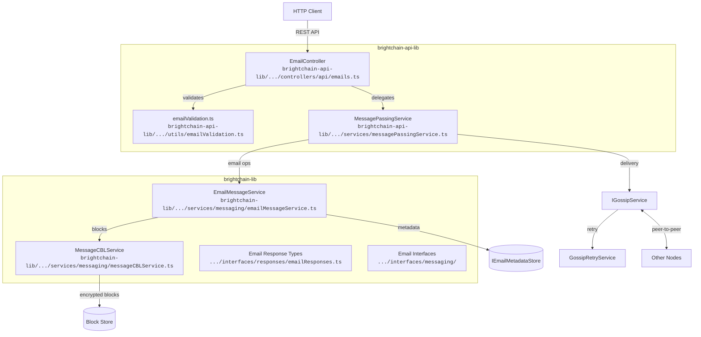
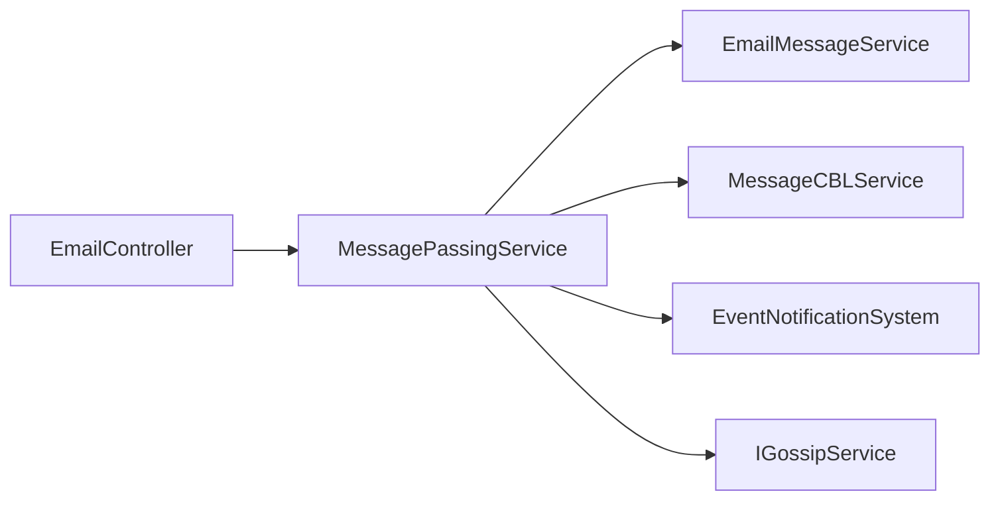
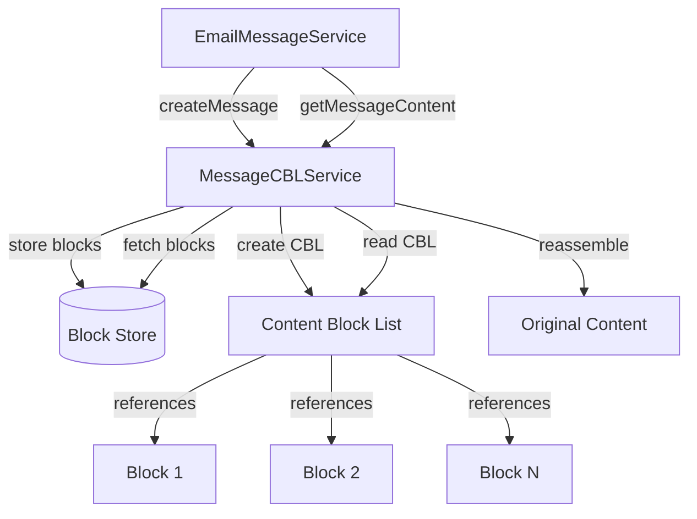
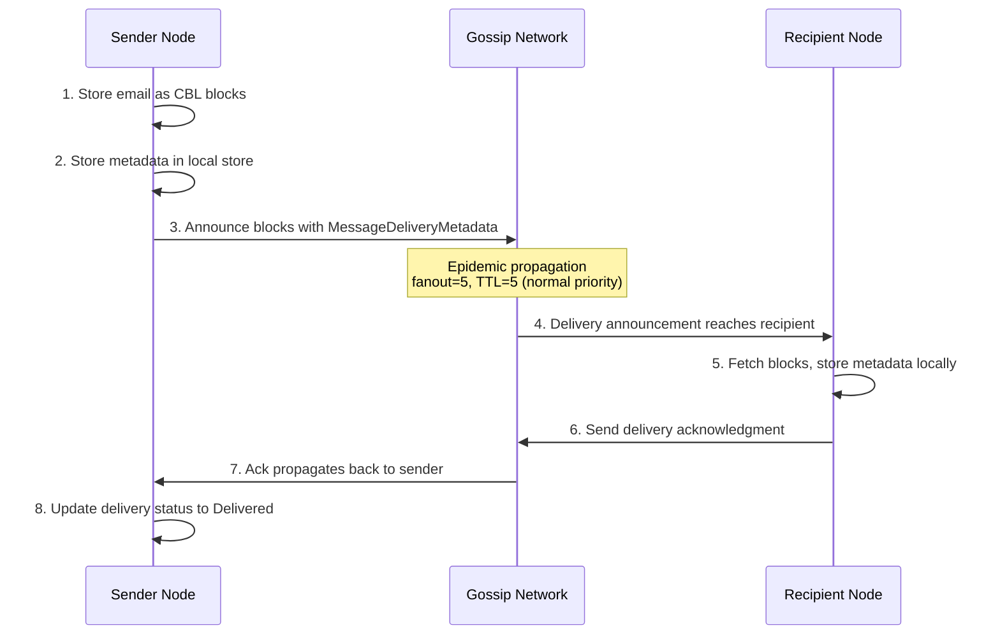
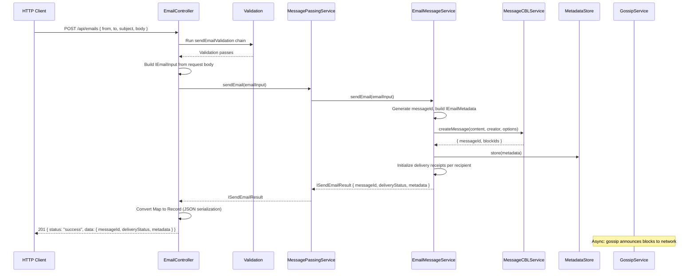
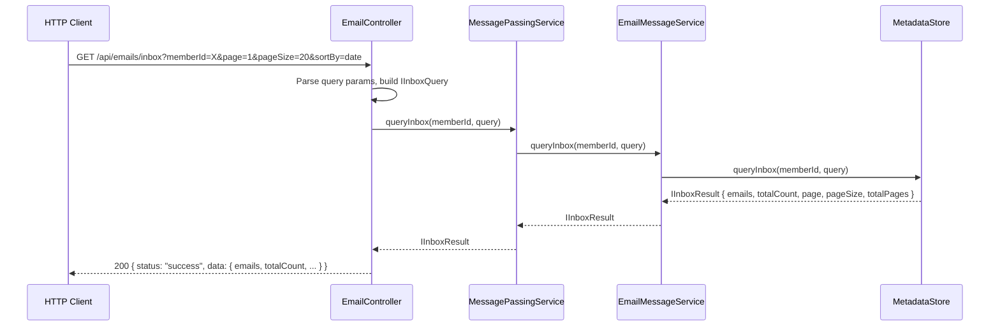
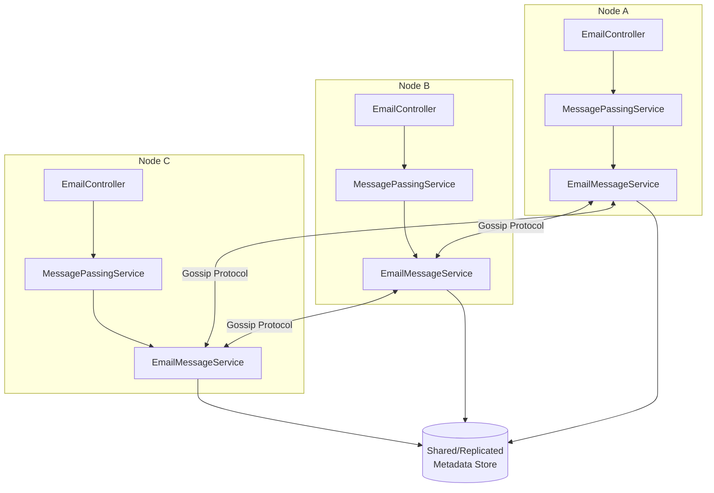

# BrightChain Email System Architecture

## Overview

The BrightChain email system provides a fully decentralized, RFC 5322-compliant email service built on top of BrightChain's encrypted block storage and gossip-based delivery network. Unlike traditional email systems that rely on centralized SMTP servers, BrightChain emails are stored as encrypted Content Block Lists (CBLs), propagated across nodes via epidemic gossip, and tracked with cryptographic delivery receipts.

The system is organized into four layers:

1. **HTTP API Layer** — RESTful endpoints for clients (`EmailController`)
2. **Service Layer** — Business logic and orchestration (`MessagePassingService`)
3. **Storage Layer** — Email metadata and block storage (`EmailMessageService`, `MessageCBLService`)
4. **Delivery Layer** — Gossip-based propagation and acknowledgments (`IGossipService`, `GossipRetryService`)



## 1. HTTP API Layer

### EmailController

**File:** `brightchain-api-lib/src/lib/controllers/api/emails.ts`

The `EmailController` extends `BaseController` from `@digitaldefiance/node-express-suite` and serves as a thin delegation layer. It handles:

- Request validation (via `express-validator` chains)
- Parameter extraction from HTTP requests
- Delegation to `MessagePassingService`
- Error mapping to HTTP status codes
- Response wrapping in `IApiEnvelope<T>`

The controller is registered in the `ApiRouter` (`brightchain-api-lib/src/lib/routers/api.ts`) and mounted at `/api/emails`.

### Route Table

| Method | Path | Handler | Description |
|--------|------|---------|-------------|
| `POST` | `/api/emails` | `handleSendEmail` | Send a new email |
| `GET` | `/api/emails/inbox` | `handleQueryInbox` | Query inbox with filters and pagination |
| `GET` | `/api/emails/inbox/unread-count` | `handleGetUnreadCount` | Get unread email count |
| `GET` | `/api/emails/:messageId` | `handleGetEmail` | Get email metadata by ID |
| `GET` | `/api/emails/:messageId/content` | `handleGetEmailContent` | Get full email content (body + attachments) |
| `GET` | `/api/emails/:messageId/thread` | `handleGetEmailThread` | Get all emails in a thread |
| `GET` | `/api/emails/:messageId/delivery-status` | `handleGetDeliveryStatus` | Get per-recipient delivery status |
| `POST` | `/api/emails/:messageId/reply` | `handleReplyToEmail` | Reply to an email |
| `POST` | `/api/emails/:messageId/forward` | `handleForwardEmail` | Forward an email |
| `POST` | `/api/emails/:messageId/read` | `handleMarkAsRead` | Mark email as read |
| `DELETE` | `/api/emails/:messageId` | `handleDeleteEmail` | Delete an email |

Route ordering is significant: `/inbox` and `/inbox/unread-count` are registered before `/:messageId` routes to prevent Express from treating "inbox" as a `messageId` parameter.

### Request/Response Format

All responses use the `IApiEnvelope<T>` wrapper:

```json
{
  "status": "success",
  "data": { ... }
}
```

Error responses:

```json
{
  "status": "error",
  "error": {
    "code": "EMAIL_NOT_FOUND",
    "message": "Email not found: <messageId>"
  }
}
```

Validation errors include field-level details:

```json
{
  "status": "error",
  "error": {
    "code": "VALIDATION_ERROR",
    "message": "Validation failed",
    "details": {
      "from.localPart": ["localPart is required"]
    }
  }
}
```

### Request Bodies

**Send Email** (`POST /api/emails`):
```json
{
  "from": { "localPart": "alice", "domain": "brightchain.io", "displayName": "Alice" },
  "to": [{ "localPart": "bob", "domain": "brightchain.io" }],
  "cc": [],
  "bcc": [],
  "subject": "Hello",
  "textBody": "Plain text content",
  "htmlBody": "<p>HTML content</p>",
  "memberId": "optional-member-id"
}
```

**Reply** (`POST /api/emails/:messageId/reply`):
```json
{
  "from": { "localPart": "bob", "domain": "brightchain.io" },
  "replyAll": false,
  "subject": "Re: Hello",
  "textBody": "Reply content"
}
```

**Forward** (`POST /api/emails/:messageId/forward`):
```json
{
  "forwardTo": [{ "localPart": "charlie", "domain": "brightchain.io" }]
}
```

**Inbox Query** (`GET /api/emails/inbox`):
Query parameters: `memberId`, `readStatus` (read|unread|all), `senderAddress`, `dateFrom`, `dateTo`, `hasAttachments`, `subjectContains`, `searchText`, `sortBy` (date|sender|subject|size), `sortDirection` (asc|desc), `page`, `pageSize`.

### Validation Schemas

**File:** `brightchain-api-lib/src/lib/utils/emailValidation.ts`

Each endpoint has a corresponding `express-validator` chain:

| Schema | Key Validations |
|--------|----------------|
| `sendEmailValidation` | `from.localPart` and `from.domain` required; at least one recipient in `to`/`cc`/`bcc` |
| `replyEmailValidation` | `messageId` param + `from.localPart` and `from.domain` required |
| `forwardEmailValidation` | `messageId` param + `forwardTo` must be a non-empty array |
| `queryInboxValidation` | `page`/`pageSize` must be positive integers; `readStatus` must be read/unread/all |
| `getUnreadCountValidation` | `memberId` required |
| `messageIdParamValidation` | `messageId` param required (used by GET/DELETE endpoints) |

### Error Mapping

The controller maps service-layer errors to HTTP status codes:

| Error Type | HTTP Status | Response Code |
|-----------|-------------|---------------|
| Email not found | 404 | `EMAIL_NOT_FOUND` |
| Validation failure | 400 | `VALIDATION_ERROR` |
| Internal error | 500 | `INTERNAL_ERROR` |

### Map Serialization

`Map` fields in service responses (e.g., `deliveryStatus`, `deliveryReceipts`) are converted to plain `Record` objects before JSON serialization using a `mapToRecord` helper, since `JSON.stringify` serializes `Map` instances as `{}`.

### Response Type Aliases

**File:** `brightchain-lib/src/lib/interfaces/responses/emailResponses.ts`

All response types are defined in `brightchain-lib` so both frontend and backend can consume them:

| Type | Wraps |
|------|-------|
| `ISendEmailResponse` | `IApiEnvelope<ISendEmailResultSerialized>` |
| `IGetEmailResponse` | `IApiEnvelope<IEmailMetadata>` |
| `IGetEmailContentResponse` | `IApiEnvelope<IEmailContent>` |
| `IDeleteEmailResponse` | `IApiEnvelope<{ deleted: boolean }>` |
| `IQueryInboxResponse` | `IApiEnvelope<IInboxResult>` |
| `IGetUnreadCountResponse` | `IApiEnvelope<{ unreadCount: number }>` |
| `IGetEmailThreadResponse` | `IApiEnvelope<IEmailMetadata[]>` |
| `IReplyToEmailResponse` | `IApiEnvelope<ISendEmailResultSerialized>` |
| `IForwardEmailResponse` | `IApiEnvelope<ISendEmailResultSerialized>` |
| `IMarkAsReadResponse` | `IApiEnvelope<{ markedAsRead: boolean }>` |
| `IGetDeliveryStatusResponse` | `IApiEnvelope<Record<string, IDeliveryReceipt>>` |

`ISendEmailResultSerialized` replaces the `Map<string, IDeliveryReceipt>` in `ISendEmailResult` with `Record<string, IDeliveryReceipt>` to reflect the JSON-serialized form.

## 2. Service Layer

### MessagePassingService

**File:** `brightchain-api-lib/src/lib/services/messagePassingService.ts`

The `MessagePassingService` is the central orchestrator. It wraps the `EmailMessageService` (from `brightchain-lib`) and exposes email operations to the controller layer. It also handles the lower-level message passing (non-email) operations.



**Email methods exposed by MessagePassingService:**

| Method | Delegates To | Description |
|--------|-------------|-------------|
| `sendEmail(email)` | `EmailMessageService.sendEmail` | Compose and send an email |
| `getEmail(messageId)` | `EmailMessageService.getEmail` | Retrieve email metadata |
| `getEmailContent(messageId)` | `EmailMessageService.getEmailContent` | Retrieve full email content |
| `deleteEmail(messageId)` | `EmailMessageService.deleteEmail` | Delete an email |
| `queryInbox(userId, query)` | `EmailMessageService.queryInbox` | Query inbox with filters |
| `markEmailAsRead(messageId, userId)` | `EmailMessageService.markAsRead` | Mark email as read |
| `getUnreadEmailCount(userId)` | `EmailMessageService.getUnreadCount` | Get unread count |
| `getEmailThread(messageId)` | `EmailMessageService.getThread` | Get thread chain |
| `createEmailReply(messageId, reply)` | `EmailMessageService.createReply` | Create a reply |
| `forwardEmail(messageId, forwardTo)` | `EmailMessageService.forwardEmail` | Forward to new recipients |
| `getEmailDeliveryStatus(messageId)` | `EmailMessageService.getDeliveryStatus` | Get delivery receipts |

The service is injected into the controller via `setMessagePassingService()`, and into the `ApiRouter` via `setMessagePassingServiceForEmail()`.

### EmailMessageService

**File:** `brightchain-lib/src/lib/services/messaging/emailMessageService.ts`

This is where the core email business logic lives. It handles:

- Email composition with RFC 5322 header generation
- Message-ID generation (`<uuid@brightchain>` format)
- Threading via `In-Reply-To` and `References` headers
- BCC privacy (separate copies for BCC recipients)
- Attachment storage as separate CBL blocks
- Delivery receipt initialization
- Inbox querying with filters, sorting, and pagination
- Email signature creation and verification (ECIES)

**Key interfaces defined in this file:**

```typescript
interface IEmailInput {
  from: IMailbox;
  to?: IMailbox[];
  cc?: IMailbox[];
  bcc?: IMailbox[];
  subject?: string;
  textBody?: string;
  htmlBody?: string;
  inReplyTo?: string;
  references?: string[];
  attachments?: IAttachmentInput[];
  encryptionScheme?: MessageEncryptionScheme;
  recipientPublicKeys?: Map<string, Uint8Array>;
  // ... additional fields
}

interface ISendEmailResult {
  messageId: string;
  deliveryStatus: Map<string, IDeliveryReceipt>;
  metadata: IEmailMetadata;
}

interface IEmailContent {
  metadata: IEmailMetadata;
  textBody?: string;
  htmlBody?: string;
  attachments?: IRetrievedAttachment[];
}

interface IInboxQuery {
  readStatus?: 'read' | 'unread' | 'all';
  senderAddress?: string;
  dateFrom?: Date;
  dateTo?: Date;
  hasAttachments?: boolean;
  subjectContains?: string;
  searchText?: string;
  sortBy?: 'date' | 'sender' | 'subject' | 'size';
  sortDirection?: 'asc' | 'desc';
  page?: number;
  pageSize?: number;
}

interface IInboxResult {
  emails: IEmailMetadata[];
  totalCount: number;
  page: number;
  pageSize: number;
  totalPages: number;
}
```

## 3. Storage Layer

### Email Metadata

**File:** `brightchain-lib/src/lib/interfaces/messaging/emailMetadata.ts`

The `IEmailMetadata` interface extends `IMessageMetadata` with RFC 5322-compliant fields:

- **Originator fields** — `from`, `sender`, `replyTo` (Section 3.6.2)
- **Destination fields** — `to`, `cc`, `bcc` (Section 3.6.3)
- **Identification fields** — `messageId`, `inReplyTo`, `references` (Section 3.6.4)
- **Informational fields** — `subject`, `comments`, `keywords` (Section 3.6.5)
- **MIME headers** — `mimeVersion`, `contentType`, `contentTransferEncoding` (RFC 2045)
- **Delivery tracking** — `deliveryReceipts: Map<string, IDeliveryReceipt>`, `readReceipts: Map<string, Date>`
- **Resent headers** — `resentHeaders: IResentHeaderBlock[]` for forwarding (Section 3.6.6)
- **Encryption metadata** — `encryptedKeys`, `encryptionIv`, `encryptionAuthTag`, `contentSignature`

### IEmailMetadataStore

The `IEmailMetadataStore` interface defines the persistence contract:

```typescript
interface IEmailMetadataStore {
  store(metadata: IEmailMetadata): Promise<void>;
  get(messageId: string): Promise<IEmailMetadata | null>;
  delete(messageId: string): Promise<void>;
  update(messageId: string, updates: Partial<IEmailMetadata>): Promise<void>;
  queryInbox(userId: string, query: IInboxQuery): Promise<IInboxResult>;
  getUnreadCount(userId: string): Promise<number>;
  markAsRead(messageId: string, userId: string): Promise<void>;
  getThread(messageId: string): Promise<IEmailMetadata[]>;
  getRootMessage(messageId: string): Promise<IEmailMetadata | null>;
}
```

An `InMemoryEmailMetadataStore` implementation is used for testing. Production deployments would use a persistent store.

### MessageCBLService — Block Storage

**File:** `brightchain-lib/src/lib/services/messaging/messageCBLService.ts`

Email content (body, attachments) is stored as encrypted Content Block Lists (CBLs). The `MessageCBLService` handles:

1. **Message creation** — Splits content into blocks, stores each block, creates a CBL referencing all blocks
2. **Message retrieval** — Reads the CBL, fetches all referenced blocks, reassembles content
3. **Retry logic** — Automatic retry with exponential backoff for storage operations
4. **Cleanup** — Removes partial state on failure



### Delivery Receipts

**File:** `brightchain-lib/src/lib/interfaces/messaging/emailDelivery.ts`

Each recipient has a `IDeliveryReceipt` tracking the full delivery lifecycle:

```typescript
interface IDeliveryReceipt {
  recipientId: string;
  recipientNode: string;
  status: DeliveryStatus;  // Pending | Announced | Delivered | Failed | Bounced | Read
  queuedAt?: Date;
  sentAt?: Date;
  deliveredAt?: Date;
  readAt?: Date;
  failedAt?: Date;
  failureReason?: string;
  failureCode?: string;
  retryCount: number;
}
```

The `DeliveryStatus` enum tracks the lifecycle:

```
Pending → Announced → Delivered → Read
                   ↘ Failed
                   ↘ Bounced
```

## 4. Delivery Layer — Gossip Protocol

Email delivery uses BrightChain's gossip-based block propagation protocol rather than traditional SMTP. This provides decentralized, censorship-resistant delivery without centralized mail servers.

### How Email Delivery Works



### Gossip Propagation

When an email is sent:

1. **Block storage** — Email content is split into encrypted blocks and stored via `MessageCBLService`
2. **Announcement** — `GossipService.announceMessage()` creates `BlockAnnouncement` entries with `MessageDeliveryMetadata` containing the `messageId`, `recipientIds`, `blockIds`, and `cblBlockId`
3. **Fanout** — Announcements are sent to a configurable number of random peers (default: 5 for normal priority, 7 for high priority)
4. **TTL propagation** — Each peer forwards the announcement with decremented TTL until TTL reaches 0
5. **Recipient matching** — When a node receives an announcement where `recipientIds` matches a local user, it triggers message delivery handlers and stops forwarding
6. **Acknowledgment** — The recipient node sends a delivery ack back through the gossip network
7. **Retry** — `GossipRetryService` tracks unacknowledged deliveries and retries with exponential backoff (30s initial, 2x multiplier, max 5 retries)

### Encryption in Transit

Sensitive announcement metadata (message delivery info, acks) is encrypted per-peer using ECIES:

- Each peer receives a uniquely encrypted batch
- BCC recipients receive separate announcements to prevent cross-recipient information leakage
- Non-sensitive block announcements are sent in plaintext

### Block Discovery

When a recipient node needs to fetch email blocks that aren't locally available, the `DiscoveryProtocol` uses Bloom filter-based discovery:

1. Check local cache (TTL: 60s)
2. Query peer Bloom filters to identify likely block holders
3. Query filtered peers with concurrency limits
4. Return locations sorted by latency

## 5. Data Flow

### Send Email — End to End



### Query Inbox



## 6. Email Threading Model

BrightChain implements RFC 5322 threading using `In-Reply-To` and `References` headers:

- **`In-Reply-To`** — Contains the `Message-ID` of the email being replied to
- **`References`** — Contains the full chain of `Message-ID`s in the thread, from the original email to the parent

When a reply is created via `POST /api/emails/:messageId/reply`:

1. The original email's `messageId` is set as `inReplyTo`
2. The `references` chain is built by appending the original's `messageId` to its existing `references`
3. The subject is prefixed with `Re:` if not already present

When retrieving a thread via `GET /api/emails/:messageId/thread`:

1. The `IEmailMetadataStore.getThread()` method follows the `references` chain
2. Returns all emails in the thread as an `IEmailMetadata[]` array
3. The root message can be found via `getRootMessage()`

### Forwarding

Forwarding uses RFC 5322 Resent headers (Section 3.6.6):

- Each forward prepends an `IResentHeaderBlock` with `resentFrom`, `resentTo`, `resentDate`, and `resentMessageId`
- Multiple forwards result in multiple blocks, most recent first
- The original email content is preserved

## 7. Delivery Status Tracking

Delivery status is tracked per-recipient via `IDeliveryReceipt` objects stored in `IEmailMetadata.deliveryReceipts`.

### Status Lifecycle

```
┌─────────┐    ┌───────────┐    ┌───────────┐    ┌──────┐
│ Pending  │───▶│ Announced │───▶│ Delivered │───▶│ Read │
└─────────┘    └───────────┘    └───────────┘    └──────┘
                     │
                     ├──▶ Failed (after max retries)
                     │
                     └──▶ Bounced (rejected by recipient node)
```

### Retry Behavior

Unacknowledged deliveries are retried by `GossipRetryService`:

| Retry | Delay |
|-------|-------|
| 1 | 30 seconds |
| 2 | 60 seconds |
| 3 | 120 seconds |
| 4 | 240 seconds (capped) |
| 5 | 240 seconds (capped) |

After 5 retries, the delivery is marked as `Failed` and a `MESSAGE_FAILED` event is emitted.

### Querying Delivery Status

`GET /api/emails/:messageId/delivery-status` returns a `Record<string, IDeliveryReceipt>` mapping each recipient to their delivery receipt with timestamps and status.

## 8. Multi-Node Architecture

The email system is designed for multi-node deployments where each node runs its own `EmailController` instance backed by shared (or replicated) services.



### Cross-Node Operations

- **Send on Node A, retrieve on Node B** — Email blocks propagate via gossip; metadata is available in the shared store
- **Reply on Node B, thread on Node C** — Threading references are stored in metadata, accessible from any node
- **Mark read on Node A, unread count on Node B** — Read status updates are reflected in the shared metadata store
- **Delete on Node A, 404 on Node B** — Deletion removes metadata from the shared store

### Service Injection

Each node's `ApiRouter` receives its `MessagePassingService` via setter injection:

```typescript
// In ApiRouter
public setMessagePassingServiceForEmail(service: MessagePassingService): void {
  this.emailController.setMessagePassingService(service);
}
```

## 9. Testing Strategy

### Property-Based Tests

**File:** `brightchain-api-lib/src/lib/controllers/api/emails.property.spec.ts`

Five property-based tests using `fast-check` (minimum 100 iterations each):

| Property | What It Validates |
|----------|-------------------|
| **P1: Send-then-retrieve round trip** | Send email → GET metadata → GET content; verify fields match |
| **P2: Validation rejects invalid inputs** | Missing `from`, empty recipients, invalid pagination → 400 |
| **P3: Delete removes email** | Send → DELETE → GET returns 404 |
| **P4: Unread count tracks read status** | Send N emails, mark M as read → unread count = N - M |
| **P5: Thread contains all replies** | Send email + K replies → thread length ≥ K + 1 |

### Multi-Node E2E Tests

**File:** `brightchain-api-lib/src/lib/services/e2e.email.spec.ts`

Integration tests using `supertest` against multiple Express server instances:

| Test | Scenario |
|------|----------|
| Cross-node send/retrieve | Send on node-0, retrieve metadata on node-1, content on node-2 |
| Cross-node reply/thread | Send on node-0, reply on node-1, get thread on node-2 |
| Cross-node forward | Send on node-0, forward on node-1, retrieve on node-2 |
| Cross-node read status | Send on node-0, mark read on node-2, check unread count on node-1 |
| Cross-node delete | Send on node-0, delete on node-1, verify 404 on node-2 |
| Cross-node inbox filtering | Send multiple emails across nodes, verify consistent pagination |
| Cross-node delivery status | Send on node-0, check delivery receipts on node-1 |
| Error handling | Non-existent IDs → 404; missing fields → 400 |

The e2e tests use `buildEmailMultiNodeEnv(count)` which creates `count` Express servers on random ports, each with its own `EmailController` wired to a shared `MessagePassingService`.

### Running Tests

```bash
# All tests in brightchain-api-lib
NX_TUI=false npx nx run brightchain-api-lib:test --outputStyle=stream

# Property tests only
NX_TUI=false npx nx run brightchain-api-lib:test --testFile=emails.property.spec.ts --outputStyle=stream

# E2E tests only
NX_TUI=false npx nx run brightchain-api-lib:test --testFile=e2e.email.spec.ts --outputStyle=stream
```

## 10. Key File Reference

| File | Package | Purpose |
|------|---------|---------|
| `controllers/api/emails.ts` | `brightchain-api-lib` | HTTP controller with 11 route handlers |
| `utils/emailValidation.ts` | `brightchain-api-lib` | Express-validator chains for all endpoints |
| `services/messagePassingService.ts` | `brightchain-api-lib` | Service orchestrator delegating to EmailMessageService |
| `routers/api.ts` | `brightchain-api-lib` | ApiRouter mounting EmailController at `/api/emails` |
| `interfaces/responses/emailResponses.ts` | `brightchain-lib` | Shared response type aliases |
| `interfaces/messaging/emailMetadata.ts` | `brightchain-lib` | RFC 5322 email metadata interface |
| `interfaces/messaging/emailDelivery.ts` | `brightchain-lib` | Delivery receipt and status types |
| `interfaces/messaging/emailAddress.ts` | `brightchain-lib` | IMailbox interface |
| `services/messaging/emailMessageService.ts` | `brightchain-lib` | Core email business logic |
| `services/messaging/messageCBLService.ts` | `brightchain-lib` | Block storage for email content |

## Related Documentation

- [Gossip Delivery Protocol](./Gossip_Delivery_Protocol.md) — Detailed gossip protocol specification
- [Communication System Architecture](./Communication_System_Architecture.md) — Direct messages, groups, and channels
- [Messaging System Architecture](./Messaging%20System%20Architecture.md) — Underlying message passing infrastructure
- [Message Passing API](./message-passing-api.md) — MessageCBLService and routing API reference
- [BrightChain Summary](./BrightChain%20Summary.md) — Overall system overview
