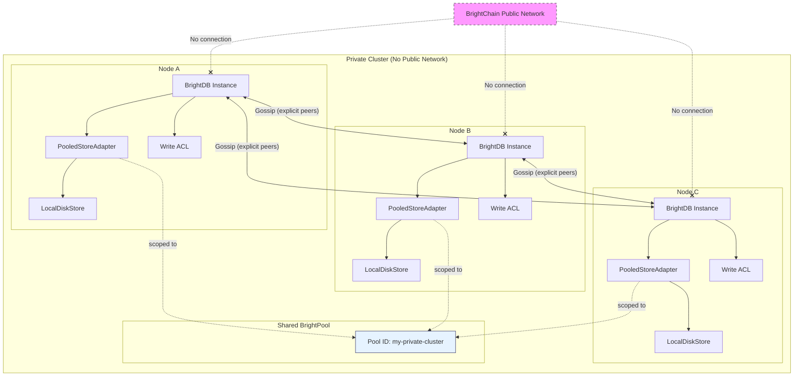
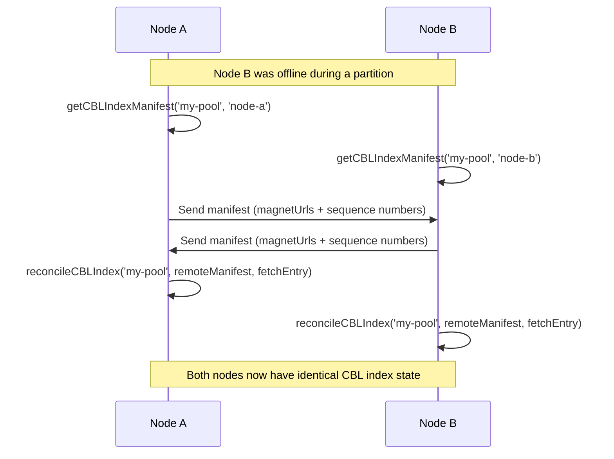

# BrightStack Private Cluster

| Field | Value |
|-------|-------|
| Prerequisites | Multiple machines or containers, Node.js 20+, network connectivity between nodes |
| Estimated Time | 30 minutes |
| Difficulty | Intermediate |

## Introduction

A private BrightDB cluster is a group of two or more BrightDB nodes that replicate data among themselves using private storage pools and gossip-based synchronization. **The cluster does not participate in the BrightChain network.** No public discovery, no blockchain interaction, and no data leaves the cluster boundary. All data remains private to the nodes you explicitly configure as members.

This deployment model gives you the replication and availability benefits of a distributed database while keeping full control over who can read and write data. Each node in the cluster runs its own BrightDB instance backed by a persistent block store, and nodes communicate through explicit peer lists — not public network discovery.

Key characteristics of a private cluster:

- **No BrightChain network participation** — nodes never connect to or announce themselves on the public network
- **Explicit membership** — every peer is configured by address; there is no automatic discovery
- **Pool-scoped replication** — data is isolated within a private BrightPool namespace shared only by cluster members
- **Mandatory ACL enforcement** — write access is controlled by public-key-based access control lists
- **Encrypted at rest** — pool-shared AES-256-GCM encryption protects all stored blocks

If you only need a single-node setup without replication, see the [BrightStack Standalone Setup](./05-brightstack-standalone.md) guide instead.

## Prerequisites

- **Two or more machines, VMs, or containers** — each node runs its own BrightDB instance. For local development, you can use multiple processes on the same machine with different ports.
- **Node.js 20+** — Download from [nodejs.org](https://nodejs.org) or use a version manager like `nvm`
- **npm or yarn** — Comes with Node.js (npm) or install yarn via `npm install -g yarn`
- **Network connectivity between nodes** — all nodes must be able to reach each other over TCP. Ensure firewall rules allow traffic on the gossip and API ports you configure.
- **Basic familiarity with BrightDB** — this guide assumes you have completed the [BrightStack Standalone Setup](./05-brightstack-standalone.md) guide or are comfortable with BrightDB's core APIs (collections, CRUD, block stores).

You do **not** need:
- The BrightChain monorepo
- A running BrightChain node
- Any public network or blockchain configuration
- DNS or service discovery infrastructure

Install the required packages on each node:

```bash
npm install @brightchain/db @brightchain/brightchain-lib express cors
```

## Cluster Architecture Overview

A private cluster consists of multiple BrightDB nodes, each backed by a `LocalDiskStore` with a `PersistentHeadRegistry`. All nodes share a common **BrightPool** — a storage pool namespace that scopes block operations to the cluster. The `PooledStoreAdapter` wraps each node's block store and routes all reads and writes through the pool, ensuring data isolation.

Nodes synchronize state using the **gossip protocol** with explicit peer lists. When a node writes a block, it announces the change to its configured peers, which propagate the announcement further based on fanout and TTL settings. Reconciliation handles recovery from network partitions by comparing CBL index manifests between peers and fetching missing entries.

Write access is governed by **ACLs** (Access Control Lists) that specify authorized writers and administrators by public key. Any connection attempt from a node not listed in the cluster ACL is rejected.



**Key components:**

- **BrightDB Instance** — each node creates a `BrightDb` with a `poolId` option, which automatically wraps the underlying store in a `PooledStoreAdapter`
- **PooledStoreAdapter** — routes all block operations (`has`, `get`, `put`, `delete`) through the shared pool namespace, ensuring blocks are isolated from any other pools on the same store
- **LocalDiskStore + PersistentHeadRegistry** — provides durable storage that survives restarts on each node
- **Gossip (explicit peers)** — nodes exchange block announcements using configured peer addresses, with configurable fanout, TTL, and batch settings
- **Write ACL** — each node enforces the same ACL, authorizing writes only from known cluster members identified by their public keys
- **Reconciliation** — periodic or on-demand comparison of CBL index manifests between peers to detect and recover missing blocks after network partitions

## 1. Creating a Private BrightPool

A BrightPool is a storage namespace that isolates blocks within a cluster. Every node in your private cluster shares the same pool ID, and all block operations — reads, writes, deletes — are scoped to that pool. Blocks written to one pool are invisible to other pools on the same store.

There are two ways to configure pool-scoped storage: let `BrightDb` handle it automatically via the `poolId` option, or create a `PooledStoreAdapter` manually for more control.

### Automatic Pool Wrapping (Recommended)

The simplest approach is to pass `poolId` when creating your `BrightDb` instance. When the underlying block store supports pool operations, BrightDB automatically wraps it in a `PooledStoreAdapter`:

```typescript
import { BrightDb } from '@brightchain/db';
import { PooledMemoryBlockStore } from '@brightchain/brightchain-lib';

// Each node uses the same pool ID to share data within the cluster
const POOL_ID = 'my-private-cluster';

// Create a pooled block store (use LocalDiskStore in production)
const blockStore = new PooledMemoryBlockStore();

// BrightDb automatically wraps the store in a PooledStoreAdapter
const db = new BrightDb(blockStore, {
  name: 'cluster-node-1',
  poolId: POOL_ID,
  dataDir: './data/node1',
});

await db.connect();

// All collection operations are now scoped to 'my-private-cluster'
const users = db.collection('users');
await users.insertOne({ name: 'Alice', role: 'admin' });

// This document is only visible to nodes sharing the same pool ID
const alice = await users.findOne({ name: 'Alice' });
console.log(alice); // { _id: '...', name: 'Alice', role: 'admin' }
```

When you provide `poolId`, BrightDB:
1. Detects that the block store implements `IPooledBlockStore`
2. Creates a `PooledStoreAdapter` that fixes all operations to the given pool
3. Uses namespace-prefixed storage keys (`poolId:hash`) for logical isolation
4. Routes all collection reads and writes through the pool-scoped adapter

### Manual PooledStoreAdapter Configuration

If you need direct control over the adapter — for example, to share a single block store across multiple pools or to access pool-level operations — you can create the `PooledStoreAdapter` yourself:

```typescript
import { BrightDb } from '@brightchain/db';
import { PooledStoreAdapter } from '@brightchain/db';
import { PooledMemoryBlockStore } from '@brightchain/brightchain-lib';

const POOL_ID = 'my-private-cluster';

// Create the underlying pooled block store
const pooledBlockStore = new PooledMemoryBlockStore();

// Manually create the adapter — all operations are fixed to this pool
const adapter = new PooledStoreAdapter(pooledBlockStore, POOL_ID);

// Pass the adapter as the block store (no poolId needed — already scoped)
const db = new BrightDb(adapter, {
  name: 'cluster-node-1',
  dataDir: './data/node1',
});

await db.connect();

// Operations go through the adapter → pool-scoped storage
const users = db.collection('users');
await users.insertOne({ name: 'Bob', role: 'developer' });
```

The `PooledStoreAdapter` implements the standard `IBlockStore` interface, so `Collection` and all other BrightDB internals work without modification. The adapter transparently routes every call through pool-scoped methods on the inner store:

| IBlockStore Method | PooledStoreAdapter Delegation |
|--------------------|-------------------------------|
| `has(key)` | `inner.hasInPool(poolId, key)` |
| `get(key)` | `inner.get(makeStorageKey(poolId, key))` |
| `put(key, data)` | `inner.putInPool(poolId, data)` |
| `delete(key)` | `inner.deleteFromPool(poolId, key)` |
| `getRandomBlocks(count)` | `inner.getRandomBlocksFromPool(poolId, count)` |

### Choosing a Pool ID

Your pool ID is a string that uniquely identifies the cluster's shared namespace. Choose something descriptive and consistent across all nodes:

```typescript
// Good: descriptive, unique to your cluster
const POOL_ID = 'acme-prod-cluster';
const POOL_ID = 'staging-east-us-2';

// Avoid: generic names that could collide with other deployments
const POOL_ID = 'default';
const POOL_ID = 'test';
```

> **Important:** Every node in the cluster must use the exact same pool ID. A mismatched pool ID means the node operates in an isolated namespace and cannot see data written by other cluster members.

### Production Node Setup

In production, each node uses a `LocalDiskStore` with a `PersistentHeadRegistry` for durable storage. Here is a complete node initialization example:

```typescript
import { BrightDb, PersistentHeadRegistry } from '@brightchain/db';
import { PooledMemoryBlockStore } from '@brightchain/brightchain-lib';

const POOL_ID = 'acme-prod-cluster';
const NODE_NAME = process.env.NODE_NAME || 'node-1';
const DATA_DIR = process.env.DATA_DIR || `./data/${NODE_NAME}`;

// Create the pooled block store
const blockStore = new PooledMemoryBlockStore();

// Create an explicit head registry for full control
const headRegistry = new PersistentHeadRegistry({
  dataDir: DATA_DIR,
});

const db = new BrightDb(blockStore, {
  name: NODE_NAME,
  poolId: POOL_ID,
  headRegistry,
});

// Load persisted head pointers from disk
await db.connect();

console.log(`Node "${NODE_NAME}" connected to pool "${POOL_ID}"`);
console.log(`Data directory: ${DATA_DIR}`);

// Create collections — they are scoped to the pool automatically
const users = db.collection('users');
const orders = db.collection('orders');
```

## 2. Configuring Gossip

Gossip is the mechanism by which cluster nodes announce block changes to each other. In a private cluster, gossip uses **explicit peer lists** — there is no public discovery, no broadcast, and no connection to the BrightChain network. Each node knows exactly which peers to communicate with.

### Gossip Configuration

Configure gossip on each node by specifying the addresses of all other cluster members. Every node must be reachable by its peers over TCP:

```typescript
// gossip-config.ts — shared configuration for all cluster nodes

export interface GossipConfig {
  /** TCP addresses of all other nodes in the cluster */
  peers: string[];
  /** Number of peers to forward each announcement to (default: 2) */
  fanout: number;
  /** Maximum number of hops an announcement can travel (default: 3) */
  ttl: number;
  /** Milliseconds between gossip heartbeats (default: 5000) */
  intervalMs: number;
}

// Node A's gossip configuration
export const nodeAGossip: GossipConfig = {
  peers: [
    'tcp://192.168.1.11:4001', // Node B
    'tcp://192.168.1.12:4001', // Node C
  ],
  fanout: 2,
  ttl: 3,
  intervalMs: 5000,
};

// Node B's gossip configuration
export const nodeBGossip: GossipConfig = {
  peers: [
    'tcp://192.168.1.10:4001', // Node A
    'tcp://192.168.1.12:4001', // Node C
  ],
  fanout: 2,
  ttl: 3,
  intervalMs: 5000,
};

// Node C's gossip configuration
export const nodeCGossip: GossipConfig = {
  peers: [
    'tcp://192.168.1.10:4001', // Node A
    'tcp://192.168.1.11:4001', // Node B
  ],
  fanout: 2,
  ttl: 3,
  intervalMs: 5000,
};
```

### Gossip Parameters Explained

| Parameter | Type | Default | Description |
|-----------|------|---------|-------------|
| `peers` | `string[]` | (required) | TCP addresses of other cluster nodes. Each node lists every other node it should communicate with. |
| `fanout` | `number` | `2` | How many peers each node forwards an announcement to. Higher values increase propagation speed but also network traffic. For a 3-node cluster, `2` means every announcement reaches all peers in one hop. |
| `ttl` | `number` | `3` | Maximum number of hops an announcement can travel before being dropped. Prevents infinite propagation loops. For small clusters (3–5 nodes), `3` is sufficient. |
| `intervalMs` | `number` | `5000` | Milliseconds between gossip heartbeats. Each heartbeat sends any pending announcements to selected peers. Lower values reduce propagation latency but increase network overhead. |

### Environment-Driven Configuration

In production, avoid hardcoding peer addresses. Use environment variables so the same code runs on any node:

```typescript
// cluster-node.ts — production node with environment-driven gossip

import { BrightDb, PersistentHeadRegistry } from '@brightchain/db';
import { PooledMemoryBlockStore } from '@brightchain/brightchain-lib';

const POOL_ID = process.env.POOL_ID || 'my-private-cluster';
const NODE_NAME = process.env.NODE_NAME || 'node-1';
const DATA_DIR = process.env.DATA_DIR || `./data/${NODE_NAME}`;
const GOSSIP_PORT = parseInt(process.env.GOSSIP_PORT || '4001', 10);

// Parse comma-separated peer list from environment
// Example: GOSSIP_PEERS=tcp://192.168.1.11:4001,tcp://192.168.1.12:4001
const GOSSIP_PEERS = (process.env.GOSSIP_PEERS || '')
  .split(',')
  .map((p) => p.trim())
  .filter(Boolean);

const gossipConfig = {
  peers: GOSSIP_PEERS,
  fanout: parseInt(process.env.GOSSIP_FANOUT || '2', 10),
  ttl: parseInt(process.env.GOSSIP_TTL || '3', 10),
  intervalMs: parseInt(process.env.GOSSIP_INTERVAL_MS || '5000', 10),
};

// Initialize the database with pool scoping
const blockStore = new PooledMemoryBlockStore();
const db = new BrightDb(blockStore, {
  name: NODE_NAME,
  poolId: POOL_ID,
  dataDir: DATA_DIR,
});

await db.connect();

console.log(`Node "${NODE_NAME}" started`);
console.log(`Pool: ${POOL_ID}`);
console.log(`Gossip port: ${GOSSIP_PORT}`);
console.log(`Gossip peers: ${gossipConfig.peers.join(', ')}`);
console.log(`Fanout: ${gossipConfig.fanout}, TTL: ${gossipConfig.ttl}`);
```

Run each node with its own environment:

```bash
# Node A
NODE_NAME=node-a DATA_DIR=./data/node-a GOSSIP_PORT=4001 \
  GOSSIP_PEERS=tcp://192.168.1.11:4001,tcp://192.168.1.12:4001 \
  npx ts-node src/cluster-node.ts

# Node B
NODE_NAME=node-b DATA_DIR=./data/node-b GOSSIP_PORT=4001 \
  GOSSIP_PEERS=tcp://192.168.1.10:4001,tcp://192.168.1.12:4001 \
  npx ts-node src/cluster-node.ts

# Node C
NODE_NAME=node-c DATA_DIR=./data/node-c GOSSIP_PORT=4001 \
  GOSSIP_PEERS=tcp://192.168.1.10:4001,tcp://192.168.1.11:4001 \
  npx ts-node src/cluster-node.ts
```

### How Gossip Propagation Works

When a node writes a block to the pool, the gossip protocol propagates the announcement through the cluster:

1. **Node A** writes a new block and creates a gossip announcement containing the block's checksum and metadata.
2. At the next heartbeat interval, Node A selects up to `fanout` peers (e.g., Node B and Node C) and sends the announcement.
3. Each receiving node checks whether it already has the block. If not, it fetches the block data from the announcing peer and stores it in its own pool-scoped store.
4. If `ttl > 1`, the receiving node decrements the TTL and forwards the announcement to its own peers (excluding the sender). This continues until TTL reaches 0.
5. Duplicate announcements (same block checksum) are silently dropped, preventing infinite loops.

```
Node A writes block X
    │
    ├──► Node B (fanout=2, ttl=3)
    │       │
    │       └──► Node C (ttl=2, already has it → drop)
    │
    └──► Node C (fanout=2, ttl=3)
            │
            └──► Node B (ttl=2, already has it → drop)
```

> **No public discovery:** Unlike a BrightChain network node, private cluster gossip never broadcasts to unknown addresses. Announcements only travel between the peers you explicitly configure. If a node is not in your peer list, it never receives gossip from your cluster.

### Tuning Gossip for Cluster Size

| Cluster Size | Recommended Fanout | Recommended TTL | Notes |
|-------------|-------------------|-----------------|-------|
| 2–3 nodes | 2 | 2 | Full mesh — every node talks to every other node directly |
| 4–7 nodes | 2–3 | 3 | Announcements reach all nodes within 2 hops |
| 8–15 nodes | 3–4 | 4 | Higher fanout ensures faster convergence |
| 16+ nodes | 4–5 | 5 | Consider reducing `intervalMs` for faster propagation |

For most private clusters (3–5 nodes), the defaults (`fanout: 2`, `ttl: 3`, `intervalMs: 5000`) work well. Increase `fanout` if you need faster convergence, or increase `intervalMs` if you want to reduce network traffic at the cost of higher propagation latency.


## 3. Reconciliation

Network partitions are inevitable in distributed systems. When a node goes offline — due to a restart, network outage, or maintenance — it misses block announcements from other nodes. Gossip handles real-time propagation, but it cannot retroactively deliver announcements that were sent while a node was unreachable.

Reconciliation fills this gap. It compares the CBL index manifests between two peers, identifies entries that one peer has but the other does not, and fetches the missing entries. You can run reconciliation periodically on a schedule or trigger it on-demand when a node rejoins the cluster.

### How Reconciliation Works

Each node maintains a **CBL index** — a higher-level index over Content Block Lists that tracks all blocks stored in a pool. The reconciliation process:

1. **Generate a local manifest** — the node calls `getCBLIndexManifest()` to produce a list of `(magnetUrl, sequenceNumber)` pairs for its pool.
2. **Exchange manifests** — the node sends its manifest to a peer and receives the peer's manifest in return.
3. **Compare and merge** — the node calls `reconcileCBLIndex()` with the remote manifest. This identifies entries present in the remote manifest but missing locally, fetches the full entry data from the peer, and merges it into the local index.



### Configuring Reconciliation

Set up a reconciliation handler that runs between two peers. Each node generates its own manifest, exchanges it with the peer, and reconciles the differences:

```typescript
// reconciliation.ts — reconciliation between two cluster peers

import { BrightDb } from '@brightchain/db';
import { CBLIndex } from '@brightchain/db';
import type { CBLIndexManifest, ICBLIndexEntry } from '@brightchain/brightchain-lib';

const POOL_ID = 'my-private-cluster';

/**
 * Run reconciliation between the local node and a remote peer.
 *
 * @param localDb - The local BrightDb instance
 * @param localIndex - The local CBL index
 * @param localNodeId - This node's identifier
 * @param remoteManifest - The manifest received from the remote peer
 * @param fetchRemoteEntry - Function to fetch a full CBL entry from the remote peer
 * @returns The number of entries merged from the remote peer
 */
async function reconcileWithPeer(
  localIndex: CBLIndex,
  localNodeId: string,
  remoteManifest: CBLIndexManifest,
  fetchRemoteEntry: (magnetUrl: string) => Promise<ICBLIndexEntry | null>,
): Promise<number> {
  // Compare the remote manifest against the local index and merge missing entries
  const mergedCount = await localIndex.reconcileCBLIndex(
    POOL_ID,
    remoteManifest,
    fetchRemoteEntry,
  );

  console.log(`Reconciliation complete: merged ${mergedCount} entries from peer`);
  return mergedCount;
}

/**
 * Generate this node's manifest for exchange with a peer.
 */
async function getLocalManifest(
  localIndex: CBLIndex,
  localNodeId: string,
): Promise<CBLIndexManifest> {
  return localIndex.getCBLIndexManifest(POOL_ID, localNodeId);
}
```

### Periodic Reconciliation

For production clusters, schedule reconciliation to run at regular intervals. This ensures that even if gossip misses an announcement (e.g., due to a brief network blip), the nodes eventually converge:

```typescript
// periodic-reconciliation.ts — scheduled reconciliation loop

import type { CBLIndexManifest, ICBLIndexEntry } from '@brightchain/brightchain-lib';
import { CBLIndex } from '@brightchain/db';

const POOL_ID = 'my-private-cluster';
const NODE_ID = process.env.NODE_NAME || 'node-1';
const RECONCILE_INTERVAL_MS = 60_000; // every 60 seconds

interface ClusterPeer {
  nodeId: string;
  address: string;
}

// List of peers to reconcile with
const peers: ClusterPeer[] = [
  { nodeId: 'node-b', address: 'http://192.168.1.11:3000' },
  { nodeId: 'node-c', address: 'http://192.168.1.12:3000' },
];

/**
 * Fetch a remote peer's manifest over HTTP.
 */
async function fetchPeerManifest(peer: ClusterPeer): Promise<CBLIndexManifest> {
  const response = await fetch(`${peer.address}/api/reconcile/manifest`);
  return response.json() as Promise<CBLIndexManifest>;
}

/**
 * Fetch a full CBL entry from a remote peer by magnet URL.
 */
function createEntryFetcher(
  peer: ClusterPeer,
): (magnetUrl: string) => Promise<ICBLIndexEntry | null> {
  return async (magnetUrl: string) => {
    const response = await fetch(
      `${peer.address}/api/reconcile/entry/${encodeURIComponent(magnetUrl)}`,
    );
    if (!response.ok) return null;
    return response.json() as Promise<ICBLIndexEntry>;
  };
}

/**
 * Run reconciliation against all configured peers.
 */
async function reconcileAll(localIndex: CBLIndex): Promise<void> {
  for (const peer of peers) {
    try {
      const remoteManifest = await fetchPeerManifest(peer);
      const merged = await localIndex.reconcileCBLIndex(
        POOL_ID,
        remoteManifest,
        createEntryFetcher(peer),
      );
      console.log(`Reconciled with ${peer.nodeId}: merged ${merged} entries`);
    } catch (err) {
      console.error(`Reconciliation failed with ${peer.nodeId}:`, err);
    }
  }
}

// Start the periodic reconciliation loop
function startReconciliationLoop(localIndex: CBLIndex): NodeJS.Timeout {
  console.log(
    `Starting reconciliation loop (interval: ${RECONCILE_INTERVAL_MS}ms)`,
  );

  return setInterval(() => {
    reconcileAll(localIndex).catch((err) =>
      console.error('Reconciliation loop error:', err),
    );
  }, RECONCILE_INTERVAL_MS);
}
```

### On-Demand Reconciliation

You can also trigger reconciliation manually — for example, when a node rejoins the cluster after an outage. Expose a reconciliation endpoint on each node so peers can request it:

```typescript
// reconcile-endpoint.ts — Express endpoint for on-demand reconciliation

import express from 'express';
import type { CBLIndex } from '@brightchain/db';

const POOL_ID = 'my-private-cluster';
const NODE_ID = process.env.NODE_NAME || 'node-1';

function createReconcileRouter(localIndex: CBLIndex): express.Router {
  const router = express.Router();

  // Expose this node's manifest for peers to fetch
  router.get('/api/reconcile/manifest', async (_req, res) => {
    const manifest = await localIndex.getCBLIndexManifest(POOL_ID, NODE_ID);
    res.json(manifest);
  });

  // Expose individual CBL entries for peers to fetch during reconciliation
  router.get('/api/reconcile/entry/:magnetUrl', async (req, res) => {
    const magnetUrl = decodeURIComponent(req.params.magnetUrl);
    const entry = await localIndex.getEntry(magnetUrl);
    if (!entry) {
      res.status(404).json({ error: 'Entry not found' });
      return;
    }
    res.json(entry);
  });

  return router;
}

export { createReconcileRouter };
```

### Reconciliation Tuning

| Parameter | Recommended Value | Notes |
|-----------|------------------|-------|
| Reconciliation interval | 30–120 seconds | Lower values detect missing entries faster but increase network traffic |
| Peer timeout | 10 seconds | Avoid blocking the reconciliation loop if a peer is unreachable |
| Retry on failure | 3 attempts with exponential backoff | Handles transient network issues gracefully |
| Reconcile on startup | Yes | Always reconcile when a node starts to catch up on missed entries |

> **Tip:** For clusters with infrequent writes, you can increase the reconciliation interval to several minutes. For high-write-throughput clusters, keep it under 60 seconds to minimize divergence windows.

## 4. Write Access Control

In a private cluster, you need to control which nodes can write data. Without access control, any process that can reach a cluster node could modify your data. BrightDB's Write ACL system enforces authorization at the head registry level — every write operation must be signed by an authorized key before the head pointer is updated.

### How Write ACLs Work

When you provide a `writeAclConfig` to `BrightDb`, the head registry is automatically wrapped with an `AuthorizedHeadRegistry`. This decorator intercepts every write operation and verifies that the caller is authorized before allowing the update to proceed.

The ACL model has three write modes:

| Mode | Behavior |
|------|----------|
| `Open` | No authorization required. Anyone can write. This is the default when no `writeAclConfig` is provided (backward compatible). |
| `Restricted` | Writes require a cryptographic proof signed by a key listed in `authorizedWriters`. |
| `OwnerOnly` | Writes require a proof signed by the database/collection creator. |

For private clusters, use `Restricted` mode with explicit writer and administrator lists.

### ACL Structure

An ACL document defines who can write and who can manage the ACL itself:

```typescript
import { WriteMode } from '@brightchain/brightchain-lib';
import type { IAclDocument } from '@brightchain/brightchain-lib';

// Example ACL document for a private cluster
const clusterAcl: IAclDocument = {
  documentId: 'acl-block-id',           // Block ID in the store
  writeMode: WriteMode.Restricted,       // Require signed writes
  authorizedWriters: [                   // Public keys that can write
    nodeAPublicKey,                      // Node A's compressed secp256k1 key
    nodeBPublicKey,                      // Node B's compressed secp256k1 key
    nodeCPublicKey,                      // Node C's compressed secp256k1 key
  ],
  aclAdministrators: [                   // Public keys that can modify the ACL
    adminPublicKey,                      // Cluster administrator's key
  ],
  scope: {
    dbName: 'my-private-cluster',        // Database-level scope
  },
  version: 1,
  createdAt: new Date(),
  updatedAt: new Date(),
  creatorPublicKey: adminPublicKey,       // The admin who created this ACL
  creatorSignature: adminSignature,       // Signature over the ACL content
};
```

**Key fields:**

- `authorizedWriters` — an array of compressed secp256k1 public keys (`Uint8Array`). Only nodes whose keys appear in this list can write to the database or collection.
- `aclAdministrators` — an array of public keys authorized to modify the ACL itself (add/remove writers, add/remove admins).
- `scope` — determines whether the ACL applies to the entire database (`dbName` only) or a specific collection (`dbName` + `collectionName`). Collection-level ACLs override database-level ACLs.
- `writeMode` — set to `WriteMode.Restricted` for cluster use.

### Configuring Write ACLs

To enable write access control on a cluster node, create a `WriteAclManager`, cache the ACL document, and pass it to `BrightDb` via the `writeAclConfig` option:

```typescript
// secured-node.ts — cluster node with write ACL enforcement

import { BrightDb, WriteAclManager, AuthorizedHeadRegistry } from '@brightchain/db';
import { MemoryBlockStore, BlockSize, WriteMode } from '@brightchain/brightchain-lib';
import type { IAclDocument, INodeAuthenticator } from '@brightchain/brightchain-lib';
import { ECDSANodeAuthenticator } from '@brightchain/brightchain-lib';

// Each node has its own secp256k1 key pair
const nodePublicKey: Uint8Array = /* this node's compressed public key */;
const nodePrivateKey: Uint8Array = /* this node's private key */;

// All cluster member public keys (shared across nodes)
const clusterMembers: Uint8Array[] = [
  nodeAPublicKey,
  nodeBPublicKey,
  nodeCPublicKey,
];

// Administrator key (can modify the ACL)
const adminPublicKey: Uint8Array = nodeAPublicKey; // Node A is the admin

// 1. Create the block store and authenticator
const blockStore = new MemoryBlockStore(BlockSize.Small);
const authenticator: INodeAuthenticator = new ECDSANodeAuthenticator();

// 2. Create the WriteAclManager and cache the cluster ACL
const aclManager = new WriteAclManager(blockStore, authenticator);

const clusterAcl: IAclDocument = {
  documentId: 'cluster-acl-v1',
  writeMode: WriteMode.Restricted,
  authorizedWriters: clusterMembers,
  aclAdministrators: [adminPublicKey],
  scope: { dbName: 'my-private-cluster' },
  version: 1,
  createdAt: new Date(),
  updatedAt: new Date(),
  creatorPublicKey: adminPublicKey,
  creatorSignature: new Uint8Array(), // signed by admin during ACL creation
};

aclManager.setCachedAcl(clusterAcl);

// 3. Create BrightDb with write ACL enforcement
const db = new BrightDb(blockStore, {
  name: 'my-private-cluster',
  writeAclConfig: {
    aclService: aclManager,
    authenticator,
  },
});

await db.connect();

// 4. Set the local signer so this node's writes are auto-signed
const headRegistry = db.getHeadRegistry();
if ('setLocalSigner' in headRegistry) {
  (headRegistry as AuthorizedHeadRegistry).setLocalSigner({
    publicKey: nodePublicKey,
    privateKey: nodePrivateKey,
  });
}

// Now this node can write — the AuthorizedHeadRegistry auto-signs each operation
const users = db.collection('users');
await users.insertOne({ _id: 'user1', name: 'Alice', role: 'admin' });
console.log('Write succeeded — node is authorized');
```

When `writeAclConfig` is provided, BrightDB wraps the head registry with an `AuthorizedHeadRegistry` that:

1. Intercepts every `setHead`, `removeHead`, and `mergeHeadUpdate` call
2. Checks the write mode for the target database/collection
3. In `Restricted` mode, verifies that the write proof is signed by a key in `authorizedWriters`
4. If a `localSigner` is configured, automatically produces write proofs for local operations
5. Rejects the operation with an authorization error if verification fails

### Rejecting Unauthorized Writes

When a node not listed in the ACL attempts to write, the `AuthorizedHeadRegistry` rejects the operation. This is how the cluster enforces membership — only nodes with keys in `authorizedWriters` can modify data:

```typescript
// unauthorized-write-example.ts — demonstrating ACL rejection

import { BrightDb, WriteAclManager, AuthorizedHeadRegistry } from '@brightchain/db';
import { MemoryBlockStore, BlockSize } from '@brightchain/brightchain-lib';
import type { INodeAuthenticator } from '@brightchain/brightchain-lib';
import { ECDSANodeAuthenticator } from '@brightchain/brightchain-lib';

// An unauthorized node tries to write to the cluster
const unauthorizedPublicKey: Uint8Array = /* key NOT in the ACL */;
const unauthorizedPrivateKey: Uint8Array = /* corresponding private key */;

const blockStore = new MemoryBlockStore(BlockSize.Small);
const authenticator: INodeAuthenticator = new ECDSANodeAuthenticator();
const aclManager = new WriteAclManager(blockStore, authenticator);
aclManager.setCachedAcl(clusterAcl); // same ACL as above

const db = new BrightDb(blockStore, {
  name: 'my-private-cluster',
  writeAclConfig: {
    aclService: aclManager,
    authenticator,
  },
});

await db.connect();

// Set the unauthorized node as the local signer
const headRegistry = db.getHeadRegistry();
if ('setLocalSigner' in headRegistry) {
  (headRegistry as AuthorizedHeadRegistry).setLocalSigner({
    publicKey: unauthorizedPublicKey,
    privateKey: unauthorizedPrivateKey,
  });
}

// This write will be rejected — the key is not in authorizedWriters
const users = db.collection('users');
try {
  await users.insertOne({ _id: 'evil', name: 'Mallory' });
} catch (err) {
  console.error('Write rejected:', err.message);
  // Output: "Write rejected: authorization failed — writer not in ACL"
}
```

### Managing Writers and Administrators

The `WriteAclManager` provides methods to add and remove writers and administrators. All mutations require a valid administrator signature:

```typescript
// acl-management.ts — adding and removing writers

import { WriteAclManager, AclChangeEventType } from '@brightchain/db';

// Listen for ACL change events
aclManager.on((event) => {
  switch (event.type) {
    case AclChangeEventType.WriterAdded:
      console.log('Writer added to', event.dbName);
      break;
    case AclChangeEventType.WriterRemoved:
      console.log('Writer removed from', event.dbName);
      break;
    case AclChangeEventType.AdminAdded:
      console.log('Admin added to', event.dbName);
      break;
    case AclChangeEventType.AdminRemoved:
      console.log('Admin removed from', event.dbName);
      break;
    case AclChangeEventType.AclSet:
      console.log('ACL replaced for', event.dbName);
      break;
  }
});

// Add a new writer (requires admin signature)
await aclManager.addWriter(
  'my-private-cluster',  // dbName
  undefined,             // collectionName (undefined = database-level)
  newNodePublicKey,      // the new writer's public key
  adminSignature,        // admin's signature over the mutation
  adminPublicKey,        // admin's public key
);

// Remove a writer (requires admin signature)
await aclManager.removeWriter(
  'my-private-cluster',
  undefined,
  removedNodePublicKey,
  adminSignature,
  adminPublicKey,
);

// Add a new administrator (requires existing admin signature)
await aclManager.addAdmin(
  'my-private-cluster',
  undefined,
  newAdminPublicKey,
  adminSignature,
  adminPublicKey,
);

// Remove an administrator (requires existing admin signature)
// Note: the last administrator cannot be removed
await aclManager.removeAdmin(
  'my-private-cluster',
  undefined,
  removedAdminPublicKey,
  adminSignature,
  adminPublicKey,
);
```

### ACL Change Events

Every ACL mutation emits a change event that you can listen for. This is useful for logging, auditing, or triggering downstream actions (like distributing the updated ACL to other nodes):

| Event Type | Emitted When |
|-----------|-------------|
| `AclSet` | A complete ACL document is set or replaced |
| `WriterAdded` | A new writer public key is added to `authorizedWriters` |
| `WriterRemoved` | A writer public key is removed from `authorizedWriters` |
| `AdminAdded` | A new administrator public key is added to `aclAdministrators` |
| `AdminRemoved` | An administrator public key is removed from `aclAdministrators` |

### Collection-Level ACLs

By default, a database-level ACL applies to all collections. If you need finer-grained control, you can set collection-level ACLs that override the database-level ACL for specific collections:

```typescript
// collection-level-acl.ts — restrict writes to a specific collection

// Database-level: all cluster members can write
aclManager.setCachedAcl({
  ...clusterAcl,
  scope: { dbName: 'my-private-cluster' },
});

// Collection-level override: only admins can write to the 'audit-log' collection
aclManager.setCachedAcl({
  ...clusterAcl,
  documentId: 'acl-audit-log-v1',
  scope: { dbName: 'my-private-cluster', collectionName: 'audit-log' },
  authorizedWriters: [adminPublicKey], // only the admin can write here
  version: 1,
});

// Node B can write to 'users' (database-level ACL allows it)
const users = db.collection('users');
await users.insertOne({ name: 'Bob' }); // succeeds

// Node B cannot write to 'audit-log' (collection-level ACL restricts it)
const auditLog = db.collection('audit-log');
try {
  await auditLog.insertOne({ event: 'unauthorized attempt' });
} catch (err) {
  console.error('Rejected:', err.message); // only admin can write here
}
```

### Audit Logging

For production clusters, enable audit logging to track all write authorization decisions. Pass an `auditLogger` in the `writeAclConfig`:

```typescript
import type { IWriteAclAuditLogger } from '@brightchain/brightchain-lib';

const auditLogger: IWriteAclAuditLogger = {
  logAuthorizedWrite(operation, collectionName, writerKey) {
    console.log(`[AUDIT] Authorized: ${operation} on ${collectionName}`);
  },
  logRejectedWrite(operation, collectionName, reason) {
    console.error(`[AUDIT] Rejected: ${operation} on ${collectionName} — ${reason}`);
  },
};

const db = new BrightDb(blockStore, {
  name: 'my-private-cluster',
  writeAclConfig: {
    aclService: aclManager,
    authenticator,
    auditLogger, // optional but recommended for production
  },
});
```

### Write ACL Summary

| Concept | Description |
|---------|-------------|
| `WriteAclManager` | Manages ACL state, caches ACL documents, verifies write proofs |
| `AuthorizedHeadRegistry` | Wraps the head registry and enforces authorization on every write |
| `authorizedWriters` | Public keys allowed to write (cluster member nodes) |
| `aclAdministrators` | Public keys allowed to modify the ACL |
| `WriteMode.Restricted` | Requires a signed write proof from an authorized writer |
| `WriteMode.Open` | No authorization (default when no `writeAclConfig` is provided) |
| `setLocalSigner` | Configures auto-signing for local writes so you don't need to thread proofs manually |
| Collection-level ACLs | Override database-level ACLs for specific collections |
| ACL change events | Emitted on every mutation for auditing and reactive updates |


## 5. Adding a Node

When your cluster needs to scale, you can add a new node by generating its key pair, updating the ACL, distributing the pool encryption key, and running an initial reconciliation to bring the new node up to date.

### Step 1: Generate a Key Pair for the New Node

Each cluster node is identified by a secp256k1 key pair. Generate one on the new machine before joining the cluster:

```typescript
// new-node-keygen.ts — run on the new node

import { ECDSANodeAuthenticator } from '@brightchain/brightchain-lib';

const authenticator = new ECDSANodeAuthenticator();

// Generate a fresh secp256k1 key pair for this node
const keyPair = authenticator.generateKeyPair();

console.log('Public key (hex):', Buffer.from(keyPair.publicKey).toString('hex'));
console.log('Private key — store securely, never share');

// Save the key pair to a secure location (e.g., environment variables, secrets manager)
// The public key must be shared with the cluster administrator
```

Send the new node's **public key** to the cluster administrator. The private key never leaves the new node.

### Step 2: Add the Writer to the ACL

On an existing node with administrator privileges, add the new node's public key to the cluster ACL using `WriteAclManager.addWriter`:

```typescript
// add-node-to-acl.ts — run on an admin node

import { WriteAclManager, AuthorizedHeadRegistry } from '@brightchain/db';
import { ECDSANodeAuthenticator } from '@brightchain/brightchain-lib';
import type { IAclDocument } from '@brightchain/brightchain-lib';

// The admin node's credentials
const adminPublicKey: Uint8Array = /* admin's compressed secp256k1 public key */;
const adminPrivateKey: Uint8Array = /* admin's private key */;

// The new node's public key (received from the new node operator)
const newNodePublicKey: Uint8Array = /* new node's compressed secp256k1 public key */;

const authenticator = new ECDSANodeAuthenticator();

// Compute the admin signature for the addWriter mutation.
// The signature covers the current ACL state to prevent replay attacks.
const currentAcl: IAclDocument = aclManager.getAclDocument('my-private-cluster')!;
const mutationPayload = WriteAclManager.computeMutationPayload(currentAcl, 'addWriter');
const adminSignature = await authenticator.sign(mutationPayload, adminPrivateKey);

// Add the new node as an authorized writer
await aclManager.addWriter(
  'my-private-cluster',  // dbName
  undefined,             // collectionName (undefined = database-level)
  newNodePublicKey,      // the new writer's public key
  adminSignature,        // admin's signature over the mutation
  adminPublicKey,        // admin's public key
);

console.log('New node added to ACL — authorized writers updated');
```

### Step 3: Distribute the Pool Encryption Key

If your cluster uses `PoolShared` encryption, the new node needs the pool key to read and write encrypted data. The `EncryptedPoolKeyManager.addMember` method encrypts the pool key for the new node using ECIES (Elliptic Curve Integrated Encryption Scheme), so only the new node's private key can decrypt it:

```typescript
// distribute-pool-key.ts — run on an admin node with the pool key loaded

import { EncryptedPoolKeyManager } from '@brightchain/db';

// The admin node already has the pool key loaded
const keyManager: EncryptedPoolKeyManager = /* initialized and loaded */;

// Encrypt the pool key for the new node
const updatedConfig = await keyManager.addMember(
  newNodePublicKey,   // new node's public key
  'node-d',           // new node's identifier
);

// Distribute updatedConfig to all cluster nodes (including the new one).
// Each node stores this config and uses it to decrypt the pool key with
// its own private key.
console.log('Pool key encrypted for new node');
console.log('Current key version:', updatedConfig.currentKeyVersion);
```

### Step 4: Configure the New Node

On the new node, set up the BrightDB instance with the cluster's pool ID, gossip peers, and ACL configuration. The new node must list all existing cluster members in its gossip peer list:

```typescript
// new-cluster-node.ts — run on the new node (Node D)

import { BrightDb, PersistentHeadRegistry, WriteAclManager, AuthorizedHeadRegistry } from '@brightchain/db';
import { PooledMemoryBlockStore, ECDSANodeAuthenticator, EncryptionMode } from '@brightchain/brightchain-lib';
import { EncryptedPoolKeyManager } from '@brightchain/db';

const POOL_ID = 'my-private-cluster';
const NODE_NAME = 'node-d';
const DATA_DIR = `./data/${NODE_NAME}`;

// This node's key pair (generated in Step 1)
const nodePublicKey: Uint8Array = /* this node's public key */;
const nodePrivateKey: Uint8Array = /* this node's private key */;

// All cluster member public keys (including this new node)
const clusterMembers: Uint8Array[] = [
  nodeAPublicKey,
  nodeBPublicKey,
  nodeCPublicKey,
  nodePublicKey,  // this node
];

const adminPublicKey: Uint8Array = nodeAPublicKey; // cluster admin

// 1. Create the block store
const blockStore = new PooledMemoryBlockStore();
const authenticator = new ECDSANodeAuthenticator();

// 2. Set up the ACL manager with all cluster members
const aclManager = new WriteAclManager(blockStore, authenticator);
aclManager.setCachedAcl({
  documentId: 'cluster-acl-v1',
  writeMode: 2, // WriteMode.Restricted
  authorizedWriters: clusterMembers,
  aclAdministrators: [adminPublicKey],
  scope: { dbName: POOL_ID },
  version: 1,
  createdAt: new Date(),
  updatedAt: new Date(),
  creatorPublicKey: adminPublicKey,
  creatorSignature: new Uint8Array(),
});

// 3. Load the pool encryption key (received from admin in Step 3)
const keyManager = new EncryptedPoolKeyManager();
const poolEncryptionConfig = /* config distributed by admin */;
await keyManager.loadPool(poolEncryptionConfig, nodePrivateKey, NODE_NAME);

// 4. Create the BrightDb instance with ACL enforcement
const db = new BrightDb(blockStore, {
  name: POOL_ID,
  poolId: POOL_ID,
  dataDir: DATA_DIR,
  writeAclConfig: {
    aclService: aclManager,
    authenticator,
  },
});

await db.connect();

// 5. Set the local signer so writes are auto-signed
const headRegistry = db.getHeadRegistry();
if ('setLocalSigner' in headRegistry) {
  (headRegistry as AuthorizedHeadRegistry).setLocalSigner({
    publicKey: nodePublicKey,
    privateKey: nodePrivateKey,
  });
}

console.log(`Node "${NODE_NAME}" joined cluster "${POOL_ID}"`);
```

### Step 5: Update Gossip Peers on All Nodes

Every existing node must add the new node to its gossip peer list, and the new node must list all existing peers. Update the `GOSSIP_PEERS` environment variable on each node:

```bash
# Existing nodes — add Node D's address
GOSSIP_PEERS=tcp://192.168.1.10:4001,tcp://192.168.1.11:4001,tcp://192.168.1.12:4001,tcp://192.168.1.13:4001

# Node D — list all existing peers
GOSSIP_PEERS=tcp://192.168.1.10:4001,tcp://192.168.1.11:4001,tcp://192.168.1.12:4001
```

Restart gossip on existing nodes or wait for the next configuration reload cycle.

### Step 6: Run Initial Reconciliation

The new node has an empty store. Trigger an on-demand reconciliation against an existing peer to pull all current data:

```typescript
// initial-sync.ts — run on the new node after joining

import type { CBLIndexManifest, ICBLIndexEntry } from '@brightchain/brightchain-lib';
import { CBLIndex } from '@brightchain/db';

const POOL_ID = 'my-private-cluster';
const NODE_ID = 'node-d';

// Pick any existing peer to reconcile with
const seedPeer = { nodeId: 'node-a', address: 'http://192.168.1.10:3000' };

async function initialSync(localIndex: CBLIndex): Promise<void> {
  console.log(`Starting initial sync from ${seedPeer.nodeId}...`);

  // Fetch the peer's manifest
  const response = await fetch(`${seedPeer.address}/api/reconcile/manifest`);
  const remoteManifest: CBLIndexManifest = await response.json();

  // Reconcile — this pulls all entries the new node is missing (which is everything)
  const merged = await localIndex.reconcileCBLIndex(
    POOL_ID,
    remoteManifest,
    async (magnetUrl: string): Promise<ICBLIndexEntry | null> => {
      const entryResponse = await fetch(
        `${seedPeer.address}/api/reconcile/entry/${encodeURIComponent(magnetUrl)}`,
      );
      if (!entryResponse.ok) return null;
      return entryResponse.json() as Promise<ICBLIndexEntry>;
    },
  );

  console.log(`Initial sync complete: merged ${merged} entries from ${seedPeer.nodeId}`);
}
```

### Adding a Node — Checklist

| Step | Action | Who |
|------|--------|-----|
| 1 | Generate key pair on new node | New node operator |
| 2 | Share public key with cluster admin | New node operator → Admin |
| 3 | Add public key to ACL via `addWriter` | Cluster admin |
| 4 | Encrypt pool key for new node via `addMember` | Cluster admin |
| 5 | Distribute updated pool encryption config | Cluster admin → All nodes |
| 6 | Configure new node with pool ID, ACL, and encryption | New node operator |
| 7 | Update gossip peer lists on all nodes | All node operators |
| 8 | Run initial reconciliation on new node | New node operator |

## 6. Removing a Node

Removing a node from the cluster involves revoking its write access, updating gossip peer lists, and — critically — rotating the pool encryption key. Key rotation is necessary because the removed node had access to the old key and could otherwise continue decrypting data written after its removal.

### Step 1: Remove the Writer from the ACL

On an admin node, revoke the departing node's write access using `WriteAclManager.removeWriter`:

```typescript
// remove-node-from-acl.ts — run on an admin node

import { WriteAclManager } from '@brightchain/db';
import { ECDSANodeAuthenticator } from '@brightchain/brightchain-lib';
import type { IAclDocument } from '@brightchain/brightchain-lib';

const authenticator = new ECDSANodeAuthenticator();

// The admin node's credentials
const adminPublicKey: Uint8Array = /* admin's compressed secp256k1 public key */;
const adminPrivateKey: Uint8Array = /* admin's private key */;

// The node being removed
const removedNodePublicKey: Uint8Array = /* removed node's public key */;

// Compute the admin signature for the removeWriter mutation
const currentAcl: IAclDocument = aclManager.getAclDocument('my-private-cluster')!;
const mutationPayload = WriteAclManager.computeMutationPayload(currentAcl, 'removeWriter');
const adminSignature = await authenticator.sign(mutationPayload, adminPrivateKey);

// Remove the node from the ACL
await aclManager.removeWriter(
  'my-private-cluster',    // dbName
  undefined,               // collectionName (undefined = database-level)
  removedNodePublicKey,    // the removed node's public key
  adminSignature,          // admin's signature over the mutation
  adminPublicKey,          // admin's public key
);

console.log('Node removed from ACL — write access revoked');
```

After this step, any write attempt signed by the removed node's key is rejected by the `AuthorizedHeadRegistry` on every remaining cluster node.

### Step 2: Rotate the Pool Encryption Key

The removed node had access to the pool encryption key. If you don't rotate the key, the removed node could still decrypt any new data written to the pool. The `EncryptedPoolKeyManager.removeMemberAndRotateKey` method handles this:

1. Generates a new AES-256-GCM pool key
2. Encrypts the new key for each remaining member using ECIES
3. Marks the old key version as inactive
4. Bumps the key version number

```typescript
// rotate-pool-key.ts — run on an admin node after ACL revocation

import { EncryptedPoolKeyManager } from '@brightchain/db';

const keyManager: EncryptedPoolKeyManager = /* initialized and loaded */;

// Remaining cluster members (excluding the removed node)
const remainingMembers = [
  { publicKey: nodeAPublicKey, nodeId: 'node-a' },
  { publicKey: nodeBPublicKey, nodeId: 'node-b' },
  // node-c was removed — not included
];

// Rotate the key: generates a new pool key, encrypts it for remaining members,
// and marks the old key version as inactive
const updatedConfig = await keyManager.removeMemberAndRotateKey(
  'node-c',           // the removed node's ID
  remainingMembers,   // all remaining members
);

console.log('Pool key rotated');
console.log('New key version:', updatedConfig.currentKeyVersion);
console.log('Old key versions preserved for reading historical data');
```

> **Why rotate?** The removed node possessed the old pool key. Without rotation, it could intercept or read any data written after its removal. Rotation ensures that only current members can decrypt new data. Old key versions are preserved so remaining nodes can still read data encrypted with previous keys.

### Step 3: Distribute the Updated Configuration

After key rotation, distribute the updated pool encryption config to all remaining nodes. Each node loads the new config and decrypts the new pool key with its own private key:

```typescript
// reload-pool-config.ts — run on each remaining node

import { EncryptedPoolKeyManager } from '@brightchain/db';

const keyManager = new EncryptedPoolKeyManager();

// Load the updated config (distributed by admin after rotation)
const updatedConfig = /* updated config from admin */;
const nodePrivateKey: Uint8Array = /* this node's private key */;
const nodeId = process.env.NODE_NAME || 'node-a';

await keyManager.loadPool(updatedConfig, nodePrivateKey, nodeId);

console.log(`Pool key reloaded — now using key version ${updatedConfig.currentKeyVersion}`);
```

### Step 4: Update Gossip Peer Lists

Remove the departing node's address from the gossip peer list on every remaining node:

```bash
# Before (3-node cluster: A, B, C)
GOSSIP_PEERS=tcp://192.168.1.10:4001,tcp://192.168.1.11:4001,tcp://192.168.1.12:4001

# After removing Node C
GOSSIP_PEERS=tcp://192.168.1.10:4001,tcp://192.168.1.11:4001
```

Restart gossip or wait for the next configuration reload cycle. Remaining nodes will stop attempting to contact the removed node.

### Step 5: Verify Removal

Confirm that the removed node can no longer write to the cluster:

```typescript
// verify-removal.ts — optional verification step

import { BrightDb, WriteAclManager, AuthorizedHeadRegistry } from '@brightchain/db';
import { MemoryBlockStore, BlockSize, ECDSANodeAuthenticator } from '@brightchain/brightchain-lib';

// Simulate a write attempt from the removed node
const removedNodePublicKey: Uint8Array = /* removed node's public key */;
const removedNodePrivateKey: Uint8Array = /* removed node's private key */;

const blockStore = new MemoryBlockStore(BlockSize.Small);
const authenticator = new ECDSANodeAuthenticator();
const aclManager = new WriteAclManager(blockStore, authenticator);

// Load the updated ACL (without the removed node)
aclManager.setCachedAcl(updatedAcl);

const db = new BrightDb(blockStore, {
  name: 'my-private-cluster',
  writeAclConfig: {
    aclService: aclManager,
    authenticator,
  },
});

await db.connect();

const headRegistry = db.getHeadRegistry();
if ('setLocalSigner' in headRegistry) {
  (headRegistry as AuthorizedHeadRegistry).setLocalSigner({
    publicKey: removedNodePublicKey,
    privateKey: removedNodePrivateKey,
  });
}

const users = db.collection('users');
try {
  await users.insertOne({ name: 'Unauthorized write' });
  console.error('ERROR: Write should have been rejected');
} catch (err) {
  console.log('Verified: removed node cannot write —', (err as Error).message);
}
```

### Reading Historical Data After Key Rotation

Old key versions are preserved in the pool encryption config. Remaining nodes can still read data that was encrypted with a previous key version using `decryptWithVersion`:

```typescript
// read-old-data.ts — reading data encrypted before key rotation

const keyManager: EncryptedPoolKeyManager = /* initialized with updated config */;

// Data encrypted with key version 1 (before rotation)
const oldCiphertext: Uint8Array = /* encrypted data from before rotation */;

const plaintext = await keyManager.decryptWithVersion(
  oldCiphertext,
  1,                  // the old key version
  nodePrivateKey,     // this node's private key
  'node-a',           // this node's ID
);

console.log('Decrypted historical data:', new TextDecoder().decode(plaintext));
```

### Removing a Node — Checklist

| Step | Action | Who |
|------|--------|-----|
| 1 | Remove public key from ACL via `removeWriter` | Cluster admin |
| 2 | Rotate pool encryption key via `removeMemberAndRotateKey` | Cluster admin |
| 3 | Distribute updated pool encryption config to remaining nodes | Cluster admin → Remaining nodes |
| 4 | Each remaining node reloads pool config and decrypts new key | Each remaining node operator |
| 5 | Remove departing node from gossip peer lists | All remaining node operators |
| 6 | Verify removed node cannot write (optional) | Cluster admin |

> **Important:** Always rotate the pool encryption key when removing a node. Skipping this step means the removed node retains the ability to decrypt any data written to the pool, even after its write access is revoked.

## 7. Pool-Shared Encryption

Pool-shared encryption protects all data at rest within the cluster using AES-256-GCM. Every block written to the pool is encrypted before storage, and every block read is decrypted transparently. The encryption key is shared among cluster members using ECIES (Elliptic Curve Integrated Encryption Scheme) — each member receives a copy of the pool key encrypted with their own public key, so only their private key can unlock it.

### Configuring Encryption

Set up pool-shared encryption when initializing the cluster. The admin generates the initial pool key and encrypts it for each member:

```typescript
// setup-encryption.ts — run once by the cluster admin

import { EncryptedPoolKeyManager } from '@brightchain/db';
import { randomBytes } from 'crypto';

// Generate a 256-bit AES key for the pool
const poolKey = randomBytes(32);

// Cluster member public keys
const members = [
  { publicKey: nodeAPublicKey, nodeId: 'node-a' },
  { publicKey: nodeBPublicKey, nodeId: 'node-b' },
  { publicKey: nodeCPublicKey, nodeId: 'node-c' },
];

// Create the key manager and initialize the pool encryption config
const keyManager = new EncryptedPoolKeyManager();

const poolEncryptionConfig = await keyManager.initializePool({
  poolId: 'my-private-cluster',
  algorithm: 'AES-256-GCM',
  members,
  poolKey,
});

console.log('Pool encryption initialized');
console.log('Key version:', poolEncryptionConfig.currentKeyVersion);
console.log('Members:', poolEncryptionConfig.members.length);

// Distribute poolEncryptionConfig to all cluster nodes
// Each node stores it and loads it on startup
```

### Loading the Pool Key on Each Node

Each node loads the pool encryption config on startup and decrypts the pool key using its own private key:

```typescript
// load-encryption.ts — run on each node at startup

import { EncryptedPoolKeyManager } from '@brightchain/db';

const keyManager = new EncryptedPoolKeyManager();

// Load the pool config (distributed by admin)
const poolEncryptionConfig = /* loaded from config file or secrets manager */;
const nodePrivateKey: Uint8Array = /* this node's private key */;
const nodeId = process.env.NODE_NAME || 'node-a';

await keyManager.loadPool(poolEncryptionConfig, nodePrivateKey, nodeId);

console.log(`Pool key loaded — encryption active (AES-256-GCM)`);
console.log(`Key version: ${poolEncryptionConfig.currentKeyVersion}`);
```

### Encryption Details

| Property | Value |
|----------|-------|
| Algorithm | AES-256-GCM |
| Key size | 256 bits (32 bytes) |
| IV/Nonce | 96 bits (12 bytes), randomly generated per block |
| Authentication tag | 128 bits (16 bytes) |
| Key distribution | ECIES with secp256k1 public keys |
| Key rotation | Supported via `removeMemberAndRotateKey` (see Section 6) |
| Historical data | Old key versions preserved for reading data encrypted before rotation |

### Verifying Encryption

You can verify that blocks are encrypted by inspecting the raw block data in the store. Encrypted blocks are not human-readable:

```typescript
// verify-encryption.ts — confirm blocks are encrypted at rest

const users = db.collection('users');
await users.insertOne({ name: 'Alice', role: 'admin', secret: 'sensitive-data' });

// The document is stored as an encrypted block in the pool
// Raw block data is AES-256-GCM ciphertext — not readable without the pool key
console.log('Document stored with pool-shared encryption');
```

> **Note:** Encryption is transparent to the application. You use the same collection API (insertOne, findOne, etc.) regardless of whether encryption is enabled. The `PooledStoreAdapter` handles encryption and decryption automatically.


## 8. Production Deployment

Deploying a private cluster to production requires careful attention to redundancy, security, and operational monitoring. This section provides a checklist and guidance for each area.

### Production Deployment Checklist

| Item | Check |
|------|-------|
| **Node redundancy** | At least 3 nodes for fault tolerance (survives 1 node failure) |
| **Persistent storage** | Every node uses `dataDir` with `PersistentHeadRegistry` on durable storage |
| **Pool-shared encryption** | AES-256-GCM encryption enabled for all data at rest |
| **Write ACLs** | `WriteMode.Restricted` with explicit `authorizedWriters` for every node |
| **Gossip configured** | Every node has a complete, correct peer list with no stale entries |
| **Reconciliation scheduled** | Periodic reconciliation running every 30–120 seconds |
| **Reconcile on startup** | Each node reconciles with a peer immediately after `db.connect()` |
| **Key rotation plan** | Documented procedure for rotating pool keys when removing a node |
| **Backup strategy** | Periodic backups of each node's `data/` directory |
| **Health monitoring** | Each node exposes a health endpoint for load balancers or monitoring tools |
| **Firewall rules** | Gossip and API ports open only between cluster nodes, not to the public internet |
| **TLS between nodes** | Gossip and reconciliation traffic encrypted in transit |
| **Process management** | pm2 or systemd keeps each node alive and restarts on failure |
| **Environment variables** | `NODE_NAME`, `POOL_ID`, `DATA_DIR`, `GOSSIP_PEERS`, `GOSSIP_PORT` configured per node |
| **Audit logging** | `auditLogger` enabled in `writeAclConfig` for write authorization tracking |

### Health Endpoint

Expose a simple health check on each node so monitoring tools can verify the node is running and connected:

```typescript
// health.ts — Express health endpoint for each cluster node

import express from 'express';
import type { BrightDb } from '@brightchain/db';

function createHealthRouter(db: BrightDb, nodeName: string): express.Router {
  const router = express.Router();

  router.get('/health', (_req, res) => {
    res.json({
      status: db.isConnected() ? 'healthy' : 'unhealthy',
      node: nodeName,
      timestamp: new Date().toISOString(),
    });
  });

  return router;
}

export { createHealthRouter };
```

### Node Redundancy Guidelines

| Cluster Size | Fault Tolerance | Notes |
|-------------|-----------------|-------|
| 2 nodes | 0 failures | Both nodes must be up for writes; useful for dev/staging only |
| 3 nodes | 1 failure | Minimum recommended for production |
| 5 nodes | 2 failures | Recommended for high-availability workloads |
| 7+ nodes | 3+ failures | For mission-critical deployments |


## 9. Troubleshooting

### Node cannot write — "authorization failed"

The node's public key is not in the cluster ACL's `authorizedWriters`. Verify:
- The node's key pair was generated correctly
- The admin ran `addWriter` with the correct public key
- The ACL was distributed to all nodes after the update
- The node's `setLocalSigner` uses the matching private key

### Gossip not propagating

If writes on one node don't appear on others:
- Verify all nodes have correct, up-to-date `GOSSIP_PEERS` lists
- Check firewall rules — gossip port must be open between all nodes
- Ensure `fanout` is at least 2 for clusters with 3+ nodes
- Check logs for gossip connection errors

### Data missing after node restart

- Ensure `db.connect()` is called before accessing collections
- Verify `dataDir` points to the correct, persistent path
- Run reconciliation against a peer to recover any missed entries
- Check that the `head-registry.json` file exists and is not corrupted

### Pool key decryption fails

- Verify the node is using the correct private key (matching the public key in the pool config)
- Ensure the pool encryption config is the latest version (after any key rotations)
- Check that the node's `nodeId` matches the ID used when the pool key was encrypted for it

### Reconciliation fails with timeout

- Increase the peer timeout from the default 10 seconds
- Check network connectivity between the reconciling nodes
- Verify the peer's reconciliation endpoint is running and accessible
- For large datasets, the first reconciliation may take longer — increase the timeout accordingly

### Removed node can still read data

This is expected if the pool encryption key was not rotated after removal. Run `removeMemberAndRotateKey` and distribute the updated config to all remaining nodes (see Section 6).


## 10. Next Steps

You now have a private BrightDB cluster with replication, access control, and encryption — all without joining the BrightChain network. Here are paths to explore next:

- [BrightStack Standalone Setup](./05-brightstack-standalone) — single-node deployment guide if you need a simpler setup
- [BrightDB Usage walkthrough](/docs/walkthroughs/04-brightdb-usage/) — deeper dive into query operators, aggregation, and advanced features
- [Building a dApp walkthrough](/docs/walkthroughs/05-building-a-dapp/) — full BrightChain network integration for decentralized applications
- [Storage Pools walkthrough](/docs/walkthroughs/03-storage-pools/) — detailed documentation on pool architecture and management
