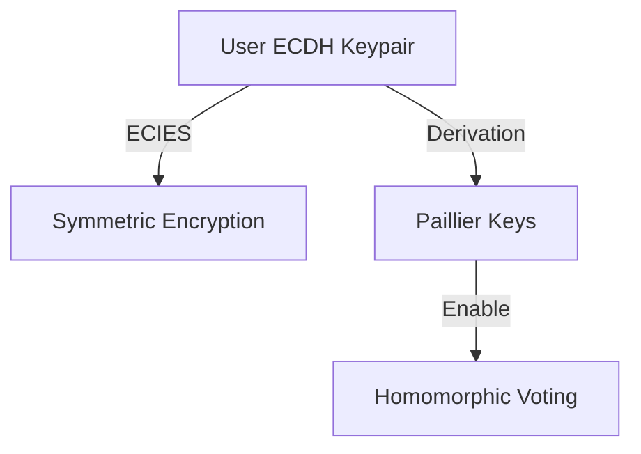
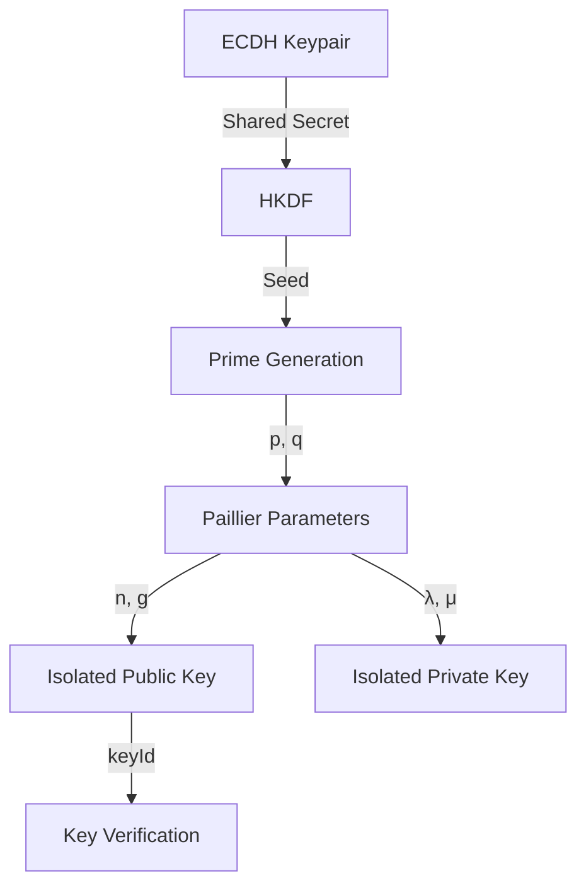
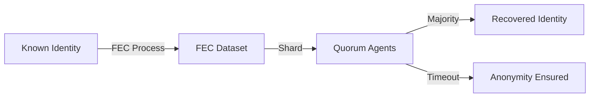
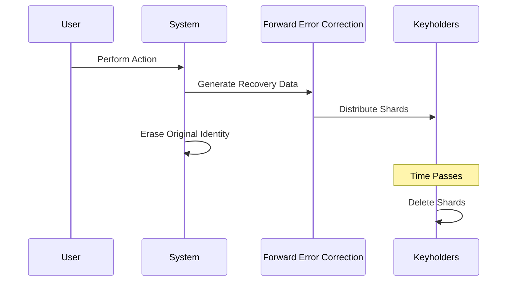
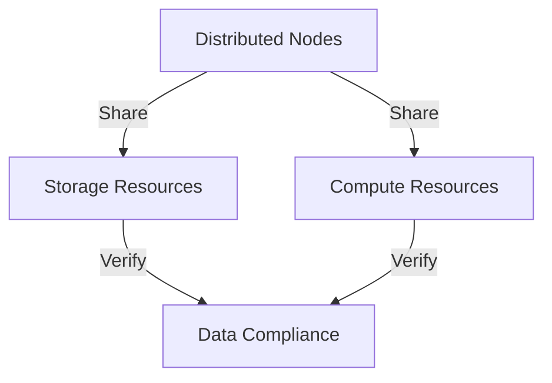
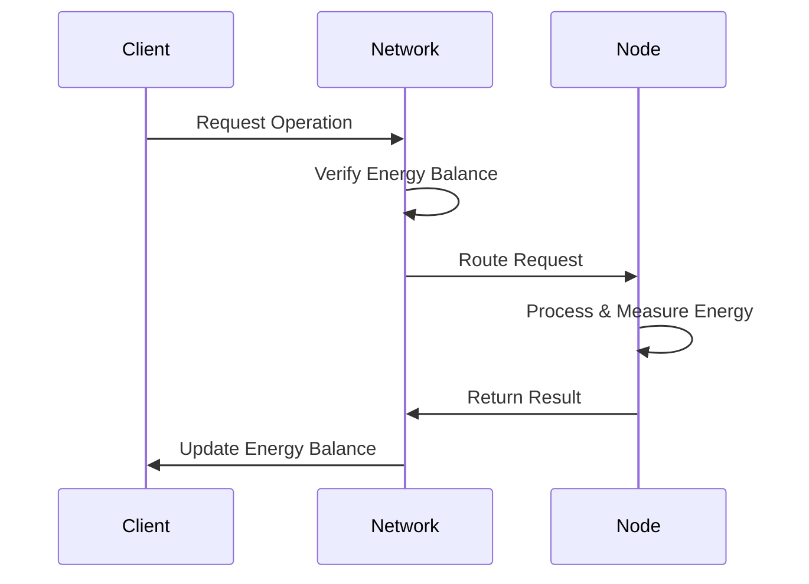

# Towards a Unified Digital Governance Framework: The BrightChain Cryptosystem

## Abstract

In an era of increasing complexity and interconnectedness, the need for secure, efficient, and scalable systems to govern digital operations has never been greater. This paper introduces BrightChain, a novel cryptosystem designed to encapsulate all critical functions of a digital government within a single framework. By leveraging an integrated approach that combines elliptic-curve cryptography, homomorphic encryption, brokered anonymity, and distributed storage and compute resources, BrightChain offers a unified solution for secure communication, voting, and resource management. This document highlights the key features of BrightChain, explores its potential impact, and calls upon experts in cryptography, distributed systems, and governance to weigh in on its development.

------

## 1. Introduction

The rapid digital transformation of societies necessitates innovative systems capable of ensuring security, privacy, and efficiency. BrightChain emerges as a response to these demands, offering a cryptographic ecosystem where all operations—from secure messaging to voting—are seamlessly integrated. This paper provides an overview of BrightChain’s architecture and key innovations, setting the stage for collaborative refinement and real-world application.

------

## 2. Key Innovations in BrightChain

### 2.1 Unified Keypair Architecture

Users enter the BrightChain system with an Elliptic Curve Diffie-Hellman (ECDH) keypair. This keypair underpins all subsequent operations:

- **Symmetric Encryption via ECIES:** BrightChain combines the strengths of asymmetric and symmetric encryption, ensuring robust security with computational efficiency for secure messaging and file storage.
- **Homomorphic Operations via Paillier Keys:** Through a novel key derivation process, BrightChain enables ECDH keys to generate Paillier keys, facilitating secure voting and other homomorphic computations.

### 2.2 Brokered Anonymity

BrightChain introduces Brokered Anonymity to balance transparency with privacy. Key features include:

- **Forward Error Correction (FEC) Dataset:** Identities are replaced with FEC datasets capable of recovery.
- **Quorum-Based Recovery:** Identity shards are distributed among trusted agents, requiring majority agreement for reconstitution.
- **Digital Statute of Limitations:** After a predefined period, FEC data is permanently deleted, ensuring true anonymity.

### 2.3 Owner-Free Filesystem (OFF)

BrightChain’s data storage model protects participants from liability while promoting resource sharing. Key attributes include:

- Decentralized storage architecture.
- Robust mechanisms for verifying legality and compliance of stored data.

### 2.4 Distributed Compute Resource Sharing

BrightChain extends the principles of distributed storage to computing, enabling nodes to contribute processing power without compromising security or integrity.

------

## 3. Energy-Efficient Design: The Joule Currency

Energy efficiency is central to BrightChain, with all operations measured in Joules, the system’s native currency. This approach incentivizes:

- Minimal energy consumption for data storage and processing.
- Optimal redundancy levels for critical and non-critical data.
- Sustainability as a core principle of digital governance.

------

## 4. Applications in Digital Governance

BrightChain offers a comprehensive toolkit for governments, organizations, and communities to:

- **Secure Communications:** Protect sensitive information with state-of-the-art encryption.
- **Transparent and Secure Voting:** Leverage homomorphic encryption for verifiable yet private elections.
- **Efficient Resource Allocation:** Optimize the use of shared storage and computing power.

------

## 5. Call to Action

The BrightChain cryptosystem represents a bold step toward a unified digital governance framework. However, its success depends on the collective insights of experts in cryptography, distributed systems, and governance. We invite feedback, collaboration, and rigorous evaluation to refine BrightChain’s architecture and ensure its readiness for global deployment.

------

## 6. Conclusion

BrightChain reimagines digital governance as a secure, efficient, and inclusive system. By integrating cutting-edge cryptographic techniques with principles of sustainability and shared resources, BrightChain has the potential to empower a new era of digital collaboration and accountability.

**Keywords:** BrightChain, ECDH, ECIES, homomorphic (Paillier) encryption, Brokered Anonymity, distributed storage, energy efficiency, digital governance.