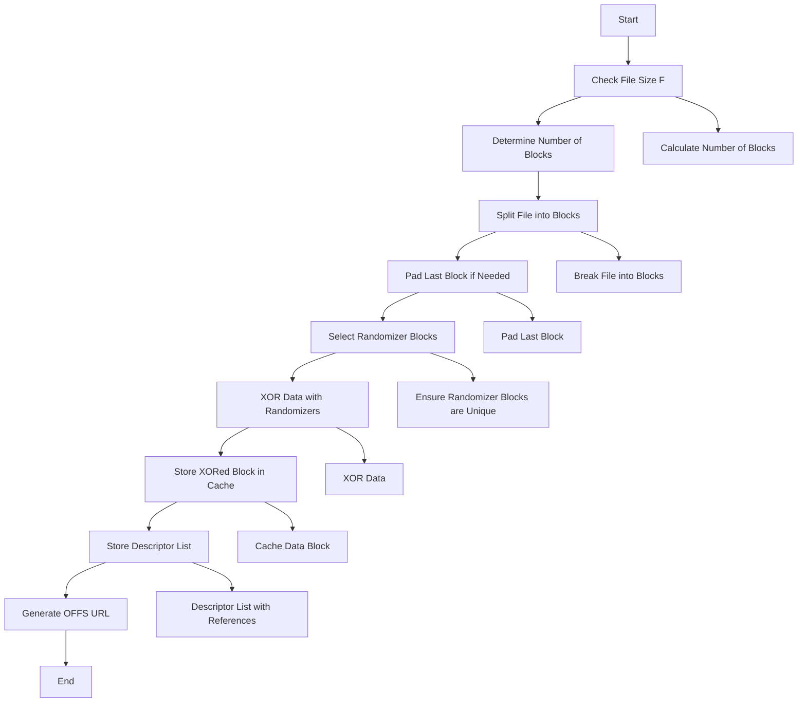
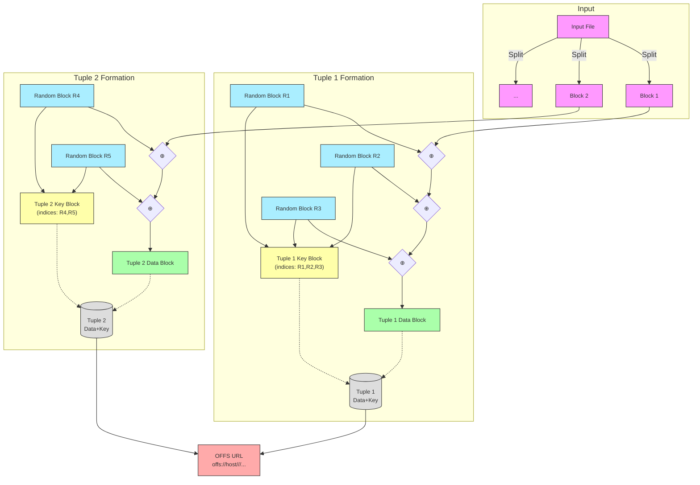

# File Storage Overview

Here's a simplified explanation of the steps for breaking up a file into blocks, selecting whiteners (randomizer blocks), performing XOR, and storing the block. Afterward, I’ll provide the Mermaid flowchart.

### **Simplified Explanation of the Steps**:

1. **File Size (F) and Block Size (B)**:
   - Given the file size \( F \) and the block size \( B \), first determine how many blocks are needed to store the file. This is done by dividing the file size by the block size (and rounding up to account for partial blocks).
2. **Break Up the File**:
   - Split the file into chunks of size \( B \) bytes. If the last block is smaller than \( B \), pad it with random data to meet the size requirement.
3. **Select the Randomizer Blocks (Whiteners)**:
   - For each block, select a number \( t-1 \) randomizer blocks from the cache. These blocks should be random and not used in previous iterations.
4. **XOR the Data**:
   - XOR the data block with \( t-1 \) randomizer blocks. The result is a new, anonymized block that will be stored in the system.
5. **Store the Block**:
   - The resulting XORed block is stored in the cache.
   - Additionally, store the metadata (descriptor list), which includes the references to the randomizer blocks used, allowing the block to be reassembled later.

### **Mermaid Flowchart**:





```
flowchart TD
    subgraph "Original OFF"
        direction TB
        F1[File Block 1] --> X1{XOR}
        R1[Random 1] --> X1
        R2[Random 2] --> X1
        X1 --> O1[Output Block 1]

        K1["Key Block 1
        (indices: R1,R2)"] --- T1[("Tuple 1")]
        O1 --- T1

        F2[File Block 2] --> X2{XOR}
        R3[Random 3] --> X2
        R4[Random 4] --> X2
        X2 --> O2[Output Block 2]

        K2["Key Block 2
        (indices: R3,R4)"] --- T2[("Tuple 2")]
        O2 --- T2

        T1 & T2 --> URL1["OFF URL with
        multiple tuples"]
    end

    subgraph "Modern CBL Approach"
        direction TB
        FB1[File Block 1] --> XB1{XOR}
        RB1[Random 1] --> XB1
        RB2[Random 2] --> XB1
        XB1 --> OB1[Output Block 1]

        FB2[File Block 2] --> XB2{XOR}
        RB3[Random 3] --> XB2
        RB4[Random 4] --> XB2
        XB2 --> OB2[Output Block 2]

        OB1 & OB2 --> |SHA512| STORE["Block Store
        (indexed by SHA512)"]
        RB1 & RB2 & RB3 & RB4 --> |SHA512| STORE

        STORE --> CBL["Constituent Block List (CBL)
        Header: metadata
        Blocks: [
            SHA512(RB1),SHA512(RB2),SHA512(OB1)
            SHA512(RB3),SHA512(RB4),SHA512(OB2)
        ]"]

        CBL --> URL2["OFF URL with
        single CBL reference"]
    end

    classDef default font-size:12px
    classDef process text-align:center
```

### **Explanation of Flowchart**:

1. **Start**: The process begins by receiving a file of size \( F \).
2. **Check File Size (F)**: The system checks the file size to determine how many blocks are needed.
3. **Determine Number of Blocks Needed**: The file is divided into blocks of size \( B \) by calculating \( \text{ceil}(F / B) \).
4. **Split File into Blocks (B)**: The file is broken into chunks of size \( B \).
5. **Pad Last Block if Necessary**: If the last block is smaller than \( B \), it is padded with random data to make it the right size.
6. **Select t-1 Randomizer Blocks from Cache**: Select \( t-1 \) randomizer blocks from the cache. These should not have been used for the current file or in previous iterations.
7. **XOR Data Block with t-1 Randomizer Blocks**: XOR the original data block with the selected randomizer blocks. This anonymizes the data, making it hard to trace.
8. **Store Resulting XORed Block in Cache**: The resulting XORed block is stored in the cache.
9. **Store Descriptor List with Block References**: The descriptor list, which tracks which blocks were used in the XOR process, is stored as well.
10. **Generate OFFS URL for File**: The system generates a unique OFFS URL that references the file and allows for later retrieval.
11. **End**: The process is complete, and the file is now stored in the system.

### **Additional Details**:

- **Randomizer Blocks (Whiteners)**: These are blocks chosen from the cache to add randomness to the XOR operation. This ensures the file content is anonymized when stored.
- **XOR Operation**: The XOR operation between the data and randomizer blocks ensures that the result looks like random data, offering anonymization without directly altering the file itself. The XOR is reversible, so the file can be reconstructed later if the correct randomizer blocks are available.

Tracking and retrieving blocks in a distributed file system like the **Owner-Free File System (OFFS)** requires a robust method for efficiently managing block availability and locating specific blocks across a peer-to-peer (P2P) network. Below, I'll outline several strategies that can be used to track blocks and handle block retrieval requests in such a system.

### 1. **Block Tracking via Distributed Hash Tables (DHTs)**

One of the most common methods to track available blocks in decentralized P2P systems is through a **Distributed Hash Table (DHT)**. A DHT is a distributed key-value store where each peer (node) in the network is responsible for a portion of the keyspace. Here’s how it can be used:

#### **a. Block Identifier**

- **Block Hashing**: Each block is uniquely identified by a hash of its content, which can be generated using cryptographic hash functions like SHA-256.
- **Block Metadata**: For each block, the system stores metadata that includes:
  - The hash of the block.
  - The node(s) where the block is stored (IP address or node identifier).
  - Possibly, a timestamp indicating when the block was added or last updated.

#### **b. Storing Block Information**

- When a block is created or downloaded, the node storing the block will add an entry in the **DHT**. The block's **hash** serves as the key, and the **value** can be a list of nodes (or peer identifiers) that store the block, along with any additional metadata.

- The **DHT** ensures that each block hash is mapped to a set of responsible nodes. Since it's a distributed structure, peers can join or leave the network dynamically, and the DHT will automatically rebalance the key-value pairs across the participating nodes.

#### **c. Finding a Block**

- **Requesting a Block**: When a user (node) needs to find a specific block (e.g., for retrieval or reassembly), they will first compute the hash of the block they are looking for.
- **DHT Lookup**: The node can then **query the DHT** with the block hash. The DHT will return the list of nodes (if any) that have the block stored. If the block is not available in the local node’s cache or disk storage, the lookup can be forwarded to other peers in the network.

#### **d. Query Propagation and Lookup Optimization**

- **Iterative Lookup**: In DHTs, the querying node may not directly know which node holds the block. Instead, it can use an iterative lookup process where each node queries a subset of peers that are closer to the key (block hash). This continues until the target node(s) are found.
- **Replication and Caching**: To improve reliability and reduce lookup time, DHTs can be configured to **replicate** block information across multiple nodes. This increases the chances that a node can quickly find a requested block even if some peers are offline or unreachable.

### 2. **Block Availability Tracking (Proactive or Reactive)**

There are two basic approaches for maintaining block availability and tracking which nodes have which blocks:

#### **a. Proactive Block Availability Tracking**

- In proactive systems, nodes **periodically announce** which blocks they have available.
- Each node periodically sends **block availability updates** (or "announcements") to the network. This can be done via a **gossip protocol**, where nodes broadcast the blocks they have to their peers.
- A **centralized registry** (or a distributed registry) may collect these announcements to keep track of block availability, but this can become a bottleneck at scale.

#### **b. Reactive Block Availability Tracking**

- In reactive systems, nodes only report **block availability when queried**. This reduces the amount of network traffic but can lead to higher query latencies.
- **DHT-based** systems typically fall into this category, as blocks are only located when requested, not proactively broadcasted.

### 3. **Block Request and Retrieval**

When a node wants to retrieve a block, the process would generally follow these steps:

1. **Compute Block Hash**: The node computes the hash of the block it needs.
2. **DHT Lookup**: The node queries the DHT to find the peer(s) that store the block.
3. **Peer Selection**: Based on the DHT result, the node selects one or more peers that hold the block.
   - This can be done by selecting a peer with the best availability (e.g., one that is online, with good bandwidth).
4. **Request the Block**: The node sends a **block request** to the selected peer(s), asking for the block.
5. **Block Transfer**: The peer responds by sending the block (or parts of it, depending on block size) to the requesting node.
6. **Reassembly**: Once the node has collected all the required blocks (randomizers and the original blocks), it can proceed with the **reassembly** (via XOR or other operations) to reconstruct the original file.

### 4. **Handling Failures and Redundancy**

In decentralized systems, nodes can go offline, so it's important to consider how to handle block retrieval failures:

#### **a. Redundancy and Replication**

- **Replication**: To reduce the likelihood of failure, blocks may be **replicated** across multiple peers. When a block is added to the DHT, its metadata includes a list of peers that store the block, ensuring that if one peer goes down, other peers can still provide the block.

#### **b. Block Repair and Recovery**

- **Block Repair**: If a block is found to be missing or corrupt, a process known as **block repair** can kick in. This involves:
  - **Reconstructing the block**: Using the other data blocks and randomizer blocks (if applicable) from the same file or related files, the system can regenerate a missing block.
  - **Fetching from other peers**: If replication exists, other nodes can be queried to fetch a working copy of the block.

#### **c. Fault Tolerance**

- If a node’s cache is insufficient or the block is unavailable, the system can attempt to retrieve the block from other peers or generate it using **randomly generated randomizer blocks** (whiteners).

### 5. **Search and Retrieval Efficiency**

To make the retrieval process more efficient, a few optimizations can be applied:

- **Caching Metadata**: Nodes may cache metadata (like which blocks are available on which nodes) in a distributed manner so that block lookups don’t need to be done from scratch each time.
- **Neighborhood Queries**: Nodes can form **neighborhoods** or **local caches** to optimize lookup times. A node can initially query its immediate peers before propagating the query to distant peers.

---

### Example Flow for Retrieving a Block:

Let’s assume a node wants to retrieve a block with hash `H`:

1. **Step 1: Block Hash Computation**:
   - The node computes the block hash `H` of the block it wants to retrieve.
2. **Step 2: DHT Lookup**:
   - The node queries the **DHT** with `H` to find the nodes responsible for the block.
3. **Step 3: Query Response**:

   - The DHT returns a list of nodes that store `H`, say `[Node1, Node2]`.

4. **Step 4: Node Selection**:
   - The requesting node selects one of the nodes based on factors like availability, load, etc. (e.g., `Node1`).
5. **Step 5: Block Request**:

   - The requesting node sends a **block request** to `Node1` asking for block `H`.

6. **Step 6: Block Transfer**:
   - `Node1` sends the block back to the requesting node.
7. **Step 7: Reassembly and Completion**:
   - Once all blocks are retrieved, the node reassembles the data (if necessary) and completes the process.

---

### Conclusion

In such a distributed system, the **DHT** serves as the backbone for tracking block availability, while **block hashes** uniquely identify blocks to ensure they can be located and retrieved efficiently. A combination of **replication, fault tolerance, and redundancy** is necessary to handle node failures and ensure reliability in retrieving blocks. The overall process allows for efficient tracking and retrieval of blocks, enabling decentralized file sharing with high availability and anonymity.

### URL Length Limitations and Large Files

Dealing with **URL length limitations** and **large files**—especially when using **SHA-512** checksums as block identifiers—is an important design consideration for a decentralized file system like **Owner-Free File System (OFFS)**. Here's how OFFS might handle these challenges:

### 1. **URL Length Limitations**

Standard URLs have a length limit that can vary depending on the browser, server, and the protocol used. For example, URLs in **HTTP/HTTPS** typically have a limit around **2,000 characters** in many browsers and servers. A SHA-512 checksum produces a **128-character hexadecimal string**, which, by itself, may not be an issue for URL length but could become problematic in certain contexts when combined with other components, such as metadata or file identifiers.

#### **Solution:**

To deal with URL length limitations, OFFS can handle large identifiers and other metadata in the following ways:

1. **Shortened URL Encoding:**

   - **Base64 Encoding**: SHA-512 produces a 512-bit hash, which can be expressed in **64 bytes** (or 128 hexadecimal characters). By encoding the hash in **Base64**, the URL length can be reduced by approximately 33%, resulting in a 43-character string, significantly smaller and more URL-friendly.
   - **Example**: A SHA-512 hash (128 hex chars) becomes a 86-character Base64-encoded string. By using Base64, you reduce the impact on URL length, which can be important if the URLs need to include other parts like path, query parameters, or metadata.

2. **Multi-part URLs or URN:**

   - If additional data, such as metadata or the hash of a large file, needs to be part of the URL, **multi-part URLs** can be used, or the system can use **Uniform Resource Names (URNs)**. A URN is a unique identifier that doesn’t depend on the location or file path, making it ideal for persistent identifiers like SHA-512 hashes.
   - In this case, the full identifier can be split across several parts, reducing each segment's length and making the URL more manageable.

3. **URL Shorteners or Pointers:**

   - Instead of encoding the entire block identifier in the URL, **URL shorteners** or **local URL pointers** (mapping long URLs to short codes) can be employed. The URL could reference a centralized or distributed index that maps the short URL to a larger identifier or a block’s location in the network.

4. **Block Store for Large Metadata:**
   - For very large file metadata, OFFS could use the **block cache** or a **secondary storage mechanism** to store large amounts of data. The URL would then only store the **block identifiers** (e.g., Base64-encoded hashes), while the metadata could be retrieved by another means or through an additional step in the process.

### 2. **Handling Large Files**

When dealing with **large files**, several key concerns arise, particularly around **chunking**, **block storage**, and **metadata management**. In OFFS, the file is split into smaller **data blocks** (typically 128 KiB) for storage and transmission. The handling of **large files** can be managed as follows:

#### **a. File Chunking and Block Size:**

- **Large files** are broken up into smaller blocks, each being independently XOR-ed with randomizer (whitener) blocks. The **block size** plays a crucial role in ensuring efficiency in storage and retrieval. For example, the default block size might be 128 KiB, but larger blocks (such as 256 MB) could be used, depending on the system’s requirements and the available disk space.
- As large files are broken into these blocks, they are represented by multiple hash values (e.g., a SHA-512 checksum for each block), each of which is stored and referenced in the **descriptor list**.

#### **b. Descriptor Lists:**

- The **descriptor list** holds the metadata for how to reconstruct the file from its constituent blocks. Each entry in the descriptor list refers to one block, which could be hashed using SHA-512.
- For very large files, the **descriptor list itself** can grow large and might need to be split into multiple smaller descriptors. These descriptors can be **split across multiple blocks** if the list exceeds the 128 KiB limit (or whatever block size is used).
- To manage this, OFFS might:
  - Break the descriptor list into multiple blocks and store them separately, linking them using **secondary metadata**.
  - Use **sequential hashes**: Each block’s hash points to a subsequent block in the list, allowing for the chain of data to be broken into smaller manageable parts while maintaining integrity and correctness.

#### **c. Multiple Block Retrieval for Large Files:**

- For large files, retrieving them requires obtaining the full set of blocks involved in the reconstruction. The system can use **parallel retrieval** mechanisms, where different peers (nodes) simultaneously provide different blocks that are part of the file.
- The **multi-use nature of blocks** in OFFS could help, as blocks could be retrieved from various peers, each sharing the blocks they already have from previous transactions or file shares.

#### **d. Large Block Identifiers for Large Files:**

- When dealing with large files, the SHA-512 checksum for each **block** might still be used as a unique identifier. However, this creates a challenge because a very large file could require hundreds or thousands of blocks.
- To handle this, the **descriptor list** must maintain the relationships between **all blocks** that belong to the file. This list could be stored separately as additional **metadata** and might use **indexes** or **block ranges** instead of individual block references.

#### **e. Splitting Files into Multiple Parts (Block Segmentation):**

- For files larger than a certain threshold (e.g., 10 GB), OFFS could split the file into **multiple segments**, each of which can be represented by its own set of blocks and corresponding **hashes**.
  - A **segment descriptor list** could be used to handle each chunk of a large file.
  - The system would allow for each chunk to be independently downloaded and reconstructed using the appropriate set of blocks.

### 3. **Performance Considerations for Large Files and SHA-512 Hashes**

Handling large files with SHA-512 hashes comes with certain **performance considerations**, such as:

1. **Storage Overhead**: SHA-512 hashes are 64 bytes (512 bits) long, which requires extra space for each block. For a large file with thousands of blocks, this can result in significant overhead just for tracking hashes.

   - This is manageable for the system but should be considered in terms of overall efficiency.

2. **Retrieval Performance**: Larger file sizes increase the complexity of block retrieval and reassembly. The system needs efficient **block lookup** and **reconstruction algorithms** to handle this.

   - Using **parallel downloads** and **multi-use blocks** helps mitigate this.

3. **Integrity and Collision Resistance**: SHA-512 provides **strong integrity guarantees**, which is crucial for verifying that the blocks haven’t been tampered with. The large size of the hash ensures that **collisions** (two different inputs yielding the same hash) are highly improbable, which is especially important in a decentralized system where data integrity needs to be verified across untrusted nodes.

### Summary

- **URL Lengths**: OFFS can reduce the size of URLs by using **Base64 encoding** for SHA-512 hashes or employing multi-part URLs, URL shorteners, or centralized mapping systems.
- **Large Files**: Large files are split into **smaller blocks**, and each block has its own **SHA-512 checksum**. The **descriptor list** holds metadata for block reconstruction and may be split across multiple blocks if necessary.
- **Block Retrieval**: **Parallel retrieval** and **multi-use blocks** improve performance, especially when retrieving large files that span many blocks.

Overall, OFFS is designed to handle large files and maintain a decentralized, efficient method of file storage, integrity verification, and retrieval, even when using large block identifiers like SHA-512 checksums.
