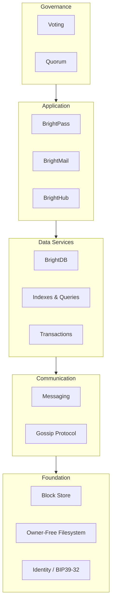
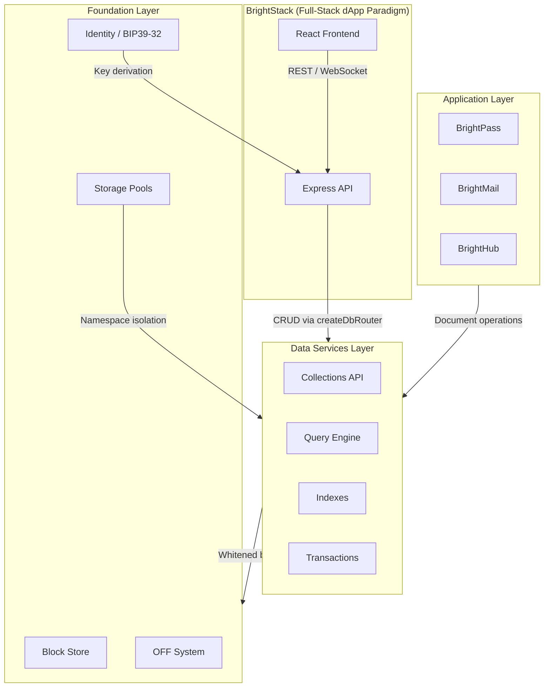

# Architecture Overview

| Field          | Value                                  |
|----------------|----------------------------------------|
| Prerequisites  | None                                   |
| Estimated Time | 20 minutes                             |
| Difficulty     | Beginner                               |

## Introduction

This guide introduces BrightChain's architecture from the ground up. You will learn how the platform is organized into layers, how data is stored using the TUPLE model for plausible deniability, and how the Nx monorepo packages map to each architectural component. By the end you will have a mental model that makes the rest of the walkthrough series much easier to follow.

## Prerequisites

No prior BrightChain experience is required. Familiarity with general distributed-systems concepts (nodes, replication, hashing) is helpful but not mandatory.

## Steps

### Step 1: Understand the Layered Architecture

BrightChain is organized into five layers. Each layer builds on the one below it.



| Layer | Components | Purpose |
|-------|-----------|---------|
| **Foundation** | Block store, Owner-Free Filesystem (OFF), Identity (BIP39/32) | Persistent storage, content-addressed blocks, cryptographic identity |
| **Communication** | Messaging, Gossip protocol | Node-to-node data exchange, peer discovery, block replication |
| **Data Services** | BrightDB, Indexes, Queries, Transactions | MongoDB-like document abstraction over the block store |
| **Application** | BrightPass, BrightMail, BrightHub | User-facing products built on BrightDB |
| **Governance** | Voting, Quorum | Consensus decisions, sealed-identity recovery, network policy |

Data flows upward: the Foundation layer stores and retrieves blocks, the Communication layer moves them between nodes, the Data Services layer provides document database abstractions, the Application layer builds user-facing features, and the Governance layer enforces collective decisions.

### Step 2: See How the Major Components Relate

The diagram below shows how BrightChain's foundation, data services, applications, and BrightStack connect.



- **Foundation Layer** provides the block store, OFF system, identity primitives, and storage pools.
- **Data Services Layer (BrightDB)** sits on top of the foundation and exposes a MongoDB-like document API. Under the hood every document is stored as whitened blocks in the OFF system.
- **Application Layer** (BrightPass, BrightMail, BrightHub) builds user-facing features on top of BrightDB's document abstractions.
- **BrightStack** is the full-stack dApp paradigm — BrightChain + Express + React + Node.js — analogous to the MERN stack but backed by a decentralized, privacy-preserving storage layer.

### Step 3: Learn the TUPLE Storage Model

All data in BrightChain is stored as **TUPLEs**. A TUPLE consists of three blocks:

1. **Data block** — the original content XORed with two randomizers
2. **Randomizer 1** — a cryptographically random block
3. **Randomizer 2** — a second cryptographically random block

```
┌──────────────┐   ┌──────────────┐   ┌──────────────┐
│  Original     │   │ Randomizer 1 │   │ Randomizer 2 │
│  Data (D)     │   │     (R1)     │   │     (R2)     │
└──────┬───────┘   └──────┬───────┘   └──────┬───────┘
       │                  │                  │
       └──────────┬───────┘                  │
              XOR (⊕)                        │
                  │                          │
                  └────────────┬─────────────┘
                           XOR (⊕)
                               │
                    ┌──────────▼──────────┐
                    │   Stored Block (S)   │
                    │   S = D ⊕ R1 ⊕ R2   │
                    └─────────────────────┘
```

**Reconstruction:** To recover the original data, XOR all three blocks together:

```
D = S ⊕ R1 ⊕ R2
```

**Why TUPLEs?** No single block contains identifiable data. All three blocks are required for reconstruction, which provides **plausible deniability** — a node operator holding any one or two blocks cannot determine what the original content was. This is the foundation of the Owner-Free Filesystem (OFF) system.

TUPLEs are used for everything: raw data blocks, CBL (Constituent Block List) metadata, messages, participant data, and hierarchical super-CBL structures.

### Step 4: Map the Nx Monorepo Packages

BrightChain is organized as an Nx monorepo. Each package has a distinct role in the architecture:

| Package | Role |
|---------|------|
| `brightchain-lib` | Core library: blocks, identity (BIP39/32), OFF, TUPLE, services, interfaces |
| `brightchain-api-lib` | Node.js/Express-specific API types, response wrappers |
| `brightchain-db` | BrightDB — MongoDB-like document database on the block store |
| `brightchain-react` | React frontend components for BrightStack apps |
| `brighthub-lib` | BrightHub social/collaboration platform logic |

In code, the database package is imported as `@brightchain/db`:

```typescript
import { BrightDb, InMemoryDatabase } from '@brightchain/db';
```

The core library provides the foundational primitives that every other package depends on. The API library extends those primitives with Express-specific types. BrightDB builds the document-database abstraction on top of the block store. The React package provides frontend components, and BrightHub adds social and collaboration features.

### Step 5: Explore the Ecosystem

BrightChain's architecture includes several purpose-built components:

**Data Services Layer:**

- **BrightDB** — A MongoDB-like document database backed by the OFF block store. Query, index, and transact against documents that are stored as whitened blocks. This is the bridge between raw block storage and application-level data.

**Application Layer:**

- **BrightPass** — Decentralized password manager and identity system built on BIP39/32 key derivation. Stores credentials as encrypted documents in BrightDB.
- **BrightMail** — Privacy-preserving email over the BrightChain network. Messages are stored as TUPLEs for plausible deniability.
- **BrightHub** — A social and collaboration platform for the BrightChain community.

**Development Platform:**

- **BrightStack** — The full-stack dApp development paradigm: BrightChain + Express + React + Node.js. Think MERN, but decentralized.

Together these components form a complete platform for building privacy-preserving decentralized applications. BrightDB serves as the critical data abstraction layer that allows applications to work with documents and collections instead of raw blocks.

## Troubleshooting

If any concepts in this overview are unclear, the remaining walkthroughs provide hands-on examples that reinforce each topic. For common issues encountered while working with BrightChain, see the [Troubleshooting & FAQ](/docs/walkthroughs/06-troubleshooting-faq) guide.

## Next Steps

- [Quickstart](/docs/walkthroughs/01-quickstart) — Get a local environment running and execute your first BrightDB query.
- [Node Setup](/docs/walkthroughs/02-node-setup) — Configure and start a BrightChain node.
- [Storage Pools](/docs/walkthroughs/03-storage-pools) — Create and manage storage pools for data isolation.
- [BrightDB Usage](/docs/walkthroughs/04-brightdb-usage) — Deep dive into the document database API.
